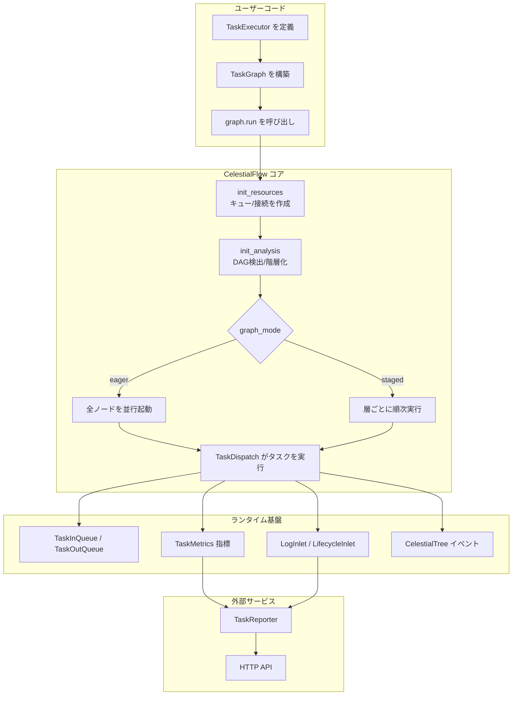
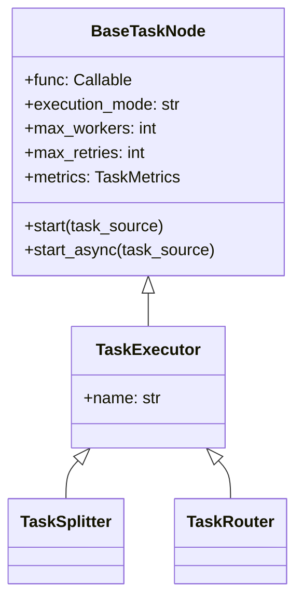
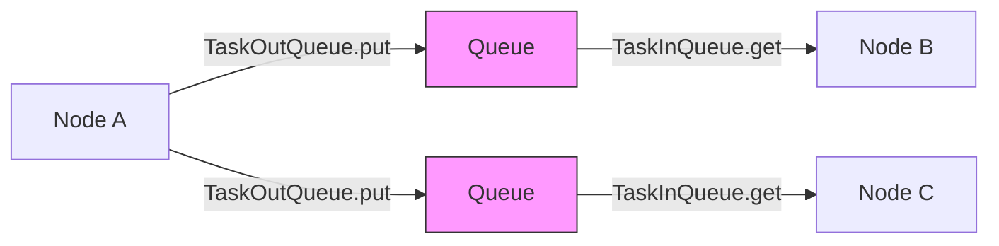
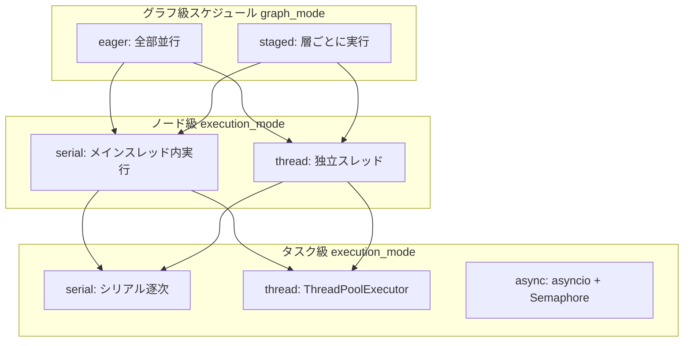
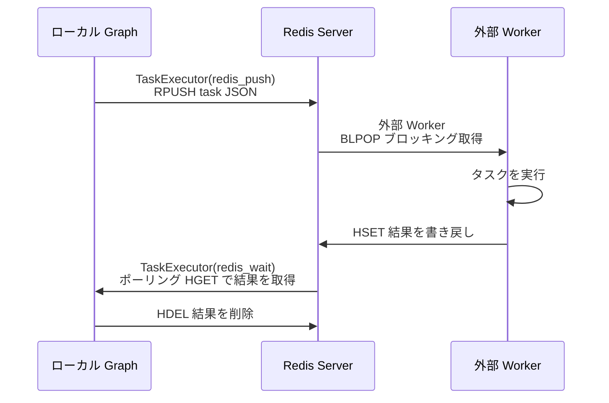
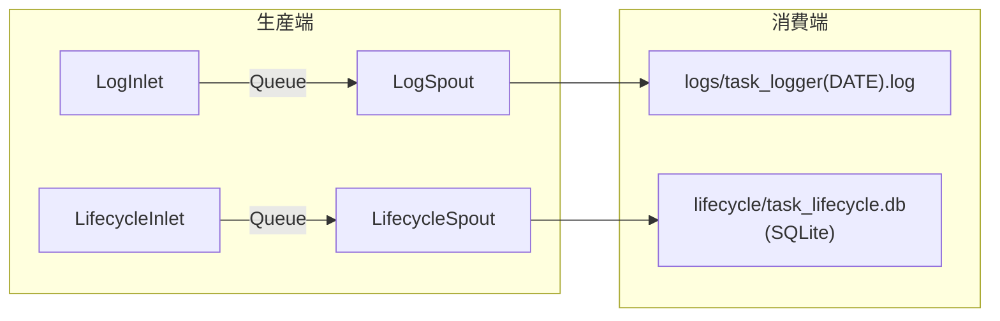
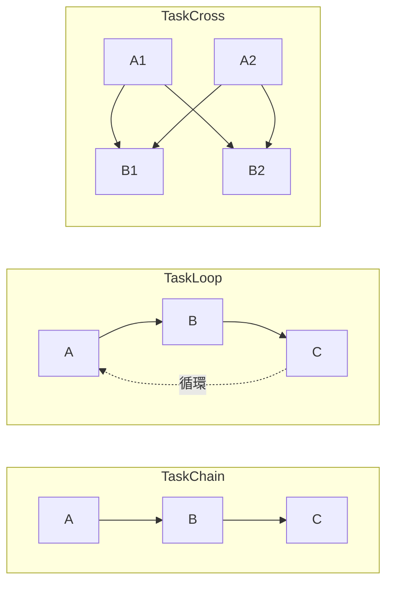
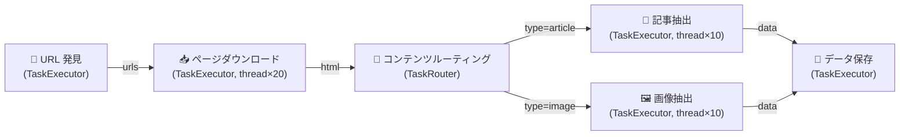
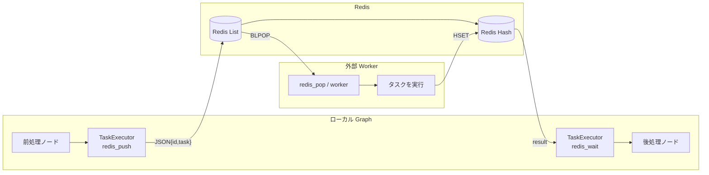

# CelestialFlow 技術共有

> 📅 最終更新日: 2026/09/09

---

## Slide 1: 表紙

# CelestialFlow

**次世代 Python タスクオーケストレーションエンジン**

- 軽量 · グラフ駆動 · 高性能 · 可観測
- バージョン 3.1.4 | Python 3.12+
- DAG / 循環グラフ / 分散実行 / 可観測実行チェーンをサポート

---

## Slide 2: プロジェクト背景と動機

### なぜ CelestialFlow が必要か？

- **既存フレームワークの課題**：Airflow はデータベーススケジューリングに依存しデプロイが重い；Prefect はクラウド SaaS モデル寄り；Ray は計算集中指向でタスクオーケストレーション向きではない
- **実需要駆動**：Python プログラムに埋め込み可能で、ゼロ外部依存で実行できるタスクグラフエンジンが必要
- **柔軟性要件**：DAG だけでなく、循環グラフ（循環タスクフロー）もサポートする必要がある
- **高性能シナリオ**：データ収集、ETL パイプライン、バッチ処理タスクの並行オーケストレーション
- **可観測性の内蔵**：後付けの監視ではなく、フレームワークレベルでネイティブに metrics、ログ、イベントソーシングを提供

備考：
実際のエンジニアリングシナリオから出発——「コードを書くように自然な」タスクオーケストレーションツールが必要であり、独立したデプロイ運用プラットフォームではない。

---

## Slide 3: CelestialFlow とは

### 一言定義

> Python ベースの軽量グラフ駆動タスクオーケストレーションフレームワーク。DAG/循環グラフトポロジー、多実行モード、イベントソース、状態レポートをサポートし、オプションの外部連携サンプルを提供。

### コア特性

- **グラフトポロジー豊富**：Chain / Cross / Grid / Loop / Wheel / Complete の6種のプリセット構造
- **多次元実行モデル**：Stage 級 (serial/thread) × Task 級 (serial/thread/async) の組み合わせ
- **外部連携サンプル**：通常の `TaskExecutor` で Redis / Go Worker などの外部システムに接続可能
- **イベントソース**：CelestialTree 統合、タスクの全ライフサイクルを追跡可能
- **状態レポートチェーン**：`TaskReporter` と `celestialflow-web` サービスによる状態と制御命令の交換
- **ゼロプラットフォーム依存**：`pip install celestialflow`、1行のコードで実行可能

---

## Slide 4: コア設計理念

### 設計哲学

- **グラフすなわちプログラム (Graph as Program)**
  - `TaskGraph` を実行ユニットとし、ノード (`TaskExecutor`) を処理ロジック、エッジをデータフローとする
  - オーケストレーションロジックとビジネスロジックを完全に分離

- **エンベロープパターン (Envelope Pattern)**
  - `TaskEnvelope` がタスク + ハッシュ + イベント ID + ソース情報をカプセル化
  - 透過的に重複排除、トレーサビリティ、ルーティング能力を提供

- **終了信号プロトコル (Termination Protocol)**
  - `TerminationSignal` → `TerminationIdPool` の段階的マージ
  - DAG および循環グラフの両方で正しい終了を保証

- **指標を第一級市民に (Metrics as First-Class)**
  - 各 Stage に `TaskMetrics` を内蔵、スレッドセーフなリアルタイムカウント

---

## Slide 5: アーキテクチャ概要

### システムアーキテクチャ図


```mermaid
graph TB
    subgraph ユーザーコード
        A[TaskExecutor を定義] --> B[TaskGraph を構築]
        B --> C[graph.run を呼び出し]
    end

    subgraph CelestialFlow コア
        C --> D[init_resources<br/>キュー/接続を作成]
        D --> E[init_analysis<br/>DAG検出/階層化]
        E --> F{graph_mode}
        F -->|eager| G[全ノードを並行起動]
        F -->|staged| H[層ごとに順次実行]
        G --> I[TaskDispatch がタスクを実行]
        H --> I
    end

    subgraph ランタイム基盤
        I --> J[TaskInQueue / TaskOutQueue]
        I --> K[TaskMetrics 指標]
        I --> L[LogInlet / LifecycleInlet]
        I --> M[CelestialTree イベント]
    end

    subgraph 外部サービス
        N[TaskReporter]
        O[HTTP API]
    end

    K --> N
    L --> N
    N --> O
```

備考：
上から下へ：ユーザーがグラフ構造を定義 → フレームワークがリソースと分析を初期化 → スケジュールモードに従って実行 → ランタイム基盤がキュー、指標、ログを提供 → `TaskReporter` がオプションで外部サービスに状態を同期。

---

## Slide 6: コアコンポーネント — TaskGraph

### TaskGraph：グラフ実行エンジン

```python
TaskGraph(
    graph_mode: str = "eager",   # "eager" | "staged"
    log_level: str = "SUCCESS"
)
```

- **初期化**: 構築後に `graph.set_nodes(stages=[...])` でノードを設定し、`graph.connect(...)` で接続を確立。ソースノードは SCC 凝縮により自動計算
- **スケジュールモード**：
  - `eager`：全ノードを並行起動、依存関係はキューが自然に保証
  - `staged`：DAG のみ利用可能、層ごとに実行、層間は同期ブロック
- **状態管理**：`node_dict`（ノードオブジェクト集合）、`status_dict`（ランタイム状態）、`snapshot()`（直近 20 スナップショット）
- **グラフ分析**：NetworkX ベースで有向グラフを構築、DAG 性質を検出、トポロジー階層を計算

---

## Slide 7: コアコンポーネント — TaskExecutor / TaskSplitter / TaskRouter

### 継承関係


```mermaid
classDiagram
    BaseTaskNode <|-- TaskExecutor
    TaskExecutor <|-- TaskSplitter
    TaskExecutor <|-- TaskRouter
    class BaseTaskNode {
        +func: Callable
        +execution_mode: str
        +max_workers: int
        +max_retries: int
        +metrics: TaskMetrics
        +start(task_source)
        +start_async(task_source)
    }

    class TaskExecutor {
        +name: str
    }
```

- **BaseTaskNode**：全ランタイムノードの基底クラス、共通骨格（キュー、metrics、ライフサイクル）を定義
- **TaskExecutor**：汎用タスクエグゼキュータ。リトライ、重複排除、キャッシュ、並行戦略を管理。ユーザーが直接構築して使用
- **TaskSplitter / TaskRouter**：グラフ構造型特化ノード、下流配布セマンティクスを変更
- **`graph.connect()`** でノード間の接続関係（上流・下流依存）を確立
- **`name` / `execution_mode`** は `__init__()` 構築パラメータで渡す

---

## Slide 8: コアコンポーネント — フロー制御ノード

### TaskSplitter & TaskRouter

| 特性 | TaskSplitter | TaskRouter |
|------|-------------|------------|
| セマンティクス | 1 → N（一対多分割） | 1 → 1（条件ルーティング） |
| 入力 | 単一タスク | 単一タスク |
| 出力 | tuple の各要素が独立タスクに | `(target_tag, task)` で指定下流にルーティング |
| カウンター | `split_counter` が下流の `task_counter` に伝播 | `route_counters[tag]` がそれぞれ伝播 |
| 実行モード | デフォルト serial、作成時に指定可能 | デフォルト serial、作成時に指定可能 |
| リトライ | デフォルト 0、作成時に指定可能 | デフォルト 0、作成時に指定可能 |

- **カウンター伝播**は下流 `is_tasks_finished()` の正確な判定を保証する重要な設計
- Splitter/Router の `serial` / `max_retries=0` がデフォルト設定で、構築時に上書き可能（具体パラメータは `core_nodes.py` を参照）

---

## Slide 9: コアコンポーネント — キューとエンベロープ

### データフロー基盤


```mermaid
graph LR
    A[Node A] -->|TaskOutQueue.put| Q1[Queue]
    Q1 -->|TaskInQueue.get| B[Node B]
    A -->|TaskOutQueue.put| Q2[Queue]
    Q2 -->|TaskInQueue.get| C[Node C]

    style Q1 fill:#f9f,stroke:#333
    style Q2 fill:#f9f,stroke:#333
```

- **TaskEnvelope**：`task` + `hash`(SHA1) + `id`(CelestialTree イベント) + `source_name`(ソースノード名)
- **TaskInQueue**：
  - 多上流集約、`source_tag` で終了信号を追跡
  - 全上流が `TerminationSignal` を送信後、`TerminationIdPool` にマージして返却
- **TaskOutQueue**：
  - ブロードキャストモード `put()` → 全下流
  - 指向モード `put_target(item, tag)` → 指定下流（Router が使用）
- **終了プロトコル**：DAG でも循環グラフでも、全ノードが優雅に終了できることを保証

---

## Slide 10: 実行モデル

### 3層実行次元


```mermaid
graph TD
    subgraph グラフ級スケジュール graph_mode
        A[eager: 全部並行]
        B[staged: 層ごとに実行]
    end

    subgraph ノード級 execution_mode
        C[serial: メインスレッド内実行]
        D[thread: 独立スレッド]
    end

    subgraph タスク級 execution_mode
        E[serial: シリアル逐次]
        F[thread: ThreadPoolExecutor]
        H[async: asyncio + Semaphore]
    end

    A --> C
    A --> D
    B --> C
    B --> D
    C --> E
    C --> F
    D --> E
    D --> F
```

| 階層 | オプション | 説明 |
|------|------|------|
| グラフ級 `graph_mode` | `eager` / `staged` | ノード間の並行 vs 順序を制御 |
| ノード級 `execution_mode` | `serial` / `thread` / `async` | ノード内タスクの並行戦略 |

備考：
TaskGraph モードでは、ノード級の `async` も使用可能（各ノードはそれぞれ自分の `TaskDispatch` を保持）。

---

## Slide 11: 指標と重複排除システム

### TaskMetrics — スレッドセーフなリアルタイムカウント

- **4大コアカウンター**：
  - `task_counter`：総入力タスク数（Splitter/Router 追加分を含む）
  - `success_counter`：成功処理数
  - `error_counter`：最終失敗数（リトライ回数超過）
  - `duplicate_counter`：重複排除インターセプト数

- **終了判定**：`is_tasks_finished()` = `total == success + error + duplicate`

- **重複排除メカニズム**：
  - `TaskEnvelope.hash` = `SHA1(pickle.dumps(task))`
  - `processed_set` が処理済みハッシュを記録
  - ゼロコスト重複排除——ハッシュはカプセル化段階で1回計算

- **SumCounter 集約**：Splitter/Router シナリオでの多ソースカウンターの正確なマージをサポート

---

## Slide 12: 外部連携サンプル — Redis Demo

### 通常の TaskExecutor で Redis / Go Worker に接続


```mermaid
sequenceDiagram
    participant Local as ローカル Graph
    participant Redis as Redis Server
    participant Remote as 外部 Worker

    Local->>Redis: TaskExecutor(redis_push)<br/>RPUSH task JSON
    Redis->>Remote: 外部 Worker<br/>BLPOP ブロッキング取得
    Remote->>Remote: タスクを実行
    Remote->>Redis: HSET 結果を書き戻し
    Redis->>Local: TaskExecutor(redis_wait)<br/>ポーリング HGET で結果を取得
    Local->>Redis: HDEL 結果を削除
```

| コンポーネント | 役割 | Redis 操作 | 位置付け |
|------|------|-----------|------|
| `redis_push()` | シリアライズしてタスクをプッシュ | `RPUSH` | demo helper |
| 外部 Worker / `redis_pop()` | ブロッキングでタスクをプル | `BLPOP` | Redis 入力のブリッジ |
| `redis_wait()` | リモート結果を待機 | `HGET` → `HDEL` | demo helper |

- **プロトコル位置**：これは demo/helper プロトコルのセットで、フレームワーク内蔵ノードではない
- **インストール方法**：このソリューションを実行する場合、追加で `redis` をインストールし Redis サービスを起動する必要がある
- **設計意図**：外部メッセージシステムを通常の `TaskExecutor` に統合する方法を示す

---

## Slide 13: CelestialTree との統合

### イベントソースとタスクリネージ

- **CelestialTree**：階層的イベント追跡システム（独立プロジェクト `celestialtree`、追加インストールが必要）
- **統合ポイント**：
  - `TaskExecutor.set_ctree(ctree_client)` で外部イベントクライアントを注入
  - デフォルトで `LocalEventClient()` を使用し、CelestialTree サービスに依存しない
  - `TaskEnvelope.id` が CelestialTree イベント ID を保存
  - `TerminationSignal.id` / `TerminationIdPool.ids` が終了イベントを伝播

- **追跡粒度**：
  - 各タスクのカプセル化時に一意のイベント ID を取得
  - Splitter 分割 → 子イベントが親イベントに関連付け
  - 終了信号マージ → イベント ID プール集約
  - 全リンクが入力から完了まで遡及可能

- **設計トレードオフ**：イベント追跡はオプション依存；デフォルトローカルモードではイベント ID のみ生成し、リモート追跡が必要な場合は別途 `celestialtree` をインストール

---

## Slide 14: 永続化とエラー処理

### Persistence モジュール


```mermaid
graph LR
    subgraph 生産端
        A[LogInlet] -->|Queue| B[LogSpout]
        C[LifecycleInlet] -->|Queue| D[LifecycleSpout]
    end

    subgraph 消費端
        B --> E["logs/task_logger(DATE).log"]
        D --> F["lifecycle/task_lifecycle.db<br/>(SQLite)"]
    end
```

- **Spout-Inlet パターン**：
  - Inlet 端（スレッドセーフ）：レコードをフォーマットし、共有キューに書き込み
  - Spout 端（デーモンスレッド）：キューから消費し、ストレージに書き込み
  - `TerminationSignal` で優雅に停止

- **ログレベル**：`TRACE(0) → DEBUG(10) → SUCCESS(20) → INFO(30) → WARNING(40) → ERROR(50) → CRITICAL(60)`

- **エラー永続化**：SQLite 形式、`stage_name`、`error_type`、`error_message`、`task_json`、`result_json` などのフィールドを含む

- **エラー分析ツール**：`load_records()`、`load_records_grouped_by_stage()` で次元ごとに失敗タスクを集約

---

## Slide 15: 例外体系

### 構造化例外階層

```
CelestialFlowError (基底クラス)
├── ConfigurationError
│   └── InvalidOptionError
│       ├── ExecutionModeError    (serial/thread/async)
│       ├── StageModeError        (serial/thread)
│       └── LogLevelError         (TRACE~CRITICAL)
├── RemoteWorkerError             (Redis リモート実行失敗)
└── UnconsumedError               (未消費のキュー内タスク)
```

- **InvalidOptionError**：「field=value, allowed=[...]」のヒント情報を自動生成
- **迅速なフィードバック**：設定レベルのエラーはグラフ起動前にスローされ、実行時ではない

---

## Slide 16: 状態レポートチェーン — アーキテクチャ

### コア構成

| 層 | 技術 | 用途 |
|----|------|------|
| ランタイム側 | `TaskReporter` | グラフ構造、分析、状態、エラー情報を周期的にプッシュ |
| プロトコル | HTTP + JSON | pull / push インターフェースで双方向同期 |
| 制御側 | 外部サービス | レポート間隔、タスク注入、終了信号を返却 |
| ストレージ側 | SQLite + ログ | エラーレコードと構造化ログの永続化は主リポジトリが担当 |

- **主リポジトリの責務**：状態収集、エラー増分同期、タスク注入入口を提供
- **外部サービスの責務**：状態データを消費し、必要に応じて監視画面やコンソールを提供

---

## Slide 17: 状態レポートチェーン — 機能

### 3大コア能力

**1. 状態同期**
- グラフ構造、トポロジー分析、ノード状態スナップショットをプッシュ
- `graph_id` でリモート側が現在のグラフをすでに保持しているかを判断可能

**2. エラー同期**
- `event_id` ベースでエラーレコードを増分プッシュ
- ローカルの fallback sqlite をエラーデータソースとして再利用

**3. タスク注入**
- リモートサービスから注入待ちタスクと終了信号をプル
- 注入プロセスはメイン実行フローをブロックしない

---

## Slide 18: TaskReporter API 一覧

### REST インターフェース設計

| 方向 | エンドポイント | データ |
|------|------|------|
| Pull | `/api/pull_server_state` | 現在のグラフ同期状態、構造状態、分析状態、最大 `event_id` |
| Pull | `/api/pull_injection` | 注入待ちタスクと終了信号 |
| Push | `/api/push_status` | 状態を更新 |
| Push | `/api/push_structure` | グラフ構造を更新 |
| Push | `/api/push_analysis` | グラフ分析データを更新 |
| Push | `/api/push_errors` | エラーレコードを更新 |

- **主リポジトリには Web フロントエンドを内蔵しない**：ここでは `TaskReporter` が実際に使用する同期インターフェースのみを定義
- **インターフェース設計目標**：外部サービスが監視画面、コンソール、監査システムを自由に実装できるようにする

---

## Slide 19: パフォーマンス設計と最適化

### 主要パフォーマンス決定

- **ゼロコピー終了検出**
  - `is_tasks_finished()` = アトミックカウンター比較、キュー走査や状態スキャン不要

- **ハッシュ1回、重複排除一生**
  - `TaskEnvelope.hash` はカプセル化段階で SHA1 を1回計算、以降の重複排除は set lookup (O(1)) のみ

- **ファクトリ化キューバックエンド**
  - フレームワーク内部で `execution_mode` に応じて `ThreadQueue` / `AsyncQueue` を選択
  - シリアルモードはゼロ同期オーバーヘッド

- **指標カウンターのレベル分け**
  - serial/async：`ValueWrapper` 通常の int
  - thread：`ValueWrapper` + `threading.Lock`
  - 必要に応じて最も軽量な同期メカニズムを選択

- **フロントエンド増分レンダリング**
  - `JSON.stringify` 比較によるスパイダー型変更検出、変更された DOM 領域のみ再レンダリング

---

## Slide 20: プリセットグラフ構造

### 6種のそのまま使えるトポロジーテンプレート


```mermaid
graph LR
    subgraph TaskChain
        direction LR
        C1[A] --> C2[B] --> C3[C]
    end

    subgraph TaskLoop
        direction LR
        L1[A] --> L2[B] --> L3[C]
        L3 -.->|循環| L1
    end

    subgraph TaskCross
        direction TB
        X1[A1] --> X3[B1]
        X1 --> X4[B2]
        X2[A2] --> X3
        X2 --> X4
    end
```

| 構造 | トポロジータイプ | 説明 |
|------|---------|------|
| `TaskChain` | DAG (線形) | 順次直列 A→B→C |
| `TaskCross` | DAG (全結合) | 層間全結合 |
| `TaskGrid` | DAG (グリッド) | 右+下方向接続 |
| `TaskLoop` | 循環 | 末尾ノードが先頭ノードに戻る |
| `TaskWheel` | 循環+Hub | 中心ノードが環上の全ノードに接続 |
| `TaskComplete` | 全結合 | 全ノード相互接続 |

- **強制 DAG**：Chain と Grid は構築時に `graph_mode="staged"` を設定して利用可能
- **循環グラフ**：Loop / Wheel / Complete は `graph_mode="eager"` 必須

---

## Slide 21: 他フレームワークとの比較

### CelestialFlow vs 主流フレームワーク

| 特性 | CelestialFlow | Airflow | Prefect | Ray |
|------|--------------|---------|---------|-----|
| **コア位置付け** | 埋め込みタスクグラフエンジン | プラットフォーム級スケジューリングシステム | クラウドネイティブワークフロー | 分散計算フレームワーク |
| **インストール複雑度** | `pip install` 即利用 | データベース + スケジューラが必要 | Server/Cloud が必要 | Ray Cluster が必要 |
| **グラフタイプ** | DAG + 循環グラフ | DAG のみ | DAG のみ | 無制限（Actor モデル） |
| **循環タスクサポート** | ネイティブサポート（Loop/Wheel） | 非サポート | 非サポート | 手動実装 |
| **実行モード** | serial/thread/async | Celery/K8s/Local | Dask/K8s | Ray Worker |
| **プロセス級隔離** | なし（スレッド級隔離） | Executor 級 | Dispatch 級 | デフォルト隔離 |
| **外部監視接続** | HTTP レポートインターフェース | 内蔵 Web UI | 内蔵 Cloud UI | Ray Dashboard |
| **イベントソース** | CelestialTree 統合 | ネイティブサポートなし | ネイティブサポートなし | ネイティブサポートなし |
| **タスク重複排除** | 内蔵 SHA1 ハッシュ重複排除 | ネイティブサポートなし | ネイティブサポートなし | ネイティブサポートなし |
| **学習曲線** | 低（純粋 Python API） | 中高 | 中 | 中高 |
| **デプロイ形態** | ライブラリ / CLI | 独立プラットフォーム | 独立プラットフォーム/SaaS | 独立クラスター |

---

## Slide 22: ユースケース

### CelestialFlow に適したシナリオ

- **データ収集 Pipeline**
  - 多段階クローラー：URL 発見 → ページダウンロード → コンテンツ抽出 → データ保存
  - ネイティブ重複排除能力が重複リクエストを回避

- **ETL / データ処理**
  - Splitter で大量分割 → 多 Worker 並行処理 → Router で結果を分流
  - JSONL 失敗ログ → 精密リトライ

- **バッチ API 呼び出し**
  - `thread` モードで高並行外部 API 呼び出し
  - 内蔵リトライ + エラーキャッシュ

- **リアルタイムストリーム処理（軽量級）**
  - Loop 構造で継続的プル → 処理 → 書き戻しを実現
  - 外部メッセージキュー / Worker サンプルで水平拡張可能

- **機械学習 Pipeline**
  - データ前処理 → 特徴量エンジニアリング → モデル訓練 → 評価
  - thread モードでデータパイプラインを並行処理

---

## Slide 23: デモデータフロー

### 典型的な Pipeline 例


```mermaid
graph LR
    A["🔗 URL 発見<br/>(TaskExecutor)"] -->|urls| B["📥 ページダウンロード<br/>(TaskExecutor, thread×20)"]
    B -->|html| C["🔀 コンテンツルーティング<br/>(TaskRouter)"]
    C -->|type=article| D["📝 記事抽出<br/>(TaskExecutor, thread×10)"]
    C -->|type=image| E["🖼 画像抽出<br/>(TaskExecutor, thread×10)"]
    D -->|data| F["💾 データ保存<br/>(TaskExecutor)"]
    E -->|data| F
```

**実行設定例**：
```python
from celestialflow import TaskExecutor, TaskRouter, TaskGraph

discover = TaskExecutor("discover_urls", discover_urls, execution_mode="serial")
download = TaskExecutor(
    "download_page", download_page, execution_mode="thread", max_workers=20
)
router = TaskRouter("classify", classify_content)
extract_article = TaskExecutor(
    "extract_article", extract_article, execution_mode="thread", max_workers=10
)
extract_image = TaskExecutor(
    "extract_image", extract_image, execution_mode="thread", max_workers=10
)
store = TaskExecutor("save_to_db", save_to_db, execution_mode="serial")

graph = TaskGraph(graph_mode="eager")
graph.set_nodes(
    stages=[discover, download, router, extract_article, extract_image, store]
)
graph.connect([discover], [download])
graph.connect([download], [router])
graph.connect([router], [extract_article, extract_image])
graph.connect([extract_article, extract_image], [store])

graph.run({"discover_urls": [seed_urls]})
```

---

## Slide 24: 分散 Demo データフロー

### Redis 外部連携サンプル


```mermaid
graph LR
    subgraph ローカル Graph
        A[前処理ノード] --> B[TaskExecutor<br/>redis_push]
        E[TaskExecutor<br/>redis_wait] --> F[後処理ノード]
    end

    subgraph Redis
        B -->|"JSON{id,task}"| C[(Redis List)]
        C --> D[(Redis Hash)]
        D -->|"result"| E
    end

    subgraph 外部 Worker
        C -->|BLPOP| G[redis_pop / worker]
        G --> H[タスクを実行]
        H -->|HSET| D
    end
```

- ローカル Graph が通常の `TaskExecutor("redis_push", redis_push)` でタスクを Redis List にプッシュ
- 外部 Worker または `redis_pop()` が Redis からタスクをプルして実行
- 結果を Redis Hash に書き戻し、ローカル `TaskExecutor("redis_wait", redis_wait)` がポーリング取得
- **水平拡張**：複数の Worker インスタンスを起動すれば並行消費可能

---

## Slide 25: 設計トレードオフ (Trade-offs)

### 主要設計決定

| 決定 | 選択 | トレードオフ |
|------|------|------|
| 循環グラフサポート | 信号マージプロトコル | 終了ロジックの複雑度増加と引き換えにトポロジー柔軟性を獲得 |
| ノード `execution_mode` | serial/thread/async | シンプルで信頼性の高いスレッドモデルを維持 |
| ログアーキテクチャ | Queue + Spout スレッド | 1つのデーモンスレッド増加と引き換えにスレッドセーフ書き込みを獲得 |
| 重複排除戦略 | SHA1(pickle) | pickle 不安定性リスクと引き換えに汎用オブジェクトハッシュ能力を獲得 |
| 外部結果取得 | ポーリング HGET (0.1s) | Demo 層の実装はシンプルかつ信頼性が高いが、リアルタイムプッシュではない |
| 状態レポート | Reporter pull/push プロトコル | リモートインターフェース約定増加と引き換えに監視と制御の疎結合を獲得 |
| CelestialTree 統合 | オプション依存 + NullClient | 追跡なし時はゼロオーバーヘッドだが、追加設定が必要 |

備考：
すべての設計決定にはトレードオフがあります。CelestialFlow は「簡潔 + 信頼性 + ゼロデプロイ依存」のソリューションを優先し、複雑性と機能性のバランスを取っています。

---

## Slide 26: 拡張性設計

### モジュール疎結合の思想

- **Node すなわちプラグイン**
  - 1つの `func` を実装 → `TaskExecutor` にラップ → 任意のグラフに接続
  - 内蔵 Splitter / Router は Executor の特化；Redis 連携は demo で接続方法を示す

- **キューバックエンド交換可能**
  - フレームワーク内部で `execution_mode` に応じて `ThreadQueue` / `AsyncQueue` を選択

- **指標バックエンド拡張可能**
  - `ValueWrapper` が実行モードに応じて適応
  - `SumCounter` が多ソースカウンターを透過的に集約

- **永続化カスタマイズ可能**
  - Spout-Inlet パターン、`_handle_record()` を実装するだけで出力先をカスタマイズ可能

- **状態レポートチェーン交換可能**
  - `TaskReporter` の pull / push プロトコルのみを規定
  - 外部サービスは主リポジトリと強く結合せず独立に進化可能

---

## Slide 27: 将来計画 (Roadmap)

### 進化の方向性

- **スケジューリング強化**
  - 優先度ベースのタスクスケジューリング
  - 動的リソース感知（CPU/メモリ）による `max_workers` の自動調整

- **分散強化**
  - Kafka / RabbitMQ をオプションの転送バックエンドとして
  - 分散一貫性保証（exactly-once セマンティクス）

- **可観測性強化**
  - OpenTelemetry 統合
  - Prometheus metrics エクスポート
  - アラートルール設定

- **開発者体験**
  - デコレータ構文でノードを定義
  - より成熟した外部監視・制御ツールチェーン
  - より豊富な内蔵ノードテンプレート

- **エコシステム**
  - CelestialTree 深層統合（因果推論、影響分析）
  - プラグインマーケットプレイスメカニズム

---

## Slide 28: まとめ

### CelestialFlow — コアバリュー

- **軽量埋め込み**：`pip install` 即利用、外部サービス依存なし、任意の Python プロジェクトに埋め込み可能
- **トポロジー柔軟**：DAG + 循環グラフ、6種のプリセット構造、任意トポロジーをカスタマイズ可能
- **実行モデル豊富**：2層次元の組み合わせ（グラフ級 × ノード級）、あらゆる並行シナリオに適応
- **外部連携フレンドリー**：必要に応じて Redis / Go Worker などの外部システムに接続し水平拡張可能
- **全リンク追跡**：CelestialTree イベントソース + JSONL エラー永続化
- **可観測性内蔵**：状態スナップショット、ログ、エラー永続化とオプション状態レポート

### 一言

> **Python を書くように、任意の複雑なタスクフローをオーケストレーションする。**

---

## Slide 29: Q&A

# ご清聴ありがとうございました

**CelestialFlow** — グラフ駆動 · 軽量 · 高性能 · 可観測

- バージョン：3.1.4
- Python：3.12+
- 依存：`pip install celestialflow`

---
