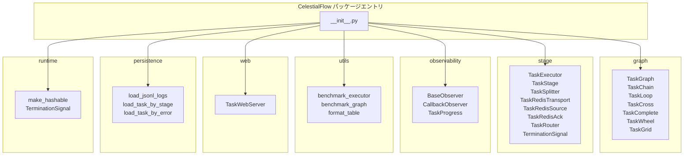

# CelestialFlow パッケージエントリ

> 📅 最終更新日: 2026/06/11

## 概要

本プロジェクトのルートエントリ。各サブモジュールから全ての公開 API を集約エクスポートし、ユーザーは `from celestialflow import ...` だけで全てのコア機能にアクセスできます。

## モジュールグループ

ソースモジュールごとに分類し、各グループの主な用途を説明します。

---

### graph — タスクグラフコア

複数のトポロジ構造定義を提供し、DAG 構築、依存接続、実行スケジューリングをサポートします。

| エクスポートシンボル | 説明 |
|----------|------|
| `TaskGraph` | 汎用タスクグラフコンテナ。任意の DAG トポロジをサポート |
| `TaskChain` | 線形チェーン構造（前ノード → 次ノード） |
| `TaskCross` | クロス接続構造（多ソース × 多ターゲット） |
| `TaskGrid` | グリッド状接続構造 |
| `TaskLoop` | ループ構造。ノードが条件を満たすとループバック可能 |
| `TaskWheel` | ホイール構造。1つの中心ノードが複数の周辺ノードに接続 |
| `TaskComplete` | 完全接続構造。全ノードが相互接続 |

---

### stage — タスク実行層

タスク実行器、ルーティング分散、分割マージ、Redis 統合サポートを提供します。

| エクスポートシンボル | 説明 |
|----------|------|
| `TaskExecutor` | 汎用タスク実行器。serial / thread / async の3つの実行モードをサポート |
| `TaskStage` | グラフ内のタスクノード。実行関数と設定をラップ |
| `TaskSplitter` | タスクスプリッター。1つの入力を複数のサブタスクに分割 |
| `TaskRedisTransport` | Redis ベースのタスク転送層 |
| `TaskRedisSource` | Redis データソース。Redis からタスク入力を取得 |
| `TaskRedisAck` | Redis 確認機構。消費後に ACK を送信 |
| `TaskRouter` | ルーティング分散器。ルールに基づいてタスクを異なる下流に分散 |
| `TerminationSignal` | 終了シグナル。グラフ実行フローの終了を制御 |

---

### observability — 可観測性

オブザーバーパターンのサポートを提供し、タスク実行プロセスを監視します。

| エクスポートシンボル | 説明 |
|----------|------|
| `BaseObserver` | オブザーバー基底クラス。on_start / on_success / on_failure などのインターフェースを定義 |
| `CallbackObserver` | コールバック式オブザーバー。コールバック関数を渡してイベントを処理 |
| `TaskProgress` | タスク進捗トラッカー。完了/失敗/合計をリアルタイム統計 |

---

### utils — ユーティリティセット

ベンチマークテストとフォーマットツールを提供します。

| エクスポートシンボル | 説明 |
|----------|------|
| `benchmark_executor` | 同期/非同期 `TaskExecutor` のマルチモードベンチマークテスト |
| `benchmark_graph` | タスクグラフ全体のベンチマークテスト |
| `format_table` | テーブル出力のフォーマット。コンソールでの比較データ表示に使用 |

---

### web — Web サービス

組み込み Web サーバーを提供し、グラフ状態の監視と可視化を行います。

| エクスポートシンボル | 説明 |
|----------|------|
| `TaskWebServer` | FastAPI ベースの Web サーバー。グラフ実行時スナップショットの HTTP API と可視化パネルを提供 |

---

### persistence — 永続化

JSONL ログの読み込みとクエリ機能を提供します。

| エクスポートシンボル | 説明 |
|----------|------|
| `load_jsonl_logs` | JSONL 形式のログファイルを読み込み |
| `load_task_by_stage` | ステージ名でフィルタリングしてタスクログを読み込み |
| `load_task_by_error` | エラータイプでフィルタリングしてタスクログを読み込み |

---

### runtime — ランタイムユーティリティ

ランタイム補助型とユーティリティ関数を提供します。

| エクスポートシンボル | 説明 |
|----------|------|
| `make_hashable` | ハッシュ不可オブジェクト（dict、list など）をハッシュ可能形式に変換 |
| `TerminationSignal` | 終了シグナル（stage グループと同一シンボルを共有） |

---

## `__all__` リスト

完全な公開 API リスト（全26シンボル）：

```python
__all__ = [
    "TaskGraph",
    "TaskChain",
    "TaskLoop",
    "TaskCross",
    "TaskComplete",
    "TaskWheel",
    "TaskGrid",
    "BaseObserver",
    "CallbackObserver",
    "TaskProgress",
    "TaskExecutor",
    "TaskStage",
    "TaskSplitter",
    "TaskRedisTransport",
    "TaskRedisSource",
    "TaskRedisAck",
    "TaskRouter",
    "TerminationSignal",
    "TaskWebServer",
    "load_jsonl_logs",
    "load_task_by_stage",
    "load_task_by_error",
    "make_hashable",
    "format_table",
    "benchmark_graph",
    "benchmark_executor",
]
```

## 使用例

以下の例は、パッケージエントリからインポートして CelestialFlow のコア機能でタスクグラフを構築・実行する方法を示します。

```python
from celestialflow import TaskGraph, TaskStage, TaskExecutor

# 1. タスク処理関数を定義
def double(x: int) -> int:
    return x * 2

def add_one(x: int) -> int:
    return x + 1

# 2. TaskStage ノードを作成
stage_a = TaskStage("StageA", func=double, execution_mode="serial", stage_mode="serial")
stage_b = TaskStage("StageB", func=add_one, execution_mode="serial", stage_mode="serial")

# 3. DAG グラフを構築
graph = TaskGraph()
graph.set_stages([stage_a, stage_b])
graph.connect([stage_a], [stage_b])

# 4. グラフを実行
init_tasks = {stage_a.get_name(): [1, 2, 3, 4, 5]}
graph.start_graph(init_tasks)

# 5. 実行結果サマリーを表示
summary = graph.get_graph_summary()
print("Graph summary:", summary)
```

### TaskExecutor を使用した独立実行

`TaskExecutor` はグラフ構造から切り離して独立実行でき、単一ステップのタスク実行に適しています：

```python
from celestialflow import TaskExecutor

# 実行器を作成しデータイテレータを渡す
executor = TaskExecutor("Adder", func=lambda x: x + 10, execution_mode="serial")
executor.start([1, 2, 3])

# 実行結果を取得
success_pairs = executor.get_success_pairs()
for task, result in success_pairs:
    print(f"Task: {task} -> Result: {result}")

# 統計カウントを表示
counts = executor.get_counts()
print("Counts:", counts)
```

### 定義済みグラフ構造の使用

```python
from celestialflow import TaskChain, TaskStage

stages = [
    TaskStage("S1", func=lambda x: x * 2),
    TaskStage("S2", func=lambda x: x + 1),
    TaskStage("S3", func=lambda x: x ** 2),
]

chain = TaskChain(stages, chain_mode="serial")
chain.start_chain({stages[0].get_name(): [1, 2, 3]})
summary = chain.get_graph_summary()
print("Chain summary:", summary)
```

## モジュール依存関係


