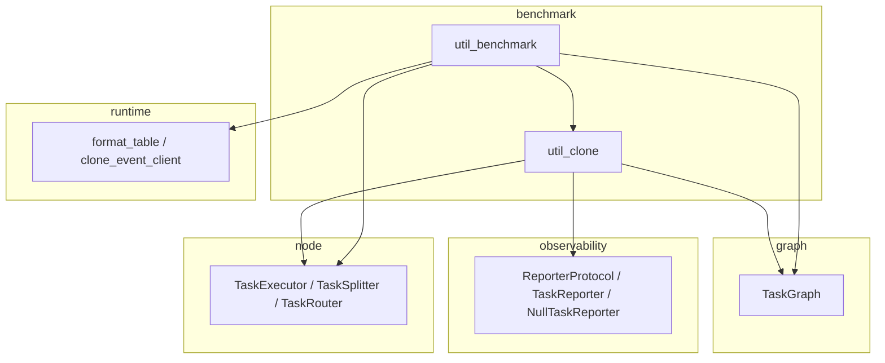

# Benchmark モジュール

> 📅 最終更新日: 2026/09/09

実行器/タスクグラフのクローン（clone）とベンチマークテスト（benchmark）機能を提供します。本モジュールは依存チェーンの最上位に位置し、他のモジュールに依存できますが、他のモジュールから依存されるべきではありません。

## サブモジュール

| ファイル | 説明 |
|------|------|
| `util_benchmark.py` | 実行器とタスクグラフのパフォーマンスベンチマークテスト |
| `util_clone.py` | 実行器とタスクグラフのクローンツール |

## エクスポートされるシンボル

`benchmark/__init__.py` はモジュールの docstring のみを含みます: `__all__` も import 文も定義されていないため、サブパッケージ自体はシンボルをエクスポートしません（`from celestialflow.benchmark import ...` は `ImportError` を送出します）。関連関数は以下の 2 つの方法で公開されます:

- `benchmark_executor` と `benchmark_graph` はトップレベルパッケージのエントリ `celestialflow/__init__.py` で集中エクスポートされ、`from celestialflow import ...` で直接インポートできます
- `clone_executor` / `clone_graph` などのクローン関数は **内部ツール** であり、公共 API ではありません。`from celestialflow import ...` で取得 **しないで** ください；必要に応じてサブモジュールパスから直接インポートしてください。

| シンボル | 定義場所 | 推奨インポート方法 | 説明 |
|------|---------|-------------|------|
| `benchmark_executor` | `util_benchmark.py` | `from celestialflow import benchmark_executor` | 同期/非同期 `TaskExecutor` のマルチモードベンチマークテスト |
| `benchmark_graph` | `util_benchmark.py` | `from celestialflow import benchmark_graph` | `TaskGraph` 全体のマルチモードベンチマークテスト |
| `clone_executor` | `util_clone.py` | `from celestialflow.benchmark.util_clone import clone_executor` | `TaskExecutor` インスタンスをクローン（内部ツール） |
| `clone_graph` | `util_clone.py` | `from celestialflow.benchmark.util_clone import clone_graph` | 接続関係を含む `TaskGraph` 全体をクローン。`TaskExecutor` ノードのみサポート（内部ツール） |

> 注: `clone_executor` / `clone_graph` はトップレベルパッケージエントリの `__all__` に含まれず、ベンチマークテストの記述やエグゼキューター/タスクグラフ設定を迅速に再利用する必要があるシナリオでのみ使用することを推奨します。

## 使用例

```python
from celestialflow import TaskGraph, TaskExecutor
from celestialflow.benchmark.util_clone import clone_graph


def double(x: int) -> int:
    return x * 2


# 状態隔離されたテストのためにタスクグラフをクローン
graph = TaskGraph(name="Demo")
node_a = TaskExecutor("A", double)
node_b = TaskExecutor("B", double)
graph.set_nodes([node_a, node_b])
graph.connect([node_a], [node_b])

cloned = clone_graph(graph)
print(f"元のグラフのノード数: {len(graph.node_dict)}")
print(f"クローングラフのノード数: {len(cloned.node_dict)}")
```

> ⚠️ `clone_graph` は `TaskExecutor` ノードのみで構成されたタスクグラフにのみ適用されます；`TaskSplitter`、`TaskRouter` などの特化ノードを含む場合は `ConfigurationError` を送出し、これらのノードのサブクラス型と動作は保持されません。`clone_graph` は「全てのノード型を完全に保持する」ことを **保証しません**。

## モジュール依存関係



## 注意事項

- **クローン機構**: すべてのクローン操作は新しいインスタンスを構築し主要なパラメータをコピーすることで実現され、元オブジェクトとクローンオブジェクトは完全に独立しています
- **状態の隔離**: ベンチマークテストでは各実行でクローンオブジェクトを使用し、状態汚染がテスト結果に影響するのを防ぎます
- **関数参照**: クローンは関数参照のみをコピーし、関数自体はディープコピーしません
- **非同期要件**: `benchmark_executor` と `benchmark_graph` はどちらも非同期関数であり、`await` または `asyncio.run` での呼び出しが必要です
- **内部ツールの位置付け**: `clone_executor` / `clone_graph` などのクローン関数は公共 API ではないため、ベンチマーク内部実装の調整に伴いシグネチャやセマンティクスが変更される可能性があります
- **`clone_graph` のノード型制限**: `TaskExecutor` ノードのみサポート；`TaskSplitter`、`TaskRouter` などの特化ノードには適用できません（`ConfigurationError` を送出します）
