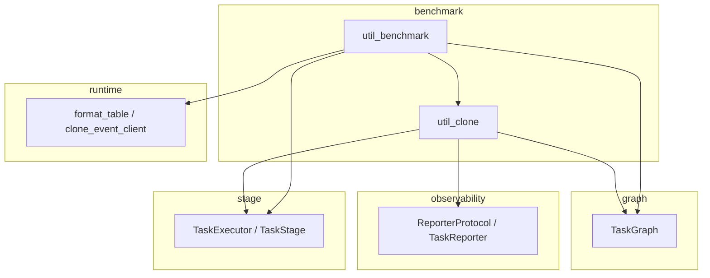

# Benchmark モジュール

> 📅 最終更新日: 2026/08/26

実行器/タスクグラフのクローン（clone）とベンチマークテスト（benchmark）機能を提供します。本モジュールは依存チェーンの最上位に位置し、他のモジュールに依存できますが、他のモジュールから依存されるべきではありません。

## サブモジュール

| ファイル | 説明 |
|------|------|
| `util_benchmark.py` | 実行器とタスクグラフのパフォーマンスベンチマークテスト |
| `util_clone.py` | 実行器、ノード、タスクグラフのクローンツール |

## エクスポートされるシンボル

`benchmark/__init__.py` はモジュールの docstring のみを含みます: `__all__` も import 文も定義されていないため、サブパッケージ自体はシンボルをエクスポートしません（`from celestialflow.benchmark import ...` は `ImportError` を送出します）。関連関数は以下の 2 つの方法で公開されます:

- `benchmark_executor` と `benchmark_graph` はトップレベルパッケージのエントリ `celestialflow/__init__.py` で集中エクスポートされ、`from celestialflow import ...` で直接インポートできます
- 5 つの関数すべてはサブモジュールパスからオンデマンドでインポートできます

| シンボル | 定義場所 | 推奨インポート方法 | 説明 |
|------|---------|-------------|------|
| `benchmark_executor` | `util_benchmark.py` | `from celestialflow import benchmark_executor` | 同期/非同期 `TaskExecutor` のマルチモードベンチマークテスト |
| `benchmark_graph` | `util_benchmark.py` | `from celestialflow import benchmark_graph` | `TaskGraph` 全体のマルチモードベンチマークテスト |
| `clone_executor` | `util_clone.py` | `from celestialflow.benchmark.util_clone import clone_executor` | `TaskExecutor` インスタンスをクローン |
| `clone_stage` | `util_clone.py` | `from celestialflow.benchmark.util_clone import clone_stage` | `TaskStage` ノードをクローン |
| `clone_graph` | `util_clone.py` | `from celestialflow.benchmark.util_clone import clone_graph` | 接続関係を含む `TaskGraph` 全体をクローン |

> 注: `clone_executor` / `clone_stage` / `clone_graph` はトップレベルパッケージエントリの `__all__` に含まれず、`util_benchmark` の内部使用またはオンデマンドインポート専用です。

## 使用例

```python
from celestialflow import TaskGraph, TaskStage
from celestialflow.benchmark.util_clone import clone_graph


def double(x: int) -> int:
    return x * 2


# 状態隔離されたテストのためにタスクグラフをクローン
graph = TaskGraph(name="Demo")
stage_a = TaskStage("A", double)
stage_b = TaskStage("B", double)
graph.set_stages([stage_a, stage_b])
graph.connect([stage_a], [stage_b])

cloned = clone_graph(graph)
print(f"元のグラフのノード数: {len(graph.stage_dict)}")
print(f"クローングラフのノード数: {len(cloned.stage_dict)}")
```

## モジュール依存関係



## 注意事項

- **クローン機構**: すべてのクローン操作は新しいインスタンスを構築し主要なパラメータをコピーすることで実現され、元オブジェクトとクローンオブジェクトは完全に独立しています
- **状態の隔離**: ベンチマークテストでは各実行でクローンオブジェクトを使用し、状態汚染がテスト結果に影響するのを防ぎます
- **関数参照**: クローンは関数参照のみをコピーし、関数自体はディープコピーしません
- **非同期要件**: `benchmark_executor` と `benchmark_graph` はどちらも非同期関数であり、`await` または `asyncio.run` での呼び出しが必要です
