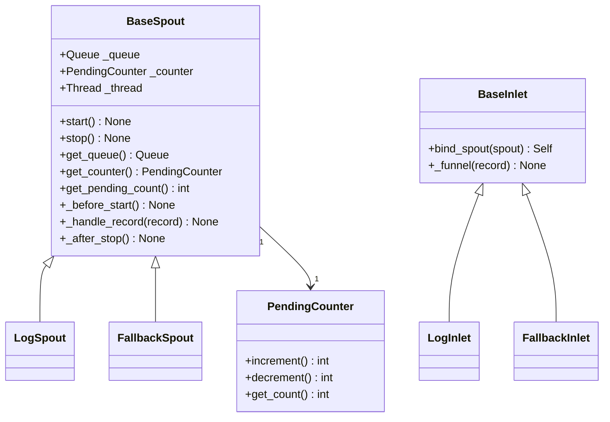

# Funnel モジュール

> 📅 最終更新日: 2026/06/22

Funnel モジュールは CelestialFlow のキュー通信インフラストラクチャを提供し、Persistence モジュールの `LogSpout`/`LogInlet` や `FallbackSpout`/`FallbackInlet` の基底クラスです。

永続化の下位基盤としてだけでなく、`TaskGraph` / `TaskStage` から切り離して軽量な producer-consumer パイプラインを単独で構築することもできます。最小限の動作サンプルは [demo_funnel.md](https://github.com/Mr-xiaotian/CelestialFlow/blob/main/docs/zh-CN/demo/demo_funnel.md) を参照してください。

## エクスポートシンボル

| エクスポートシンボル | ソースモジュール | 説明 |
|---------|---------|------|
| `BaseInlet` | `core_inlet` | すべての入口クラスの基底クラス。キュー書き込み機能を提供 |
| `BaseSpout` | `core_spout` | すべての出口クラスの基底クラス。バックグラウンドスレッドによる監視とキュー消費機能を提供 |

## ファイル説明

### コアコンポーネント

1. **core_inlet.py** (`BaseInlet`)
   - **役割**: すべての入口クラスの基底クラス。キュー書き込み機能を提供
   - **主要機能**: `bind_spout()` による spout との関連付け、`_funnel()` によるキュー書き込み

2. **core_spout.py** (`BaseSpout`)
   - **役割**: すべての出口クラスの基底クラス。バックグラウンドスレッドによる監視とキュー消費機能を提供
   - **主要機能**: バックグラウンドスレッド監視、ライフサイクルフック、グレースフルスタート/ストップ、待処理カウント

3. **util_count.py** (`PendingCounter`)
   - **役割**: スレッドセーフな待処理カウンター
   - **主要機能**: `BaseSpout` / `BaseInlet` と連携し、未処理完了のレコード数を統計

## 継承関係



## モジュール連携

### 外部連携
- **Persistence モジュールとの連携**: `LogSpout`/`LogInlet`、`FallbackSpout`/`FallbackInlet` はいずれも本モジュールの基底クラスを継承
- **Runtime モジュールとの連携**: 停止シグナルとして `TerminationSignal` を使用、サブクラスが必ずオーバーライドすべき例外型として `CelestialFlowError` を使用

## 使用例

以下は `BaseInlet` と `BaseSpout` の基本的な使用パターンです。

### BaseSpout + BaseInlet 連携

```python
from celestialflow.funnel import BaseSpout, BaseInlet

# 1. カスタム Spout：受信したレコードをコンソールに出力
class PrintSpout(BaseSpout):
    def _handle_record(self, record):
        print(f"Spout 受信: {record}")

# 2. カスタム Inlet：書き込みインターフェースをカプセル化
class PrintInlet(BaseInlet):
    def send(self, data):
        self._funnel(data)

# 3. Spout と Inlet を作成し、関連付け
spout = PrintSpout()
inlet = PrintInlet().bind_spout(spout)

# 4. バックグラウンド監視スレッドを起動
spout.start()

# 5. Inlet 経由でレコードを送信
inlet.send("Hello, World!")
inlet.send({"key": "value"})
inlet.send(42)

# 6. Spout を停止
spout.stop()
print("Spout が停止しました")
```

### BaseSpout のカスタムフックを使用

```python
from celestialflow.funnel import BaseSpout

class FileSpout(BaseSpout):
    def __init__(self, filename: str):
        super().__init__()
        self.filename = filename

    def _before_start(self):
        print(f"ファイルを開く: {self.filename}")

    def _handle_record(self, record):
        print(f"レコード処理: {record}")

    def _after_stop(self):
        print(f"ファイルを閉じる: {self.filename}")

spout = FileSpout("records.log")
spout.start()
spout.get_queue().put("record1")
spout.get_queue().put("record2")
spout.stop()
```

## 注意事項

1. **関連付け方式**: `BaseInlet` は `bind_spout()` を通じて `BaseSpout` と関連付けられ、キューを直接保持するのではありません。
2. **待処理カウント**: `BaseSpout` は内部で `PendingCounter` を維持し、`get_pending_count()` で未処理完了のレコード数を確認できます。
3. **例外分離**: 単一レコードの処理失敗時は traceback を出力して続行し、バックグラウンドスレッドは終了しません。
