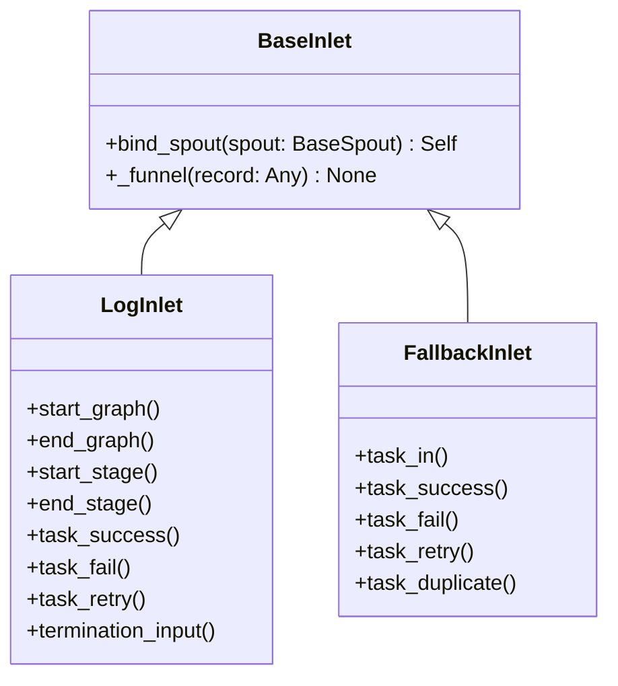

# BaseInlet

> 📅 最終更新日: 2026/06/22

`BaseInlet` はすべての入口クラス（Inlet）の基底クラスであり、レコードをキューに書き込むことで対応する `BaseSpout` に送信する役割を担います。

## クラス定義

```python
class BaseInlet:
    _queue: Queue[Any]
    _counter: PendingCounter

    def bind_spout(self, spout: BaseSpout) -> Self:
        """
        現在の inlet を指定された spout に関連付ける。

        :param spout: 対象リスナー
        :return: 関連付け済みの inlet インスタンス
        """
        self._queue = spout.get_queue()
        self._counter = spout.get_counter()
        return self

    def _funnel(self, record: Any) -> None:
        """
        レコードをキューに入れる。

        :param record: 送信するレコード
        """
        if not hasattr(self, '_queue') or not hasattr(self, '_counter'):
            raise InitializationError("inlet is not bound to spout")

        self._counter.increment()
        try:
            self._queue.put(record)
        except Exception:
            self._counter.decrement()
            raise
```

## コアメソッド

### bind_spout

```python
def bind_spout(self, spout: BaseSpout) -> Self:
```

- 現在の inlet を指定された `BaseSpout` インスタンスに関連付けます。
- 内部で spout の入力キュー（`_queue`）と待処理カウンター（`_counter`）を再利用します。
- 自身を返すため、メソッドチェーンをサポート：`LogInlet(log_level).bind_spout(spout)`。
- 関連付け前に `_funnel()` を呼び出すと `InitializationError` が発生します。

### _funnel（protected）

```python
def _funnel(self, record: Any) -> None:
```

- `record` を spout と共有するキューに入れます。
- エンキュー前に `increment()` でカウントを増やし、エンキュー失敗時は即座に `decrement()` でロールバックします。
- サブクラスは通常、具体的な業務メソッドの内部でこのメソッドを呼び出します。

## 継承関係



### 継承関係の説明

| サブクラス | 所在ファイル | 責務 |
|------|---------|------|
| `LogInlet` | `persistence/core_log.py` | ログ記録。タスクのエンキュー/デキュー/終了の全過程を追跡 |
| `FallbackInlet` | `persistence/core_fallback.py` | Fallback 記録。タスクライフサイクルを SQLite に永続化 |

## 使用例

```python
from celestialflow.funnel import BaseSpout, BaseInlet

class MySpout(BaseSpout):
    def __init__(self):
        super().__init__()
        self.received = []

    def _handle_record(self, record):
        self.received.append(record)

class MyInlet(BaseInlet):
    def send(self, data):
        self._funnel(data)

# 使用
spout = MySpout()
inlet = MyInlet().bind_spout(spout)

spout.start()
inlet.send("hello")
inlet.send({"key": "value"})
spout.stop()

print(spout.received)
```

## 注意事項

1. **単方向通信**: Inlet はキューへの書き込みのみ、Spout は消費を担当。両者はキューによって分離されています。
2. **関連付け方式**: キューとカウンターは `BaseSpout` が作成し、`bind_spout()` を通じて Inlet と共有されます。Inlet はキューのライフサイクルに関与しません。
3. **スレッドセーフ**: `queue.Queue` と `PendingCounter`（内部ロック）を使用してスレッド間の安全な通信を実現します。
4. **未関連付け例外**: `bind_spout()` を呼び出さずに `_funnel()` を呼び出すと、`InitializationError` が発生します。
5. **使用パターン**: 通常、各 `BaseSpout` に 1 つの `BaseInlet` が対応し、プロデューサー・コンシューマーのペアを形成します。
