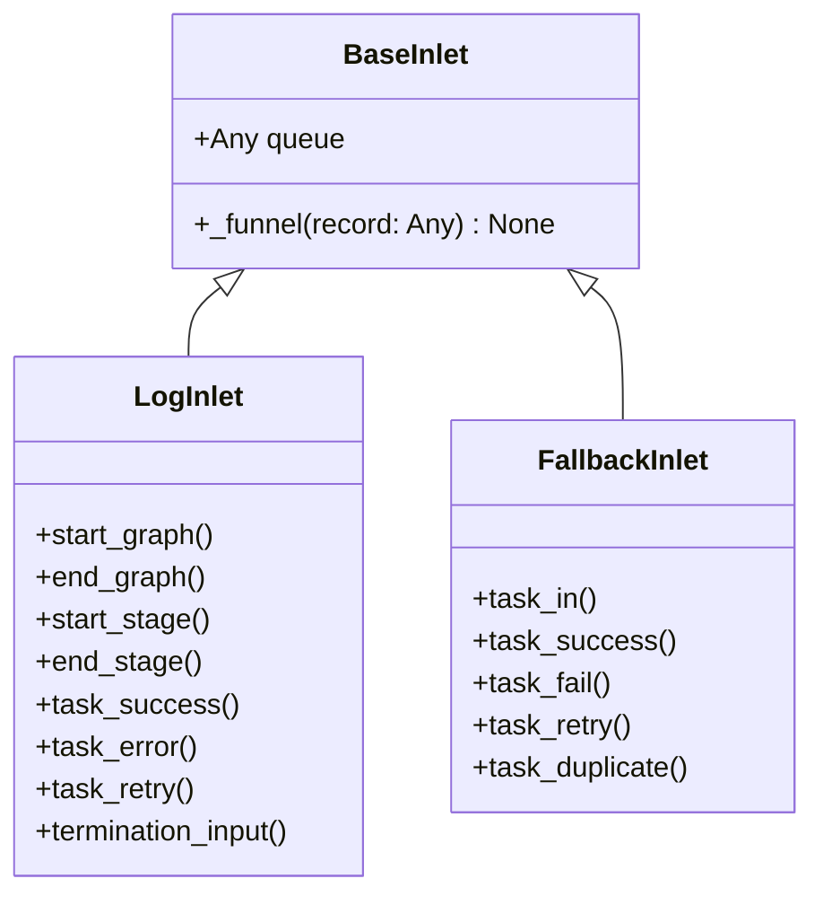

# BaseInlet

> 📅 最終更新日: 2026/06/18

`BaseInlet` はすべての入口クラス（Inlet）の基底クラスであり、レコードをキューに書き込む汎用機能を提供します。

## クラス定義

```python
class BaseInlet:
    def __init__(self, queue: Any) -> None:
        """
        :param queue: レコードキュー（対応する Spout の get_queue() から取得）
        """
        self.queue: Any = queue

    def _funnel(self, record: Any) -> None:
        """レコードをキューに入れ、対応する Spout が消費できるようにする。"""
        self.queue.put(record)
```

### プロパティ

| プロパティ | 型 | 説明 |
|------|------|------|
| `queue` | `Any` | レコードキューインスタンス。`queue.put()` でレコードを書き込む |

## コアメソッド

### _funnel（protected）

```python
def _funnel(self, record: Any) -> None:
```

- `record` を `self.queue` に入れ、対応する `Spout` が消費できるようにする
- サブクラスの具体的な業務メソッドから呼び出される
- `queue.Queue` を使用してスレッド間の安全な通信を保証

## 継承関係



### 継承関係の説明

| サブクラス | 所在ファイル | 責務 |
|------|---------|------|
| `LogInlet` | `persistence/core_log.py` | ログ記録。タスクのエンキュー/デキュー/終了の全過程を追跡 |
| `FallbackInlet` | `persistence/core_fallback.py` | Fallback 記録。タスクライフサイクルを SQLite に永続化 |

> ⚠️ **変更済み**：旧版 `FailInlet`（`core_fail.py`）は `FallbackInlet`（`core_fallback.py`）にリネームされ、`SuccessSpout` は削除されました。

## 使用例

```python
from celestialflow.funnel import BaseSpout, BaseInlet

class MySpout(BaseSpout):
    def _handle_record(self, record):
        print(record)

class MyInlet(BaseInlet):
    def send(self, data):
        self._funnel(data)

# 使用
spout = MySpout()
spout.start()
inlet = MyInlet(spout.get_queue())
inlet.send("hello")
spout.stop()
```

## 注意事項

1. **単方向通信**: Inlet はキューへの書き込みのみ、Spout は消費を担当。両者はキューによって分離されている
2. **キュー出所**: キューは対応する `BaseSpout` が作成・提供し（`get_queue()` 経由）、Inlet はキューのライフサイクルに関与しない
3. **スレッドセーフ**: `queue.Queue` を使用してスレッド間の安全な通信を実現
4. **例外非スロー**: `_funnel` 内部ではキュー書き込み例外を処理しない。サブクラスが呼び出し元でキャッチする必要がある
5. **使用パターン**: 通常、各 `BaseSpout` に 1 つの `BaseInlet` が対応し、プロデューサー・コンシューマーのペアを形成
