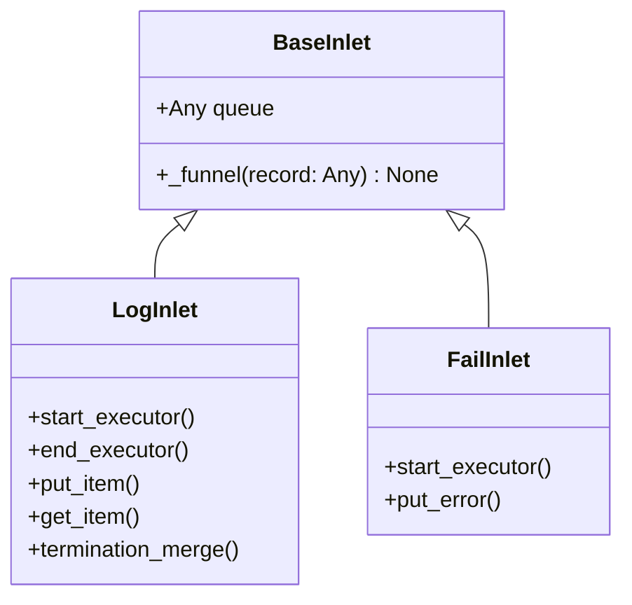

# BaseInlet

> 📅 最終更新日: 2026/05/28

`BaseInlet` はすべての Inlet クラスの基底クラスで、レコードをキューに書き込む共通機能を提供します。

## クラス定義

```python
class BaseInlet:
    def __init__(self, queue: Any) -> None:
        """
        :param queue: レコードキュー（対応する Spout の get_queue() から取得）
        """
        self.queue: Any = queue

    def _funnel(self, record: Any) -> None:
        """レコードをキューに入れ、対応する Spout に消費させる。"""
        self.queue.put(record)
```

### 属性の型

| 属性 | 型 | 説明 |
|------|------|------|
| `queue` | `Any` | レコードキューインスタンス。`queue.put()` でレコードを書き込む |

## コアメソッド

### _funnel（protected）

```python
def _funnel(self, record: Any) -> None:
```

- `record` を `self.queue` に入れ、対応する `Spout` に消費させる
- サブクラスの具体的なビジネスメソッドから呼び出される
- `queue.Queue` を使用してスレッド間の安全な通信を確保

## 継承関係



### 継承関係の詳細

| サブクラス | ソースファイル | 責務 |
|-----------|--------------|------|
| `LogInlet` | `persistence/core_log.py` | ログ記録。タスクの入出キュー・終了の全プロセスを追跡 |
| `FailInlet` | `persistence/core_fail.py` | エラー記録。タスクのエラー情報を JSONL に永続化 |

## 使用例

```python
from celestialflow.funnel import BaseSpout, BaseInlet

class MySpout(BaseSpout):
    def _handle_record(self, record):
        print(record)

class MyInlet(BaseInlet):
    def send(self, data):
        self._funnel(data)

# 使用方法
spout = MySpout()
spout.start()
inlet = MyInlet(spout.get_queue())
inlet.send("hello")
spout.stop()
```

## 注意事項

1. **一方向通信**: Inlet はキューへの書き込みのみ行い、Spout が消費を担当。両者はキューを通じて分離されている
2. **キューの提供元**: キューは対応する `BaseSpout` が作成・提供する（`get_queue()` 経由）。Inlet はキューのライフサイクルを管理しない
3. **スレッドセーフ**: `queue.Queue` によるスレッド間安全な通信を実現
4. **例外非発生**: `_funnel` 内部ではキュー書き込み例外を処理しない。サブクラスが呼び出し元でキャッチする必要がある
5. **使用パターン**: 通常、1つの `BaseSpout` に1つの `BaseInlet` が対応し、プロデューサー・コンシューマーペアを形成
