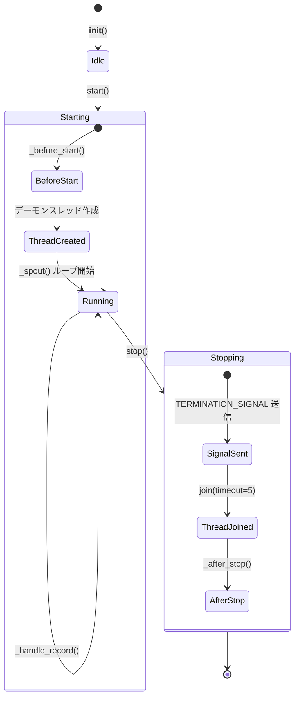

# BaseSpout

> 📅 最終更新日: 2026/06/22

`BaseSpout` はすべての出口クラスの基底クラスであり、バックグラウンドスレッドでキューを監視しレコードを処理する汎用機能を提供します。

## 初期化

```python
class BaseSpout:
    def __init__(self):
        self._queue: Queue[Any] = Queue()
        self._counter = PendingCounter()
        self._thread: Thread | None = None
```

## コアメソッド

### start

バックグラウンド監視スレッドを起動します。

```python
def start(self):
    """バックグラウンド監視スレッドを起動する（未実行の場合）。"""
```

フロー：
1. `_before_start()` フックを呼び出す
2. スレッドが未実行の場合、デーモンスレッドを作成・起動し、`_spout()` メソッドを実行

### stop

監視スレッドを停止し、リソースをクリーンアップします。

```python
def stop(self):
    """終了シグナルを送信し、バックグラウンドスレッドの終了を待つ。"""
```

フロー：
1. `_thread` が `None` の場合、そのままリターン
2. `TERMINATION_SIGNAL` をキューに送信
3. スレッドの終了を待機（`join(timeout=5)`）し、`_thread` を `None` に設定
4. `_after_stop()` フックを呼び出す

### get_queue / get_counter / get_pending_count

```python
def get_queue(self) -> Queue[Any]:
    """リスナーの入力キューを取得する。"""

def get_counter(self) -> PendingCounter:
    """現在のリスナーに関連付けられた待処理カウンターを取得する。"""

def get_pending_count(self) -> int:
    """現在も処理が完了していないレコード数を読み取る。"""
```

`get_pending_count()` には「デキュー済みだがまだ処理中」のレコードも含まれます。カウントは `_handle_record()` 完了後に減少するためです。

## オーバーライド可能なメソッド

```python
def _before_start(self) -> None:
    """起動前の初期化処理。デフォルトは空実装。"""
    return None

def _handle_record(self, _record: Any) -> None:
    """単一レコードを処理する（サブクラスで必ずオーバーライド。未実装の場合は CelestialFlowError を送出）。"""
    raise CelestialFlowError("_handle_record must be implemented by subclasses")

def _after_stop(self) -> None:
    """停止後のクリーンアップ処理。デフォルトは空実装。"""
    return None
```

## 内部実装

```python
def _spout(self):
    """バックグラウンドスレッドのメインループ。キューから継続的にレコードを取得し _handle_record を呼び出す。終了シグナル受信時に終了。"""
    while True:
        try:
            record = self._queue.get(timeout=0.5)
        except Empty:
            continue

        if isinstance(record, TerminationSignal):
            break

        try:
            self._handle_record(record)
        except Exception:
            # 単一レコードの処理失敗はスレッドを殺さず、traceback を出力して継続
            traceback.print_exc()
        finally:
            self._counter.decrement()
```

## ライフサイクル状態図



## 使用例

以下は `BaseSpout` のカスタムサブクラスを作成し、起動・処理・停止の全フローを示す例です。

### 基本的なサブクラス実装

```python
from celestialflow.funnel import BaseSpout

# カスタム Spout：文字列レコードをリストに収集
class CollectSpout(BaseSpout):
    def __init__(self):
        super().__init__()
        self.collected: list[str] = []

    def _handle_record(self, record):
        """単一レコードを処理。サブクラスで必ずオーバーライドすること"""
        self.collected.append(str(record))

# 使用
spout = CollectSpout()
spout.start()

# キュー経由でレコードを送信
q = spout.get_queue()
q.put("task_1")
q.put("task_2")
q.put("task_3")

# 停止
spout.stop()
print(f"{len(spout.collected)} 件のレコードを収集しました")
```

### ライフサイクルフック付きサブクラス

```python
from celestialflow.funnel import BaseSpout

class FileWriterSpout(BaseSpout):
    def __init__(self, filepath: str):
        super().__init__()
        self.filepath = filepath
        self.fh = None

    def _before_start(self):
        """起動前にファイルを開く"""
        self.fh = open(self.filepath, "w", encoding="utf-8")
        print(f"ファイルを開きました: {self.filepath}")

    def _handle_record(self, record):
        """ファイルに書き込む"""
        line = f"{record}\n"
        self.fh.write(line)

    def _after_stop(self):
        """停止後にファイルを閉じる"""
        if self.fh:
            self.fh.close()
            print(f"ファイルを閉じました: {self.filepath}")

# 使用
spout = FileWriterSpout("/tmp/test_spout.log")
spout.start()
spout.get_queue().put("record_alpha")
spout.get_queue().put("record_beta")
spout.stop()
```

### 待処理数の確認

```python
from celestialflow.funnel import BaseSpout

class CounterSpout(BaseSpout):
    def __init__(self):
        super().__init__()
        self.count = 0

    def _handle_record(self, record):
        self.count += 1

spout = CounterSpout()
spout.start()

for i in range(100):
    spout.get_queue().put(i)

# キューが空になるまで待機
import time
time.sleep(0.5)
print(f"待処理: {spout.get_pending_count()}")

spout.stop()
print(f"{spout.count} 件のレコードを処理しました")  # 100
```

## 注意事項

1. **スレッドセーフ**: `queue.Queue` を使用してスレッド間通信の安全性を確保します。
2. **デーモンスレッド**: 監視スレッドはデーモンスレッド（`daemon=True`）として設定され、メインプロセス終了時に自動終了します。
3. **グレースフルストップ**: `TerminationSignal` を送信してスレッドに停止を通知し、`join(timeout=5)` で最大 5 秒待機します。
4. **例外分離**: 単一レコードの処理失敗時は traceback を出力して続行し、スレッドは終了しません。
5. **キュー未クリア**: 停止時にキュー内の残存レコードはクリアされません。
6. **待処理カウント**: カウンターは `_funnel()` エンキュー前に増加し、`_spout()` 処理完了後に減少します。これにより、データがすべて消費されたかどうかを判断できます。
