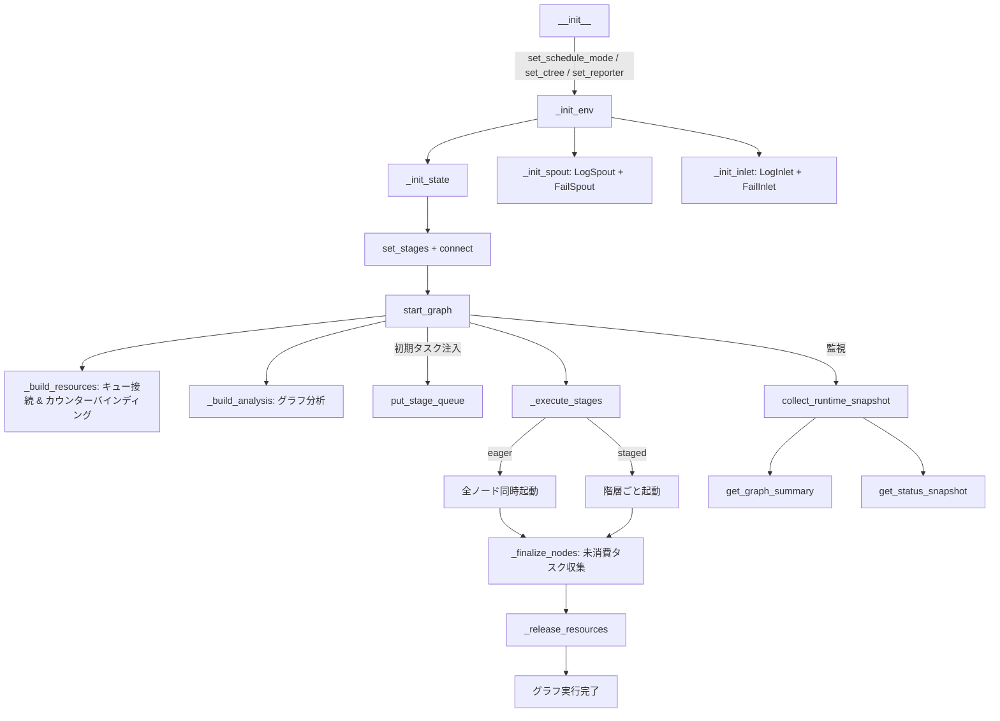

# TaskGraph

> 📅 最終更新日: 2026/06/11

`TaskGraph` は CelestialFlow のコアスケジューラであり、一連の `TaskStage` ノードの依存関係、実行フロー、リソース割り当て、ライフサイクルを管理します。

> 注意: `TaskGraph` は単一回使用のオブジェクトです。一度 `start_graph()` が完了した後、現在のインスタンスが安全にリセットされて再起動できることは保証されません。同じフローを繰り返し実行する必要がある場合は、新しい `TaskGraph` と関連する `TaskStage` を再作成してください。

## 主要データ構造

`TaskGraph` は内部で `stage_dict: dict[str, TaskStage]` を使用して全ノードの Stage マッピングを保持します。各 Stage は初期化時に自動的に対応する `TaskInQueue` と `TaskOutQueue` を作成し、キューは `_build_resources()` フェーズで接続が確立されます。

## 初期化

```python
class TaskGraph:
    def __init__(self, name: str, schedule_mode: str = "eager", log_level: str = "INFO"):
        ...
```

### パラメータ説明

- **name**: タスクグラフ名（必須）
- **schedule_mode**: スケジュールモード
  - `eager`（デフォルト）: 全ノードを一度に並行起動。依存関係はキューフローで自動制御
  - `staged`: 階層実行（DAG のみ）。階層順に逐層起動し、上位層がすべて完了してから下位層を起動
- **log_level**: ログレベル

## グラフ構築

### set_stages

```python
def set_stages(self, stages: list[TaskStage]) -> None:
    """
    ノードをタスクグラフに追加します。各ノードに対して TaskInQueue と TaskOutQueue を作成します。

    :param stages: ノードリスト
    :raises DuplicateNodeError: ノード名が重複している場合
    """
```

### connect

```python
def connect(self, from_stages: list[TaskStage], to_stages: list[TaskStage]) -> None:
    """
    ハイパーエッジ接続を確立します: from_stages の各ノードが to_stages の各ノードに接続されます。
    out_edges / in_edges 辞書を操作し、実際のキュー接続は _build_resources() で完了します。
    """
```

## 設定メソッド

### set_reporter

```python
def set_reporter(self, is_report: bool = False, host: str = "127.0.0.1", port: int = 5000) -> None:
    """レポーターを設定し、Web UI に状態をプッシュします。"""
```

### set_ctree

```python
def set_ctree(self, use_ctree: bool = False, host: str = "127.0.0.1",
              http_port: int = 7777, grpc_port: int = 7778,
              transport: str = "grpc") -> None:
    """
    CelestialTree クライアントを設定します。有効時は接続ヘルスチェックを行います。
    :raises CelestialTreeConnectionError: 接続失敗時
    """
```

### set_graph_mode

```python
def set_graph_mode(self, stage_mode: str, execution_mode: str) -> None:
    """
    全ノードの stage_mode と execution_mode を一括設定します。
    _build_analysis() をトリガーして分析データを再構築します。
    """
```

## 起動実行

### start_graph

```python
def start_graph(self, init_tasks_dict: Mapping[str, Iterable[Any]],
                put_termination_signal: bool = True) -> None:
    """
    タスクグラフを起動します。フロー:
    1. _build_resources() でキュー接続とカウンターバインディングを構築
    2. _build_analysis() でグラフ構造を分析（ソースノード、階層、DAG 検出）
    3. spout、inlet、reporter を起動
    4. put_stage_queue() で初期タスクと終了シグナルを注入
    5. _execute_stages() で全ノードを実行
    6. _finalize_nodes() で後処理（スレッド終了保証、未消費タスク収集）
    7. リソース解放
    """
```

ライフサイクル制約:

- `TaskGraph` は起動プロセス中に実行時キュー接続、先行バインディング、スレッド参照、状態スナップショットを確立します。
- これらの実行時リソースは設計上単一の完全実行を対象としており、実行終了後に安全にクリアされて再利用されることは保証されません。
- 同じトポロジを再実行する必要がある場合は、同一インスタンスの `start_graph()` を再度呼び出すのではなく、グラフオブジェクトとノードオブジェクトを再インスタンス化することを推奨します。

```python
graph = TaskGraph(name="MyGraph", schedule_mode="eager")
graph.set_stages(stages=[stage_a, stage_b])
graph.connect([stage_a], [stage_b])
graph.start_graph({stage_a.get_name(): [1, 2, 3, 4, 5]})
```

### _execute_stages

```python
def _execute_stages(self) -> None:
    """eager モード: 全ノードを一度に起動; staged モード: 階層ごとに起動。"""
```

### _execute_stage

```python
def _execute_stage(self, stage: TaskStage) -> None:
    """
    単一ノードを実行:
    - thread モード: 新規スレッドで stage.start_stage() を呼び出し
    - serial モード: 現在のスレッドで同期的に stage.start_stage() を呼び出し
    """
```

## 動的タスク注入

### put_stage_queue

```python
def put_stage_queue(self, tasks_dict: Mapping[str, Iterable[Any]],
                    put_termination_signal: bool = True) -> None:
    """
    ノードに動的にタスクを注入します。対応:
    - 通常タスク → 自動的に TaskEnvelope にラップ
    - TerminationSignal オブジェクト → 終了シグナルを直接注入
    - put_termination_signal=True → 全ソースノードに自動的に終了シグナルを注入
    """
```

## 実行時監視

### collect_runtime_snapshot

```python
def collect_runtime_snapshot(self) -> None:
    """
    全ノードの実行時スナップショットを収集し、status_dict を更新します。
    各ノードの processed / pending / elapsed / remaining とグローバル残り時間を計算します。
    """
```

### _snapshot_one_stage

単一ノードのスナップショットを収集し、以下のフィールドを含む辞書を返します:

| フィールド | 型 | 説明 |
|------|------|------|
| `name` | `str` | ノード名 |
| `func_name` | `str` | 関数名 |
| `execution_mode` | `str` | 実行モード |
| `stage_mode` | `str` | ノードモード |
| `status` | `StageStatus` | 実行状態 |
| `tasks_input` | `int` | 入力タスク数 |
| `tasks_succeeded` | `int` | 成功数 |
| `tasks_failed` | `int` | 失敗数 |
| `tasks_duplicated` | `int` | 重複数 |
| `tasks_processed` | `int` | 処理済み数 |
| `tasks_pending` | `int` | 保留中数 |
| `total_tasks_pending` | `int` | グローバル推定保留中数 |
| `elapsed_time` | `float` | 経過時間 |
| `remaining_time` | `float` | 推定残り時間 |
| `total_remaining_time` | `float` | グローバル推定残り時間 |
| `task_avg_time` | `str` | 平均時間（フォーマット済み） |
| `start_time` | `float` | 起動タイムスタンプ |

## 照会インターフェース

| メソッド | 戻り値型 | 説明 |
|------|---------|------|
| `get_status_snapshot()` | `dict` | 統一タイムスタンプ付き状態スナップショット |
| `get_graph_analysis()` | `dict` | グラフ分析情報（isDAG、scheduleMode、layersDict、className） |
| `get_structure_graph()` | `dict` | JSON 形式のグラフ構造（nodes + edges + source_nodes） |
| `get_structure_list()` | `list[str]` | 枠線付きフォーマット済みツリーテキスト |
| `get_networkx_graph()` | `DiGraph` | networkx 有向グラフインスタンス |
| `get_fail_by_stage_dict()` | `dict[str, list]` | ノード別グループ化失敗タスク |
| `get_fail_by_error_dict()` | `dict[tuple, list]` | エラー型別グループ化失敗タスク（キーは `(error_type, error_message)` タプル） |
| `get_total_error_num()` | `int` | 総エラー数 |
| `get_fallback_path()` | `str` | 失敗タスク JSONL ファイルの絶対パス |
| `get_source_stages()` | `list[TaskStage]` | ソースノードリスト |
| `get_stage_input_trace(stage_name)` | `str` | ノード入力依存関係ツリー（ctree 有効時） |

### get_fail_by_error_dict 説明

```python
def get_fail_by_error_dict(self) -> dict[tuple[str, ...], list[Any]]:
    """(error_type, error_message) でグループ化して返します。"""
```

## ライフサイクル図



## スケジュールモード詳解

### Eager モード

```
全ノード同時 start_stage → データがキューを通じてフロー → 終了シグナル到達後に停止
```

- 並列度を最大化
- ほとんどのシナリオに適用可能
- 循環グラフではこのモードの使用を推奨

### Staged モード

```
Layer 0: [Node A, Node B] → 全 join → Layer 1: [Node C, Node D] → ...
```

- 階層ごとに実行、各層が完全に終了してから次層を起動
- DAG のみ適用可能
- デバッグ、パフォーマンス分析、リソース制御に最適

## 非 DAG グラフの注意事項

循環グラフでは、`put_termination_signal=True` の場合、`start_graph` は `RuntimeWarning` を発行します。終了シグナルにより、一部のノードが上流データを受信する前に早期終了する可能性があるため、以下を推奨します:

```python
graph.start_graph({"source": tasks}, put_termination_signal=False)
# 後続で Web UI または put_stage_queue から手動で TerminationSignal を注入
```

## 未消費タスク処理

`_finalize_nodes()` 内で `in_queue.drain()` により全残存タスクを収集し、それらを `UnconsumedError` としてマークし、`fail_inlet` を通じて JSONL ファイルに永続化します。
