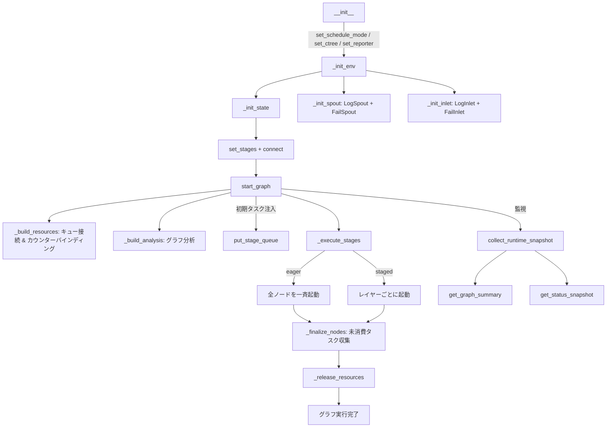

# TaskGraph

> 📅 最終更新日: 2026/05/28

`TaskGraph` は CelestialFlow のコアスケジューラで、一連の `TaskStage` ノードの依存関係、実行フロー、リソース割り当て、ライフサイクルの管理を担当します。

## 主要データ構造

`TaskGraph` は内部で `stage_dict: dict[str, TaskStage]` を使用して全ノードの Stage マッピングを保持します。各 Stage は初期化時に自動的に対応する `TaskInQueue` と `TaskOutQueue` を作成し、キューは `_build_resources()` フェーズで接続されます。

## 初期化

```python
class TaskGraph:
    def __init__(self, schedule_mode: str = "eager", log_level: str = "INFO"):
        ...
```

### パラメータ説明

- **schedule_mode**: スケジューリングモード
  - `eager`（デフォルト）: 全ノードを一斉に並行起動。依存関係はキューフローで自動制御
  - `staged`: レイヤーごとに実行（DAG のみ）。レベル順にレイヤーを起動し、前のレイヤーがすべて完了してから次のレイヤーを開始
- **log_level**: ログレベル

## グラフ構築

### set_stages

```python
def set_stages(self, stages: list[TaskStage]) -> None:
    """
    ノードをタスクグラフに追加する。各ノードに TaskInQueue と TaskOutQueue を作成。

    :param stages: ノードリスト
    :raises DuplicateNodeError: ノード名が重複している場合
    """
```

### connect

```python
def connect(self, from_stages: list[TaskStage], to_stages: list[TaskStage]) -> None:
    """
    ハイパーエッジ接続を確立：from_stages の各ノードが to_stages の各ノードに接続。
    out_edges / in_edges 辞書を操作し、実際のキュー接続は _build_resources() で実行。
    """
```

## 設定メソッド

### set_reporter

```python
def set_reporter(self, is_report: bool = False, host: str = "127.0.0.1", port: int = 5000) -> None:
    """Web UI に状態をプッシュするレポーターを設定。"""
```

### set_ctree

```python
def set_ctree(self, use_ctree: bool = False, host: str = "127.0.0.1",
              http_port: int = 7777, grpc_port: int = 7778,
              transport: str = "grpc") -> None:
    """
    CelestialTree クライアントを設定。有効時は接続状態を検証。
    :raises CelestialTreeConnectionError: 接続失敗時
    """
```

### set_graph_mode

```python
def set_graph_mode(self, stage_mode: str, execution_mode: str) -> None:
    """
    全ノードの stage_mode と execution_mode を一括設定。
    _build_analysis() をトリガーして分析データを再構築。
    """
```

## 実行開始

### start_graph

```python
def start_graph(self, init_tasks_dict: Mapping[str, Iterable[Any]],
                put_termination_signal: bool = True) -> None:
    """
    タスクグラフを開始。フロー：
    1. _build_resources() — キュー接続とカウンターバインディングを構築
    2. _build_analysis() — グラフ構造を分析（ソースノード、レベル、DAG 判定）
    3. spout、inlet、reporter を起動
    4. put_stage_queue() — 初期タスクと終了シグナルを注入
    5. _execute_stages() — 全ノードを実行
    6. _finalize_nodes() — 後処理（スレッド終了確認、未消費タスク収集）
    7. リソース解放
    """
```

```python
graph = TaskGraph(schedule_mode="eager")
graph.set_stages(stages=[stage_a, stage_b])
graph.connect([stage_a], [stage_b])
graph.start_graph({stage_a.get_name(): [1, 2, 3, 4, 5]})
```

### _execute_stages

```python
def _execute_stages(self) -> None:
    """eager モード：全ノードを一斉起動；staged モード：レイヤーごとに順次起動。"""
```

### _execute_stage

```python
def _execute_stage(self, stage: TaskStage) -> None:
    """
    単一ノードを実行：
    - thread モード：新規スレッドで stage.start_stage() を呼び出し
    - serial モード：現在のスレッドで同期的に stage.start_stage() を呼び出し
    """
```

## 動的タスク注入

### put_stage_queue

```python
def put_stage_queue(self, tasks_dict: Mapping[str, Iterable[Any]],
                    put_termination_signal: bool = True) -> None:
    """
    ノードにタスクを動的注入。以下をサポート：
    - 通常タスク → 自動的に TaskEnvelope にラップ
    - TerminationSignal オブジェクト → 直接終了シグナルを注入
    - put_termination_signal=True → 全ソースノードに終了シグナルを自動注入
    """
```

## ランタイム監視

### collect_runtime_snapshot

```python
def collect_runtime_snapshot(self) -> None:
    """
    全ノードのランタイムスナップショットを収集し、status_dict を更新。
    各ノードの processed / pending / elapsed / remaining とグローバル残り時間を計算。
    """
```

### _snapshot_one_stage

単一ノードのスナップショットを収集し、以下のフィールドを含む辞書を返す：

| フィールド | 型 | 説明 |
|-----------|------|------|
| `name` | `str` | ノード名 |
| `func_name` | `str` | 関数名 |
| `execution_mode` | `str` | 実行モード |
| `stage_mode` | `str` | ノードモード |
| `status` | `StageStatus` | 実行状態 |
| `tasks_input` | `int` | 入力タスク数 |
| `tasks_succeeded` | `int` | 成功数 |
| `tasks_failed` | `int` | 失敗数 |
| `tasks_duplicated` | `int` | 重複数 |
| `tasks_processed` | `int` | 処理済み数 |
| `tasks_pending` | `int` | 保留中数 |
| `elapsed_time` | `float` | 経過時間 |
| `remaining_time` | `float` | 推定残り時間 |
| `task_avg_time` | `str` | 平均時間（フォーマット済み） |
| `start_time` | `float` | 起動タイムスタンプ |

## クエリインターフェース

| メソッド | 戻り値の型 | 説明 |
|---------|----------|------|
| `get_status_snapshot()` | `dict` | 統一タイムスタンプ付き状態スナップショット |
| `get_graph_summary()` | `dict` | グローバル残り時間サマリー |
| `get_graph_analysis()` | `dict` | グラフ分析情報（isDAG, scheduleMode, layersDict, className） |
| `get_structure_json()` | `list[dict]` | JSON 形式のグラフ構造 |
| `get_structure_list()` | `list[str]` | 枠付きフォーマット済みツリーテキスト |
| `get_networkx_graph()` | `DiGraph` | networkx 有向グラフインスタンス |
| `get_fail_by_stage_dict()` | `dict[str, list]` | ステージ別の失敗タスク |
| `get_fail_by_error_dict()` | `dict[tuple, list]` | エラータイプ別の失敗タスク（キーは `(error_type, error_message)` タプル） |
| `get_total_error_num()` | `int` | 総エラー数 |
| `get_fallback_path()` | `str` | 失敗タスク JSONL ファイルの絶対パス |
| `get_source_stages()` | `list[TaskStage]` | ソースノードリスト |
| `get_stage_input_trace(stage_name)` | `str` | ノード入力依存関係ツリー（ctree 有効時） |

### get_fail_by_error_dict 詳細

```python
def get_fail_by_error_dict(self) -> dict[tuple[str, ...], list[Any]]:
    """(error_type, error_message) でグループ化して返す。"""
```

## ライフサイクル図



## スケジューリングモード詳解

### Eager モード

```
全ノードが同時に start_stage → データはキューを通じてフロー → 終了シグナル到着で停止
```

- 並列度を最大化
- ほとんどのシナリオに適用
- 循環グラフにはこのモードを推奨

### Staged モード

```
レイヤー 0: [ノード A, ノード B] → すべて join → レイヤー 1: [ノード C, ノード D] → ...
```

- レイヤーごとに実行。現在のレイヤーが完全に終了してから次のレイヤーを開始
- DAG のみに適用
- デバッグ、パフォーマンス分析、リソース制御に適する

## 非 DAG グラフの注意事項

循環グラフで `put_termination_signal=True` の場合、`start_graph` は `RuntimeWarning` を発行します。終了シグナルにより、一部のノードが上流データを受信する前に早期終了する可能性があります。推奨アプローチ：

```python
graph.start_graph({"source": tasks}, put_termination_signal=False)
# 後で Web UI や put_stage_queue で手動で TerminationSignal を注入
```

## 未消費タスクの処理

`_finalize_nodes()` で `in_queue.drain()` により全残存タスクを収集し、`UnconsumedError` としてマークし、`fail_inlet` を通じて JSONL ファイルに永続化します。
