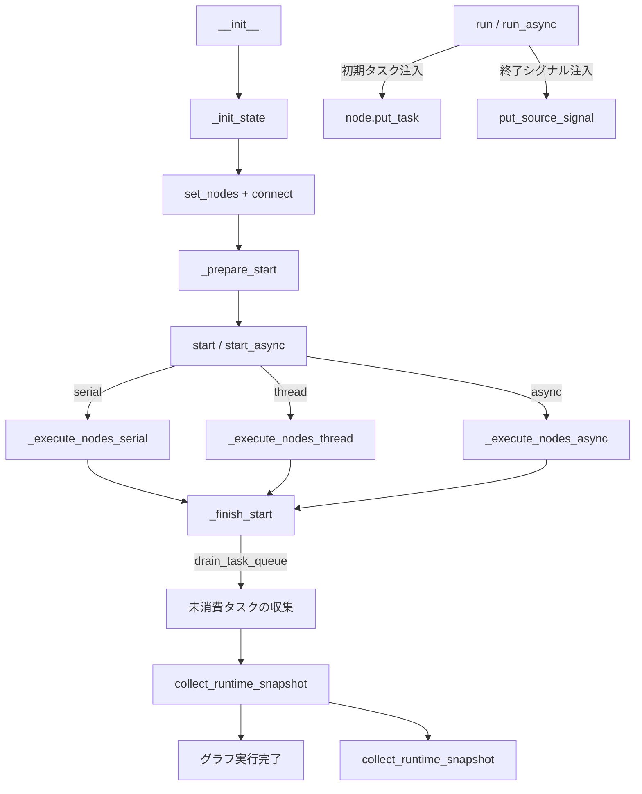

# TaskGraph

> 📅 最終更新日: 2026/09/09

`TaskGraph` は CelestialFlow のコアスケジューラであり、一連のタスクノード（`BaseTaskNode` 派生オブジェクト、パブリック API は `TaskExecutor`、`TaskSplitter`、`TaskRouter`）の依存関係、実行フロー、リソース割り当て、ライフサイクルを管理します。

> 注意: `TaskGraph` は単一回使用のオブジェクトです。一度 `run()` が完了した後、現在のインスタンスが安全にリセットされて再起動できることは保証されません。同じフローを繰り返し実行する必要がある場合は、新しい `TaskGraph` と関連するタスクノードを再作成してください。

## 主要データ構造

`TaskGraph` は内部で `node_dict: dict[str, AnyTaskNode]` を使用して全ノードのマッピングを保持し、キュー接続は `connect()` フェーズで直接確立されます。グラフ分析は内部で維持される `OrderGraph` インスタンス（`self.order_graph`）に基づき、その `out_edges` / `in_edges` は入辺・出辺隣接テーブルの参照ビューです。

## 初期化

```python
class TaskGraph:
    def __init__(self, name: str, graph_mode: str = "serial"): ...
```

### パラメータ説明

- **name**: タスクグラフ名（必須）
- **graph_mode**: グラフ実行モード
  - `serial`（デフォルト）: 直列実行。階層（`layers_dict`）のトポロジカル順に従い逐層実行
  - `thread`: スレッド並行実行。各ノードが独立スレッドで起動
  - `async`: 非同期並行実行。実行中のイベントループコンテキストでの呼び出しが必要（[`start_async`](#start_async) 参照）

## グラフ構築

### set_nodes

```python
def set_nodes(self, nodes: list[AnyTaskNode]) -> None:
    """
    ノードをタスクグラフに追加します。ノードを登録し、グラフレベルのイベントクライアントを注入します。

    :param nodes: ノードリスト
    :raises DuplicateNodeError: ノード名が重複している場合
    """
```

### connect

```python
def connect[R](
    self,
    from_nodes: list[AnyTaskNode],
    to_nodes: list[AnyTaskNode],
) -> None:
    """
    ハイパーエッジ接続を確立します: from_nodes の各ノードが to_nodes の各ノードに接続されます。
    self.order_graph の out_edges / in_edges 辞書を操作し、キュー接続は connect() 内で直接完了します。
    """
```

## 設定メソッド

### set_reporter

```python
def set_reporter(self, reporter: ReporterProtocol) -> None:
    """
    タスクグラフにバインドされるレポーターを設定します。

    :param reporter: レポーターインスタンス
    """
```

### set_ctree

```python
def set_ctree(self, ctree_client: EventClient) -> None:
    """
    タスクグラフ共有のイベントクライアントを設定します。
    渡されると、現在のグラフ内の全ノードに同期して下位配信されます。
    """
```

> デフォルトでは、`TaskGraph` は内部で `LocalEventClient()` を使用してローカルのインクリメンタルイベント ID を生成するため、`celestialtree` がインストールされていなくても、コア実行リンクは正常に動作します。
>
> イベントを CelestialTree に報告したい場合は、まず `celestialtree` を追加インストールし、対応するクライアントインスタンスを自身で構築して `set_ctree()` に渡す必要があります。

### set_graph_mode

```python
def set_graph_mode(self, graph_mode: str) -> None:
    """
    グラフ実行モードを設定します。指定可能な値は 'serial'、'thread'、'async' です。
    """
```

### set_node_execution_mode

```python
def set_node_execution_mode(self, execution_mode: str) -> None:
    """
    全ノードの execution_mode を一括設定します（'serial'、'thread'、'async'）。
    _build_analysis() をトリガーして分析データを再構築します。
    """
```

## 起動実行

### run

```python
def run(
    self,
    init_tasks_dict: dict[str, Iterable[Any]],
    *,
    if_put_signal: bool = True,
) -> None:
    """
    タスクグラフを実行します。フロー：
    1. 初期タスクを各ノードに注入
    2. if_put_signal=True の場合、ソースノードに自動的に終了シグナルを注入
    3. start() を呼び出して実行を起動
    """
```

### run_async

```python
async def run_async(
    self,
    init_tasks_dict: dict[str, Iterable[Any]],
    *,
    if_put_signal: bool = True,
) -> None:
    """run() の非同期バージョン。"""
```

### restore_db

```python
def restore_db(
    self,
    db_path: str | Path,
    statuses: Iterable[str] | None = None,
    *,
    filter_by_error_type: bool = False,
    if_put_signal: bool = True,
) -> None:
    """
    sqlite 永続化ライブラリからタスクを読み込み、ノード別にグループ化してタスクグラフを起動します。

    :param db_path: sqlite データベースファイルパス
    :param statuses: レコードステータスフィルタリスト。デフォルト ``["failed", "pending"]``
    :param filter_by_error_type: 各ノードの ``retry_exceptions`` で ``error_type`` をフィルタリングするかどうか。デフォルト ``False``
    :param if_put_signal: 終了シグナルを注入するかどうか。デフォルト True
    """
```

このメソッドは内部で `load_tasks_grouped_by_node()` を呼び出して永続化タスクレコードを読み込み、
`node.metrics.get_retry_error_type_names()` で回復可能なエラータイプをフィルタリングし、
最終的に `start()` を再利用して実行します。

### ライフサイクル制約

- `TaskGraph` は起動プロセス中に実行時キュー接続、先行バインディング、スレッド参照、状態スナップショットを確立します。
- これらの実行時リソースは設計上単一の完全実行を対象としており、実行終了後に安全にクリアされて再利用されることは保証されません。
- 同じトポロジを再実行する必要がある場合は、同一インスタンスの `run()` を再度呼び出すのではなく、グラフオブジェクトとノードオブジェクトを再インスタンス化することを推奨します。

```python
graph = TaskGraph(name="MyGraph", graph_mode="thread")
graph.set_nodes(nodes=[node_a, node_b])
graph.connect([node_a], [node_b])
graph.run({node_a.get_name(): [1, 2, 3, 4, 5]})
```

### start

```python
def start(self) -> None:
    """
    タスクグラフを起動します（同期エントリ）。
    graph_mode に応じて _execute_nodes_serial() または _execute_nodes_thread() を選択します。
    """
```

### start_async

```python
async def start_async(self) -> None:
    """
    タスクグラフを非同期で起動します。graph_mode='async' が必要。そうでない場合は InvalidOptionError を送出します。
    """
```

### _execute_nodes_serial / _execute_nodes_thread / _execute_nodes_async

```python
def _execute_nodes_serial(self) -> None:
    """階層（layers_dict）のトポロジカル順に従い、層ごとに各ノードを逐次直列実行。"""


def _execute_nodes_thread(self) -> None:
    """各ノードを独立したデーモンスレッドで起動し、最後に一括 join。"""


async def _execute_nodes_async(self) -> None:
    """グラフ全体を並行実行。"""
```

### _execute_node / _execute_node_async

```python
def _execute_node(self, node: AnyTaskNode) -> None:
    """
    同期グラフ起動パスで単一ノードを実行します。
    - async ノードは asyncio.run(node.start_async())
    - その他のノードは node.start()
    """


async def _execute_node_async(self, node: AnyTaskNode) -> None:
    """
    単一ノードを非同期実行：async はそのまま、それ以外は asyncio.to_thread(node.start)。
    """
```

## 実行時監視

### collect_runtime_snapshot

```python
def collect_runtime_snapshot(self) -> tuple[dict[str, Any], float]:
    """
    全ノードのランタイムスナップショットを収集し、DAG 認識のグローバル pending 推定値を計算して各ノードのスナップショット（total_tasks_pending / total_remaining_time）に追記します。

    :return: (status_dict, status_timestamp) — 各ノードのスナップショット辞書と統一収集タイムスタンプ
    """
```

このメソッドは全ノードを反復して `node.snapshot(interval)` を呼び出し各ノードのスナップショットを収集し、DAG 認識のグローバル pending 推定値を計算して各ノードのスナップショットに追記します。

以下の表は完全なスナップショットに含まれる全フィールドを示します：

| フィールド | 型 | 説明 |
|------|------|------|
| `name` | `str` | ノード名 |
| `func_name` | `str` | 関数名 |
| `execution_mode` | `str` | 実行モード |
| `max_workers` | `int` | 最大並行ワーカー数 |
| `status` | `StageStatus` | 実行状態 |
| `tasks_input` | `int` | 入力タスク数 |
| `tasks_succeeded` | `int` | 成功数 |
| `tasks_failed` | `int` | 失敗数 |
| `tasks_duplicated` | `int` | 重複数 |
| `tasks_processed` | `int` | 処理済み数 |
| `tasks_pending` | `int` | 保留中数 |
| `total_tasks_pending` | `int` | グローバル推定保留中数 |
| `elapsed_time` | `float` | 経過時間 |
| `remaining_time` | `float` | 推定残り時間 |
| `total_remaining_time` | `float` | グローバル推定残り時間 |
| `task_avg_time` | `str` | 平均時間（フォーマット済み） |
| `start_time` | `float` | 起動タイムスタンプ |

## 照会インターフェース

| メソッド | 戻り値型 | 説明 |
|------|---------|------|
| `get_graph_id()` | `str` | 現在のタスクグラフインスタンスの一意識別子を取得 |
| `get_nodes()` | `list[str]` | 登録順に全ノード名を返す |
| `get_edges()` | `dict[str, list[str]]` | 出辺隣接テーブル（内部 `OrderGraph` との共有参照。呼び出し側は読み取り専用とすべき） |
| `get_source_nodes()` | `list[str]` | ソースノード名のリスト |
| `get_graph_analysis()` | `dict` | グラフ分析情報（graphId, graphMode, name, startTime, className, isDAG, layersDict） |
| `get_structure_list()` | `list[str]` | 枠線付きのフォーマット済みツリーテキスト |
| `get_order_graph()` | `OrderGraph` | 内部の順序付き有向グラフインスタンス |
| `get_lifecycle_path()` | `Path` | タスクライフサイクル永続化 sqlite ファイルの絶対パス。未設定時は空 Path を返す |

### get_graph_analysis の説明

`get_graph_analysis()` は以下のフィールドを含む辞書を返します：

```python
{
    "graphId": self.graph_id,
    "graphMode": self.graph_mode,
    "name": self.name,
    "startTime": self.start_time,
    "className": self.__class__.__name__,
    "isDAG": self.is_dag,
    "layersDict": self.layers_dict,
}
```

## ライフサイクル図


```mermaid
flowchart TD
    INIT[__init__] --> INIT_STATE[_init_state]
    INIT_STATE --> BUILD[set_nodes + connect]
    BUILD --> PREPARE[_prepare_start]
    PREPARE --> START[start / start_async]
    START -->|serial| SER[_execute_nodes_serial]
    START -->|thread| THR[_execute_nodes_thread]
    START -->|async| ASY[_execute_nodes_async]
    SER --> FINISH[_finish_start]
    THR --> FINISH
    ASY --> FINISH
    FINISH -->|drain_task_queue| DRAIN[未消費タスクの収集]
    DRAIN --> SNAP[collect_runtime_snapshot]
    SNAP --> END[グラフ実行完了]

    SNAP --> STATUS[collect_runtime_snapshot]

    RUN[run / run_async] -->|初期タスク注入| PUT[node.put_task]
    RUN -->|終了シグナル注入| SIGNAL[put_source_signal]
```

## グラフ実行モード詳解

### serial モード

```
layers_dict の階層トポロジカル順に従い、層ごとに node.start() を同期実行 → データがキューを通じてフロー → 終了シグナル到達後に停止
```

- 階層（トポロジカル順）ごとに同期実行。層内は登録順
- デフォルトモード
- 適用シーン：デバッグ、直列パイプライン

### thread モード

```
各ノードに対して独立スレッドを起動 → node.start() → 全スレッドを join
```

- 並列度を最大化
- 適用シーン：CPU/IO 混在型の並行パイプライン

### async モード

```
全ノードを非同期実行（asyncio.gather）→ 既存のイベントループ内で start_async() を呼び出す必要あり
```

- グラフ全体を並行コルーチン実行
- `serial` / `thread` モードのノードは `asyncio.to_thread` により独立スレッドで実行され、イベントループをブロックしない
- 適用シーン：他の非同期システムとの統合が必要な場合

## 非 DAG グラフの注意事項

循環グラフ（`TaskLoop` / `TaskWheel` など）に対し、`graph_mode='serial'` でグラフに循環（非 DAG）がある場合、
`_build_analysis` は `ConfigurationError` を送出し、`thread` または `async` モードへの切り替えを要求します。

`thread` / `async` モードで循環グラフを使用する場合、`run` 実行時に `if_put_signal=False` を設定し、
外部から明示的に `TerminationSignal` を注入して停止タイミングを制御することを推奨します。
そうしないと、終了シグナルによって一部のノードが上流データを受信する前に早期終了する可能性があります。

```python
graph.run({"source": tasks}, if_put_signal=False)
# その後 node.put_task または外部から手動で TerminationSignal を注入
```

## 未消費タスク処理

`_finish_start()` 内で `node_dict` を反復し、各ノードの `drain_task_queue()` を呼び出して全残存タスクを収集し、
それらを `UnconsumedError` としてマークし、`get_lifecycle_spout`（`LifecycleSpout`）を通じて日付別に組織された lifecycle
sqlite 永続化ファイルに失敗情報を記録します。
