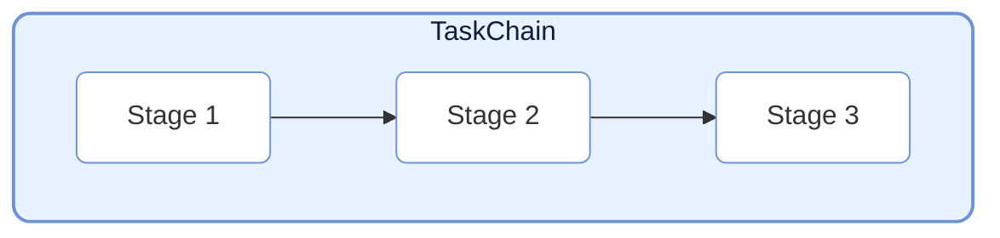
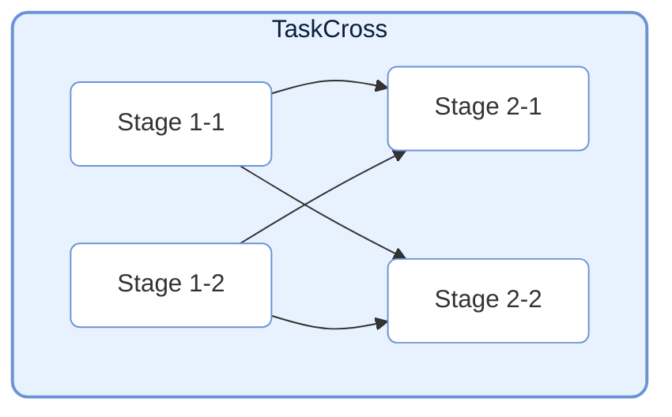
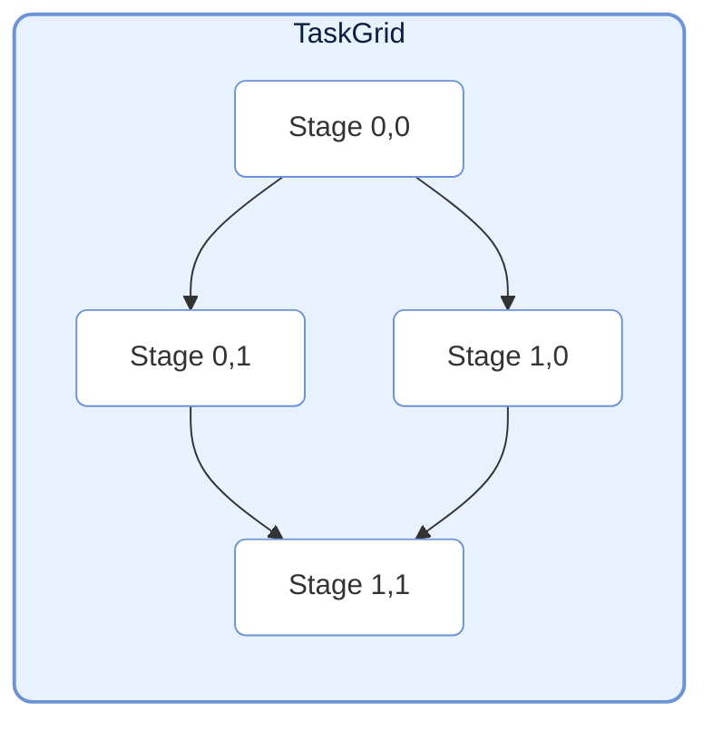
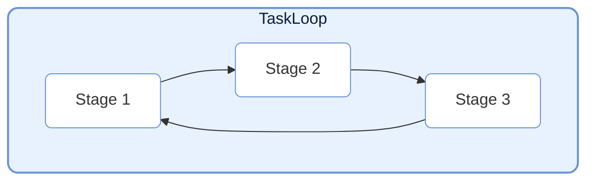
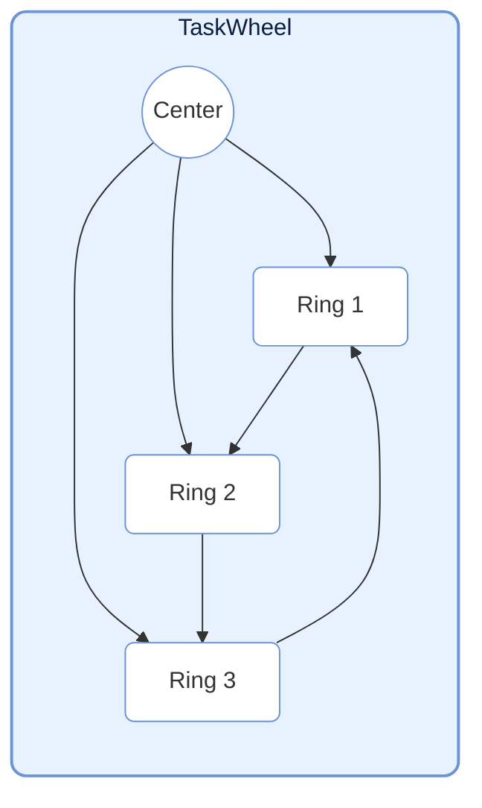
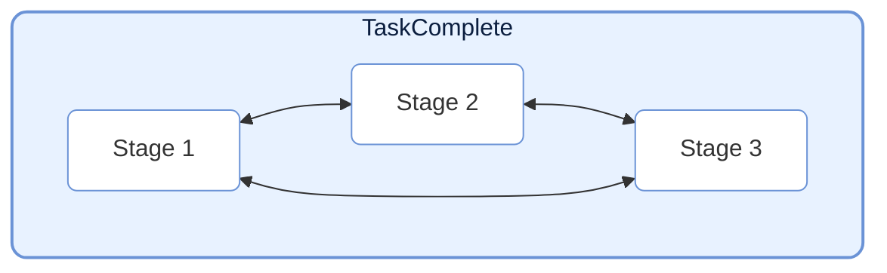

# TaskStructure

> 📅 最終更新日: 2026/06/18

TaskStructure モジュールは複数の事前定義タスクグラフ構造を提供し、ユーザーが複雑なタスクフローを迅速に構築できるようにします。すべての構造は `TaskGraph` を継承しています。

## Chain（線形チェーン）



`TaskChain` は最もシンプルなタスク構造で、複数の `TaskStage` を順序通りに接続し、線形のデータフローを形成します。

```python
from celestialflow import TaskChain, TaskStage

# ステージを定義
stage1 = TaskStage("S1", func=func1)
stage2 = TaskStage("S2", func=func2)
stage3 = TaskStage("S3", func=func3)

# チェーンを作成
chain = TaskChain(
    name="DataPipeline",
    stages=[stage1, stage2, stage3],
    stage_mode="thread",  # thread: ノード並行実行; serial: ノード直列実行
    log_level="SUCCESS"
)

# 起動
chain.start_chain(init_tasks_dict={stage1.get_name(): [data]})
```

## Cross（クロス層）



`TaskCross` はタスクを「層」で組織化します。各層は複数の並行実行ノードを含みます。隣接層間のノードは全結合依存関係を確立します（上位層の各ノードが下位層の全ノードに接続）。

```python
from celestialflow import TaskCross

# 層を定義
layer1 = [stage_1_1, stage_1_2]
layer2 = [stage_2_1, stage_2_2]

# クロス構造を作成
cross = TaskCross(
    name="CrossPipeline",
    layers=[layer1, layer2],
    schedule_mode="eager"
)
```

## Grid（グリッド）



`TaskGrid` はタスクノードを二次元グリッドに組織化します。各ノードは**右隣**と**下隣**のノードに接続します。

```python
from celestialflow import TaskGrid

# グリッドを定義
grid_layout = [
    [stage_00, stage_01],
    [stage_10, stage_11]
]

# グリッド構造を作成
grid = TaskGrid(
    name="GridPipeline",
    grid=grid_layout,
    schedule_mode="eager"
)
```

## Loop（リング）



`TaskLoop` はノードを首尾接続して閉ループを形成します。デフォルトで `eager` スケジュールモードを使用します。
注意: リング構造は通常、停止に外部介入を必要とするか、特定の終了条件を設定する必要があります。

```python
from celestialflow import TaskLoop

# リングを作成
loop = TaskLoop(
    name="FeedbackLoop",
    stages=[stage1, stage2, stage3]  # stage3 -> stage1
)
```

## Wheel（ホイール）



`TaskWheel` は 1 つの中心ノードと 1 つのリング構造を含みます。中心ノードはリング上の各ノードに接続し、リング上のノードは首尾接続されます。

```python
from celestialflow import TaskWheel

# ホイール構造を作成
wheel = TaskWheel(
    name="HubAndSpoke",
    center=center_stage,
    ring=[ring_stage1, ring_stage2, ring_stage3]
)
```

## Complete（完全グラフ）



`TaskComplete` は特殊な構造で、各ノードが自身を除く他のすべてのノードに接続します。

```python
from celestialflow import TaskComplete

# 完全グラフを作成
complete = TaskComplete(
    name="FullMesh",
    stages=[stage1, stage2, stage3, stage4]
)
```

## 使用例

以下の例は各事前定義グラフ構造の具体的な構築と実行方法を示します。

### TaskChain 完全例

```python
from celestialflow import TaskChain, TaskStage

# 3 つのステージを定義: データクレンジング -> 変換 -> 集約
def clean(data: str) -> str:
    return data.strip()

def transform(data: str) -> int:
    return int(data) * 2

def aggregate(data: int) -> dict:
    return {"original": data // 2, "doubled": data}

# チェーンを構築
s1 = TaskStage("Clean", func=clean)
s2 = TaskStage("Transform", func=transform)
s3 = TaskStage("Aggregate", func=aggregate)
chain = TaskChain(name="ETL", stages=[s1, s2, s3], stage_mode="thread")

# 起動
chain.start_chain({s1.get_name(): [" 10 ", " 20 ", " 30 "]})

# 結果を取得
print(f"チェーン状態: {chain.get_status_snapshot()}")
```

### TaskCross 完全例

```python
from celestialflow import TaskCross, TaskStage

# 第 1 層: データ準備
def load_a(x: int) -> int:
    return x + 1

def load_b(x: int) -> int:
    return x * 10

# 第 2 層: 計算分析
def analyze_a(x: int) -> float:
    return x * 1.5

def analyze_b(x: int) -> float:
    return x * 2.0

layer1 = [TaskStage("LoadA", func=load_a), TaskStage("LoadB", func=load_b)]
layer2 = [TaskStage("AnaA", func=analyze_a), TaskStage("AnaB", func=analyze_b)]

cross = TaskCross(name="DataAnalysis", layers=[layer1, layer2])
cross.start_cross({layer1[0].get_name(): [1, 2], layer1[1].get_name(): [3, 4]})
print(cross.get_status_snapshot())
```

### TaskGrid 完全例

```python
from celestialflow import TaskGrid, TaskStage

# 2x2 グリッド
n00 = TaskStage("Init", func=lambda x: x)
n01 = TaskStage("Add", func=lambda x: x + 1)
n10 = TaskStage("Mul", func=lambda x: x * 2)
n11 = TaskStage("Square", func=lambda x: x * x)

grid = TaskGrid(name="CalcGrid", grid=[[n00, n01], [n10, n11]])
grid.start_grid({n00.get_name(): [1, 2, 3]})
print(grid.get_status_snapshot())
```

### TaskLoop 完全例

```python
from celestialflow import TaskLoop, TaskStage

# 3 ノードリング: 各ノードが処理後に結果を次へ渡す
loop_stages = [
    TaskStage("Ring1", func=lambda x: x + 1),
    TaskStage("Ring2", func=lambda x: x * 2),
    TaskStage("Ring3", func=lambda x: x - 3),  # Ring3 -> Ring1 で閉ループを形成
]

loop = TaskLoop(name="RingLoop", stages=loop_stages)
loop.start_loop(
    {loop_stages[0].get_name(): [5]},
    put_termination_signal=False,  # リング構造では手動で終了注入が必要
)
```

### TaskWheel 完全例

```python
from celestialflow import TaskWheel, TaskStage

center = TaskStage("Hub", func=lambda x: {"input": x, "processed": x * 10})
ring_nodes = [
    TaskStage("Channel1", func=lambda x: x["processed"] + 1),
    TaskStage("Channel2", func=lambda x: x["processed"] + 2),
    TaskStage("Channel3", func=lambda x: x["processed"] + 3),
]

wheel = TaskWheel(name="HubWheel", center=center, ring=ring_nodes)
wheel.start_wheel({center.get_name(): [42]})
print(wheel.get_status_snapshot())
```

### TaskComplete 完全例

```python
from celestialflow import TaskComplete, TaskStage

nodes = [
    TaskStage("N1", func=lambda x: x ** 2),
    TaskStage("N2", func=lambda x: x + 1),
    TaskStage("N3", func=lambda x: x // 2),
]

complete = TaskComplete(name="FullConnected", stages=nodes)
complete.start_complete(
    {nodes[0].get_name(): [10]},
    put_termination_signal=False,
)
print(complete.get_status_snapshot())
```
