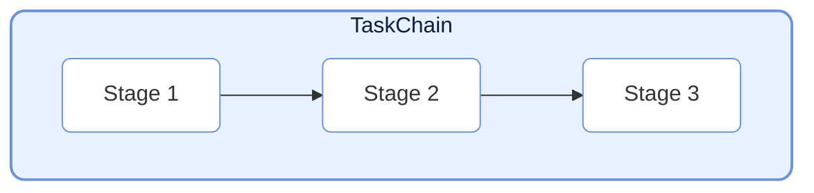
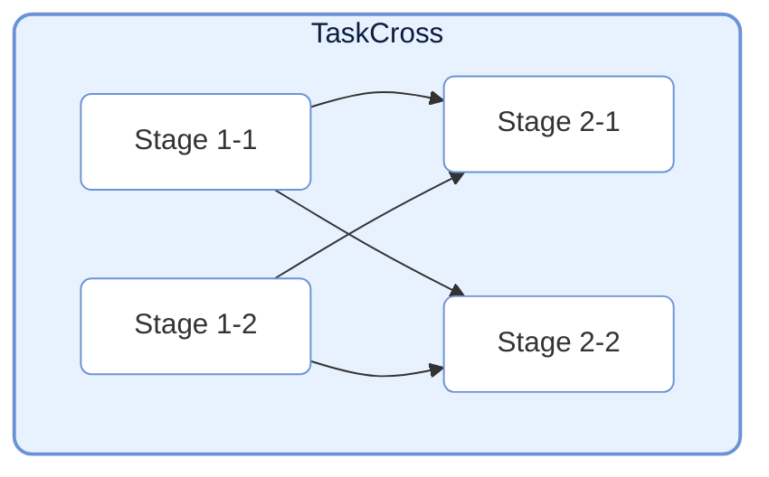
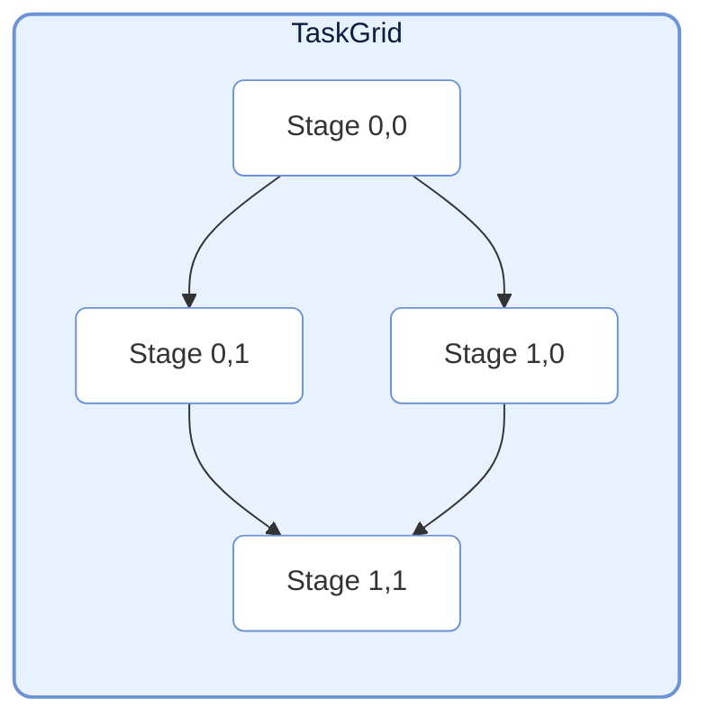
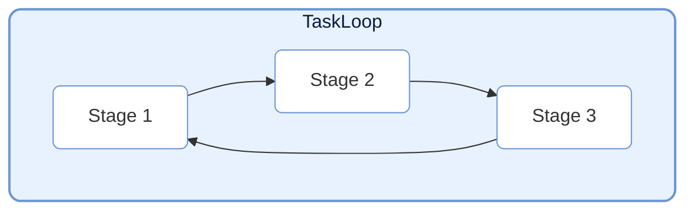
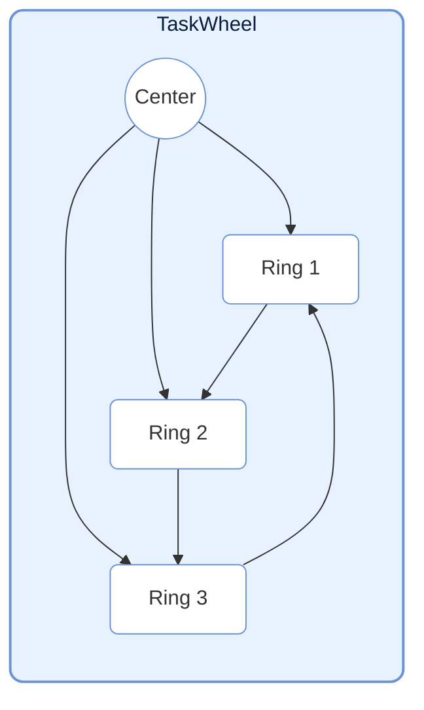
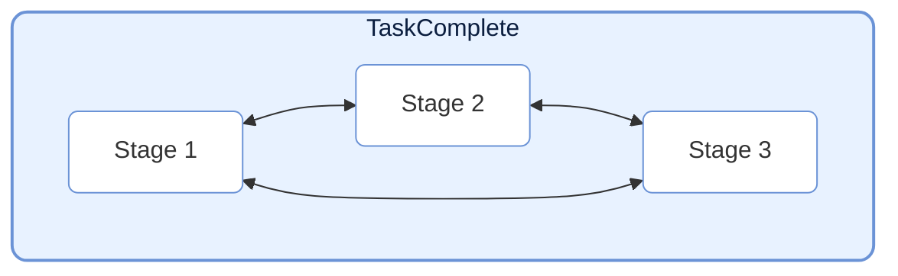

# TaskStructure

> 📅 最終更新日: 2026/04/24

TaskStructure モジュールは複数の定義済みタスクグラフ構造を提供し、ユーザーが複雑なタスクフローを迅速に構築できるようにします。すべての構造は `TaskGraph` を継承しています。

## Chain (リニアチェーン)



`TaskChain` は最もシンプルなタスク構造で、複数の `TaskStage` を順番に接続し、リニアなデータフローを形成します。

```python
from celestialflow import TaskChain, TaskStage

# ステージを定義
stage1 = TaskStage("S1", func=func1)
stage2 = TaskStage("S2", func=func2)
stage3 = TaskStage("S3", func=func3)

# チェーンを作成
chain = TaskChain(
    stages=[stage1, stage2, stage3],
    chain_mode="serial",  # serial: 順次実行; process: 同時実行
    log_level="SUCCESS"
)

# 起動
chain.start_chain(init_tasks_dict={stage1.get_tag(): [data]})
```

## Cross (クロスレイヤー)



`TaskCross` はタスクを「レイヤー」単位で組織します。各レイヤーには並列実行される複数のノードが含まれます。隣接するレイヤー間のノードは全結合の依存関係を構築します（前のレイヤーの各ノードが次のレイヤーのすべてのノードに接続されます）。

```python
from celestialflow import TaskCross

# レイヤーを定義
layer1 = [stage_1_1, stage_1_2]
layer2 = [stage_2_1, stage_2_2]

# クロス構造を作成
cross = TaskCross(
    layers=[layer1, layer2],
    schedule_mode="eager"
)
```

## Grid (グリッド)



`TaskGrid` はタスクノードを二次元グリッドに組織します。各ノードはその**右側**と**下方**のノードに接続されます。

```python
from celestialflow import TaskGrid

# グリッドを定義
grid_layout = [
    [stage_00, stage_01],
    [stage_10, stage_11]
]

# グリッド構造を作成
grid = TaskGrid(
    grid=grid_layout,
    schedule_mode="eager"
)
```

## Loop (ループ)



`TaskLoop` はノードを先頭と末尾で接続して閉ループを形成します。ループの特性上、`eager` スケジューリングモードが強制されます。
注意：ループ構造は通常、外部からの介入で停止するか、特定の終了条件を設定する必要があります。

```python
from celestialflow import TaskLoop

# ループを作成
loop = TaskLoop(
    stages=[stage1, stage2, stage3]  # stage3 -> stage1
)
```

## Wheel (ホイール)



`TaskWheel` は中心ノードとリング構造を含みます。中心ノードはリング上の各ノードに接続し、リング上のノードは先頭と末尾で接続されます。

```python
from celestialflow import TaskWheel

# ホイール構造を作成
wheel = TaskWheel(
    center=center_stage,
    ring=[ring_stage1, ring_stage2, ring_stage3]
)
```

## Complete (完全グラフ)



`TaskComplete` は特殊な構造で、各ノードが自身以外のすべてのノードに接続されます。

```python
from celestialflow import TaskComplete

# 完全グラフを作成
complete = TaskComplete(
    stages=[stage1, stage2, stage3, stage4]
)
```
