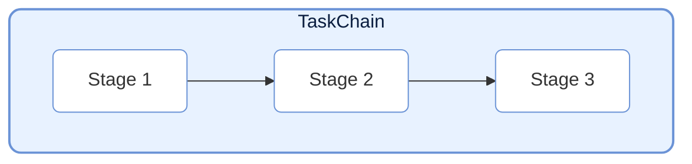
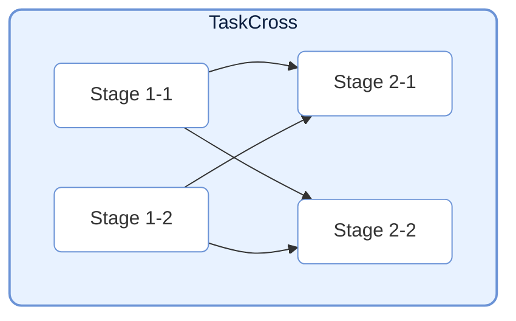
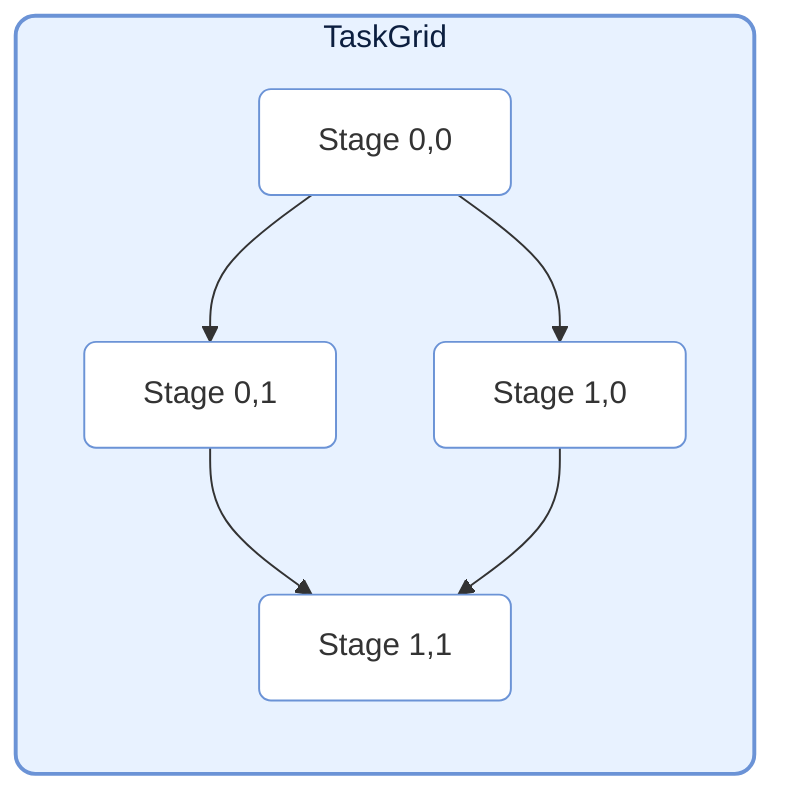
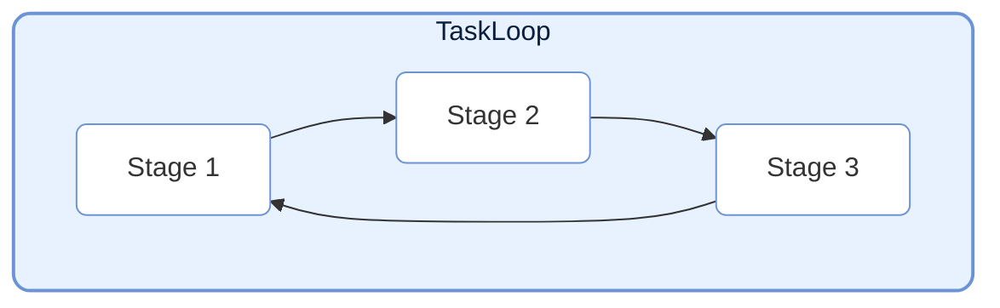
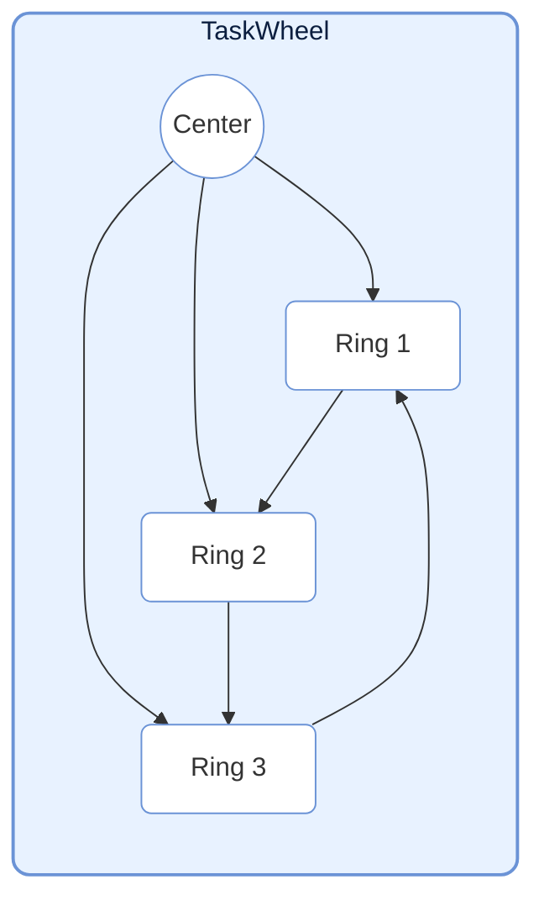
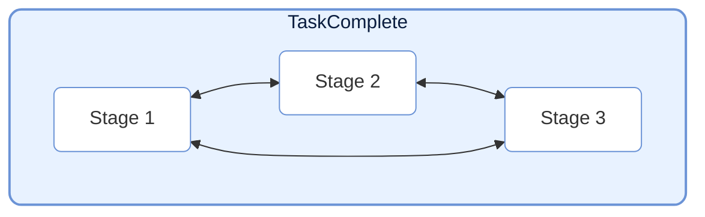

# src/celestialflow/graph/core_structure.py

> 📅 最終更新日: 2026/09/24

TaskStructure モジュールは複数の事前定義タスクグラフ構造を提供し、ユーザーが複雑なタスクフローを迅速に構築できるようにします。すべての構造は `TaskGraph` を継承しています。

## Chain（線形チェーン）


```mermaid
flowchart LR
    subgraph TC[TaskChain]
        direction LR
        S1[Stage 1]
        S2[Stage 2]
        S3[Stage 3]
        S1 --> S2 --> S3
    end
    style TC fill:#e8f2ff,stroke:#6b93d6,stroke-width:2px,color:#0b1e3f,rx:10px,ry:10px
    classDef blueNode fill:#ffffff,stroke:#6b93d6,rx:6px,ry:6px;
    class S1,S2,S3 blueNode;
```

`TaskChain` は最もシンプルなタスク構造で、複数の `TaskExecutor` を順序通りに接続し、線形のデータフローを形成します。

```python
from celestialflow import TaskChain, TaskExecutor

# ステージを定義
stage1 = TaskExecutor("S1", func=func1)
stage2 = TaskExecutor("S2", func=func2)
stage3 = TaskExecutor("S3", func=func3)

# チェーンを作成
chain = TaskChain(
    name="DataPipeline",
    nodes=[stage1, stage2, stage3],
    graph_mode="thread",  # thread: ステージ並行実行; serial: ステージ直列実行
)

# 起動
chain.run({stage1.get_name(): [data]})
```

## Cross（クロス層）


```mermaid
flowchart LR
    subgraph TC[TaskCross]
        direction LR
        
        S11[Stage 1-1]
        S12[Stage 1-2]
        
        S21[Stage 2-1]
        S22[Stage 2-2]

        S11 --> S21
        S11 --> S22
        S12 --> S21
        S12 --> S22
    end
    style TC fill:#e8f2ff,stroke:#6b93d6,stroke-width:2px,color:#0b1e3f,rx:10px,ry:10px
    classDef blueNode fill:#ffffff,stroke:#6b93d6,rx:6px,ry:6px;
    class S11,S12,S21,S22 blueNode;
```

`TaskCross` はタスクを「層」で組織化します。各層は複数の並行実行ノードを含みます。隣接層間のノードは全結合依存関係を確立します（上位層の各ノードが下位層の全ノードに接続）。

```python
from celestialflow import TaskCross

# 層を定義
layer1 = [stage_1_1, stage_1_2]
layer2 = [stage_2_1, stage_2_2]

# クロス構造を作成
cross = TaskCross(name="CrossPipeline", layers=[layer1, layer2], graph_mode="thread")
```

## Grid（グリッド）


```mermaid
flowchart TD
    subgraph TG[TaskGrid]
        direction TB
        S00[Stage 0,0]
        S01[Stage 0,1]
        S10[Stage 1,0]
        S11[Stage 1,1]

        S00 --> S01
        S00 --> S10
        S01 --> S11
        S10 --> S11
    end
    style TG fill:#e8f2ff,stroke:#6b93d6,stroke-width:2px,color:#0b1e3f,rx:10px,ry:10px
    classDef blueNode fill:#ffffff,stroke:#6b93d6,rx:6px,ry:6px;
    class S00,S01,S10,S11 blueNode;
```

`TaskGrid` はタスクノードを二次元グリッドに組織化します。各ノードは**右隣**と**下隣**のノードに接続します。

```python
from celestialflow import TaskGrid

# グリッドを定義
grid_layout = [[stage_00, stage_01], [stage_10, stage_11]]

# グリッド構造を作成
grid = TaskGrid(name="GridPipeline", grid=grid_layout, graph_mode="thread")
```

## Loop（リング）


```mermaid
flowchart LR
    subgraph TL[TaskLoop]
        direction LR
        S1[Stage 1]
        S2[Stage 2]
        S3[Stage 3]
        
        S1 --> S2 --> S3 --> S1
    end
    style TL fill:#e8f2ff,stroke:#6b93d6,stroke-width:2px,color:#0b1e3f,rx:10px,ry:10px
    classDef blueNode fill:#ffffff,stroke:#6b93d6,rx:6px,ry:6px;
    class S1,S2,S3 blueNode;
```

`TaskLoop` はノードを首尾接続して閉ループを形成します。デフォルトで `thread` グラフ実行モードを使用します。
注意：リング構造は通常、停止に外部介入を必要とするか、特定の終了条件を設定する必要があります。

```python
from celestialflow import TaskLoop

# リングを作成
loop = TaskLoop(
    name="FeedbackLoop",
    nodes=[stage1, stage2, stage3],  # stage3 -> stage1
)
```

## Wheel（ホイール）


```mermaid
flowchart TD
    subgraph TW[TaskWheel]
        direction TB
        C((Center))
        R1[Ring 1]
        R2[Ring 2]
        R3[Ring 3]
        
        C --> R1
        C --> R2
        C --> R3
        
        R1 --> R2 --> R3 --> R1
    end
    style TW fill:#e8f2ff,stroke:#6b93d6,stroke-width:2px,color:#0b1e3f,rx:10px,ry:10px
    classDef blueNode fill:#ffffff,stroke:#6b93d6,rx:6px,ry:6px;
    class C,R1,R2,R3 blueNode;
```

`TaskWheel` は 1 つの中心ノードと 1 つのリング構造を含みます。中心ノードはリング上の各ノードに接続し、リング上のノードは首尾接続されます。

```python
from celestialflow import TaskWheel

# ホイール構造を作成
wheel = TaskWheel(
    name="HubAndSpoke",
    center=center_stage,
    ring=[ring_stage1, ring_stage2, ring_stage3],
)
```

## Complete（完全グラフ）


```mermaid
flowchart LR
    subgraph TC[TaskComplete]
        direction LR
        S1[Stage 1]
        S2[Stage 2]
        S3[Stage 3]
        
        S1 <--> S2
        S2 <--> S3
        S3 <--> S1
    end
    style TC fill:#e8f2ff,stroke:#6b93d6,stroke-width:2px,color:#0b1e3f,rx:10px,ry:10px
    classDef blueNode fill:#ffffff,stroke:#6b93d6,rx:6px,ry:6px;
    class S1,S2,S3 blueNode;
```

`TaskComplete` は特殊な構造で、各ノードが自身を除く他のすべてのノードに接続します。

```python
from celestialflow import TaskComplete

# 完全グラフを作成
complete = TaskComplete(name="FullMesh", nodes=[stage1, stage2, stage3, stage4])
```

## 使用例

以下の例は各事前定義グラフ構造の具体的な構築と実行方法を示します。

### TaskChain 完全例

```python
from celestialflow import TaskChain, TaskExecutor


# 3 つのステージを定義: データクレンジング -> 変換 -> 集約
def clean(data: str) -> str:
    return data.strip()


def transform(data: str) -> int:
    return int(data) * 2


def aggregate(data: int) -> dict:
    return {"original": data // 2, "doubled": data}


# チェーンを構築
s1 = TaskExecutor("Clean", func=clean)
s2 = TaskExecutor("Transform", func=transform)
s3 = TaskExecutor("Aggregate", func=aggregate)
chain = TaskChain(name="ETL", nodes=[s1, s2, s3], graph_mode="thread")

# 起動
chain.run({s1.get_name(): [" 10 ", " 20 ", " 30 "]})

# 構造化トポロジーテキストとノード数を取得
tree_lines = chain.get_structure_list()
print(f"チェーンのステージ数: {len(chain.get_nodes())}")
print("\n".join(tree_lines))
```

### TaskCross 完全例

```python
from celestialflow import TaskCross, TaskExecutor


# 第 1 層: データ準備
def load_a(x: int) -> int:
    return x + 1


def load_b(x: int) -> int:
    return x * 10


# 第 2 層: 計算分析
def analyze_a(x: int) -> float:
    return x * 1.5


def analyze_b(x: int) -> float:
    return x * 2.0


layer1 = [TaskExecutor("LoadA", func=load_a), TaskExecutor("LoadB", func=load_b)]
layer2 = [TaskExecutor("AnaA", func=analyze_a), TaskExecutor("AnaB", func=analyze_b)]

cross = TaskCross(name="DataAnalysis", layers=[layer1, layer2])
cross.run({layer1[0].get_name(): [1, 2], layer1[1].get_name(): [3, 4]})
print(cross.get_structure_list())
```

### TaskGrid 完全例

```python
from celestialflow import TaskGrid, TaskExecutor

# 2x2 グリッド
n00 = TaskExecutor("Init", func=lambda x: x)
n01 = TaskExecutor("Add", func=lambda x: x + 1)
n10 = TaskExecutor("Mul", func=lambda x: x * 2)
n11 = TaskExecutor("Square", func=lambda x: x * x)

grid = TaskGrid(name="CalcGrid", grid=[[n00, n01], [n10, n11]])
grid.run({n00.get_name(): [1, 2, 3]})
print(grid.get_structure_list())
```

### TaskLoop 完全例

```python
from celestialflow import TaskLoop, TaskExecutor

# 3 ノードリング: 各ノードが処理後に結果を次へ渡す
loop_nodes = [
    TaskExecutor("Ring1", func=lambda x: x + 1),
    TaskExecutor("Ring2", func=lambda x: x * 2),
    TaskExecutor("Ring3", func=lambda x: x - 3),  # Ring3 -> Ring1 で閉ループを形成
]

loop = TaskLoop(name="RingLoop", nodes=loop_nodes)
loop.run(
    {loop_nodes[0].get_name(): [5]},
    if_put_signal=False,  # リング構造では手動で終了注入が必要
)
```

### TaskWheel 完全例

```python
from celestialflow import TaskWheel, TaskExecutor

center = TaskExecutor("Hub", func=lambda x: {"input": x, "processed": x * 10})
ring_nodes = [
    TaskExecutor("Channel1", func=lambda x: x["processed"] + 1),
    TaskExecutor("Channel2", func=lambda x: x["processed"] + 2),
    TaskExecutor("Channel3", func=lambda x: x["processed"] + 3),
]

wheel = TaskWheel(name="HubWheel", center=center, ring=ring_nodes)
wheel.run({center.get_name(): [42]})
print(wheel.get_structure_list())
```

### TaskComplete 完全例

```python
from celestialflow import TaskComplete, TaskExecutor

nodes = [
    TaskExecutor("N1", func=lambda x: x**2),
    TaskExecutor("N2", func=lambda x: x + 1),
    TaskExecutor("N3", func=lambda x: x // 2),
]

complete = TaskComplete(name="FullConnected", nodes=nodes)
complete.run(
    {nodes[0].get_name(): [10]},
    if_put_signal=False,
)
print(complete.get_structure_list())
```
