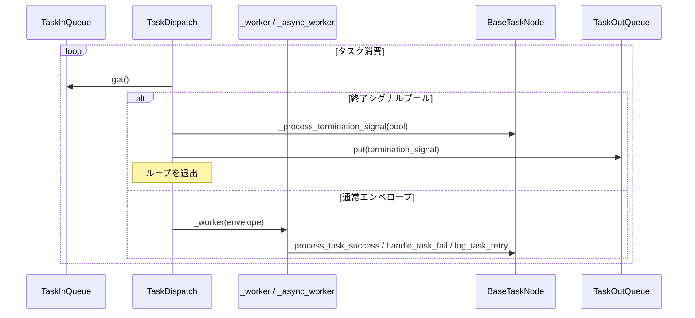
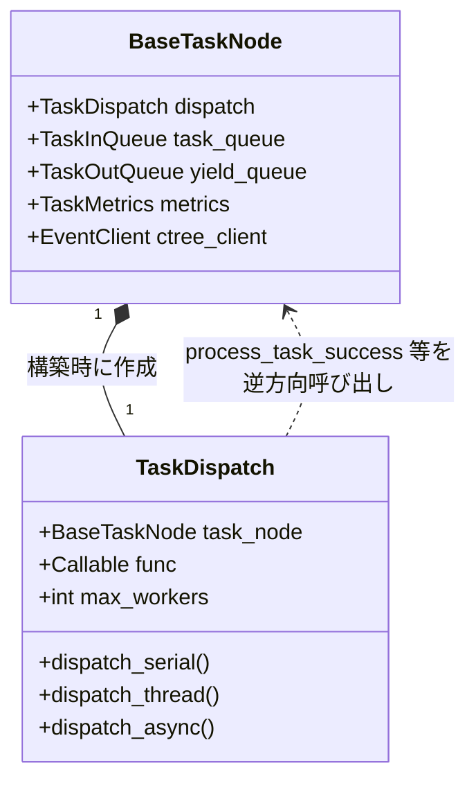

# src/celestialflow/node/core_dispatch.py

> 📅 最終更新日: 2026/09/24

`core_dispatch.py` は `TaskDispatch[T, R, Y]` を定義します。これは `BaseTaskNode` が保持する「タスクスケジューラ」コンポーネントです。ノードオブジェクトの入力キューから `TaskEnvelope` / 終了シグナルを取得し、`execution_mode` に応じてシリアル / スレッド / 非同期のいずれかでノードコールバックを呼び出します。さらに、終了シグナルのマージ、スレッドプールの初期化 / 解放、worker 例外の記録などを担当します。

> `TaskDispatch` は `BaseTaskNode` の**内部コンポーネント**であり、`BaseTaskNode.__init__` が構築時に自動生成します。公共 API ではなく、`node/__init__.py` の `__all__` には含まれません。

## コアオブジェクト

### `TaskDispatch[T, R, Y]`

```python
class TaskDispatch[T, R, Y]:
    def __init__(
        self,
        task_node: BaseTaskNode[T, R, Y],
        func: Callable[[T], R] | Callable[[T], Awaitable[R]],
        max_workers: int,
    ): ...
```

| フィールド | 型 | 説明 |
|------|------|------|
| `task_node` | `BaseTaskNode[T, R, Y]` | ホストノード（`TaskExecutor` ではなく基底クラス） |
| `func` | `Callable[[T], R] | Callable[[T], Awaitable[R]]` | ノードコールバック参照 |
| `max_workers` | `int` | 並行数の上限 |
| `_pool` | `ThreadPoolExecutor | None` | スレッドプール（thread モードでのみ使用） |

> スケジューラはホストオブジェクトを介して `task_node.metrics` / `process_task_success` / `handle_task_fail` / `log_task_retry` / `get_name` / `ctree_client.emit` / `task_queue` / `yield_queue` などを逆方向に呼び出します。

## 公開スケジューリングメソッド

| メソッド | 用途 |
|------|------|
| `dispatch_serial()` | 現在のスレッドでタスクキューを同期的に消費；`TerminationIdPool` を検出したらマージして終了 |
| `dispatch_thread()` | `ThreadPoolExecutor` で並行消費；タスク数が `max_workers` に達したらブロックして待機 |
| `async dispatch_async()` | `asyncio.Semaphore` で流量制限した非同期消費；ストリーム的に到達し、受信しながら実行 |

### `dispatch_serial`

メインループの擬似コード:

```text
while True:
    envelope = task_queue.get()
    if isinstance(envelope, TerminationIdPool):
        termination_signal = _process_termination_signal(envelope)
        break
    _worker(envelope)
yield_queue.put(termination_signal)
```

### `dispatch_thread`

```text
_init_pool("thread")
try:
    pending = set[Future[None]]()
    while True:
        envelope = task_queue.get()
        if isinstance(envelope, TerminationIdPool):
            termination_signal = _process_termination_signal(envelope)
            break
        # 限流：pending 数 ≥ max_workers 时阻塞
        while len(pending) >= max_workers:
            _, pending = wait(pending, return_when=FIRST_COMPLETED)
        pending.add(_pool.submit(_worker, envelope))
    wait(pending)
    yield_queue.put(termination_signal)
finally:
    _release_pool()
```

### `dispatch_async`

```text
semaphore = asyncio.Semaphore(max_workers)
pending = set[asyncio.Task[None]]()

async def sem_worker(envelope):
    async with semaphore:
        await _async_worker(envelope)

while True:
    envelope = await asyncio.to_thread(task_queue.get)  # 不阻塞事件循环
    if isinstance(envelope, TerminationIdPool):
        termination_signal = _process_termination_signal(envelope)
        break
    task = asyncio.create_task(sem_worker(envelope))
    pending.add(task)
    task.add_done_callback(pending.discard)

await asyncio.gather(*pending, return_exceptions=True)
yield_queue.put(termination_signal)
```

## 内部補助メソッド

| メソッド | 動作 |
|------|------|
| `_call_sync(task) -> R` | 同期コールバックを呼び出す；awaitable を返した場合は `ConfigurationError` を送出 |
| `_call_async(task) -> R` | 非同期コールバックを呼び出す；戻り値が awaitable でない場合は `ConfigurationError` を送出 |
| `_worker(envelope) -> None` | 単一タスクを同期実行：`for fail_times in range(1, max_retries + 2)` でループし、`retry_exceptions` に該当する場合は `task_node.log_task_retry` を呼び出し、そうでなければ `handle_task_fail` を呼び出し；最外層の `try` が捕捉した例外は `get_log_inlet().worker_crash` でレポート；`finally` で `task_node.metrics.end_task()` を呼び出し |
| `_async_worker(envelope) -> None` | 非同期版 `_worker`、`await self._call_async(task)` を使用 |
| `_process_termination_signal(pool) -> TerminationSignal` | `TerminationIdPool.ids` 内のすべての id を `ctree_client.emit(CTreeEvent.TERMINATION_MERGE, parents=...)` により単一の `TerminationSignal(source=task_node.get_name())` にマージし、`get_log_inlet().termination_merge(...)` を書き込む |
| `_init_pool(execution_mode)` | `execution_mode == "thread"` かつ `_pool is None` の場合のみ `ThreadPoolExecutor(max_workers=self.max_workers)` を構築 |
| `_release_pool()` | `_pool` をシャットダウンしてクリア（スレッドモード終了時に呼び出し） |

## 主要なデータフロー



## 例外一覧

| 例外 | トリガーシーン |
|------|---------|
| `ConfigurationError` | 同期呼び出しが awaitable を返す / 非同期呼び出しが非 awaitable を返す |
| `InitializationError` | `dispatch_thread` 内で `_pool is None`（理論上 `_init_pool` で保証されているが、コードにフォールバック保持） |
| `get_log_inlet().worker_crash(e)` | `_worker` / `_async_worker` の最外層 `try` が `process_task_success` / `handle_task_fail` / `log_task_retry` の外側で送出された例外を捕捉 |

## ホスト `BaseTaskNode` との関係



> `BaseTaskNode.__init__` 内で `self.dispatch = TaskDispatch(cast(BaseTaskNode[T, R, Y], self), self.func, self.max_workers)` によりホストのバインディングが完了します。

## 注意事項

1. **ホストの型は `BaseTaskNode` であって `TaskExecutor` ではない**：実際に渡されるのが `TaskSplitter` / `TaskRouter` であっても、スケジューラは `BaseTaskNode` インターフェースを介してのみホストにアクセスします。
2. **終了シグナルのパス**：単一の `TerminationSignal` は `TaskInQueue` で他の発生源とマージされ `TerminationIdPool` となります；スケジューラはプールを受信した際に一括して `TERMINATION_MERGE` を emit します。
3. **スレッドプールのライフサイクル**：`_pool` は `dispatch_thread` 内でのみ一時的に存在し、開始前に `_init_pool`、終了時に `_release_pool` が呼ばれます。そのため、同一スケジューラは複数回の `start` をまたいで再利用できません。
4. **非同期パスはイベントループをブロックしない**：`dispatch_async` は `asyncio.to_thread(task_queue.get)` で入力をプルし、`asyncio.Semaphore` と組み合わせて「受信しながら実行」しつつイベントループをブロックしません。
5. **重複排除ロジックは含まれなくなった**：スケジューラは実行のみを担当し、タスクの重複判定機能はノード層から全面的に削除されました。`TaskMetrics.duplicate_counter` / `BaseObserver.on_task_duplicate` は歴史的なカウントインターフェースとしてのみ残されています。
