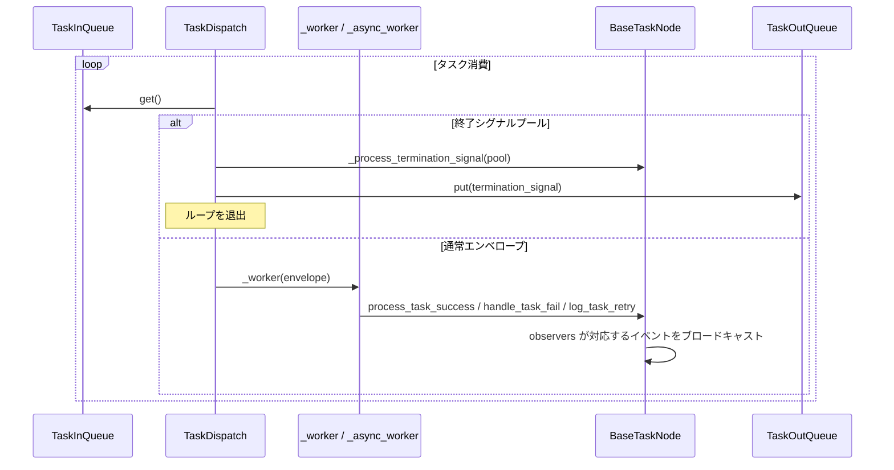
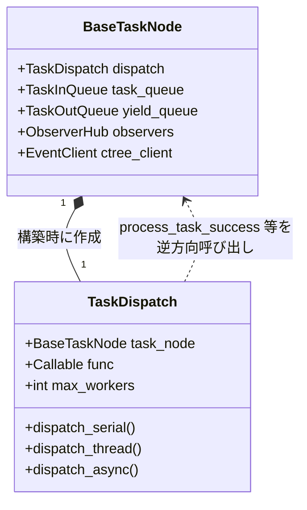

# src/celestialflow/node/core_dispatch.py

> 📅 最終更新日: 2026/10/09

`core_dispatch.py` は `TaskDispatch[T, R, Y]` を定義します。これは `BaseTaskNode` が保持する「タスクスケジューラ」コンポーネントです。ノードオブジェクトの入力キューから `TaskEnvelope` / 終了シグナルを取得し、`execution_mode` に応じてシリアル / スレッド / 非同期のいずれかでノードコールバックを呼び出します。さらに、終了シグナルのマージ、スレッドプールの初期化 / 解放、worker 例外の記録などを担当します。

> `TaskDispatch` は `BaseTaskNode` の**内部コンポーネント**であり、`BaseTaskNode.__init__` が構築時に自動生成します。公共 API ではなく、`node/__init__.py` の `__all__` には含まれません。

## コアオブジェクト

### `TaskDispatch[T, R, Y]`

```python
class TaskDispatch[T, R, Y]:
    def __init__(
        self,
        task_node: BaseTaskNode[T, R, Y],
        func: Callable[[T], R] | Callable[[T], Awaitable[R]],
        max_workers: int,
    ): ...
```

| フィールド | 型 | 説明 |
|------|------|------|
| `task_node` | `BaseTaskNode[T, R, Y]` | ホストノード（`TaskExecutor` ではなく基底クラス） |
| `func` | `Callable[[T], R] | Callable[[T], Awaitable[R]]` | ノードコールバック参照 |
| `max_workers` | `int` | 並行数の上限 |
| `_pool` | `ThreadPoolExecutor | None` | スレッドプール（thread モードでのみ使用） |

> スケジューラはホストオブジェクトを介して `task_node.observers` / `process_task_success` / `handle_task_fail` / `log_task_retry` / `get_name` / `ctree_client.emit` / `task_queue` / `yield_queue` などを逆方向に呼び出します。

## 公開スケジューリングメソッド

| メソッド | 用途 |
|------|------|
| `dispatch_serial()` | 現在のスレッドでタスクキューを同期的に消費；`TerminationIdPool` を検出したらマージして終了 |
| `dispatch_thread()` | `ThreadPoolExecutor` で並行消費；タスク数が `max_workers` に達したらブロックして待機 |
| `async dispatch_async()` | `asyncio.Semaphore` で流量制限した非同期消費；ストリーム的に到達し、受信しながら実行 |

### `dispatch_serial`

メインループの擬似コード:

```text
while True:
    envelope = task_queue.get()
    if isinstance(envelope, TerminationIdPool):
        termination_signal = _process_termination_signal(envelope)
        break
    _worker(envelope)
yield_queue.put(termination_signal)
```

### `dispatch_thread`

```text
_init_pool("thread")
try:
    pending = set[Future[None]]()
    while True:
        envelope = task_queue.get()
        if isinstance(envelope, TerminationIdPool):
            termination_signal = _process_termination_signal(envelope)
            break
        # 流量制限：pending の数が max_workers 以上の場合、完了済み futures を待ってブロック
        while len(pending) >= max_workers:
            _, pending = wait(pending, return_when=FIRST_COMPLETED)
        pending.add(_pool.submit(_worker, envelope))
    wait(pending)  # 現在のバッチ全体の完了を待機
    yield_queue.put(termination_signal)
finally:
    _release_pool()
```

### `dispatch_async`

```text
semaphore = asyncio.Semaphore(max_workers)
pending = set[asyncio.Task[None]]()

async def sem_worker(envelope):
    async with semaphore:
        await _async_worker(envelope)

while True:
    envelope = await asyncio.to_thread(task_queue.get)  # イベントループをブロックしない
    if isinstance(envelope, TerminationIdPool):
        termination_signal = _process_termination_signal(envelope)
        break
    task = asyncio.create_task(sem_worker(envelope))
    pending.add(task)
    task.add_done_callback(pending.discard)

await asyncio.gather(*pending, return_exceptions=True)
yield_queue.put(termination_signal)
```

## 内部補助メソッド

| メソッド | 動作 |
|------|------|
| `_call_sync(task) -> R` | 同期コールバックを呼び出す；awaitable を返した場合は `ConfigurationError` を送出 |
| `_call_async(task) -> R` | 非同期コールバックを呼び出す；戻り値が awaitable でない場合は `ConfigurationError` を送出 |
| `_worker(envelope) -> None` | 単一タスクを同期実行：まず `skip_func` を判定し、次に `for fail_times in range(1, max_retries + 2)` でリトライループ；`retry_exceptions` に該当する場合は `task_node.log_task_retry` を呼び出し、リトライ上限に達するか非リトライ可能例外なら `handle_task_fail` を呼び出し；成功時は `process_task_success` を呼び出し。最外層の `try` が捕捉した未処理例外は `task_node.observers.on_worker_crash(WorkerCrashEvent(...))` でレポート |
| `_async_worker(envelope) -> None` | 非同期版 `_worker`、`await self._call_async(task)` を使用 |
| `_process_termination_signal(pool) -> TerminationSignal` | `TerminationIdPool.ids` 内のすべての id を `ctree_client.emit(CTreeEvent.TERMINATION_MERGE, parents=...)` により単一の `TerminationSignal(source=task_node.get_name())` にマージし、`TerminationMergeEvent` をブロードキャスト |
| `_init_pool(execution_mode)` | `execution_mode == "thread"` かつ `_pool is None` の場合のみ `ThreadPoolExecutor(max_workers=self.max_workers)` を構築 |
| `_release_pool()` | `_pool` をシャットダウンしてクリア（スレッドモード終了時に呼び出し） |

### `_worker` リトライループの詳細

```python
def _worker(self, task_envelope: TaskEnvelope[T]) -> None:
    try:
        task = task_envelope.get_task()
        if self.task_node.skip_func is not None and self.task_node.skip_func(task):
            self.task_node.handle_task_skip(task_envelope)
            return

        max_retries = self.task_node.max_retries
        for fail_times in range(1, max_retries + 2):
            try:
                start_perf = time.perf_counter()
                result = self._call_sync(task)
                self.task_node.process_task_success(task_envelope, result, start_perf)
                return
            except Exception as exception:
                if fail_times > max_retries or not isinstance(
                    exception, self.task_node.retry_exceptions
                ):
                    self.task_node.handle_task_fail(task_envelope, exception)
                    return
                self.task_node.log_task_retry(task_envelope, exception, fail_times)
    except Exception as e:
        self.task_node.observers.on_worker_crash(
            WorkerCrashEvent(node=self.task_node.get_name(), exception=e)
        )
```

## 主要なデータフロー


```mermaid
sequenceDiagram
    participant Q as TaskInQueue
    participant D as TaskDispatch
    participant W as _worker / _async_worker
    participant N as BaseTaskNode
    participant R as TaskOutQueue

    loop タスク消費
        D->>Q: get()
        alt 終了シグナルプール
            D->>N: _process_termination_signal(pool)
            D->>R: put(termination_signal)
            Note over D: ループを退出
        else 通常エンベロープ
            D->>W: _worker(envelope)
            W->>N: process_task_success / handle_task_fail / log_task_retry
            N->>N: observers が対応するイベントをブロードキャスト
        end
    end
```

## 例外一覧

| 例外 | トリガーシーン |
|------|---------|
| `ConfigurationError` | 同期呼び出しが awaitable を返す / 非同期呼び出しが非 awaitable を返す |
| `InitializationError` | `dispatch_thread` 内で `_pool is None`（理論上 `_init_pool` で保証されているが、コードにフォールバック保持） |
| `WorkerCrashEvent` | `_worker` / `_async_worker` の最外層 `try` が `process_task_success` / `handle_task_fail` / `log_task_retry` の外側で送出された例外を捕捉し、`observers.on_worker_crash` でレポート（フレームワークパスには送出しない） |

## ホスト `BaseTaskNode` との関係


```mermaid
classDiagram
    class BaseTaskNode {
        +TaskDispatch dispatch
        +TaskInQueue task_queue
        +TaskOutQueue yield_queue
        +ObserverHub observers
        +EventClient ctree_client
    }
    class TaskDispatch {
        +BaseTaskNode task_node
        +Callable func
        +int max_workers
        +dispatch_serial()
        +dispatch_thread()
        +dispatch_async()
    }

    BaseTaskNode "1" *-- "1" TaskDispatch : 構築時に作成
    TaskDispatch ..> BaseTaskNode : process_task_success 等を逆方向呼び出し
```

> `BaseTaskNode.__init__` 内で `self.dispatch = TaskDispatch(cast(BaseTaskNode[T, R, Y], self), self.func, self.max_workers)` によりホストのバインディングが完了します。

## 注意事項

1. **ホストの型は `BaseTaskNode` であって `TaskExecutor` ではない**：実際に渡されるのが `TaskSplitter` / `TaskRouter` であっても、スケジューラは `BaseTaskNode` インターフェースを介してのみホストにアクセスします。
2. **終了シグナルのパス**：単一の `TerminationSignal` は `TaskInQueue` で他の発生源とマージされ `TerminationIdPool` となります；スケジューラはプールを受信した際に一括して `TERMINATION_MERGE` を emit し、`TerminationMergeEvent` をブロードキャストします。
3. **スレッドプールのライフサイクル**：`_pool` は `dispatch_thread` 内でのみ一時的に存在し、開始前に `_init_pool`、終了時に `_release_pool` が呼ばれます。そのため、同一スケジューラは複数回の `start` をまたいで再利用できません。
4. **非同期パスはイベントループをブロックしない**：`dispatch_async` は `asyncio.to_thread(task_queue.get)` で入力をプルし、`asyncio.Semaphore` と組み合わせて「受信しながら実行」しつつイベントループをブロックしません。
5. **観測者によるクラッシュのレポート**：worker のフォールバック例外は `get_log_inlet().worker_crash` に書き込むのではなく、`task_node.observers.on_worker_crash` で `WorkerCrashEvent` をブロードキャストし、登録済み観測者（`LogInlet` など）が記録方法を決定します。
6. **スキップ判定のサポート**：`_worker` / `_async_worker` は実行前に `skip_func` を判定し、該当する場合は `handle_task_skip` を呼び出して直接リターンします。