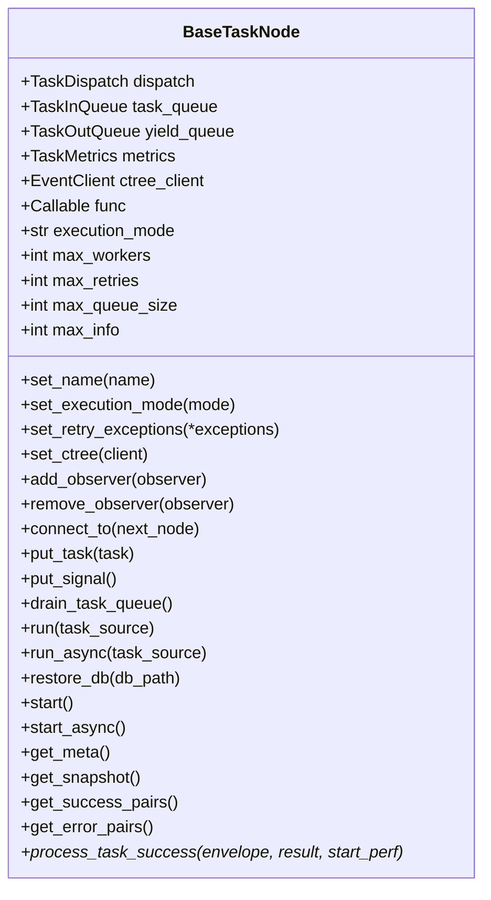
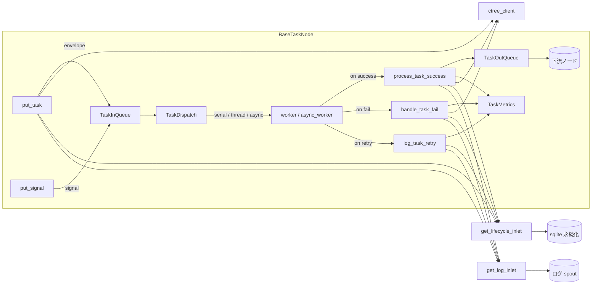

# src/celestialflow/node/core_node.py

> 📅 最終更新日: 2026/09/24

`core_node.py` は CelestialFlow ノード層のコア基底クラス `BaseTaskNode[T, R, Y]` を定義します。これは「キュー通信 / タスクスケジューリング / メトリクス統計 / イベント追跡 / 永続化ログ / オブザーバーコールバック」などのランタイム関心を 1 つのオブジェクトに集約し、上位の `TaskExecutor` / `TaskSplitter` / `TaskRouter` が再利用するための `run` / `start` などのエントリメソッドを公開します。

> ⚠️ `BaseTaskNode` は **内部基底クラス** であり、**公共 API としてエクスポートされません**。ユーザーに見えるのは `TaskExecutor` / `TaskSplitter` / `TaskRouter` の 3 つのノードクラスのみです。

## コアオブジェクト

### `BaseTaskNode[T, R, Y]`

3 つのジェネリックパラメータはそれぞれ次を表します：入力タスク型 `T`、`func` の直接戻り値型 `R`、下流へ送信する結果型 `Y`。

| フィールド | 型 | 説明 |
|------|------|------|
| `dispatch` | `TaskDispatch[T, R, Y]` | タスクスケジューラ（内部コンポーネント）。`__init__` で作成 |
| `task_queue` | `TaskInQueue[T]` | 入力タスクキュー |
| `yield_queue` | `TaskOutQueue[Y]` | 出力結果キュー（下流ノードへ） |
| `metrics` | `TaskMetrics` | タスク指標統計オブジェクト（成功 / 失敗 / 重複 / 経過時間 / 上流下流カウント） |
| `ctree_client` | `EventClient` | イベントクライアント（ctree）、デフォルト `LocalEventClient()` |
| `func` | `Callable[[T], R]` または `Callable[[T], Awaitable[R]]` | タスクを実際に実行するコールバック |
| `execution_mode` | `str` | `'serial'` / `'thread'` / `'async'` |
| `max_workers` | `int` | 最大並行 worker 数（デフォルト `min(32, cpu_count+4)`） |
| `max_retries` | `int` | 単一タスクの最大リトライ回数（`1` は「元 1 回 + リトライ 1 回」） |
| `max_queue_size` | `int` | 入力キューの容量上限（`0` は無制限） |
| `max_info` | `int` | ログ内の各タスク文字列の最大長（デフォルト `50`） |
| `_name` | `str` | ノード / マネージャ名 |
| `start_time` | `float` | 直近の `start` の `time.time()` 記録。構築時は `0.0` |



## 初期化

```python
def __init__(
    self,
    name: str,
    func: Callable[[T], R] | Callable[[T], Awaitable[R]],
    *,
    execution_mode: str = "serial",
    max_workers: int | None = None,
    max_retries: int = 1,
    max_queue_size: int = 0,
    max_info: int = 50,
): ...
```

`__init__` の主要動作:

1. `set_name` で名前を書き込み、`_set_func` でコールバックシグネチャを検証（位置引数を 1 つだけ受け取る必要がある）。それ以外は `ConfigurationError` を送出；
2. `set_execution_mode` がモードの正当性を検証；`execution_mode == "async"` だが `func` が `iscoroutinefunction` でない場合は `ConfigurationError` を送出；
3. `max_workers / max_retries / max_queue_size / max_info` を初期化；
4. デフォルトで `LocalEventClient()` をインストール。後で `set_ctree(...)` で置換可能；
5. `TaskDispatch(cast(BaseTaskNode[T, R, Y], self), self.func, self.max_workers)` をインスタンス化し、`TaskInQueue` / `TaskOutQueue` / `TaskMetrics` を新規作成；
6. `start_time` を `0.0` に初期化し、レポーターがノードの実際の起動前に一度スナップショットを収集できるようにします。

## 設定 setter

| メソッド | 役割 | エラー |
|------|------|------|
| `set_name(name)` | ノード / マネージャ名を設定 | — |
| `set_execution_mode(execution_mode)` | `'serial'` / `'thread'` / `'async'` を切り替え | `InvalidOptionError`（モード不正）、`ConfigurationError`（`async` だが `func` がコルーチンでない） |
| `set_ctree(ctree_client)` | イベントクライアントを置き換え | — |
| `set_retry_exceptions(*exceptions)` | `metrics` にリトライ可能な例外型を登録 | — |
| `add_observer(observer)` / `remove_observer(observer)` | `BaseObserver` を登録 / 解除 | — |
| `_set_func(func)` | `func` を書き込んで検証 | `ConfigurationError`（引数数 ≠ 1）、`CallableParameterKindError`（VAR/KEYWORD 引数を含む） |

> すべての setter は `start()` / `start_async()` の前に呼び出す必要があり、**`start` 後の再変更は有効であるとは保証されません**。

## テンプレートメソッドとクエリ

`BaseTaskNode` は `TaskExecutor` / `TaskSplitter` / `TaskRouter` がオーバーライドするための **抽象フック** を 1 つだけ公開します:

| メソッド | 役割 |
|------|------|
| `process_task_success(task_envelope, result, start_perf) -> None` | worker が結果を正常に取得した際、ノードは「指標 + 永続化 + 下流配信」などの操作を行う必要がある；新規の `BaseTaskNode` は直接 `NotImplementedError` を送出 |

補助クエリメソッド:

- `get_name() -> str`：ノード名を返します。
- `_get_class_name() -> str`：現在のノードクラス名を返します。
- `_get_execution_mode_desc() -> str`：シリアルの場合は `"serial"`、それ以外は `"{mode}-{max_workers}"` を返します。
- `get_lifecycle_path() -> Path`：`LifecycleSpout.db_path` の絶対パスを返します（未設定時は空の `Path`）。
- `get_meta() -> dict[str, Any]`：構築期メタ情報 `{"class_name", "execution_mode", "max_workers"}` を返します；これらのフィールドは reporter の起動前に凍結されており、グラフ構造とともに一度にレポートされます。
- `get_snapshot() -> dict[str, Any]`：現在のランタイムスナップショットを収集します。フィールドには `start_time`、`status`、`elapsed_time`、`metrics.get_counts()` の全カウントキー、および `upstream_counts` / `downstream_counts` が含まれます。
- `get_success_pairs() -> list[tuple[T, R]]` / `get_error_pairs() -> list[tuple[T, PersistedError]]`：`LifecycleSpout` から成功 / 失敗レコードを取得します。

> スナップショットには `remaining_time` / `task_avg_time` は含まれなくなりました；ビジー時の経過時間は `TaskMetrics` がタスクの実際の実行期間中に自ら累積し（`elapsed_time`）、呼び出し側が間隔を渡す必要はありません。

## 下流のバインド

`connect_to(next_node)` は現在のノードから下流への伝送接続を確立します:

1. 共有の `ValueWrapper(value=0)` を 1 つ作成；
2. `self.metrics.set_downstream_counter(next_node.get_name(), counter)` と `next_node.metrics.set_upstream_counter(self.get_name(), counter)` により、上流と下流が同一のカウンタを共有；
3. `self.yield_queue.add_queue(next_node.get_name(), next_node.task_queue)` を実行し、さらに `next_node.task_queue.add_source_name(self.get_name())` を実行。

したがって、現在のノードが下流へ 1 つタスクを送信するごとに双方のカウントが同期して増加し、スナップショットの `downstream_counts` / `upstream_counts` はここに由来します。

## タスク注入

| メソッド | 動作 |
|------|------|
| `put_task(task)` | 単一タスクを `TaskEnvelope` にラップし、`TASK_INPUT` イベントを発火後にエンキュー；`metrics.add_external_input_count()` を呼び出し、`get_lifecycle_inlet().task_input` / `get_log_inlet().task_input` を書き込む |
| `put_signal()` | `TerminationSignal(source="input")` をキューに入れ、`TERMINATION_INPUT` イベントを発火し、`get_log_inlet().termination_input` を書き込む |
| `drain_task_queue()` | 残ったタスクを空にし、各遗留タスクを `UnconsumedError()` として `handle_task_fail` 経由で失敗処理 |

## エントリメソッド

### `run(task_source, *, if_put_signal=True)`

```python
def run(self, task_source: Iterable[T], *, if_put_signal: bool = True) -> None:
    with funnel_scope():
        for task in task_source:
            self.put_task(task)
        if if_put_signal:
            self.put_signal()
        self.start()
```

`funnel_scope()` はグローバルな `LifecycleSpout` / `LogSpout` の起動 / 停止を担当します。

### `async run_async(task_source, *, if_put_signal=True)`

非同期バージョン。`await self.start_async()` を呼び出し、同様に `funnel_scope()` のコンテキスト内で実行されます。

### `restore_db(db_path, statuses=None, *, filter_by_error_type=False)`

sqlite データベースから前回の未完了タスクを読み込み、リプレイします:

1. `statuses` のデフォルトは `["failed", "pending"]`；
2. `filter_by_error_type=True` の場合、現在のノードの `metrics.get_retry_error_type_names()` で `error_type` をフィルタリング（`pending` レコードは常に保持）；
3. `record["task_json"]` フィールドを取り出した後、`self.run(tasks)` を呼び出します。

### `start()`

- 準備フェーズで `self.metrics.on_start()` を呼び出し `node_start` ログを書き込み；
- `execution_mode` に応じて `dispatch.dispatch_serial()` / `dispatch.dispatch_thread()` を選択；`async` は `start_async` へ、それ以外は `InvalidOptionError` を送出；
- 終了フェーズで `_finish_start` が `node_end` ログを書き込み、`metrics.on_finish()` を呼び出す；
- いずれのフェーズで発生した例外も最終的に `ExceptionGroup("Errors occurred during execution", ...)` に集約されて送出。

### `async start_async()`

- `execution_mode == "async"` の場合のみ正当。それ以外は `InvalidOptionError` を送出；
- 内部で `await self.dispatch.dispatch_async()` を呼び出し、例外は追加で `get_log_inlet().node_crash(...)` を呼び出し。

## 結果 / スナップショット / エラー処理

| メソッド | 役割 |
|------|------|
| `process_task_success(envelope, result, start_perf)` | 抽象フック。成功処理はサブクラスが実装 |
| `handle_task_fail(envelope, exception)` | 失敗カウント + `TASK_ERROR` イベント + 失敗情報の永続化を記録 |
| `log_task_retry(envelope, exception, fail_times)` | リトライログと lifecycle リトライレコードを書き込む |
| `_get_repr(task) -> str` | `format_repr(task, self.max_info)` で可読な文字列を生成 |
| `get_meta() -> dict` | 構築期メタ情報 |
| `get_snapshot() -> dict` | ランタイムスナップショット |
| `get_lifecycle_path() -> Path` | ライフサイクル永続化ファイルのパス |
| `get_success_pairs() -> list[tuple[T, R]]` | 成功タスクと結果 |
| `get_error_pairs() -> list[tuple[T, PersistedError]]` | 失敗タスクと `PersistedError`（型とメッセージを含む） |

## 主要なデータフロー



## 使用例

> `BaseTaskNode` は直接外部に公開されません。以下の例はカスタムノードを実装するために継承する方法を示します；実際のプロダクションでは `TaskExecutor` の継承を推奨します。

```python
from celestialflow.node.core_node import BaseTaskNode
from celestialflow.runtime import TaskEnvelope
from celestialflow.runtime.util_types import CTreeEvent


class SquareNode(BaseTaskNode[int, int, int]):
    """把整数平方的最小节点示例。"""

    def process_task_success(self, task_envelope, result, start_perf):
        task = task_envelope.get_task()
        task_id = task_envelope.get_id()

        result_id = self.ctree_client.emit(CTreeEvent.TASK_SUCCESS, parents=[task_id])
        self.metrics.add_success_count()

        for target in self.yield_queue.get_target_names():
            self.metrics.add_downstream_count(target)
            downstream_id = self.ctree_client.emit(
                CTreeEvent.TASK_INPUT, parents=[result_id]
            )
            self.yield_queue.put_target(
                target, TaskEnvelope(task=result, id=downstream_id)
            )


node = SquareNode("Square", lambda x: x * x, execution_mode="serial")
node.run([1, 2, 3, 4])
print(node.get_snapshot())
```

## 例外一覧

| 例外 | トリガーシーン |
|------|---------|
| `ConfigurationError` | `_set_func` の引数数 ≠ 1；`set_execution_mode("async")` だが `func` がコルーチンでない |
| `InvalidOptionError` | `execution_mode` が `("serial", "thread", "async")` のいずれにも該当しない |
| `CallableParameterKindError` | コールバックが `POSITIONAL_ONLY` / `POSITIONAL_OR_KEYWORD` 以外の引数を含む |
| `NotImplementedError` | サブクラスが `process_task_success` をオーバーライドしていない |
| `ExceptionGroup` | `start` / `start_async` プロセス中の例外が最終的に集約されて送出 |

## 注意事項

1. **ワンタイム `start`**：`start()` / `start_async()` はワンタイム呼び出しです。**実行完了後にインスタンスを安全にリセットして再利用できることは保証されません**；繰り返し実行する場合は新しいノードを作成してください。
2. **setter の呼び出しタイミング**：すべての setter は `start` 前に完了させる必要があり、実行期間中に `func` を置き換えないでください。
3. **ライフサイクル管理**：グローバルな `LifecycleSpout` / `LogSpout` は `funnel_scope()` が起動 / 停止を担当し、`BaseTaskNode` は spout / inlet を直接保持しません。
4. **ctree クライアント**：デフォルトの `LocalEventClient()` は内部でイベント ID をインクリメントします。`set_ctree(...)` でいつでも `celestialtree` に接続するクライアントに置き換えることができます。
5. **削除された機能**：タスクの重複判定（`enable_duplicate_check` / `get_binding_counter` / `prev_binding` / `deal_duplicate` / `get_counts` / `snapshot(interval)`）はすべてノード層から削除されました。`get_snapshot()` / `connect_to()` を基準にしてください。
