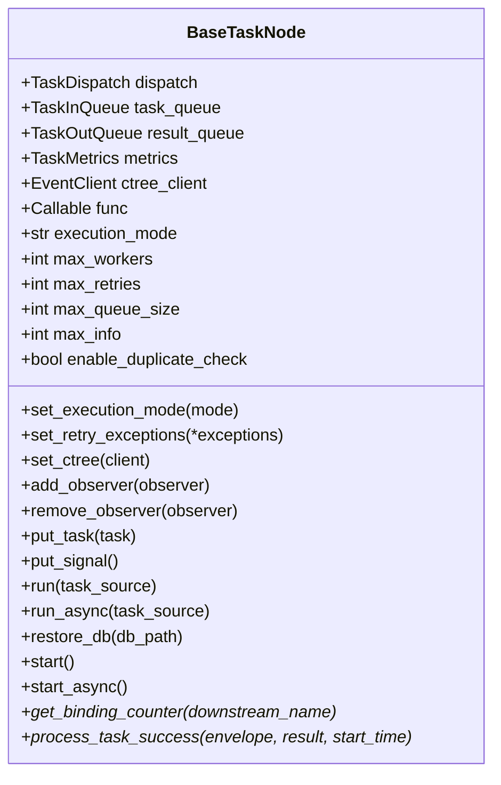
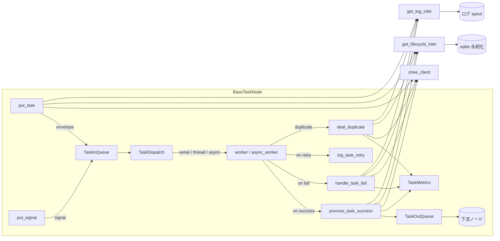

# BaseTaskNode

> 📅 最終更新日: 2026/09/09

`core_node.py` は CelestialFlow ノード層のコア基底クラス `BaseTaskNode[T, R]` を定義します。これは「キュー通信 / タスクスケジューリング / メトリクス統計 / イベント追跡 / 永続化ログ / オブザーバーコールバック」などのランタイム関心を 1 つのオブジェクトに集約し、上位の `TaskExecutor` / `TaskSplitter` / `TaskRouter` が再利用するための `run` / `start` などのエントリメソッドを公開します。

> ⚠️ `BaseTaskNode` は **内部基底クラス** であり、**公共 API としてエクスポートされません**。ユーザーに見えるのは `TaskExecutor` / `TaskSplitter` / `TaskRouter` の 3 つのノードクラスのみです。

## コアオブジェクト

### `BaseTaskNode[T, R]`

| フィールド | 型 | 説明 |
|------|------|------|
| `dispatch` | `TaskDispatch[T, R]` | タスクスケジューラ（内部コンポーネント）。`__init__` で作成 |
| `task_queue` | `TaskInQueue[T]` | 入力タスクキュー |
| `result_queue` | `TaskOutQueue[R]` | 出力結果キュー |
| `metrics` | `TaskMetrics` | タスク指標統計オブジェクト（成功 / 失敗 / 重複 / 経過時間） |
| `ctree_client` | `EventClient` | イベントクライアント（ctree）、デフォルト `LocalEventClient()` |
| `func` | `Callable[[T], R]` または `Callable[[T], Awaitable[R]]` | タスクを実際に実行するコールバック |
| `execution_mode` | `str` | `'serial'` / `'thread'` / `'async'` |
| `max_workers` | `int` | 最大並行 worker 数（デフォルト `min(32, cpu_count+4)`） |
| `max_retries` | `int` | 単一タスクの最大リトライ回数（`1` は「元 1 回 + リトライ 1 回」） |
| `max_queue_size` | `int` | 入力キューの容量上限（`0` は無制限） |
| `max_info` | `int` | ログ内の各タスク文字列の最大長（デフォルト `50`） |
| `enable_duplicate_check` | `bool` | タスクハッシュに基づく重複チェックを有効化するか |
| `_name` | `str` | ノード / マネージャ名 |
| `start_time` | `float` | 直近の `start` の `time.time()` 記録 |



## 初期化

```python
def __init__(
    self,
    name: str,
    func: Callable[[T], R] | Callable[[T], Awaitable[R]],
    *,
    execution_mode: str = "serial",
    max_workers: int | None = None,
    max_retries: int = 1,
    max_queue_size: int = 0,
    max_info: int = 50,
    enable_duplicate_check: bool = False,
):
    ...
```

`__init__` の主要動作:

1. `set_name` で名前を書き込む；
2. `_set_func` がコールバックシグネチャを検証（位置引数を 1 つだけ受け取る必要がある）。それ以外は `ConfigurationError` を送出；
3. `set_execution_mode` がモードの正当性を検証；`execution_mode == "async"` だが `func` が `iscoroutinefunction` でない場合は `ConfigurationError` を送出；
4. `max_workers / max_retries / max_queue_size / max_info / enable_duplicate_check` を初期化；
5. デフォルトで `LocalEventClient()` をインストール。後で `set_ctree(...)` で置換可能；
6. `TaskDispatch(cast(BaseTaskNode[T, R], self), self.func, self.max_workers)` をインスタンス化し、`TaskInQueue` / `TaskOutQueue` / `TaskMetrics` を新規作成。

## 設定 setter

| メソッド | 役割 | エラー |
|------|------|------|
| `set_name(name)` | ノード / マネージャ名を設定 | — |
| `set_execution_mode(execution_mode)` | `'serial'` / `'thread'` / `'async'` を切り替え | `InvalidOptionError`（モード不正）、`ConfigurationError`（`async` だが `func` がコルーチンでない） |
| `set_ctree(ctree_client)` | イベントクライアントを置き換え | — |
| `set_retry_exceptions(*exceptions)` | `metrics` にリトライ可能な例外型を登録 | — |
| `add_observer(observer)` / `remove_observer(observer)` | `BaseObserver` を登録 / 解除 | — |
| `_set_func(func)` | `func` を書き込んで検証 | `ConfigurationError`（引数数 ≠ 1）、`CallableParameterKindError`（VAR/KEYWORD 引数を含む） |

> すべての setter は `start()` / `start_async()` の前に呼び出す必要があり、**`start` 後の再変更は有効であるとは保証されません**。

## テンプレートメソッド（サブクラスで必ず実装）

`BaseTaskNode` は `TaskExecutor` / `TaskSplitter` / `TaskRouter` がオーバーライドするための **抽象フック** を 2 つ公開します:

| メソッド | 役割 |
|------|------|
| `get_binding_counter(downstream_name) -> ValueWrapper` | 上流（predecessor）に、現在のノードがバインドしてほしい下流カウンタを伝える；新規 `BaseTaskNode` は直接 `NotImplementedError` を送出 |
| `process_task_success(envelope, result, start_time) -> None` | worker が結果を正常に取得した際、ノードが「指標 + 永続化 + 下流配信」を行う；新規 `BaseTaskNode` は直接 `NotImplementedError` を送出 |

> `TaskExecutor` は `success_counter` を使用、`TaskSplitter` は独自の `split_counter` を使用、`TaskRouter` は下流名ごとに `route_counters` を管理します。

補助テンプレートメソッド:

- `prev_binding(pending_prev_binding)`: 前駆ノードのカウンタを現在のノードの `metrics.task_counter` に登録します。

## タスク注入

| メソッド | 動作 |
|------|------|
| `put_task(task)` | 単一タスクを `TaskEnvelope` にラップし、`TASK_INPUT` イベントを発火後にエンキュー；同期的に `metrics.add_task_count` を増加 |
| `put_signal()` | `TerminationSignal(source="input")` をキューに入れ、`TERMINATION_INPUT` イベントを発火 |
| `drain_task_queue()` | 残ったタスクを空にし、遗留タスクをそれぞれ `UnconsumedError()` として `handle_task_fail` 経由で失敗マーキング |

> `put_task` / `put_signal` は同時に `get_lifecycle_inlet()` / `get_log_inlet()` を通じて永続化レコードも書き込みます。

## エントリメソッド

### `run(task_source, *, if_put_signal=True)`

```python
def run(self, task_source: Iterable[T], *, if_put_signal: bool = True) -> None:
    with funnel_scope():
        for task in task_source:
            self.put_task(task)
        if if_put_signal:
            self.put_signal()
        self.start()
```

`funnel_scope()` はグローバルな `LifecycleSpout` / `LogSpout` の起動 / 停止を担当します。

### `async run_async(task_source, *, if_put_signal=True)`

非同期バージョン。`await self.start_async()` を呼び出し、同様に `funnel_scope()` のコンテキスト内で実行されます。

### `restore_db(db_path, statuses=None, *, filter_by_error_type=False)`

sqlite データベースから前回の未完了タスクを読み込み、リプレイします:

1. `statuses` のデフォルトは `["failed", "pending"]`；
2. `filter_by_error_type=True` の場合、現在のノードの `metrics.get_retry_error_type_names()` で `error_type` をフィルタリング；
3. `record["task_json"]` フィールドを取り出した後、`self.run(tasks)` を呼び出します。

### `start()`

- 準備フェーズで `self.metrics.reset_state()` と `metrics.on_start(...)` を呼び出し；
- `execution_mode` に応じて `dispatch.dispatch_serial()` / `dispatch.dispatch_thread()` を選択；`async` は `start_async` へ；
- 終了フェーズで `_finish_start` が spout のタイミングをクローズし `on_finish` をブロードキャスト；
- いずれのフェーズで発生した例外も最終的に `ExceptionGroup("Errors occurred during execution", ...)` に集約されて送出。

### `async start_async()`

- `execution_mode == "async"` の場合のみ正当。それ以外は `InvalidOptionError` を送出；
- 内部で `await self.dispatch.dispatch_async()` を呼び出し、例外は追加で `get_log_inlet().executor_crash(...)` を呼び出し。

## 結果 / スナップショット / エラー処理

| メソッド | 役割 |
|------|------|
| `handle_task_fail(envelope, exception)` | 失敗カウント + `TASK_ERROR` イベント + 失敗情報の永続化を記録 |
| `log_task_retry(envelope, exception, retry_time)` | リトライログを書き込む |
| `deal_duplicate(envelope)` | タスクを重複としてマークし、`TASK_DUPLICATE` イベントを書き込む |
| `get_counts() -> dict` | `metrics.get_counts()` をそのまま転送 |
| `get_lifecycle_path() -> Path` | `LifecycleSpout.db_path` の絶対パスを返す（未設定時は空 `Path`） |
| `snapshot(interval) -> dict` | レポーター用のランタイムスナップショット（`status`、カウント、推定経過時間、残り時間、平均タスク経過時間を含む） |
| `get_success_pairs() -> list[tuple[T, R]]` | `LifecycleSpout` から成功タスクと結果を取得 |
| `get_error_pairs() -> list[tuple[T, PersistedError]]` | 失敗タスクと `PersistedError`（型とメッセージを含む）を取得 |

## 主要なデータフロー



## 使用例

> `BaseTaskNode` は直接外部に公開されません。以下の例はカスタムノードを実装するために継承する方法を示します；実際のプロダクションでは `TaskExecutor` の継承を推奨します。

```python
from celestialflow.node.core_node import BaseTaskNode
from celestialflow.runtime import TaskEnvelope


class SquareNode(BaseTaskNode[int, int]):
    """整数を二乗する最小ノードの例。"""

    def get_binding_counter(self, _downstream_name):
        return self.metrics.success_counter

    def process_task_success(self, envelope, result, start_time):
        # レポート + 永続化 + 転送
        task = envelope.get_task()
        result_id = self.ctree_client.emit("task.success", parents=[envelope.get_id()])
        self.metrics.add_success_count()
        for target in self.result_queue.get_target_names():
            downstream_id = self.ctree_client.emit("task.input", parents=[result_id])
            self.result_queue.put_target(TaskEnvelope(result, downstream_id), target)


node = SquareNode("Square", func=lambda x: x * x, execution_mode="serial")
node.run([1, 2, 3, 4])
print(node.get_counts())
```

## 例外一覧

| 例外 | トリガーシーン |
|------|---------|
| `ConfigurationError` | `_set_func` の引数数 ≠ 1；`set_execution_mode("async")` だが `func` がコルーチンでない |
| `InvalidOptionError` | `execution_mode` が `("serial", "thread", "async")` のいずれにも該当しない |
| `CallableParameterKindError` | コールバックが `POSITIONAL_ONLY` / `POSITIONAL_OR_KEYWORD` 以外の引数を含む |
| `NotImplementedError` | サブクラスが `get_binding_counter` / `process_task_success` をオーバーライドしていない |
| `ExceptionGroup` | `start` / `start_async` プロセス中の例外が最終的に集約されて送出 |

## 注意事項

1. **ワンタイム `start`**：`start()` / `start_async()` はワンタイム呼び出しです。**実行完了後にインスタンスを安全にリセットして再利用できることは保証されません**；繰り返し実行する場合は新しいノードを作成してください。
2. **setter の呼び出しタイミング**：すべての setter は `start` 前に完了させる必要があり、実行期間中に `func` を置き換えないでください。
3. **ライフサイクル管理**：グローバルな `LifecycleSpout` / `LogSpout` は `funnel_scope()` が起動 / 停止を担当し、`BaseTaskNode` は spout / inlet を直接保持しません。
4. **ctree クライアント**：デフォルトの `LocalEventClient()` は内部でイベント ID をインクリメントします。`set_ctree(...)` でいつでも `celestialtree` に接続するクライアントに置き換えることができます。
5. **重複チェック**：`enable_duplicate_check=True` の場合、スケジューラはエンベロープを消費する前に `metrics.is_duplicate(task_hash)` を呼び出し、命中したものは `deal_duplicate` で処理されます。
