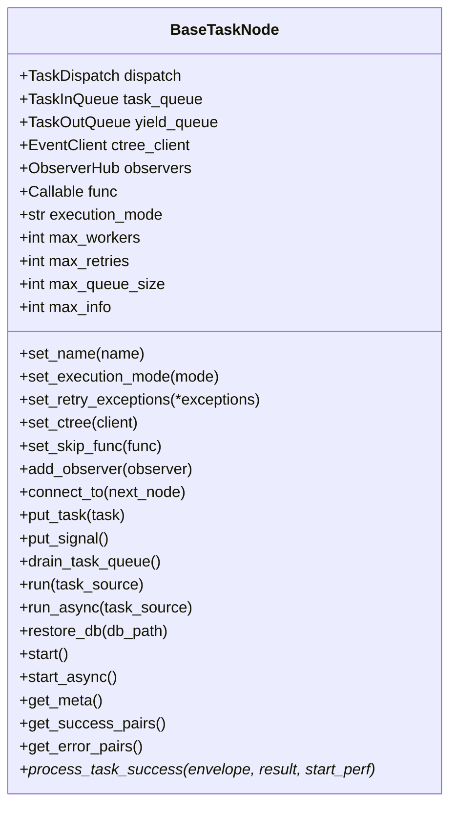
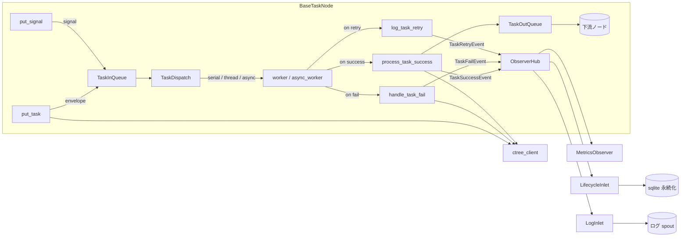

# src/celestialflow/node/core_node.py

> 📅 最終更新日: 2026/10/09

`core_node.py` は CelestialFlow ノード層のコア基底クラス `BaseTaskNode[T, R, Y]` を定義します。これは「キュー通信 / タスクスケジューリング / イベント追跡 / 観測者コールバック」などのランタイム関心を 1 つのオブジェクトに集約し、上位の `TaskExecutor` / `TaskSplitter` / `TaskRouter` が再利用するための `run` / `start` などのエントリメソッドを公開します。

> ⚠️ `BaseTaskNode` は **内部基底クラス** であり、**公共 API としてエクスポートされません**。ユーザーに見えるのは `TaskExecutor` / `TaskSplitter` / `TaskRouter` の 3 つのノードクラスのみです。

## コアオブジェクト

### `BaseTaskNode[T, R, Y]`

3 つのジェネリックパラメータはそれぞれ次を表します：入力タスク型 `T`、`func` の直接戻り値型 `R`、下流へ送信する結果型 `Y`。

| フィールド | 型 | 説明 |
|------|------|------|
| `dispatch` | `TaskDispatch[T, R, Y]` | タスクスケジューラ（内部コンポーネント）。`__init__` で作成 |
| `task_queue` | `TaskInQueue[T]` | 入力タスクキュー |
| `yield_queue` | `TaskOutQueue[Y]` | 出力結果キュー（下流ノードへ） |
| `ctree_client` | `EventClient` | イベントクライアント（ctree）、デフォルト `LocalEventClient()` |
| `observers` | `ObserverHub` | 観測者ディスパッチセンター。`add_observer()` で `Observer` を登録 |
| `func` | `Callable[[T], R]` または `Callable[[T], Awaitable[R]]` | タスクを実際に実行するコールバック |
| `execution_mode` | `str` | `'serial'` / `'thread'` / `'async'`、デフォルト `'serial'` |
| `max_workers` | `int` | 最大並行 worker 数（デフォルト `min(32, cpu_count+4)`） |
| `max_retries` | `int` | 単一タスクの最大リトライ回数（`1` は「元 1 回 + リトライ 1 回」） |
| `retry_exceptions` | `tuple[type[Exception], ...]` | リトライ可能な例外型の集合。`set_retry_exceptions` で登録 |
| `max_queue_size` | `int` | 入力キューの容量上限（`0` は無制限） |
| `max_info` | `int` | ログ内の各タスク文字列の最大長（デフォルト `50`） |
| `skip_func` | `Callable[[T], bool] | None` | タスクスキップ判定関数。デフォルト `None` はスキップしないことを意味 |
| `_name` | `str` | ノード / マネージャ名 |
| `_lifecycle_db_path` | `Path | None` | 単独実行時に生成される lifecycle データベースパス。グラフスケジューリング時は `None` |


```mermaid
classDiagram
    class BaseTaskNode {
        +TaskDispatch dispatch
        +TaskInQueue task_queue
        +TaskOutQueue yield_queue
        +EventClient ctree_client
        +ObserverHub observers
        +Callable func
        +str execution_mode
        +int max_workers
        +int max_retries
        +int max_queue_size
        +int max_info
        +set_name(name)
        +set_execution_mode(mode)
        +set_retry_exceptions(*exceptions)
        +set_ctree(client)
        +set_skip_func(func)
        +add_observer(observer)
        +connect_to(next_node)
        +put_task(task)
        +put_signal()
        +drain_task_queue()
        +run(task_source)
        +run_async(task_source)
        +restore_db(db_path)
        +start()
        +start_async()
        +get_meta()
        +get_success_pairs()
        +get_error_pairs()
        +process_task_success(envelope, result, start_perf)*
    }
```

> 注：ノードは `TaskMetrics` を**保持しなくなりました**。カウントと統計は `MetricsObserver` がイベントに基づいて維持します（単独実行時はグラフ / ノード組み立てエントリで登録、下記参照）。`BaseTaskNode` 自身は `observers` を通じてイベントをブロードキャストするだけです。

## 初期化

```python
def __init__(
    self,
    name: str,
    func: Callable[[T], R] | Callable[[T], Awaitable[R]],
    *,
    execution_mode: str = "serial",
    max_workers: int | None = None,
    max_retries: int = 1,
    max_queue_size: int = 0,
    max_info: int = 50,
    skip_func: Callable[[T], bool] | None = None,
): ...
```

`__init__` の主要動作:

1. `set_name` で名前を書き込み、`_set_func` でコールバックシグネチャを検証（位置引数を 1 つだけ受け取る必要がある）。それ以外は `ConfigurationError` を送出；
2. `set_skip_func` でタスクスキップ判定関数を登録（同様に単一位置引数が必要）。`None` はスキップしない；
3. `set_execution_mode` がモードの正当性を検証；`execution_mode == "async"` だが `func` が `iscoroutinefunction` でない場合は `ConfigurationError` を送出；
4. `max_workers / max_retries / max_queue_size / max_info` を初期化し、`retry_exceptions` を空タプルにプリセット；
5. デフォルトで `LocalEventClient()` をインストール。後で `set_ctree(...)` で置換可能；
6. `TaskDispatch(cast(BaseTaskNode[T, R, Y], self), self.func, self.max_workers)` をインスタンス化し、`TaskInQueue`（`out_name` はノード名）/ `TaskOutQueue`（`in_name` はノード名）/ `ObserverHub` を新規作成；
7. `_lifecycle_db_path` を `None` に初期化し、単独実行時に組み立てエントリが書き込みます。

## 設定 setter

| メソッド | 役割 | エラー |
|------|------|------|
| `set_name(name)` | ノード / マネージャ名を設定 | — |
| `set_execution_mode(execution_mode)` | `'serial'` / `'thread'` / `'async'` を切り替え | `InvalidOptionError`（モード不正）、`ConfigurationError`（`async` だが `func` がコルーチンでない） |
| `set_ctree(ctree_client)` | イベントクライアントを置き換え | — |
| `set_retry_exceptions(*exceptions)` | `retry_exceptions` にリトライ可能な例外型を追加 | — |
| `set_skip_func(skip_func)` | タスクスキップ判定関数を設定 | `ConfigurationError`（引数数 ≠ 1）、`CallableParameterKindError`（VAR/KEYWORD 引数を含む） |
| `add_observer(observer)` | `Observer` を `ObserverHub` に登録 | — |
| `_set_func(func)` | `func` を書き込んで検証 | `ConfigurationError`（引数数 ≠ 1）、`CallableParameterKindError`（VAR/KEYWORD 引数を含む） |

> すべての setter は `start()` / `start_async()` の前に呼び出す必要があり、**`start` 後の再変更は有効であるとは保証されません**。

## テンプレートメソッドとクエリ

`BaseTaskNode` は `TaskExecutor` / `TaskSplitter` / `TaskRouter` がオーバーライドするための **抽象フック** を 1 つだけ公開します:

| メソッド | 役割 |
|------|------|
| `process_task_success(task_envelope, result, start_perf) -> None` | worker が結果を正常に取得した際、ノードは「イベントブロードキャスト + 下流配信」などの操作を行う必要がある；新規の `BaseTaskNode` は直接 `NotImplementedError` を送出 |

補助クエリメソッド:

- `get_name() -> str`：ノード名を返します。
- `_get_class_name() -> str`：現在のノードクラス名を返します。
- `get_meta() -> dict[str, Any]`：構築期メタ情報 `{"class_name", "execution_mode", "max_workers"}` を返します。グラフ構造とともに一度だけ報告されます。
- `get_retry_error_type_names() -> set[str]`：`retry_exceptions` 内の各クラスの `__name__` 集合を返します。`restore_db` がエラータイプでフィルタリングするために使用します。
- `get_success_pairs() -> list[tuple[T, R]]`：単独実行で生成した lifecycle ライブラリから成功 `(task, result)` レコードを読み取ります。単独実行していない（またはグラフスケジューリングの）場合は空リストを返します。
- `get_error_pairs() -> list[tuple[T, PersistedError]]`：単独実行で生成した lifecycle ライブラリから失敗 `(task, PersistedError)` レコードを読み取ります。単独実行していない（またはグラフスケジューリングの）場合は空リストを返します。

> ノードは `get_snapshot()` / `get_lifecycle_path()` / `start_time` などの旧インターフェースを**提供しなくなりました**。実行時状態は `MetricsObserver` のスナップショットビュー（`MetricsView.get_node_metrics()`）が提供し、lifecycle パスは組み立てエントリが `run` / `run_async` のコンテキストで生成します。

## 下流のバインド

`connect_to(next_node)` は現在のノードから下流への伝送接続を確立します:

```python
def connect_to(self, next_node: BaseTaskNode[Any, Any, Any]) -> None:
    self.yield_queue.add_queue(next_node.get_name(), next_node.task_queue)
    next_node.task_queue.add_source_name(self.get_name())
```

バインドはノードとキューの間のデータパスのみを確立します。上流・下流の伝送カウントは**カウンタオブジェクトを共有せず**、`MetricsObserver` が `on_task_input` イベント配信時に導出します（上流の配信は受信側の上流カウントと発信元側の下流カウントの両方に加算）。したがって `connect_to` はバインドのみを行い、カウンティングには参加しません。

## タスク注入

| メソッド | 動作 |
|------|------|
| `put_task(task)` | 単一タスクを `TaskEnvelope(task, input_id)` にラップします。`input_id` は `ctree_client.emit(CTreeEvent.TASK_INPUT)` で生成；その後エンキューして `TaskInputEvent` をブロードキャスト（`from_node=None` は外部注入を意味） |
| `put_signal()` | `ctree_client.emit(CTreeEvent.TERMINATION_INPUT)` で `termination_id` を生成し、`TerminationSignal(termination_id, source="input")` をキューに配置して `TerminationInputEvent` をブロードキャスト |
| `drain_task_queue()` | タスクキューを空にし、各遗留タスクを `UnconsumedError()` として `handle_task_fail` 経由で処理 |

## エントリメソッド

### `run(task_source, *, if_put_signal=True)`

```python
def run(self, task_source: Iterable[T], *, if_put_signal: bool = True) -> None:
    error_list: list[Exception] = []
    try:
        with run_node_resources(self.observers) as lifecycle_db_path:
            self._lifecycle_db_path = lifecycle_db_path
            for task in task_source:
                self.put_task(task)
            if if_put_signal:
                self.put_signal()
            self.start()
    except Exception as exception:
        error_list.append(exception)
    if error_list:
        raise ExceptionGroup("Errors occurred during run", error_list)
```

`run_node_resources`（`celestialflow.assembly` に配置）は単一ノードの実行時リソースを組み立てます：`MetricsObserver` を作成し、`LifecycleInlet` / `LogInlet` 観測者と対応する spout を注入して一括で起動・停止します。lifecycle データベースパスを生成します。

### `async run_async(task_source, *, if_put_signal=True)`

非同期バージョン。`await self.start_async()` を呼び出し、同様に `run_node_resources` のコンテキスト内で実行されます。

### `restore_db(db_path, statuses=None, *, filter_by_error_type=False)`

sqlite データベースから前回の未完了タスクを読み込み、リプレイします:

1. `statuses` のデフォルトは `["failed", "pending"]`；
2. `load_tasks_grouped_by_node(db_path, statuses)` でノード名ごとにレコードを取り出します；
3. `filter_by_error_type=True` の場合、`get_retry_error_type_names()` で `error_type` をフィルタリング（`pending` レコードは常に保持）；
4. `record["task_json"]` を取り出した後、`self.run(tasks)` を呼び出します。

### `start()`

- 準備フェーズ `_prepare_start` で `NodeStartEvent`（`execution_mode` / `max_workers` を含む）をブロードキャスト；
- `execution_mode` に応じて `dispatch.dispatch_serial()` / `dispatch.dispatch_thread()` を選択；`async` は `start_async` へ、それ以外は `InvalidOptionError` を送出；
- 終了フェーズ `_finish_start` で `NodeEndEvent`（`elapsed` を含む）をブロードキャスト；
- いずれのフェーズで発生した例外も最終的に `ExceptionGroup("Errors occurred during execution", ...)` に集約されて送出。

### `async start_async()`

- `execution_mode == "async"` の場合のみ正当。それ以外は `InvalidOptionError` を送出；
- 内部で `await self.dispatch.dispatch_async()` を呼び出し、終了時に `NodeEndEvent` をブロードキャスト。

## 結果 / イベント / エラー処理

| メソッド | 役割 |
|------|------|
| `process_task_success(envelope, result, start_perf)` | 抽象フック。成功処理はサブクラスが実装 |
| `handle_task_fail(envelope, exception)` | `ctree_client.emit(CTreeEvent.TASK_ERROR, parents=[task_id])` で `error_id` を生成し、`TaskFailEvent` をブロードキャスト |
| `handle_task_skip(envelope)` | `ctree_client.emit(CTreeEvent.TASK_SKIP, parents=[task_id])` で `skip_id` を生成し、`TaskSkipEvent` をブロードキャスト |
| `log_task_retry(envelope, exception, fail_times)` | `TaskRetryEvent`（`retry_times` を含む）をブロードキャスト；lifecycle 状態更新は `LifecycleInlet` がイベントに応答して実施 |
| `_get_repr(task) -> str` | `format_repr(task, self.max_info)` で可読な文字列を生成 |

## 主要なデータフロー


```mermaid
flowchart LR
    subgraph "BaseTaskNode"
        PutTask[put_task] -->|envelope| TaskQueue[TaskInQueue]
        PutSignal[put_signal] -->|signal| TaskQueue
        TaskQueue --> Dispatch[TaskDispatch]
        Dispatch -->|serial / thread / async| Worker[worker / async_worker]
        Worker -->|on success| PTS[process_task_success]
        Worker -->|on fail| HTF[handle_task_fail]
        Worker -->|on retry| LTR[log_task_retry]
        PTS --> YieldQueue[TaskOutQueue]
        YieldQueue --> Downstream[(下流ノード)]
        PTS -->|TaskSuccessEvent| Hub[ObserverHub]
        HTF -->|TaskFailEvent| Hub
        LTR -->|TaskRetryEvent| Hub
    end

    PutTask --> CT[ctree_client]
    HTF --> CT
    PTS --> CT

    Hub --> Metrics[MetricsObserver]
    Hub --> Lifecycle[LifecycleInlet]
    Hub --> Log[LogInlet]
    Lifecycle --> SQLite[(sqlite 永続化)]
    Log --> LogStore[(ログ spout)]
```

`ObserverHub` はノードイベントブロードキャストの出力側です：ノードはイベント発生時に該当する `on_*` コールバックを呼び出すと、登録済みの `MetricsObserver` / `LifecycleInlet` / `LogInlet` などがそれぞれそれに応じてカウント更新、書き込み、ログ出力を行います。これらの観測者は `run_node_resources`（単独実行）またはグラフレベルクライアントの組み立てで注入されます。

## 使用例

> `BaseTaskNode` は直接外部に公開されません。以下の例はカスタムノードを実装するために継承する方法を示します；実際のプロダクションでは `TaskExecutor` の継承を推奨します。

```python
from celestialflow.node.core_node import BaseTaskNode
from celestialflow.runtime import TaskEnvelope
from celestialflow.runtime.util_types import CTreeEvent
from celestialflow.observer import TaskSuccessEvent, TaskInputEvent


class SquareNode(BaseTaskNode[int, int, int]):
    """整数を二乗する最小ノードの例。"""

    def process_task_success(self, task_envelope, result, start_perf):
        task = task_envelope.get_task()
        task_id = task_envelope.get_id()

        result_id = self.ctree_client.emit(CTreeEvent.TASK_SUCCESS, parents=[task_id])
        self.observers.on_task_success(
            TaskSuccessEvent(
                node=self.get_name(),
                task=task,
                task_repr=str(task),
                result=result,
                result_repr=str(result),
                elapsed=0.0,
                task_id=task_id,
                success_id=result_id,
            )
        )

        for target in self.yield_queue.get_target_names():
            downstream_id = self.ctree_client.emit(
                CTreeEvent.TASK_INPUT, parents=[result_id]
            )
            self.observers.on_task_input(
                TaskInputEvent(
                    node=target,
                    task=result,
                    task_repr=str(result),
                    input_id=downstream_id,
                    from_node=self.get_name(),
                )
            )
            self.yield_queue.put_target(
                target, TaskEnvelope(task=result, id=downstream_id)
            )


node = SquareNode("Square", lambda x: x * x, execution_mode="serial")
node.run([1, 2, 3, 4])
```

## 例外一覧

| 例外 | トリガーシーン |
|------|---------|
| `ConfigurationError` | `_set_func` / `set_skip_func` の引数数 ≠ 1；`set_execution_mode("async")` だが `func` がコルーチンでない |
| `InvalidOptionError` | `execution_mode` が `("serial", "thread", "async")` のいずれにも該当しない；`start()` 時にモードが serial でも thread でもない |
| `CallableParameterKindError` | コールバックが `POSITIONAL_ONLY` / `POSITIONAL_OR_KEYWORD` 以外の引数を含む |
| `NotImplementedError` | サブクラスが `process_task_success` をオーバーライドしていない |
| `ExceptionGroup` | `run` / `run_async` / `start` / `start_async` プロセス中の例外が最終的に集約されて送出 |

## 注意事項

1. **ワンタイム `start`**：`start()` / `start_async()` はワンタイム呼び出しです。**実行完了後にインスタンスを安全にリセットして再利用できることは保証されません**；繰り返し実行する場合は新しいノードを作成してください。
2. **setter の呼び出しタイミング**：すべての setter は `start` 前に完了させる必要があり、実行期間中に `func` を置き換えないでください。
3. **実行時リソースは組み立てエントリが管理**：`MetricsObserver` / `LifecycleInlet` / `LogInlet` は `run_node_resources`（単独実行）またはグラフレベルクライアントが組み立て、`BaseTaskNode` 自身は spout / inlet を直接保持しません。
4. **ctree クライアント**：デフォルトの `LocalEventClient()` は内部でイベント ID をインクリメントします。`set_ctree(...)` でいつでも `celestialtree` に接続するクライアントに置き換えることができます。
5. **削除された機能**：ノード層は `TaskMetrics` を保持せず、`get_snapshot()` / `get_lifecycle_path()` / `remove_observer()` などの旧インターフェースも提供しません。カウント統計は `MetricsObserver` がイベントに基づいて一元的に維持します。