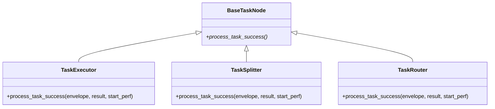

# src/celestialflow/node/core_nodes.py

> 📅 最終更新日: 2026/09/24

`core_nodes.py` は CelestialFlow が外部に公開する 3 つの具体的なノードクラスを提供します:

- `TaskExecutor` — 汎用タスク実行器
- `TaskSplitter` — 1→N 分割器
- `TaskRouter` — 条件ルーター

> 3 つのクラスは **いずれも独自の `__init__` を定義せず**、`BaseTaskNode.__init__` をそのまま再利用します。それぞれが `process_task_success` をオーバーライドして「実行 / 分割 / ルーティング」の 3 つのセマンティクスを提供します。



> 注意：`TaskSplitter` と `TaskRouter` は **直接** `BaseTaskNode` を継承し、`TaskExecutor` とは並列関係（`TaskExecutor` のサブクラスではない）です。

## 共通コンストラクタ署名

3 つのクラスは同一のコンストラクタ署名を共有します（`BaseTaskNode` から継承）:

```python
def __init__(
    self,
    name: str,
    func: Callable[[T], R] | Callable[[T], Awaitable[R]],
    *,
    execution_mode: str = "serial",
    max_workers: int | None = None,
    max_retries: int = 1,
    max_queue_size: int = 0,
    max_info: int = 50,
): ...
```

ここで `R` は各サブクラスのジェネリックにおける「直接戻り値型」です:

| クラス | ジェネリック継承 | `func` が返すべきもの |
|----|---------|--------------|
| `TaskExecutor[T, R]` | `BaseTaskNode[T, R, R]` | 単一の結果 `R` |
| `TaskSplitter[T, RItem]` | `BaseTaskNode[T, Iterable[RItem], RItem]` | 反復可能なサブタスク列 |
| `TaskRouter[T, Y]` | `BaseTaskNode[T, dict[str, Y], Y]` | `{下流名: ペイロード}` マッピング |

## `TaskExecutor[T, R]`

汎用実行器。単一の入力を単一の結果にマッピングし、結果を登録されたすべての下流ターゲットに転送する役割を担います。

### 主要オーバーライド

`process_task_success(envelope, result, start_perf)` →

1. `ctree_client.emit(CTreeEvent.TASK_SUCCESS, parents=[task_id])` で `result_id` を取得；
2. `self.metrics.add_success_count()`；
3. `get_lifecycle_inlet().task_success(task_id, result)`；
4. `get_log_inlet().task_success(name, repr(task), repr(result), 耗时, task_id, result_id)` でログ書き込み；
5. 各下流ターゲット (`self.yield_queue.get_target_names()`) に対し：`add_downstream_count(target)`、`TASK_INPUT` イベントを再発行、lifecycle / log の入力レコードを書き込み、`yield_queue.put_target(target, TaskEnvelope(result, downstream_input_id))` を実行。

### 例

```python
from celestialflow.node import TaskExecutor


def double(x: int) -> int:
    return x * 2


executor = TaskExecutor(
    "Doubler",
    func=double,
    execution_mode="serial",
)
executor.run([1, 2, 3])
for task, result in executor.get_success_pairs():
    print(task, "->", result)
```

## `TaskSplitter[T, RItem]`

`func` は単一のタスクを受け取り、反復可能なサブタスク列を返します。サブタスクは 1 つずつ下流キューに注入されます（典型的な 1→N シナリオ）。

### 主要オーバーライド

`process_task_success(envelope, result, start_perf)` →

1. `result_list = list(result)` で結果を実体化（ジェネレータをサポート）；
2. `ctree_client.emit(CTreeEvent.TASK_SUCCESS, parents=[task_id])` で `result_id` を取得；
3. `self.metrics.add_success_count()`；
4. `get_lifecycle_inlet().task_success(task_id, result_list)`；
5. `get_log_inlet().task_success(...)` でログ書き込み；
6. 各下流ターゲットに対し：`add_downstream_count(target, len(result_list))` で送信カウントを一度に増加；その後 `result_list` 内の各 `item` に対して個別に `TASK_INPUT` イベントを発行し、lifecycle / log の入力レコードを書き込み、`yield_queue.put_target(target, TaskEnvelope(item, downstream_input_id))` を実行。

> 空の反復可能オブジェクトは正当に 0 個のサブタスクを生成します（例外は送出されません）；ジェネレータ入力は `list()` で完全に実体化した後に配信されます。

### 例

```python
from celestialflow.node import TaskSplitter


def split_chars(text: str) -> list[str]:
    return list(text)


splitter = TaskSplitter("CharSplitter", split_chars)
# 単一タスクを直接注入する場合：
# splitter.run(["abc"])  # 下流は順に "a"、"b"、"c" を受け取る
```

`TaskGraph` と組み合わせた典型的な使用法：

```python
from celestialflow import TaskGraph, TaskExecutor
from celestialflow.node import TaskSplitter

splitter = TaskSplitter("Splitter", lambda task: list(task))
sink = TaskExecutor("Sink", func=lambda c: print(c))

graph = TaskGraph(name="SplitGraph")
graph.set_nodes([splitter, sink])
graph.connect([splitter], [sink])

graph.run({"Splitter": [["a", "b", "c"]]})
```

## `TaskRouter[T, Y]`

`func` は `{下流名: ペイロード}` マッピングを返し、それに基づいてタスク（または任意のペイロード）を指定された下流へ振り分けます。

### 主要オーバーライド

`process_task_success(envelope, result, start_perf)` →

1. `result` 内の各ターゲット名が既に `self.metrics.downstream_counter` に登録されているかを検証；未登録のターゲットが存在する場合は `InvalidOptionError("Unknown target", unknown[0], self.metrics.downstream_counter.keys())` を送出；
2. `ctree_client.emit(CTreeEvent.TASK_SUCCESS, parents=[task_id])` で `result_id` を取得；
3. `self.metrics.add_success_count()`；
4. `get_lifecycle_inlet().task_success(task_id, task)`（注意：lifecycle の成功として記録されるのは**入力タスク** `task` であり、マッピング `result` ではない）；
5. `get_log_inlet().task_success(name, repr(task), repr(result), 耗时, task_id, result_id)` でログ書き込み；
6. `result.items()` 内の各 `(target, yie)` に対し：`add_downstream_count(target)`、`TASK_INPUT` イベントを発行、lifecycle / log の入力レコードを書き込み、`yield_queue.put_target(target, TaskEnvelope(yie, downstream_input_id))` を実行——下流が受け取るのは**そのターゲットに対応するペイロード** `yie` であり、ルーターの入力タスクではない。

### 例

```python
from celestialflow import TaskGraph, TaskExecutor
from celestialflow.node import TaskRouter


def route_by_length(text: str) -> dict[str, str]:
    target = "LongPath" if len(text) > 5 else "ShortPath"
    return {target: text}


router = TaskRouter("LengthRouter", route_by_length)
long_node = TaskExecutor("LongPath", func=lambda s: ("L", s))
short_node = TaskExecutor("ShortPath", func=lambda s: ("S", s))

graph = TaskGraph(name="RouterGraph")
graph.set_nodes([router, long_node, short_node])
graph.connect([router], [long_node, short_node])

graph.run({router.get_name(): ["hi", "hello world", "ok"]})
```

## 例外一覧

| 例外 | トリガーシーン |
|------|---------|
| `InvalidOptionError` | `TaskRouter.process_task_success` 内で `result` に `connect_to` でバインドされていないターゲット名が含まれる |
| `ConfigurationError` | `BaseTaskNode` から継承：`async` だが `func` がコルーチンでない；`func` の引数数 ≠ 1 など |
| `CallableParameterKindError` | `BaseTaskNode._set_func` のシグネチャ検証から継承 |

## 注意事項

1. **直接の親クラスは `BaseTaskNode`**：`TaskSplitter` / `TaskRouter` は `TaskExecutor` のサブクラスでは **ありません**。それぞれが異なる `process_task_success` セマンティクスを担います。
2. **`func` は必須**：独自の `__init__` を持たないため、3 つのクラスはいずれも `func` を提供する必要があります；デフォルトは `execution_mode="serial"`、`max_retries=1`。
3. **ルーターのターゲットは事前バインドが必要**：`func` が返すターゲット文字列は `self.metrics.downstream_counter` に存在する必要があります（少なくとも `graph.connect` / `connect_to` で登録済み）；そうでない場合は `InvalidOptionError` を送出します。
4. **ルーターの各ターゲットはそれぞれのペイロードを受け取る**：1 回のルーティングで複数のターゲットを返すことができ、各下流は対応する key の value のみを受け取ります。
5. **ランタイムコンポーネントは自動初期化**：3 つのノードクラスはすべて `BaseTaskNode.__init__` を通じて `metrics / task_queue / yield_queue / dispatch` などのコンポーネントを自動初期化し、重複作成は不要です。
6. **`split_item` / `split_counter` / `_split` / `route_counters` / `_route` は存在しない**：分割とルーティングのロジックは現在、渡された `func` が完全に担い、クラス自体は `func` の結果を下流に配信する役割のみを持ちます。
