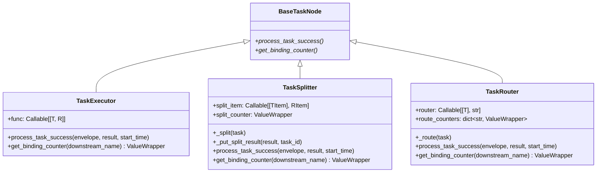

# core_nodes

> 📅 最終更新日: 2026/09/09

`core_nodes.py` は CelestialFlow が外部に公開する 3 つの具体的なノードクラスを提供します:

- `TaskExecutor` — 汎用タスク実行器
- `TaskSplitter` — 1→N 分割器
- `TaskRouter` — 条件ルーター

> 上記 3 つのクラスの **直接の親クラスはすべて `BaseTaskNode`** であり、`BaseTaskNode` はノード基底クラスでもあります；それぞれが `process_task_success` と `get_binding_counter` をオーバーライドして「実行 / 分割 / ルーティング」の 3 つのセマンティクスを提供します。



> 注意：`TaskSplitter` と `TaskRouter` は **直接** `BaseTaskNode` を継承し、`TaskExecutor` とは並列関係（`TaskExecutor` のサブクラスではない）です。

## `TaskExecutor[T, R]`

汎用実行器。単一の入力を単一の結果にマッピングし、結果を登録されたすべての下流ターゲットに転送する役割を担います。

### 構築

```python
def __init__(
    self,
    name: str,
    func: Callable[[T], R] | Callable[[T], Awaitable[R]],
    *,
    execution_mode: str = "serial",
    max_workers: int | None = None,
    max_retries: int = 1,
    max_queue_size: int = 0,
    max_info: int = 50,
    enable_duplicate_check: bool = False,
): ...
```

`TaskExecutor` はすべての引数を `BaseTaskNode.__init__` にそのまま転送するため、`execution_mode / max_workers / max_retries / max_queue_size / max_info / enable_duplicate_check` は構築時にキーワード引数でデフォルト値を上書きできます。

### 主要オーバーライド

- `get_binding_counter(_downstream_name) -> ValueWrapper` → `self.metrics.success_counter` を返します。
- `process_task_success(envelope, result, start_time)` →
  1. `ctree_client.emit(CTreeEvent.TASK_SUCCESS, parents=[task_id])` を呼び出して `result_id` を取得；
  2. `self.metrics.add_success_count()`；
  3. `get_lifecycle_inlet().task_success(task_id, result)`；
  4. `get_log_inlet().task_success(...)` でログ書き込み；
  5. 各下流ターゲット (`result_queue.get_target_names()`) に対し `TASK_INPUT` イベントを再発行し、`TaskEnvelope(result, downstream_input_id)` を `put_target` します。

### 例

```python
from celestialflow.node import TaskExecutor


def double(x: int) -> int:
    return x * 2


executor = TaskExecutor(
    "Doubler",
    func=double,
    execution_mode="serial",
)
executor.run([1, 2, 3])
for task, result in executor.get_success_pairs():
    print(task, "->", result)
```

## `TaskSplitter[TItem, RItem]`

1 つの `Iterable[TItem]` を `Iterable[RItem]` に分割し、各 `RItem` をそれぞれ下流に送信します（典型的な 1→N シナリオ）。

### 構築

```python
def __init__(
    self,
    name: str,
    split_item: Callable[[TItem], RItem] | None = None,
):
    super().__init__(
        name=name,
        func=self._split,  # 内蔵分割関数
        execution_mode="serial",  # ハードコード
        max_retries=0,  # ハードコード：分割器はリトライしない
    )
    self.split_item = split_item or self._identity_split_item
    self.split_counter = ValueWrapper(0, self.metrics.lock)
```

> デフォルトの `execution_mode` と `max_retries` は `"serial"` と `0` にハードコードされています。他のモードが必要な場合は外部で `set_execution_mode` を使って調整してください。

### 主要オーバーライド

- `get_binding_counter(_downstream_name) -> ValueWrapper` → `self.split_counter` を返します（`success_counter` ではない）。
- `process_task_success(envelope, result, start_time)` →
  1. `list(result)` で結果を実体化；
  2. `_put_split_result(result_list, task_id)` で各サブタスクを順次すべての下流ターゲットに put し、`split_trace` ログを書き込む；
  3. `self.metrics.add_success_count()`、`get_lifecycle_inlet().task_success(task_id, result_list)`；
  4. `_update_split_counter(split_count)` で split カウンタを増加。

### `_split` サブクラスフック

`TaskSplitter` は「分割方法」をプライベートメソッド `_split` にカプセル化します:

```python
def _split(self, task: Iterable[TItem]) -> Iterable[RItem]:
    return (self.split_item(item) for item in task)
```

注意:

- `_split` は **プライベートメソッド** であり、公開 API ではない；
- カスタム分割ロジックが必要な場合は、`_split` をオーバーライドするよりも `split_item` パラメータ（単一サブタスクに対するマッピング）を使うことを推奨；
- デフォルトの `split_item` は `_identity_split_item`（恒等写像 `cast(RItem, task)`）。

> 「集合の分割方法」をどうしても置き換えたい場合は、`TaskSplitter` を継承して `__init__` の外部で `func` をオーバーライドするか `process_task_success` を完全にオーバーライドする必要がありますが、推奨されません。

### `_put_split_result(result, task_id)` プライベートメソッド

各サブタスクに対して:

1. `ctree_client.emit("task.split", parents=[task_id])` を呼び出して `split_id` を取得；
2. 各下流ターゲットに対し `task.input` イベントを発行し、エンベロープを `put_target`；
3. `get_log_inlet().split_trace(...)` でトレースを記録。

`split_count = len(result_list)` を返します。

### 例

```python
from celestialflow.node import TaskSplitter
from celestialflow import TaskGraph, TaskExecutor

# 分割器：文字列を単一文字に分割
splitter = TaskSplitter("CharSplitter")


# 下流：すべての文字を印刷
class CharSink(BaseTaskNode[str, str]):  # 概念的な例
    ...
```

より一般的な使用法は `TaskGraph` と組み合わせることです:

```python
from celestialflow import TaskGraph, TaskExecutor
from celestialflow.node import TaskSplitter

splitter = TaskSplitter("Splitter")
sink = TaskExecutor("Sink", func=lambda c: print(c))

graph = TaskGraph(name="SplitGraph")
graph.set_nodes([splitter, sink])
graph.connect([splitter], [sink])

graph.run({splitter.get_name(): [["a", "b", "c"]]})
```

## `TaskRouter[T]`

`router` コールバックに基づいてタスクを指定された下流にルーティングします。

### 構築

```python
def __init__(self, name: str, router: Callable[[T], str]):
    super().__init__(
        name=name,
        func=self._route,  # 内蔵ルーティング関数
        execution_mode="serial",  # ハードコード
        max_retries=0,  # ハードコード：ルーターはリトライしない
    )
    self.router = router
    self.route_counters = {}
```

> 同じくデフォルトの `execution_mode` と `max_retries` は `"serial"` と `0` にハードコードされています。他のモードが必要な場合は外部で `set_execution_mode` を使って調整してください。

### 主要オーバーライド

- `get_binding_counter(downstream_name) -> ValueWrapper` → 下流名に対して `setdefault` で対応する `ValueWrapper` を作成して返します。
- `process_task_success(envelope, result, start_time)` →
  1. `target, task = result`；
  2. `ctree_client.emit("task.route", parents=[task_id])` を呼び出して `route_id` を取得；
  3. `self.metrics.add_success_count()`、`get_lifecycle_inlet().task_success(task_id, task)`；
  4. `_update_route_counter(target)` で対応する下流カウンタを増加；
  5. `get_log_inlet().route_success(...)` でログ書き込み；
  6. `target` に対し `task.input` イベントを発行し `put_target`。

### `_route` サブクラスフック

```python
def _route(self, task: T) -> tuple[str, T]:
    target = self.router(task)
    if target not in self.route_counters:
        raise InvalidOptionError("Unknown target", target, self.route_counters.keys())
    return target, task
```

> `target` は `prev_binding` で登録済みの下流名である必要があります；そうでない場合は `InvalidOptionError`（`runtime.util_errors` 所属）を送出します。

### 例

```python
from celestialflow import TaskGraph, TaskExecutor
from celestialflow.node import TaskRouter


def by_length(text: str) -> str:
    return "LongPath" if len(text) > 5 else "ShortPath"


router = TaskRouter("LengthRouter", router=by_length)
long_node = TaskExecutor("LongPath", func=lambda s: ("L", s))
short_node = TaskExecutor("ShortPath", func=lambda s: ("S", s))

graph = TaskGraph(name="RouterGraph")
graph.set_nodes([router, long_node, short_node])
graph.connect([router], [long_node, short_node])

graph.run({router.get_name(): ["hi", "hello world", "ok"]})
```

## 例外一覧

| 例外 | トリガーシーン |
|------|---------|
| `InvalidOptionError` | `TaskRouter._route` 内の `target` が登録済みの `route_counters` に存在しない |
| `ConfigurationError` | `BaseTaskNode` から継承：`async` だが `func` がコルーチンでない；`func` の引数数 ≠ 1 など |
| `CallableParameterKindError` | `BaseTaskNode._set_func` のシグネチャ検証から継承 |

## 注意事項

1. **直接の親クラスは `BaseTaskNode`**：`TaskSplitter` / `TaskRouter` は `TaskExecutor` のサブクラスでは **ありません**。それぞれが異なる `process_task_success` セマンティクスを担います。
2. **分割 / ルーティングノードはリトライしない**：`max_retries=0` が `__init__` でハードコード；リトライが必要な場合は `TaskExecutor` を使用してください。
3. **分割器の `execution_mode` のデフォルトはシリアル**：分割自体は I/O が軽い操作のため、通常は並行性を必要としません。並行性が必要な場合は `set_execution_mode("thread")` で調整してください。
4. **ルーターのターゲットは事前バインドが必要**：`router` が返すターゲット文字列は `self.route_counters` に存在する必要があります（少なくとも `prev_binding` で登録済み）；そうでない場合は `InvalidOptionError` を送出します。
5. **ランタイムの `start_time` / カウンタ**：3 つのノードクラスはすべて `BaseTaskNode.__init__` を通じて `metrics / task_queue / result_queue / dispatch` などのコンポーネントを自動初期化し、重複作成は不要です。
