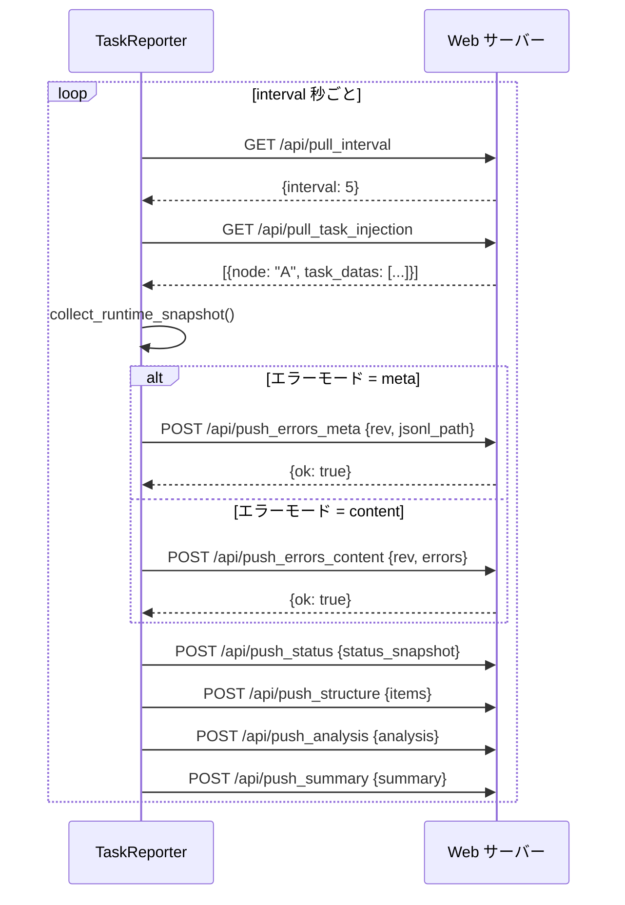

# TaskReporter

> 📅 最終更新日: 2026/05/24

`TaskReporter` はバックグラウンドコンポーネントで、タスクグラフの実行状態を収集し、リモート Web サーバー（CelestialFlow Web UI）に報告します。また、サーバーからの制御命令（タスク注入など）の取得も担当します。

## 機能特性

- **状態報告**: タスクグラフの構造、トポロジー、実行状態（カウンター）、分析データ、サマリー情報などを定期的にプッシュ。
- **タスク注入**: Web UI からユーザーが注入した新しいタスクを受信し、実行中のタスクグラフに動的に挿入。
- **パラメータの動的調整**: サーバーからの設定取得（報告間隔 `interval` など）をサポート。
- **エラーログ同期**: 増分エラーログプッシュをサポート（メタデータモード / コンテンツモード）。

## 使用方法

通常、直接インスタンス化する必要はなく、`TaskGraph` を通じて有効化します：

```python
graph = TaskGraph(...)
# Reporter を有効化し、ローカルポート 5005 に接続
graph.set_reporter(True, host="127.0.0.1", port=5005)
```

## API 連携

Reporter は HTTP を通じて以下の Web API と連携します：

### プルインターフェース（Pull）

| メソッド | エンドポイント | 説明 |
|------|------|------|
| `GET` | `/api/pull_interval` | 報告間隔の設定を取得 |
| `GET` | `/api/pull_task_injection` | 注入されたタスクを取得 |

### プッシュインターフェース（Push）

| メソッド | エンドポイント | 説明 |
|------|------|------|
| `POST` | `/api/push_errors_meta` | エラーメタ情報をプッシュ（バージョン番号と JSONL パス） |
| `POST` | `/api/push_errors_content` | エラー内容をプッシュ（増分、具体的なエラーエントリを含む） |
| `POST` | `/api/push_status` | ランタイム状態スナップショットをプッシュ |
| `POST` | `/api/push_structure` | グラフ構造情報をプッシュ |
| `POST` | `/api/push_analysis` | グラフ分析データをプッシュ |
| `POST` | `/api/push_summary` | グラフ概要統計をプッシュ |

### 連携フロー



## NullTaskReporter

Reporter が有効化されていない場合、`TaskGraph` はプレースホルダーとして `NullTaskReporter` を使用します。`start()` と `stop()` はノーオペレーションで、ネットワークリクエストは一切行われません。

```python
class NullTaskReporter:
    interval = 1
    history_limit = 20

    def start(self) -> None: ...
    def stop(self) -> None: ...
```

`NullTaskReporter` は `__init__.py` からもエクスポートされており、レポート機能無効時に安全に参照できます：

```python
from celestialflow.observability import NullTaskReporter
```
