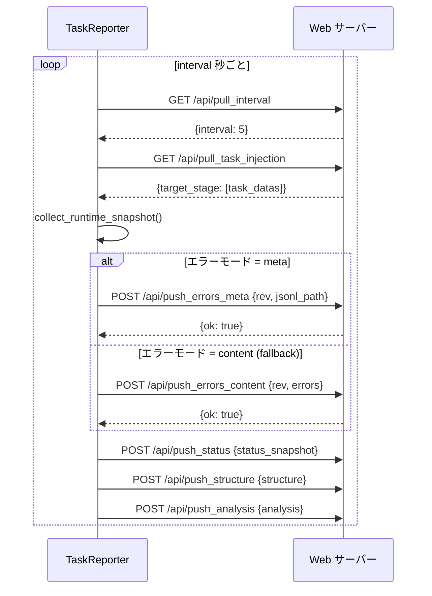

# TaskReporter

> 📅 最終更新日: 2026/06/11

`TaskReporter` はバックグラウンドコンポーネントで、タスクグラフの実行状態を収集しリモート Web サーバー（CelestialFlow Web UI）にレポートします。また、サーバーから制御指示（タスク注入など）をプルする役割も担います。

## 機能特性

- **状態レポート**: タスクグラフの構造、トポロジー、実行状態（カウンター）、分析データなどを定期的にプッシュ。
- **タスク注入**: Web UI からユーザーが注入した新規タスクを受信し、実行中のタスクグラフに動的挿入。
- **パラメータ動的調整**: サーバーから設定（レポート間隔 `interval` など）をプル可能。
- **エラーログ同期**: エラーログの増分プッシュをサポート（メタデータモード / コンテンツモード）。

## 初期化

```python
class TaskReporter:
    def __init__(
        self,
        host: str,
        port: int,
        task_graph: "TaskGraph",
        log_inlet: LogInlet,
    ) -> None:
        """
        :param host: リモートサービスのホストアドレス
        :param port: リモートサービスのポート
        :param task_graph: タスクグラフインスタンス
        :param log_inlet: ログコレクターインスタンス
        """
```

初期化後、`base_url = f"http://{host}:{port}"` が設定され、デフォルトで `interval = 5` 秒、`history_limit = 20` となります。

## API インタラクション

Reporter は HTTP 経由で以下の Web API とやり取りします：

### プルインターフェース（Pull）

| メソッド | エンドポイント | 説明 |
|------|------|------|
| `GET` | `/api/pull_interval` | レポート間隔設定を取得 |
| `GET` | `/api/pull_task_injection` | 注入タスクを取得 |

### プッシュインターフェース（Push）

| メソッド | エンドポイント | 説明 |
|------|------|------|
| `POST` | `/api/push_errors_meta` | エラーメタ情報をプッシュ（バージョン番号と JSONL パス） |
| `POST` | `/api/push_errors_content` | エラー内容をプッシュ（増分、具体的なエラー項目を含む） |
| `POST` | `/api/push_status` | 実行時状態スナップショットをプッシュ |
| `POST` | `/api/push_structure` | グラフ構造情報をプッシュ |
| `POST` | `/api/push_analysis` | グラフ分析データをプッシュ |

> **変更点**：以前のドキュメントでは `/api/push_summary` エンドポイントが記載されていましたが、現在の `TaskReporter._refresh_all()` には summary のプッシュ呼び出しは含まれていません（`LogInlet` には `push_summary_failed` ログメソッドが残っていますが、Reporter からは呼び出されません）。

### インタラクションフロー



## _refresh_all 実行順序

```python
def _refresh_all(self) -> None:
    # 1. プル
    self._pull_interval()          # GET /api/pull_interval
    self._pull_and_inject_tasks()  # GET /api/pull_task_injection → タスク注入

    # 2. スナップショット収集
    self.task_graph.collect_runtime_snapshot()

    # 3. プッシュ
    self._push_errors()      # 最初に meta モード、失敗時は content モードにフォールバック
    self._push_status()      # POST /api/push_status
    self._push_structure()   # POST /api/push_structure
    self._push_analysis()    # POST /api/push_analysis
```

## ライフサイクル

```python
reporter.start()  # 停止フラグをクリアし、_loop() を実行するデーモンスレッドを作成
reporter.stop()   # 停止フラグを設定し、スレッドを join（timeout=2）、最後に一度リフレッシュ
```

`_loop()` 内では毎回 `_refresh_all()` を実行し、例外をキャッチして `log_inlet.loop_failed()` で記録。スレッドは終了しません。

## NullTaskReporter

Reporter が有効化されていない場合、`NullTaskReporter` をプレースホルダーとして使用します。その `start()` と `stop()` はすべて空操作で、ネットワークリクエストは一切発生しません。

```python
class NullTaskReporter:
    interval: int = 1
    history_limit: int = 20

    def start(self) -> None: ...
    def stop(self) -> None: ...
```
