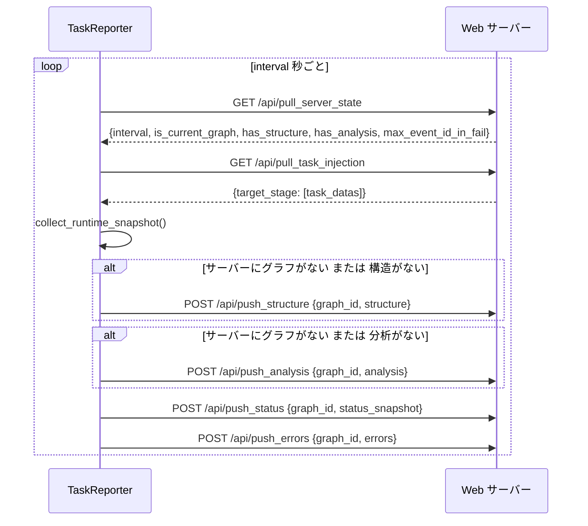

# TaskReporter

> 📅 最終更新日: 2026/06/22

`TaskReporter` はバックグラウンドコンポーネントで、タスクグラフの実行状態を収集しリモート Web サーバー（CelestialFlow Web UI）にレポートします。また、サーバーから制御指示（タスク注入など）をプルする役割も担います。

## 機能特性

- **状態レポート**: タスクグラフの構造、トポロジー、実行状態（カウンター）、分析データなどを定期的にプッシュ。
- **タスク注入**: Web UI からユーザーが注入した新規タスクを受信し、実行中のタスクグラフに動的挿入。
- **パラメータ動的調整**: サーバーから設定（レポート間隔 `interval` など）をプル可能。
- **エラーログ同期**: エラーログの増分プッシュ（`event_id` ベースの増分）。

## 初期化

```python
class TaskReporter:
    def __init__(
        self,
        host: str,
        port: int,
        task_graph: ReporterTaskGraph,
        log_inlet: LogInlet,
    ) -> None:
        """
        :param host: リモートサービスのホストアドレス
        :param port: リモートサービスのポート
        :param task_graph: タスクグラフインスタンス（ReporterTaskGraph プロトコルを満たす）
        :param log_inlet: ログコレクターインスタンス
        """
```

初期化後、`base_url = f"http://{host}:{port}"` が設定され、デフォルトで `interval = 5` 秒、`history_limit = 20` となります。

## API インタラクション

Reporter は HTTP 経由で以下の Web API とやり取りします：

### プルインターフェース（Pull）

| メソッド | エンドポイント | 説明 |
|------|------|------|
| `GET` | `/api/pull_server_state` | サーバー同期状態を取得（間隔設定、構造/分析状態、最大 event_id などを含む） |
| `GET` | `/api/pull_task_injection` | 注入タスクを取得 |

### プッシュインターフェース（Push）

| メソッド | エンドポイント | 説明 |
|------|------|------|
| `POST` | `/api/push_errors` | エラー情報をプッシュ（増分、`server_max_event_id_in_fail` ベース） |
| `POST` | `/api/push_status` | 実行時状態スナップショットをプッシュ |
| `POST` | `/api/push_structure` | グラフ構造情報をプッシュ |
| `POST` | `/api/push_analysis` | グラフ分析データをプッシュ |

### インタラクションフロー



## _refresh_all 実行順序

```python
def _refresh_all(self) -> None:
    # 1. プル
    self._pull_server_state()       # GET /api/pull_server_state → 設定と状態を同期
    self._pull_and_inject_tasks()   # GET /api/pull_task_injection → タスク注入

    # 2. スナップショット収集
    self.task_graph.collect_runtime_snapshot()

    # 3. プッシュ（必要に応じて）
    if (not self._server_has_current_graph) or (not self._server_has_structure):
        self._push_structure()      # POST /api/push_structure
    if (not self._server_has_current_graph) or (not self._server_has_analysis):
        self._push_analysis()       # POST /api/push_analysis
    self._push_status()             # POST /api/push_status
    self._push_errors()             # POST /api/push_errors
```

## ライフサイクル

```python
reporter.start()  # 停止フラグをクリアし、_loop() を実行するデーモンスレッドを作成
reporter.stop()   # 停止フラグを設定し、スレッドを join（timeout=2）、最後に一度リフレッシュ
```

`_loop()` 内では毎回 `_refresh_all()` を実行し、例外をキャッチして `log_inlet.loop_failed()` で記録。スレッドは終了しません。

## NullTaskReporter

Reporter が有効化されていない場合、`NullTaskReporter` をプレースホルダーとして使用します。その `start()` と `stop()` はすべて空操作で、ネットワークリクエストは一切発生しません。

```python
class NullTaskReporter:
    interval: int = 1
    history_limit: int = 20

    def start(self) -> None: ...
    def stop(self) -> None: ...
```
