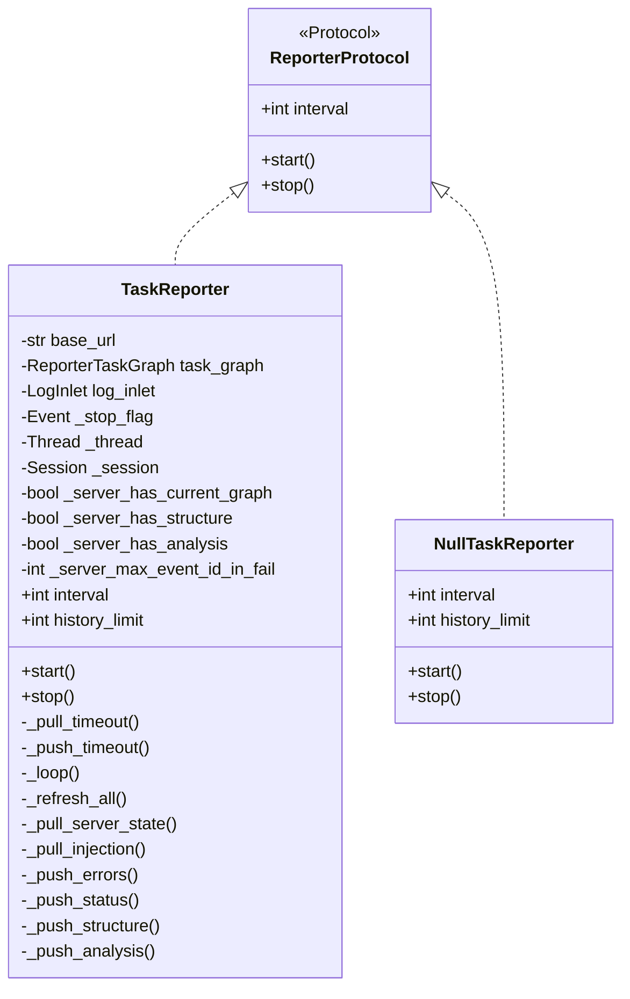
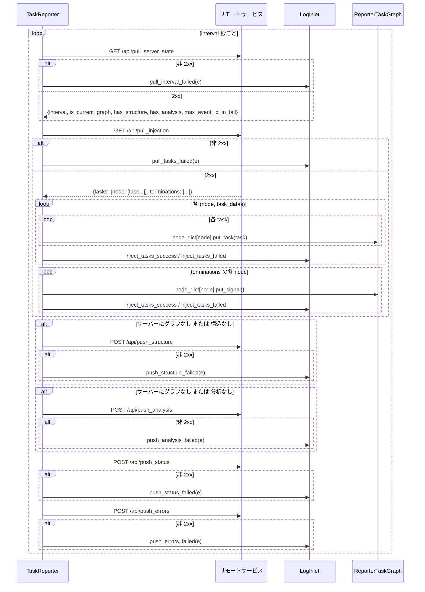

# observability/core_report.py

> 📅 最終更新日: 2026/09/10

`core_report.py` は `celestialflow-web` サービスと通信するレポーターコンポーネントを実装します。バックグラウンドスレッドにより、タスクグラフの構造・状態・エラー情報などを定期的に遠端へプッシュすると同時に、遠端から注入する必要のあるタスクと終了シグナルをプルし、実行中のタスクグラフへ動的に書き込みます。本ファイルには 3 つの主要型が含まれます:

- `ReporterProtocol`: 依存者が「reporter 起動停止能力を備える」ことを宣言するための最小インターフェースプロトコル。
- `TaskReporter`: HTTP によるプル/プッシュを担う実際のレポーター実装。
- `NullTaskReporter`: レポーターを無効化した際に使用する no-op プレースホルダー。

## モジュール概要


```mermaid
classDiagram
    class ReporterProtocol {
        <<Protocol>>
        +int interval
        +start()
        +stop()
    }
    class TaskReporter {
        -str base_url
        -ReporterTaskGraph task_graph
        -LogInlet log_inlet
        -Event _stop_flag
        -Thread _thread
        -Session _session
        -bool _server_has_current_graph
        -bool _server_has_structure
        -bool _server_has_analysis
        -int _server_max_event_id_in_fail
        +int interval
        +int history_limit
        +start()
        +stop()
        -_pull_timeout()
        -_push_timeout()
        -_loop()
        -_refresh_all()
        -_pull_server_state()
        -_pull_injection()
        -_push_errors()
        -_push_status()
        -_push_structure()
        -_push_analysis()
    }
    class NullTaskReporter {
        +int interval
        +int history_limit
        +start()
        +stop()
    }

    ReporterProtocol <|.. TaskReporter
    ReporterProtocol <|.. NullTaskReporter
```

## `ReporterProtocol`

```python
class ReporterProtocol(Protocol):
    """Reporter 依赖方所需的最小接口。"""

    interval: int

    def start(self) -> None: ...

    def stop(self) -> None: ...
```

`TaskReporter` と `NullTaskReporter` はいずれもこのプロトコルを満たすため、依存者（図層など）は両者を無差別に受け入れることができ、レポーターを有効化しない場合でも `start()` / `stop()` を安全に呼び出せます。

## `TaskReporter`

### 初期化

```python
def __init__(
    self,
    host: str,
    port: int,
    task_graph: ReporterTaskGraph,
) -> None:
    """
    :param host: リモートサービスホストアドレス
    :param port: リモートサービスポート
    :param task_graph: タスクグラフインスタンス（ReporterTaskGraph プロトコルを満たす）
    """
```

初期化後の内部状態:

| フィールド | 型 | 説明 |
|------|------|------|
| `base_url` | `str` | `f"http://{host}:{port}"` |
| `task_graph` | `ReporterTaskGraph` | プロトコル経由で注入されたタスクグラフ |
| `log_inlet` | `LogInlet` | `get_log_inlet()` により取得。全ての失敗/注入結果のレポートに使用 |
| `_stop_flag` | `Event` | バックグラウンドスレッドの終了制御 |
| `_thread` | `Thread | None` | バックグラウンドスレッドの参照 |
| `_session` | `requests.Session` | 再利用される HTTP セッション |
| `_server_has_current_graph` | `bool` | サーバーが現在の `graph_id` を保持しているか |
| `_server_has_structure` | `bool` | サーバーが構造プッシュを受け取ったことがあるか |
| `_server_has_analysis` | `bool` | サーバーが分析プッシュを受け取ったことがあるか |
| `_server_max_event_id_in_fail` | `int | None` | サーバーが把握している最大失敗 `event_id` の水位線 |
| `interval` | `int` | レポート周期（秒）。`_pull_server_state` で動的調整され、範囲は `[1, 60]` |
| `history_limit` | `int` | 履歴スナップショットの保持上限、デフォルト 20 |

### ライフサイクル

```python
reporter.start()  # 停止フラグをクリアし、_loop() を実行するデーモンスレッドを作成
reporter.stop()   # 停止フラグを設定し、join してスレッドを待機（timeout=2）、最後に1度リフレッシュ
```

`start()` は `_stop_flag.clear()` と `Thread(target=self._loop, daemon=True).start()` のみを行います。

`stop()` の詳細:

1. `_thread is None` であれば即リターン（冪等呼び出しを許可）；
2. `_stop_flag.set()` を設定し `join(timeout=2)`；
3. それでもスレッドが終了しない場合は `_session` をクローズし `ReporterError("Reporter thread is still running.")` を送出；
4. 正常終了時は `_thread` を `None` に設定（2 回目の `start()` を許可するため）、最後に `_refresh_all()` を実行して最終プッシュ；
5. `_session` をクローズし `log_inlet.stop_reporter()` で停止ログを記録。

`_loop()` は各ループで `_refresh_all()` を実行し、例外を捕捉して `log_inlet.loop_failed(e)` で記録します。**スレッドは終了しません**。

### タイムアウト計算

```python
def _pull_timeout(self) -> float:
    return max(1.0, min(self.interval * 0.2, 5.0))

def _push_timeout(self) -> float:
    return max(1.0, min(self.interval * 0.2, 3.0))
```

- プルタイムアウトの上限は 5 秒、プッシュタイムアウトの上限は 3 秒；
- どちらも `interval` の 20% を基準とし、下限は 1 秒。過度に短い `interval`（例: 1 秒）でリクエストが直ちにタイムアウトするのを防ぎます。

### `_refresh_all` 実行順序

```python
def _refresh_all(self) -> None:
    try:
        # 1. プル
        self._pull_server_state()  # GET /api/pull_server_state
        self._pull_injection()     # GET /api/pull_injection

        # 2. プッシュ（必要に応じて）
        if (not self._server_has_current_graph) or (not self._server_has_structure):
            self._push_structure()  # POST /api/push_structure
        if (not self._server_has_current_graph) or (not self._server_has_analysis):
            self._push_analysis()   # POST /api/push_analysis
        self._push_status()         # POST /api/push_status
        self._push_errors()         # POST /api/push_errors
    except Exception as e:
        self.log_inlet.loop_failed(e)
```

`_refresh_all` 全体は `try/except` でラップされており、内部の例外はすべて `loop_failed` ログに書き出されるだけで外には伝播しません。これにより、単一回の失敗でバックグラウンドループが終了することを防ぎます。

## API インタラクション

Reporter は HTTP により `celestialflow-web` サービスの以下のエンドポイントと通信します:

### プルインターフェース（Pull）

| メソッド | エンドポイント | 説明 |
|------|------|------|
| `GET` | `/api/pull_server_state?graph_id=...` | 同期判定状態（interval、`is_current_graph`、構造/分析の有無、失敗レコードの最大 event_id など）を取得 |
| `GET` | `/api/pull_injection` | 本ラウンドで注入するタスクリストと終了シグナル対象ノードを取得 |

### プッシュインターフェース（Push）

| メソッド | エンドポイント | 説明 |
|------|------|------|
| `POST` | `/api/push_errors` | エラー（失敗レコード）をプッシュ |
| `POST` | `/api/push_status` | ランタイム状態スナップショットをプッシュ |
| `POST` | `/api/push_structure` | グラフ構造（ノード/エッジ/ソースノード）をプッシュ |
| `POST` | `/api/push_analysis` | グラフ分析データをプッシュ |

### 非 2xx レスポンス処理

> ⚠️ **重要な挙動**: すべての `GET` / `POST` リクエストはレスポンス取得後、**必ず** `res.ok` を確認する必要があります。`res.ok` が `False` の場合は直ちに `ReporterError("...: {status_code}")` を送出し、対応する `_pull_*` / `_push_*` メソッドの外側 `except` ブロックで `pull_*_failed` / `push_*_failed` ログに記録してください。**4xx / 5xx レスポンスをサイレントに通すことは禁止** されています。

## `_pull_server_state`

```python
GET /api/pull_server_state?graph_id={graph_id}
```

リモート側の同期状態を読み取り、以下を更新します:

- `interval`（範囲 `[1, 60]`）；
- `_server_has_current_graph` / `_server_has_structure` / `_server_has_analysis`；
- `_server_max_event_id_in_fail`（値がない場合は `None`）。

失敗時は `log_inlet.pull_interval_failed(e)` で記録され、後続のプッシュには影響しません。

## `_pull_injection`（分離プロトコル）

```python
GET /api/pull_injection
```

返されるペイロードの構造:

```json
{
  "tasks": {
    "NodeA": [task1, task2, task3],
    "NodeB": [...]
  },
  "terminations": ["NodeA", "NodeC"]
}
```

> プロトコル特徴: **タスクリスト** と **終了シグナルノードリスト** は互いに素で、並行に配信されます；同一ノードが両方のフィールドに現れることもあります。処理順序は「先にタスク、後に終了シグナル」で固定されています。

注入ロジック:

```python
injection_payload: dict[str, Any] = res.json()

# 1. タスク注入：同一ノードの task_datas を 1 件ずつ走査
for target_node, task_datas in injection_payload.get("tasks", {}).items():
    try:
        node = self.task_graph.node_dict[target_node]
        for task in task_datas:
            node.put_task(task)                  # 1 件ずつエンキュー
        self.log_inlet.inject_tasks_success(target_node, task_datas)
    except Exception as e:
        self.log_inlet.inject_tasks_failed(target_node, task_datas, e)

# 2. 終了シグナル注入
for target_node in injection_payload.get("terminations", []):
    try:
        node = self.task_graph.node_dict[target_node]
        node.put_signal()
        self.log_inlet.inject_tasks_success(target_node, [TERMINATION_SIGNAL])
    except Exception as e:
        self.log_inlet.inject_tasks_failed(target_node, [TERMINATION_SIGNAL], e)
```

> ⚠️ **1 件ずつのエンキューはプロトコルの必須要件**: `for task in task_datas: node.put_task(task)` のように `put_task` を 1 件ずつ呼び出す必要があります。`task_datas` リストをそのまま単一タスクとして注入すると、`BaseTaskNode` のエンキューセマンティクスが破壊され、予期しない下流挙動が発生します。リグレッションテストは `tests/observability/test_reporter.py::test_reporter_accepts_split_task_and_termination_payload` を参照。

ペイロード解析失敗（非 2xx / JSON 異常）は `log_inlet.pull_tasks_failed(e)` で記録され、**後続のプッシュは中断されません**。

## `_push_errors`（増分プッシュ）

lifecycle SQLite 内の失敗レコードを読み取ってプッシュ:

- `not self._server_has_current_graph` または `_server_max_event_id_in_fail is None` の場合、全件 `load_records(db_path=lifecycle_path)`；
- それ以外の場合は増分で `load_records_after_event_id_in_fail(lifecycle_path, self._server_max_event_id_in_fail)` を呼び出し、サーバー水位線より厳密に大きい `event_id` の失敗レコードのみをプッシュ。

プッシュペイロード:

```python
{
    "graph_id": graph_id,
    "errors": all_errors,
}
```

非 2xx レスポンス → `ReporterError` → `log_inlet.push_errors_failed(e)`。

## `_push_status`

```python
status_dict, now = self.task_graph.collect_runtime_snapshot()

payload = {
    "graph_id": self.task_graph.get_graph_id(),
    "status": status_dict,
    "timestamp": now,
}
```

非 2xx レスポンス → `ReporterError` → `log_inlet.push_status_failed(e)`。

## `_push_structure`

`not _server_has_current_graph` または `not _server_has_structure` の場合のみトリガ:

```python
payload = {
    "graph_id": self.task_graph.get_graph_id(),
    "nodes": self.task_graph.get_nodes(),
    "edges": self.task_graph.get_edges(),
    "source_nodes": self.task_graph.get_source_nodes(),
}
```

非 2xx レスポンス → `ReporterError` → `log_inlet.push_structure_failed(e)`。

## `_push_analysis`

`not _server_has_current_graph` または `not _server_has_analysis` の場合のみトリガ:

```python
analysis = self.task_graph.get_graph_analysis()
payload = {
    "graph_id": self.task_graph.get_graph_id(),
    "analysis": analysis,
}
```

非 2xx レスポンス → `ReporterError` → `log_inlet.push_analysis_failed(e)`。

## 重要なデータフロー


```mermaid
sequenceDiagram
    participant R as TaskReporter
    participant S as リモートサービス
    participant L as LogInlet
    participant G as ReporterTaskGraph

    loop interval 秒ごと
        R->>S: GET /api/pull_server_state
        alt 非 2xx
            R->>L: pull_interval_failed(e)
        else 2xx
            S-->>R: {interval, is_current_graph, has_structure, has_analysis, max_event_id_in_fail}
        end

        R->>S: GET /api/pull_injection
        alt 非 2xx
            R->>L: pull_tasks_failed(e)
        else 2xx
            S-->>R: {tasks: {node: [task...]}, terminations: [...]}
            loop 各 (node, task_datas)
                loop 各 task
                    R->>G: node_dict[node].put_task(task)
                end
                R->>L: inject_tasks_success / inject_tasks_failed
            end
            loop terminations の各 node
                R->>G: node_dict[node].put_signal()
                R->>L: inject_tasks_success / inject_tasks_failed
            end
        end

        alt サーバーにグラフなし または 構造なし
            R->>S: POST /api/push_structure
            alt 非 2xx
                R->>L: push_structure_failed(e)
            end
        end
        alt サーバーにグラフなし または 分析なし
            R->>S: POST /api/push_analysis
            alt 非 2xx
                R->>L: push_analysis_failed(e)
            end
        end

        R->>S: POST /api/push_status
        alt 非 2xx
            R->>L: push_status_failed(e)
        end
        R->>S: POST /api/push_errors
        alt 非 2xx
            R->>L: push_errors_failed(e)
        end
    end
```

## ログ接続（`LogInlet` インターフェース）

`TaskReporter` は `LogInlet` の以下のメソッドのみに依存します（詳細は `celestialflow.persistence.core_log` を参照）:

| 呼び出し | トリガーシーン |
|------|---------|
| `inject_tasks_success(node, task_datas)` | タスクまたは終了シグナルの注入成功（`[TERMINATION_SIGNAL]` 単一要素も含む） |
| `inject_tasks_failed(node, task_datas, error)` | ノードが存在しない、または注入処理中の例外 |
| `pull_tasks_failed(error)` | `/api/pull_injection` の非 2xx / JSON 解析失敗 |
| `pull_interval_failed(error)` | `/api/pull_server_state` の失敗 |
| `push_errors_failed(error)` | `/api/push_errors` の非 2xx / ペイロード構築失敗 |
| `push_status_failed(error)` | `/api/push_status` の失敗 |
| `push_structure_failed(error)` | `/api/push_structure` の失敗 |
| `push_analysis_failed(error)` | `/api/push_analysis` の失敗 |
| `loop_failed(error)` | `_refresh_all` トップレベルでの未捕捉例外（次ループに影響しない） |
| `stop_reporter()` | `stop()` 終了時にレポーター停止を記録 |
| `worker_crash(error)` | スケジューラ worker のクラッシュ（`core_dispatch` からのみ呼び出し） |

> ユニットテストでは `monkeypatch.setattr("celestialflow.observability.core_report.get_log_inlet", lambda: fake)` により fake の `LogInlet` を注入して呼び出しを検証できます。

## `NullTaskReporter`

レポーターを有効化しない場合は `NullTaskReporter` をプレースホルダーとして使用します:

```python
class NullTaskReporter:
    interval: int = 1
    history_limit: int = 20

    def start(self) -> None: ...
    def stop(self) -> None: ...
```

`start()` / `stop()` はどちらも no-op で、**いかなるネットワークリクエストも発生させません**；`ReporterProtocol` も満たすため、依存者は「レポーターを有効化するか否か」で分岐する必要がありません。

## 使用例

```python
from celestialflow.observability import TaskReporter, NullTaskReporter
from celestialflow import TaskGraph, TaskExecutor

graph = TaskGraph("Demo")
executor = TaskExecutor("NodeA", lambda x: x * 2, execution_mode="thread")
graph.set_nodes([executor])

# レポーターを有効化
reporter = TaskReporter(host="127.0.0.1", port=5000, task_graph=graph)
reporter.start()

graph.run({executor.get_name(): list(range(10))})
reporter.stop()

# レポーターを無効化する場合は NullTaskReporter をプレースホルダーとして使用
placeholder: ReporterProtocol = NullTaskReporter()
placeholder.start()
placeholder.stop()
```

## 例外一覧

| 例外 | トリガーシーン |
|------|---------|
| `ReporterError` | `stop()` 終了時にスレッドが 2 秒以内に終了しなかった場合；またはすべての `_pull_*` / `_push_*` が `not res.ok` を検出した場合 |

## 注意事項

1. **1 件ずつのエンキューは必須要件**: `_pull_injection` では `task_datas` の各要素に対して `node.put_task(task)` を 1 件ずつ呼び出す必要があり、リストを単一タスクとして注入することは禁止されています。
2. **非 2xx レスポンスの確認は必須**: すべての `GET` / `POST` リクエストは、レスポンス取得後に `res.ok` を必ず判定し、失敗を対応する `_pull_*_failed` / `_push_*_failed` ログに記録してください。
3. **`stop()` 後は `_thread` を必ず `None` に設定**: 2 回目の `start()` を許可するため。さもないと `Thread` 参照リークにより重複 join が発生します。
4. **`interval` の収束範囲は `[1, 60]`**: 遠端から取得した `interval` は `int(max(1.0, min(float(interval), 60.0)))` にクランプされます。
5. **構造/分析プッシュは必要時のみ**: サーバーが初めて現在のグラフを保持する場合、または対応するフィールドが欠落している場合にのみトリガされ、各ラウンドで重複アップロードしません。
6. **増分エラープッシュは失敗レコードの最大 `event_id` を水位線とする**: クライアント側の `event_id` が単調増加であることが前提です（`LocalEventClient` / `ctree_client` が保証）。
7. **図プロトコルへの依存（具体クラスではない）**: `TaskReporter` は `ReporterTaskGraph` / `ReporterTaskNode` プロトコルによりタスクグラフにアクセスし、`celestialflow.graph` をインポートせずに独立してテストできます。
