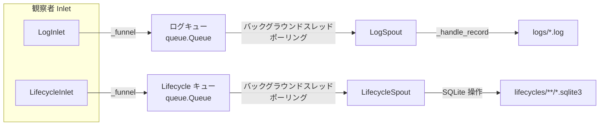

# src/celestialflow/persist/__init__.py

> 📅 最終更新日: 2026/10/09

`persist` モジュールは CelestialFlow の**永続化モジュール**であり、タスクライフサイクル（Lifecycle）と実行ログ（Log）の記録・書き込み・検索機能を提供します。`LifecycleInlet` / `LogInlet` はオブザーバーとしてタスクイベントを消費してキューへ書き込み、`LifecycleSpout` / `LogSpout` はバックグラウンドスレッドでキューからレコードを取り出してディスクへ書き込みます。

## エクスポートシンボル

モジュールレベルの `__all__` は以下の通り完全にエクスポートします：

```python
__all__ = [
    "LifecycleInlet",
    "LifecycleSpout",
    "LogInlet",
    "LogSpout",
]
```

| エクスポートシンボル | ソースモジュール | 説明 |
|---------|---------|------|
| `LifecycleSpout` | `core_lifecycle` | ライフサイクル記録リスナー。タスクライフサイクルを SQLite データベースへ書き込み |
| `LifecycleInlet` | `core_lifecycle` | オブザーバーとしてタスクイベントを消費し、ライフサイクル操作をキューへ書き込む（spout をバインド） |
| `LogSpout` | `core_log` | ログ監視スレッド。ログを `logs/` ディレクトリのテキストファイルへ書き込み |
| `LogInlet` | `core_log` | オブザーバーとしてイベントを消費し、ログメッセージをキューへ書き込む（spout をバインド） |

> モジュールの `__init__` は `core_*` ファイルのシンボルのみをエクスポートします。ツール関数 `util_payload` / `util_sqlite` / `util_render` はここではエクスポートされず、必要に応じて対応するモジュールからインポートします。

## ファイル説明

1. **core_lifecycle.py**（`LifecycleSpout`, `LifecycleInlet`）
   - **役割**: タスクライフサイクルの永続化。タスクの pending / success / failed / skipped 状態とリトライ情報を統一的に記録。
   - **書き込み方式**: `LifecycleInlet` は `BaseInlet, Observer` を継承し、`on_task_*` イベントコールバックをオーバーライドしてライフサイクル操作辞書をキューへ入れます；`LifecycleSpout` は `BaseSpout` を継承し、バックグラウンドスレッドで `__op__` に応じて対応する SQLite 書き込み操作を実行します。
   - **ストレージ形式**: SQLite データベース（WAL モード）、ファイルは `lifecycles/` ディレクトリに配置。

2. **core_log.py**（`LogSpout`, `LogInlet`）
   - **役割**: 実行ログの収集と永続化。
   - **書き込み方式**: `LogInlet` は `BaseInlet, Observer` を継承し、すべてのイベントコールバック（グラフ / ノード / タスク / 終了シグナル / ワーカークラッシュ）をオーバーライドしてログを記録し、`metrics_view` に基づいてノード集計を書き込みます；`LogSpout` は `BaseSpout` を継承し、ログを `logs/` ディレクトリ下のテキストファイルへ書き込みます。
   - **ログ形式**: 各行に `timestamp level message` を含みます。

3. **util_payload.py**
   - **役割**: タスクデータを再帰的に JSON フレンドリーな永続化構造へ変換。
   - **主要関数**: `to_persisted_payload(task)` —— 基本型はそのまま透過、コンテナは再帰、それ以外の型は `str()` に低下。

4. **util_sqlite.py**
   - **役割**: SQLite データベースの接続管理とレコード CRUD 操作ツール。
   - **主要関数**: `connect_db`、`insert_record`、`promote_record_to_{success,skipped,failed}_by_event_id`、`update_retry_by_event_id`、`load_records`、`query_records`、`load_task_{error,result}_records` など。

5. **util_render.py**
   - **役割**: グラフ構造のレンダリングツール。ノード / 辺 / ソースノードを枠付きのツリー型テキストへレンダリング。
   - **主要関数**: `render_structure_list(nodes, edges, source_nodes)`。

## モジュール連携

### 内部連携
- `LifecycleInlet` / `LogInlet` は `funnel.BaseInlet` と `observer.Observer` を継承し、`_funnel()` でレコードを spout キューへ書き込みます。
- `LifecycleSpout` / `LogSpout` は `funnel.BaseSpout` を継承し、キューを消費してディスクへ書き込みます。

### 外部連携
- **Observer モジュールとの連携**: `LifecycleInlet` / `LogInlet` は `Observer` のサブクラスで、`ObserverHub` に登録され、`run_graph_resources` / `run_node_resources`（`assembly/core_run.py`）で組み立てられます。
- **Runtime モジュールとの連携**: `LogInlet` は `runtime.util_constant.LEVEL_DICT` を参照してレベルフィルタリングを行い、`runtime.util_types.MetricsView` を参照してノード集計を読み取ります。
- **Funnel モジュールとの連携**: `BaseInlet` / `BaseSpout` 基底クラスを再利用して、スレッドセーフなキューと消費スレッドを実現します。

## アーキテクチャ特性

### プロデューサー・コンシューマーパターン



### ファイル名の規則

| 永続化タイプ | ファイルパスパターン |
|-----------|-------------|
| ログ | `logs/flow_log({日付}).log` |
| ライフサイクル | `./lifecycles/{日付}/flow_lifecycle({時刻}).sqlite3` |

### バッチフラッシュ戦略

- ログファイルは**行バッファリング**方式（`buffering=1`）で書き込まれ、読み取り側は新規ログを速やかに確認できます。
- Lifecycle SQLite 書き込みは**即時 commit** を採用：`LifecycleSpout._handle_record()` は実際の操作でレコードを変更した直後に `commit()` し、`_after_stop()` でもう一度 `commit()` でフォールバックします。
- グローバル spout は単一のエグゼキュータの起動停止に追随せず、`run_graph_resources` / `run_node_resources`（または `TaskGraph.run()` 内部）が実行期間全体を通じて起動と停止を一元管理し、ファイルハンドルの頻繁な開閉を避けます。

## 使用例

### オブザーバーハブへの組み立て

```python
from celestialflow.observer import ObserverHub, MetricsObserver
from celestialflow.persist import LifecycleInlet, LifecycleSpout, LogInlet, LogSpout

metrics_view = MetricsObserver()
hub = ObserverHub()
hub.add_observer(metrics_view)

lifecycle_spout = LifecycleSpout()
log_spout = LogSpout()
hub.add_observer(LifecycleInlet().bind_spout(lifecycle_spout))
hub.add_observer(LogInlet(metrics_view, "INFO").bind_spout(log_spout))

lifecycle_spout.start()
log_spout.start()
# ... タスクグラフを実行 ...
log_spout.stop()
lifecycle_spout.stop()
```

## 注意事項

1. **オブザーバーがイベントを消費**：`LifecycleInlet` / `LogInlet` は `task_input` / `task_success` などの手動呼び出しメソッドを提供せず、対応するオブザーバーコールバック（`on_task_*` / `on_graph_*` など）で記録します。
2. **コンストラクタ引数**：`LogInlet` は構築時に `metrics_view`（`MetricsView`）と省略可能な `log_level`（デフォルト `"INFO"`）を渡す必要があります。
3. **`__all__` はコアクラスのみ**：ツール関数は `util_*` ファイルにあり、必要に応じて `celestialflow.persist.util_xxx` からインポートします。