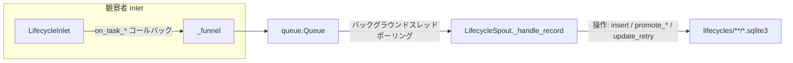

# src/celestialflow/persist/core_lifecycle.py

> 📅 最終更新日: 2026/10/09

`persist/core_lifecycle.py` はタスクライフサイクル（Lifecycle）の永続化を担当します：タスクのライフサイクル全体における状態変化（pending → success / failed / skipped、およびリトライ回数の更新）を記録し、データを `lifecycles/` ディレクトリ下の SQLite データベースファイルへ書き込みます。中核コンポーネントは `LifecycleSpout` と `LifecycleInlet` です。

## アーキテクチャ設計

### データフロー



システムは **プロデューサー-コンシューマー** パターンを採用しています：

1. **LifecycleInlet (プロデューサー + オブザーバー)**：`BaseInlet, Observer` を継承し、`on_task_*` イベントコールバックでタスクライフサイクルイベントを操作辞書にカプセル化して、`_funnel()` でスレッドセーフなキューに入れます。
2. **LifecycleSpout (コンシューマー)**：`BaseSpout` を継承し、独立したバックグラウンドスレッドで動作し、キューを継続的に監視して、操作タイプ（`__op__`）に応じて対応する SQLite 書き込み操作を実行します。

## LifecycleSpout

`LifecycleSpout` は `BaseSpout` を継承し、SQLite データベースファイルの作成と書き込みを管理します。

### 初期化と起動

```python
class LifecycleSpout(BaseSpout):
    def __init__(self) -> None:
        """ライフサイクル記録リスナーを初期化します。"""

    self.db_path: Path | None = None
```

起動後（`_before_start()`）、`./lifecycles/{date}/` ディレクトリ下に `flow_lifecycle({time}).sqlite3` ファイルを作成し、sqlite 接続を確立します：

```python
from celestialflow.persist import LifecycleSpout

lifecycle_spout = LifecycleSpout()
lifecycle_spout.start()
print(lifecycle_spout.db_path)  # ./lifecycles/2026-10-09/flow_lifecycle(....).sqlite3
```

`_after_stop()` はまず `commit()` を実行してから接続を閉じ、残存するトランザクションの永続化を確実にします。

### _handle_record の操作タイプ

`LifecycleSpout._handle_record` は `record["__op__"]` に応じて異なる SQLite 操作を実行します：

| 操作 | トリガーコールバック | 説明 |
|------|---------|------|
| `insert` | `LifecycleInlet.on_task_input()` | 新規タスクが node に入り、`pending` レコードを書き込む |
| `promote_success` | `LifecycleInlet.on_task_success()` | pending を `success` に昇格させ、結果 JSON を書き込む |
| `promote_failed` | `LifecycleInlet.on_task_fail()` | pending を `failed` に昇格させ、エラーイベント ID に切り替えてエラータイプとメッセージを書き込む |
| `promote_skipped` | `LifecycleInlet.on_task_skip()` | pending を `skipped` に昇格させ、スキップイベント ID に切り替える |
| `update_retry` | `LifecycleInlet.on_task_retry()` | `pending` 状態を保ち、`retry_times` と直近の失敗のエラータイプ / メッセージのみを更新 |

操作が実際にレコードを変更するたびに、直ちに `commit()` が実行されます。未知の `__op__` や接続未初期化は例外を送出します。

### ファイルパス

Lifecycle データはデフォルトで `./lifecycles/` ディレクトリ下に保存され、日付ごとにアーカイブされます：

```text
./lifecycles/
└── 2026-10-09/
    └── flow_lifecycle(14-30-05-123).sqlite3
```

## LifecycleInlet

`LifecycleInlet` は `BaseInlet, Observer` を継承し、オブザーバーとしてタスクイベントを消費するスレッドセーフな書き込みラッパーです。ライフサイクルレコードを生成するタスクイベントのコールバックのみをオーバーライドし、それ以外のイベントは `Observer` のデフォルトの空実装をそのまま使用します。

### イベントコールバック

```python
class LifecycleInlet(BaseInlet, Observer):
    def on_task_input(self, event: TaskInputEvent) -> None:
        """タスクが or の node に入ったことを示す pending レコードを書き込む。"""

    def on_task_success(self, event: TaskSuccessEvent) -> None:
        """正常に処理されたタスクに対応する pending レコードを success に昇格させ、結果を書き込む。"""

    def on_task_fail(self, event: TaskFailEvent) -> None:
        """pending レコードを failed に昇格させ、最終的な error_id をバインドする。"""

    def on_task_skip(self, event: TaskSkipEvent) -> None:
        """タスクがスキップされ実行されなかったことを示す pending レコードを skipped に昇格させる。"""

    def on_task_retry(self, event: TaskRetryEvent) -> None:
        """pending レコードのリトライ回数と直近の失敗のエラー情報を更新する。"""
```

説明：

- `on_task_input` 内のタスクは `to_persisted_payload()` で JSON フレンドリーな構造にシリアライズされ、`task_json` フィールドに格納されます。
- `on_task_fail` は `error_type`（例外クラス名）と `error_message`（`str(error)`）を併せて永続化し、`error_id` に切り替えます。
- `on_task_retry` は `retry_times` と直近のエラー情報のみを更新し、レコードは `pending` 状態のまま保持され、最終的には `on_task_success` / `on_task_fail` によって昇格されます。
- `LifecycleInlet` はキューへの書き込みのみを行い、データベースを直接操作しません。すべての I/O は `LifecycleSpout` のバックグラウンドスレッドで実行されます。

### spout のバインド

```python
lifecycle_inlet = LifecycleInlet().bind_spout(lifecycle_spout)
```

`bind_spout()` は `BaseInlet` から来ており、inlet と spout を関連付け、以後 `_funnel()` がレコードを spout の消費キューへ書き込むようにします。

## 使用例

```python
from celestialflow.observer import ObserverHub, TaskInputEvent
from celestialflow.persist import LifecycleInlet, LifecycleSpout

lifecycle_spout = LifecycleSpout()
lifecycle_spout.start()

lifecycle_inlet = LifecycleInlet().bind_spout(lifecycle_spout)

# オブザーバーとして hub に登録し、タスクイベントを消費する
hub = ObserverHub()
hub.add_observer(lifecycle_inlet)

# ノードがタスクイベントを生成するのをシミュレート（実際にはノードが実行時に発行）
hub.on_task_input(
    TaskInputEvent(node="StageA", task="hello", task_repr="hello", input_id=1)
)

lifecycle_spout.stop()
```

実際の使用では、`LifecycleInlet` は通常 `assembly/core_run.py` で組み立てられ、タスクグラフの実行中にタスクライフサイクルを永続化します。永続化されたレコードの読み取りには `util_sqlite` の `load_records` / `load_task_error_records` / `load_task_result_records` などの関数を使用してください。

## 注意事項

1. **SQLite ストレージ**：WAL モード + `check_same_thread=False` を使用し、スレッドを跨いだ読み書きをサポートします（`util_sqlite.connect_db` を参照）。
2. **即時 commit**：書き込み操作が実際にレコードを変更するたびに直ちに commit が行われ、データの損失を防ぎます。
3. **Inlet はキューへの書き込みのみ**：データベースを直接操作せず、すべての I/O は `LifecycleSpout` のバックグラウンドスレッドで実行されます。
4. **オブザーバーコールバック駆動**：本クラスは `task_input` / `task_success` などの手動呼び出しメソッドを提供せず、`on_*` イベントコールバックを通じてライフサイクルを消費します。