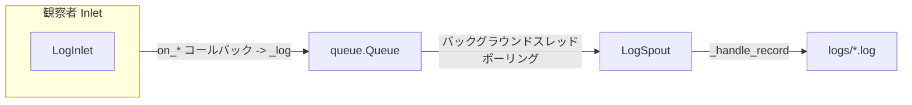

# src/celestialflow/persist/core_log.py

> 📅 最終更新日: 2026/10/09

`persist/core_log.py` モジュールは、スレッドセーフなログシステムを提供します。プロデューサー・コンシューマーパターンにより、ログを統一的に収集・フォーマットし、`logs/` ディレクトリ配下のテキストファイルに永続化します。中核コンポーネントは `LogSpout` と `LogInlet` です。

## アーキテクチャ設計

### データフロー

ログシステムはプロデューサー・コンシューマーパターンを採用しています。完全なデータフローは以下の通りです：



### ログレベルフィルタリング

`LogInlet._log()` メソッドはキューに書き込む前にレベルフィルタリングを行います：レベルは `LEVEL_DICT` 内の既知レベルで、かつ `log_level` 閾値以上である必要があり、それ以外は破棄されます。

### オブザーバーパターン

`LogInlet` は `BaseInlet, Observer` を継承し、ログシステムをイベントバスに接続します：

1. **LogInlet (プロデューサー + オブザーバー)**：
   - すべてのイベントコールバック（グラフ / ノード / タスク / 終了シグナル / ワーカークラッシュ）をオーバーライドし、コールバック内で `_log()` を呼び出して対応するログを記録します。
   - ノードの起動停止を記録する際、`metrics_view` を介してノード集計（入力総数、成功 / 失敗 / スキップ数など）を読み取ります。
   - ログレベルに基づくフィルタリングをサポートし、不要な通信を削減します。

2. **LogSpout (コンシューマー)**：
   - `BaseSpout` を継承し、独立したバックグラウンドスレッドで動作します。
   - キューからログレコードを取り出し、ファイルへ書き込みます。

## ログレベル

システムは以下の標準ログレベルをサポートします（数値が大きいほど優先度が高い、`runtime.util_constant.LEVEL_DICT` を参照）：

| レベル | 値 | 説明 |
|------|----|------|
| TRACE | 0 | 最も詳細なトレース情報。終了シグナルのマージなど |
| DEBUG | 10 | デバッグ情報。タスク入力、終了シグナル入力など |
| SUCCESS | 20 | 重要な操作の成功。タスク完了など |
| INFO | 30 | 一般情報。ノード / グラフの起動停止、グラフ構造の出力など |
| WARNING | 40 | 警告情報。タスクリトライなど |
| ERROR | 50 | エラー情報。タスク失敗など |
| CRITICAL | 60 | 重大エラー。ノード / ワーカークラッシュなど |

## LogSpout

`LogSpout` は `BaseSpout` を継承し、ログファイルの設定と書き込みスレッドの管理を担当します。

### 初期化

```python
spout = LogSpout()
spout.start()
```

起動後、ログは `logs/flow_log({date}).log` ファイルに書き込まれ、行バッファリング（`buffering=1`）方式で開かれるため、読み取り側が新規ログを速やかに確認できます。

### ファイルパス

```text
logs/
└── flow_log(2026-10-09).log
```

## LogInlet

`LogInlet` は `BaseInlet, Observer` を継承し、オブザーバーとしてすべてのイベントを消費し、ログをキュー経由で spout に渡してディスクへ書き込みます。

### 初期化

```python
inlet = LogInlet(metrics_view, log_level="INFO").bind_spout(log_spout)
```

- `metrics_view`: 指標の読み取り専用ビュー（`MetricsView`）。ノードの起動停止時にノード集計を記録するために使用します。
- `log_level`: 最低ログレベル。このレベル未満のログは記録されません；不正なレベルは `InvalidOptionError` を送出します。

### イベントコールバックとログレベル

すべてのメソッドはイベントドメイン別に以下のように分類されます：

#### タスクグラフ (Graph)

| コールバック | ログレベル | 説明 |
|------|---------|------|
| `on_graph_start(event)` | INFO | タスクグラフの起動と構造情報を記録（`util_render` でレンダリング） |
| `on_graph_end(event)` | INFO | タスクグラフの終了と経過時間を記録 |

#### ノード (Node)

| コールバック | ログレベル | 説明 |
|------|---------|------|
| `on_node_start(event)` | INFO | ノード起動を記録し、実行するタスク数と実行モードを出力 |
| `on_node_end(event)` | INFO | ノード終了を記録し、成功 / 失敗 / スキップ数と経過時間を出力 |

#### ワーカースレッド (Worker)

| コールバック | ログレベル | 説明 |
|------|---------|------|
| `on_worker_crash(event)` | CRITICAL | ワーカークラッシュを記録 |

#### タスク (Task)

| コールバック | ログレベル | 説明 |
|------|---------|------|
| `on_task_input(event)` | DEBUG | タスクが入力キューに入ったこととソースを記録 |
| `on_task_success(event)` | SUCCESS | タスク成功完了を記録 |
| `on_task_skip(event)` | SUCCESS | タスクがスキップされたことを記録 |
| `on_task_retry(event)` | WARNING | タスク失敗だがリトライがトリガーされたことを記録 |
| `on_task_fail(event)` | ERROR | タスク失敗かつリトライ不可能を記録 |

> 分割（Split）とルーティング（Router）には専用のログがなくなりました：`TaskSplitter` / `TaskRouter` の入力配分は一律 `on_task_input`、成功は一律 `on_task_success` を通ります。

#### 終了シグナル (Termination)

| コールバック | ログレベル | 説明 |
|------|---------|------|
| `on_termination_input(event)` | DEBUG | 終了シグナル入力を記録 |
| `on_termination_merge(event)` | TRACE | 終了シグナルマージを記録 |

### 使用例

```python
from celestialflow.persist import LogSpout, LogInlet
from celestialflow.observer import MetricsObserver

metrics_view = MetricsObserver()
log_spout = LogSpout()
log_spout.start()

inlet = LogInlet(metrics_view, log_level="INFO").bind_spout(log_spout)
# inlet をノードの ObserverHub に登録し、イベントを消費してログを記録
# hub.on_node_start(NodeStartEvent(node="NodeA", ...)) -> ログへ書き込み

log_spout.stop()
```

オブザーバーコールバック（汎用の `info()` / `debug()` ではなく）でログを記録することで、生成されるログが構造化され、読みやすく、機械解析が容易であることを保証します。

## 注意事項

1. **コンストラクタに `metrics_view` が必要**：`LogInlet(metrics_view, log_level)` は指標の読み取り専用ビューを渡す必要があり、ノード起動停止時の集計出力に使用されます。
2. **オブザーバーコールバック駆動**：`task_input` / `node_start` などの手動呼び出しメソッドは提供されず、`on_*` イベントコールバックを通じてログを記録します。
3. **行バッファリング書き込み**：ログファイルは `buffering=1` で開かれ、書き込み後すぐに確認できます。