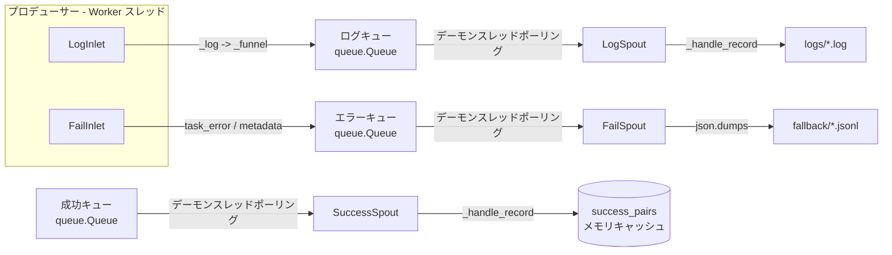

# Persistence モジュール

> 📅 最終更新日: 2026/06/11

Persistence モジュールは CelestialFlow のデータ永続化機能を提供し、実行ログの記録、エラー情報の保存、成功結果のキャッシュを含みます。タスク実行の重要なデータを確実に保存・取得できるようにします。

## エクスポートシンボル

| エクスポートシンボル | ソースモジュール | 説明 |
|---------|---------|------|
| `FailSpout` | `core_fail` | 失敗レコードリスナー。エラー情報を fallback ディレクトリの JSONL ファイルに書き込み |
| `FailInlet` | `core_fail` | スレッドセーフな失敗レコードコレクター。キューを通じてエラーを `FailSpout` に送信して書き込み |
| `LogSpout` | `core_log` | ログ監視スレッド。ログを `logs/` ディレクトリのテキストファイルに書き込み |
| `LogInlet` | `core_log` | スレッドセーフなログコレクター。豊富なセマンティックログメソッドを提供 |
| `SuccessSpout` | `core_success` | 成功結果監視スレッド。成功キューを継続的に読み取り task-result ペアをキャッシュ |

## ファイル説明

### ログ永続化

1. **core_log.py** (`LogSpout`, `LogInlet`)
   - **役割**: ログ記録と保存の基盤アーキテクチャ
   - **コアコンポーネント**:
     - `LogSpout`: ログ監視スレッド。キューからログメッセージを受信し `logs/` ディレクトリのテキストファイルに書き込み
     - `LogInlet`: スレッドセーフなログコレクター。セマンティックログメソッドを提供（タスク成功/失敗/リトライ、ステージ起動/停止、キュー操作など）
   - **ログ形式**: プレーンテキスト形式。各行に `timestamp level message` を含む

### エラー永続化

2. **core_fail.py** (`FailSpout`, `FailInlet`)
   - **役割**: エラー情報の記録と保存の基盤アーキテクチャ
   - **コアコンポーネント**:
     - `FailSpout`: 失敗レコードリスナー。キューからエラー情報を受信し `fallback/` ディレクトリの JSONL ファイルに書き込み
     - `FailInlet`: スレッドセーフなエラーコレクター。エラー情報をキュー経由で `FailSpout` に送信して書き込み
   - **エラー形式**: JSONL（JSON Lines）。1 行 1 レコード

### 成功結果永続化

3. **core_success.py** (`SuccessSpout`)
   - **役割**: 成功結果監視スレッド。成功結果キューを継続的に読み取り task-result ペアをキャッシュ
   - **コアコンポーネント**:
     - `SuccessSpout`: `BaseSpout` を継承し、`(task, result)` ペアをキャッシュ

### JSONL ツール

4. **util_jsonl.py**
   - **役割**: JSON Lines 形式サポート。効率的な構造化データの保存と読み取りに使用
   - **主要関数**:
     - `load_jsonl_logs()`: JSONL ファイルからログデータを読み込み。選択的フィールド読み取りと行オフセットをサポート
     - `parse_jsonl_value()`: JSONL フィールド値をスマート解析（`ast.literal_eval` 逆シリアライズをサポート）
     - `load_jsonl_by_key()`: 指定フィールドで JSONL データをグループ化読み込み
     - `load_jsonl_grouped_by_keys()`: 複数フィールドで JSONL データをグループ化読み込み
     - `load_task_by_stage()`: stage ごとにエラーレコードをグループ化読み込み
     - `load_task_by_error()`: error と stage ごとにエラーレコードをグループ化読み込み
     - `load_task_error_pairs()`: エラーレコードを読み込み、`(task, error)` ペアリストを返す


## モジュール連携

### 内部連携
- すべての永続化クラスは `BaseSpout`/`BaseInlet`（Funnel モジュールで定義）を継承
- `LogSpout`/`LogInlet` と `FailSpout`/`FailInlet` はペアで使用
- `SuccessSpout` は単独で使用し、成功結果をキャッシュ

### 外部連携
- **Runtime モジュールとの連携**: ランタイムが生成するログとエラーを監視し、`LEVEL_DICT` を参照
- **Stage モジュールとの連携**: タスク実行状態と結果を記録
- **Observability モジュールとの連携**: 監視と分析のための生データを提供
- **Funnel モジュールとの連携**: `BaseSpout`/`BaseInlet` 基底クラスを継承

## アーキテクチャ特性

### 非同期ノンブロッキング設計
- Spout はバックグラウンドスレッドで実行され、メインフローをブロックしない
- Inlet はキュー経由でデータを送信し、ノンブロッキング書き込み
- バッチフラッシュにより I/O 頻度を削減

### プロデューサー・コンシューマーパターン



### ファイル名規則

| 永続化タイプ | ファイルパスパターン |
|-----------|-------------|
| ログ | `logs/task_logger({日付}).log` |
| エラー | `fallback/{日付}/{ソース}({時刻}).jsonl` |

### バッチフラッシュ戦略

| コンポーネント | フラッシュ閾値 | 説明 |
|------|---------|------|
| `LogSpout` | 5 件ごと | ログ量が多く、閾値を高めに設定 |
| `FailSpout` | 1 件ごと | エラーデータは重要であり、即時フラッシュ |

## 使用例

### 基本設定

```python
from celestialflow.persistence import LogSpout, LogInlet, FailSpout, FailInlet

# ログ永続化を設定
log_spout = LogSpout()
log_spout.start()
log_inlet = LogInlet(log_spout.get_queue(), log_level="SUCCESS")

# エラー永続化を設定
fail_spout = FailSpout(error_source="graph_errors")
fail_spout.start()
fail_inlet = FailInlet(fail_spout.get_queue())
```

### ログ記録

```python
# ステージ起動/停止を記録
log_inlet.start_stage("StageA", "thread", "thread-4")
log_inlet.end_stage("StageA", "thread", "thread-4", 12.5, 100, 2, 0)

# タスクライフサイクルを記録
log_inlet.task_success("func", "task1", "thread", "result", 0.05, 1, 2)
log_inlet.task_error("func", "task2", ValueError("bad"), 3, 4)
```

### エラー記録

```python
fail_inlet.start_graph("my_graph", {"stages": ["A", "B"], "edges": [("A","B")]})
fail_inlet.start_executor("Executor-1")
fail_inlet.task_error("StageA", 1, ValueError("invalid"), task_data)
```

### エラーデータ読み取り

```python
from celestialflow.persistence.util_jsonl import (
    load_jsonl_logs,
    load_task_error_pairs,
    parse_jsonl_value,
)

# エラーログを読み取り
errors = load_jsonl_logs("fallback/2026-01-01/errors(10-00-00-000).jsonl")

# (task, error) ペアを取得
pairs = load_task_error_pairs("fallback/2026-01-01/errors(10-00-00-000).jsonl")

# task 値を解析
task = parse_jsonl_value("[1, 2, 3]")  # (1, 2, 3) を返す
```
