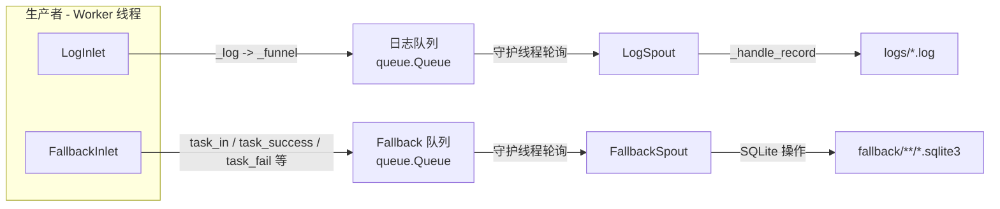

# Persistence モジュール

> 📅 最終更新日: 2026/06/18

Persistence モジュールは CelestialFlow のデータ永続化機能を提供し、実行ログの記録と fallback（フォールバック）永続化を含みます。タスク実行の重要なデータを確実に保存・取得できるようにします。

> ⚠️ **変更あり**：このモジュールは大規模なリファクタリングが行われました。`FailSpout`/`FailInlet` → `FallbackSpout`/`FallbackInlet`、`SuccessSpout` は削除（機能は `FallbackSpout` に統合）、JSONL ファイルストレージ → SQLite データベース。旧ドキュメント `core_fail.md`、`core_success.md`、`util_jsonl.md` は保持されていますが非推奨とマークされています。

## エクスポートシンボル

| エクスポートシンボル | ソースモジュール | 説明 |
|---------|---------|------|
| `FallbackInlet` | `core_fallback` | スレッドセーフな fallback レコードコレクター。キューを通じてタスクライフサイクルイベントを `FallbackSpout` に送信 |
| `FallbackSpout` | `core_fallback` | Fallback レコードリスナー。タスクライフサイクルを SQLite データベースに書き込み |
| `LogInlet` | `core_log` | スレッドセーフなログコレクター。豊富なセマンティックログメソッドを提供 |
| `LogSpout` | `core_log` | ログ監視スレッド。ログを `logs/` ディレクトリのテキストファイルに書き込み |

## ファイル説明

### ログ永続化

1. **core_log.py** (`LogSpout`, `LogInlet`)
   - **役割**: ログ記録と保存の基盤アーキテクチャ
   - **コアコンポーネント**:
     - `LogSpout`: ログ監視スレッド。キューからログメッセージを受信し `logs/` ディレクトリのテキストファイルに書き込み
     - `LogInlet`: スレッドセーフなログコレクター。セマンティックログメソッドを提供（タスク成功/失敗/リトライ、ステージ起動/停止、キュー操作など）
   - **ログ形式**: プレーンテキスト形式。各行に `timestamp level message` を含む

### Fallback 永続化

2. **core_fallback.py** (`FallbackSpout`, `FallbackInlet`)
   - **役割**: タスクライフサイクルのフォールバック永続化。成功と失敗の結果を統一的に処理
   - **コアコンポーネント**:
     - `FallbackSpout`: `BaseSpout` を継承し、SQLite でタスクライフサイクルイベントを永続化
     - `FallbackInlet`: スレッドセーフなコレクター。`task_in`/`task_success`/`task_fail`/`task_retry`/`task_duplicate` メソッドを提供
   - **ストレージ形式**: SQLite データベース（WAL モード）

### データシリアライゼーション

3. **util_payload.py**
   - **役割**: タスクデータを再帰的に JSON フレンドリーな永続化構造に変換
   - **主要関数**: `to_persisted_payload(task)` — 任意の Python オブジェクトを JSON シリアライズ可能な構造に変換

### SQLite ツール

4. **util_sqlite.py**
   - **役割**: SQLite データベースの接続管理と CRUD 操作ツール
   - **主要関数**: `connect_db`、`insert_record`、`load_records`、`query_records`、`load_task_error_records` など

## モジュール連携

### 内部連携
- すべての永続化クラスは `BaseSpout`/`BaseInlet`（Funnel モジュールで定義）を継承
- `FallbackSpout`/`FallbackInlet` と `LogSpout`/`LogInlet` はペアで使用
- `FallbackSpout` は成功と失敗の結果を統一的に処理し、旧版の独立した `SuccessSpout` を置き換え

### 外部連携
- **Runtime モジュールとの連携**: ランタイムが生成するログとエラーを監視し、`LEVEL_DICT` を参照
- **Stage モジュールとの連携**: タスク実行状態と結果を記録
- **Observability モジュールとの連携**: 監視と分析のための生データを提供
- **Funnel モジュールとの連携**: `BaseSpout`/`BaseInlet` 基底クラスを継承

## アーキテクチャ特性

### 非同期ノンブロッキング設計
- Spout はバックグラウンドスレッドで実行され、メインフローをブロックしない
- Inlet はキュー経由でデータを送信し、ノンブロッキング書き込み

### プロデューサー・コンシューマーパターン



### ファイル名規則

| 永続化タイプ | ファイルパスパターン |
|-----------|-------------|
| ログ | `logs/task_logger({日付}).log` |
| Fallback | `fallback/{日付}/{ソース}({時刻}).sqlite3` |

## 使用例

### 基本設定

```python
from celestialflow.persistence import LogSpout, LogInlet, FallbackSpout, FallbackInlet

# ログ永続化を設定
log_spout = LogSpout()
log_spout.start()
log_inlet = LogInlet(log_spout.get_queue(), log_level="SUCCESS")

# fallback 永続化を設定
fallback_spout = FallbackSpout(error_source="graph_errors")
fallback_spout.start()
fallback_inlet = FallbackInlet(fallback_spout.get_queue())
```

### ログ記録

```python
# ステージ起動/停止を記録
log_inlet.start_stage("StageA", "thread", "thread-4")
log_inlet.end_stage("StageA", "thread", "thread-4", 12.5, 100, 2, 0)

# タスクライフサイクルを記録
log_inlet.task_success("func", "task1", "thread", "result", 0.05, 1, 2)
log_inlet.task_fail("func", "task2", ValueError("bad"), 3, 4)
```

### fallback 記録

```python
# タスクが入る
fallback_inlet.task_in("StageA", event_id=1, task="hello")

# タスク成功
fallback_inlet.task_success(event_id=1, result="OK", persist=True)

# タスク失敗
fallback_inlet.task_fail(event_id=2, error_id=10, error=ValueError("bad"))
```

### 永続化データの読み取り

```python
from celestialflow.persistence.util_sqlite import load_records, load_task_error_records

# 失敗レコードを読み取り
errors = load_task_error_records("fallback/2026-06-18/errors.sqlite3", "StageA")
for task, (error_type, error_msg) in errors:
    print(f"{task}: {error_type} - {error_msg}")
```
