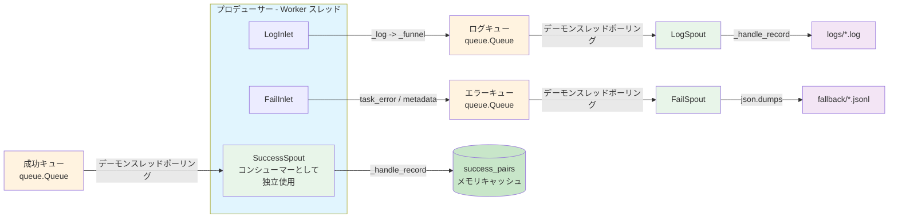

# Persistence モジュール

> 📅 最終更新日: 2026/05/24

Persistence モジュールは CelestialFlow のデータ永続化機能を提供し、実行ログ記録、エラー情報ストレージ、成功結果キャッシュ、設定定数管理を含みます。タスク実行の重要なデータが確実に保存・取得できることを保証します。

## モジュール概要

Persistence モジュールはランタイムデータをローカルファイルシステムに永続化し、ログ記録、エラー追跡、成功結果キャッシュをサポートします。本モジュールはプロデューサー・コンシューマー（Spout/Inlet）パターンを採用し、メインフローのパフォーマンスに影響を与えることなく、タスク実行フローにシームレスに統合されます。

## エクスポート項目

| エクスポートシンボル | ソースモジュール | 説明 |
|---------|---------|------|
| `FailSpout` | `core_fail` | 失敗レコードリスナー。エラー情報を fallback ディレクトリの JSONL ファイルに書き込み |
| `FailInlet` | `core_fail` | スレッドセーフな失敗レコードコレクター。キューを通じてエラーを `FailSpout` に送信して書き込み |
| `LogSpout` | `core_log` | ログ監視スレッド。ログを `logs/` ディレクトリのテキストファイルに書き込み |
| `LogInlet` | `core_log` | スレッドセーフなログコレクター。豊富なセマンティックログメソッドを提供 |
| `SuccessSpout` | `core_success` | 成功結果監視スレッド。成功キューを継続的に読み取り、task-result ペアをキャッシュ |

## ファイル説明

### ログ永続化

1. **core_log.py** (`LogSpout`, `LogInlet`)
   - **役割**: ログ記録とストレージの基盤
   - **コアコンポーネント**:
     - `LogSpout`: ログ監視スレッド。キューからログメッセージを受信し `logs/` ディレクトリ下のテキストファイルに書き込む
     - `LogInlet`: スレッドセーフなログコレクター。セマンティックログメソッドを提供（タスク成功/失敗/リトライ、ステージ起動/停止、キュー操作など）
   - **ログ形式**: プレーンテキスト形式。各行に `timestamp level message` を含む
   - **主要機能**: 非同期書き込み、レベルフィルタリング、豊富なライフサイクルログメソッド

### エラー永続化

2. **core_fail.py** (`FailSpout`, `FailInlet`)
   - **役割**: エラー情報の記録とストレージの基盤
   - **コアコンポーネント**:
     - `FailSpout`: 失敗レコードリスナー。キューからエラー情報を受信し `fallback/` ディレクトリの JSONL ファイルに書き込む
     - `FailInlet`: スレッドセーフなエラーコレクター。エラー情報をキューを通じて `FailSpout` に送信して書き込み
   - **エラー形式**: JSONL（JSON Lines）。`ts`、`error_type`、`error_message`、`error_repr`、`stage`、`task` などのフィールドを含む
   - **主要機能**: JSONL ファイルストレージ、エラーカウンター、メタデータ記録

### 成功結果永続化

3. **core_success.py** (`SuccessSpout`)
   - **役割**: 成功結果監視スレッド。成功結果キューを継続的に読み取り、task-result ペアをキャッシュ
   - **コアコンポーネント**:
     - `SuccessSpout`: `BaseSpout` を継承し、`(task, result)` ペアをキャッシュ
   - **主要機能**: 成功結果キャッシュ、task-result ペア抽出

### データ形式と設定

4. **util_jsonl.py**
   - **役割**: 効率的な構造化データの保存と読み取りのための JSON Lines 形式サポート
   - **主要関数**:
     - `load_jsonl_logs()`: JSONL ファイルからログデータを読み込み、選択的なフィールド読み取りと行オフセットをサポート
     - `parse_jsonl_value()`: JSONL フィールド値をインテリジェントに解析（`ast.literal_eval` デシリアライズをサポート）
     - `load_jsonl_by_key()`: 指定フィールドでグループ化して JSONL データを読み込み
     - `load_jsonl_grouped_by_keys()`: 複数フィールドでグループ化して JSONL データを読み込み
     - `load_task_by_stage()`: stage ごとにグループ化してエラーレコードを読み込み
     - `load_task_by_error()`: error と stage ごとにグループ化してエラーレコードを読み込み
     - `load_task_error_pairs()`: エラーレコードを読み込み、`(task, error)` ペアのリストを返す
   - **使用シーン**: エラーログ読み取り、エラーレコード分析、Web インターフェースのデータ表示

5. **util_constant.py**
   - **役割**: 永続化関連の定数と設定定義
   - **内容**:
     - `LEVEL_DICT`: ログレベル辞書。ログレベルと対応する数値を定義
     - ログレベル: TRACE(0), DEBUG(10), SUCCESS(20), INFO(30), WARNING(40), ERROR(50), CRITICAL(60)
   - **主要機能**: 統一されたログレベル管理、レベル比較、ログフィルタリング

## モジュール関連

### 内部関連
- すべての永続化クラスは `BaseSpout`/`BaseInlet`（Funnel モジュールで定義）を継承
- `LogSpout`/`LogInlet` と `FailSpout`/`FailInlet` はペアで使用
- `SuccessSpout` は独立して使用し、成功結果をキャッシュ
- ユーティリティクラスはコアクラスによって使用され、形式サポートと設定管理を提供

### 外部関連
- **Runtime モジュール**: ランタイムで生成されるログとエラーを監視
- **Stage モジュール**: タスク実行状態と結果を記録
- **Observability モジュール**: 監視と分析のための生データを提供
- **Utils モジュール**: データ処理とフォーマットのためのユーティリティ関数を使用

## アーキテクチャ特性

### 非同期ノンブロッキング設計
- Spout はバックグラウンドスレッドで実行し、メインフローをブロックしない
- Inlet はキューを通じてデータを送信し、ノンブロッキング書き込み
- バッチコミットでストレージ効率を向上

### プロデューサー・コンシューマーパターン



### JSONL 形式（エラー永続化）
- 1行1 JSON レコード。ストリーミング処理に適しています
- フィールド単位の選択的読み取りをサポート
- `ast.literal_eval` デシリアライズに対応

### ファイル名規則

| 永続化タイプ | ファイルパスパターン |
|-----------|-------------|
| ログ | `logs/task_logger({日付}).log` |
| エラー | `fallback/{日付}/{ソース}({時刻}).jsonl` |

## 使用パターン

### 基本設定
```python
from celestialflow.persistence import LogSpout, LogInlet, FailSpout, FailInlet

# ログ永続化の設定
log_spout = LogSpout()
log_spout.start()
log_inlet = LogInlet(log_spout.get_queue())

# エラー永続化の設定
fail_spout = FailSpout(error_source="graph_errors")
fail_spout.start()
fail_inlet = FailInlet(fail_spout.get_queue())
```

### ログ記録
```python
# ステージの起動/停止を記録
log_inlet.start_stage("StageA", "thread", "thread", 4)
log_inlet.end_stage("StageA", "thread", "thread", 12.5, 100, 2, 0)

# タスクライフサイクルを記録
log_inlet.task_success("func", "task1", "thread", "result", 0.05, 1, 2)
log_inlet.task_error("func", "task2", ValueError("bad"), 3, 4)
```

### エラー記録
```python
fail_inlet.start_graph([{"name": "StageA", ...}])
fail_inlet.start_executor("Executor-1")
fail_inlet.task_error("StageA", 1, ValueError("invalid"), task_data)
```

### エラーデータ読み取り
```python
from celestialflow.persistence.util_jsonl import (
    load_jsonl_logs,
    load_task_error_pairs,
    parse_jsonl_value,
)

# エラーログを読み取り
errors = load_jsonl_logs("fallback/2026-01-01/errors(10-00-00-000).jsonl")

# (task, error) ペアを取得
pairs = load_task_error_pairs("fallback/2026-01-01/errors(10-00-00-000).jsonl")

# task 値を解析
task = parse_jsonl_value("[1, 2, 3]")  # (1, 2, 3) を返す
```
