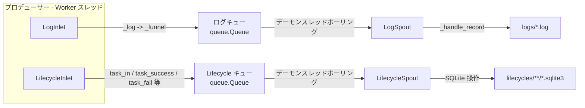

# Persistence モジュール

> 📅 最終更新日: 2026/08/26

Persistence モジュールは CelestialFlow のデータ永続化機能を提供し、タスクライフサイクル（Lifecycle）記録と実行ログ（Log）を含みます。タスク実行の重要なデータを確実に保存・取得できるようにします。

## エクスポートシンボル

| エクスポートシンボル | ソースモジュール | 説明 |
|---------|---------|------|
| `LifecycleInlet` | `core_lifecycle` | スレッドセーフなライフサイクル記録コレクター。キューを通じてタスクライフサイクルイベントを `LifecycleSpout` に送信 |
| `LifecycleSpout` | `core_lifecycle` | ライフサイクル記録リスナー。タスクライフサイクルを SQLite データベースに書き込み |
| `LogInlet` | `core_log` | スレッドセーフなログコレクター。豊富なセマンティックログメソッドを提供 |
| `LogSpout` | `core_log` | ログ監視スレッド。ログを `logs/` ディレクトリのテキストファイルに書き込み |
| `funnel_scope` | `core_scope` | グローバルな LifecycleSpout と LogSpout のライフサイクルを管理するコンテキストマネージャー |
| `get_lifecycle_inlet` | `core_lifecycle` | グローバルで一意な LifecycleInlet インスタンスを取得 |
| `get_lifecycle_spout` | `core_lifecycle` | グローバルで一意な LifecycleSpout インスタンスを取得 |
| `get_log_inlet` | `core_log` | グローバルで一意な LogInlet インスタンスを取得 |
| `get_log_spout` | `core_log` | グローバルで一意な LogSpout インスタンスを取得 |

## ファイル説明

### ライフサイクル永続化

1. **core_lifecycle.py** (`LifecycleSpout`, `LifecycleInlet`)
   - **役割**: タスクライフサイクルの永続化。タスクの pending / success / failed / duplicate 状態を統一的に記録
   - **コアコンポーネント**:
     - `LifecycleSpout`: `BaseSpout` を継承し、SQLite でタスクライフサイクルイベントを永続化
     - `LifecycleInlet`: スレッドセーフなコレクター。`task_in`/`task_success`/`task_fail`/`task_duplicate` メソッドを提供
   - **ストレージ形式**: SQLite データベース（WAL モード）。`lifecycles/` ディレクトリ配下に配置

### ログ永続化

2. **core_log.py** (`LogSpout`, `LogInlet`)
   - **役割**: ログ記録と保存の基盤アーキテクチャ
   - **コアコンポーネント**:
     - `LogSpout`: ログ監視スレッド。キューからログメッセージを受信し `logs/` ディレクトリのテキストファイルに書き込み
     - `LogInlet`: スレッドセーフなログコレクター。セマンティックログメソッドを提供（タスク成功/失敗/リトライ、図/階層の起動停止、レポーターイベントなど）
   - **ログ形式**: プレーンテキスト形式。各行に `timestamp level message` を含む

### スコープ管理

3. **core_scope.py** (`funnel_scope`)
   - **役割**: グローバルな LifecycleSpout と LogSpout のライフサイクルを管理するコンテキストマネージャー
   - **主要機能**: 進入時に 2 つの spout を起動し、退出時に停止・例外収集を行い、`ExceptionGroup` として一律送出

### データシリアライゼーション

4. **util_payload.py**
   - **役割**: タスクデータを再帰的に JSON フレンドリーな永続化構造に変換
   - **主要関数**: `to_persisted_payload(task)` — 任意の Python オブジェクトを JSON シリアライズ可能な構造に変換

### SQLite ツール

5. **util_sqlite.py**
   - **役割**: SQLite データベースの接続管理と CRUD 操作ツール
   - **主要関数**: `connect_db`、`insert_record`、`promote_record_to_*`、`load_records`、`query_records`、`load_task_error_records` など

## モジュール連携

### 内部連携
- すべての永続化クラスは `BaseSpout`/`BaseInlet`（Funnel モジュールで定義）を継承
- `LifecycleSpout`/`LifecycleInlet` と `LogSpout`/`LogInlet` はペアで使用され、`funnel_scope` がその起動停止を一元管理

### 外部連携
- **Runtime モジュールとの連携**: ランタイムが生成するログとエラーを監視し、`LEVEL_DICT` を参照
- **Stage モジュールとの連携**: タスク実行状態と結果を記録。`TaskExecutor` は `get_log_inlet()` / `get_lifecycle_inlet()` を通じて書き込み
- **Observability モジュールとの連携**: 監視と分析のための生データを提供。`TaskReporter` は lifecycle データベースから失敗レコードを読み出し増分プッシュ
- **Funnel モジュールとの連携**: `BaseSpout`/`BaseInlet` 基底クラスを継承

## アーキテクチャ特性

### ノンブロッキング非同期設計
- Spout はバックグラウンドスレッドで実行され、メインフローをブロックしない
- Inlet はキュー経由でデータを送信し、ノンブロッキング書き込み

### プロデューサー・コンシューマーパターン


```mermaid
flowchart LR
    subgraph Producer[プロデューサー - Worker スレッド]
        LogInlet[LogInlet]
        LifecycleInlet[LifecycleInlet]
    end

    LogInlet -->|_log -> _funnel| LogQueue[ログキュー<br/>queue.Queue]
    LifecycleInlet -->|task_in / task_success / task_fail 等| LifecycleQueue[Lifecycle キュー<br/>queue.Queue]

    LogQueue -->|デーモンスレッドポーリング| LogSpout[LogSpout]
    LifecycleQueue -->|デーモンスレッドポーリング| LifecycleSpout[LifecycleSpout]

    LogSpout -->|_handle_record| LogFile[logs/*.log]
    LifecycleSpout -->|SQLite 操作| SQLiteFile[lifecycles/**/*.sqlite3]
```

### ファイル名規則

| 永続化タイプ | ファイルパスパターン |
|-----------|-------------|
| ログ | `logs/flow_log({日付}).log` |
| ライフサイクル | `./lifecycles/{日付}/flow_lifecycle({時刻}).sqlite3` |

### バッチフラッシュ戦略

- ログファイルは**行バッファリング**方式（`buffering=1`）で書き込まれ、読み取り側は明示的なフラッシュ機構なしで新規ログを速やかに確認可能。
- Lifecycle SQLite 書き込みは**即時 commit** を採用：`LifecycleSpout._handle_record()` が操作ごとにレコードを実際に変更した直後に `commit()` し、データを損失させないことを保証。`_after_stop()` で再度 `commit()` を実行してフォールバックとする。
- グローバル spout は単一の実行者起動停止に追随せず、`funnel_scope`（または `TaskGraph.run()` 内部）が実行期間全体を通じて起動停止を一元管理し、ファイルハンドルの頻繁な開閉を避ける。

## 使用例

### 基本設定

```python
from celestialflow.persistence import funnel_scope

# funnel_scope でライフサイクルを一元管理
with funnel_scope():
    # LifecycleSpout と LogSpout は自動起動済み
    # 業務ロジックを実行...
    ...
# スコープ退出時に 2 つの Spout は自動停止
```

### ログ記録

```python
from celestialflow.persistence import get_log_inlet

log_inlet = get_log_inlet()

# 実行者起動停止を記録
log_inlet.start_executor("StageA", 100, "thread")
log_inlet.end_executor("StageA", "thread", 12.5, 98, 2, 0)

# タスクライフサイクルを記録
log_inlet.task_success("func", "task1", "thread", "result", 0.05, 1, 2)
log_inlet.task_fail("func", "task2", ValueError("bad"), 3, 4)
```

### ライフサイクル記録

```python
from celestialflow.persistence import get_lifecycle_inlet

lifecycle_inlet = get_lifecycle_inlet()

# タスクが入る
lifecycle_inlet.task_in("StageA", event_id=1, task="hello")

# タスク成功
lifecycle_inlet.task_success(event_id=1, result="OK")

# タスク失敗
lifecycle_inlet.task_fail(event_id=2, error_id=10, error=ValueError("bad"))
```

### 永続化データの読み取り

```python
from celestialflow.persistence.util_sqlite import load_records, load_task_error_records

# 失敗レコードを読み取り
errors = load_task_error_records(
    "lifecycles/2026-08-26/flow_lifecycle(10-00-00-123).sqlite3", "StageA"
)
for task, (error_type, error_msg) in errors:
    print(f"{task}: {error_type} - {error_msg}")
```
