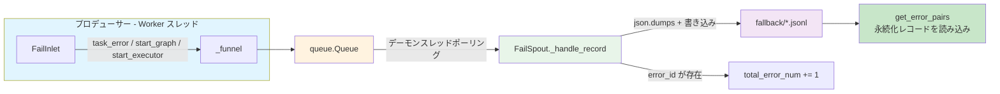
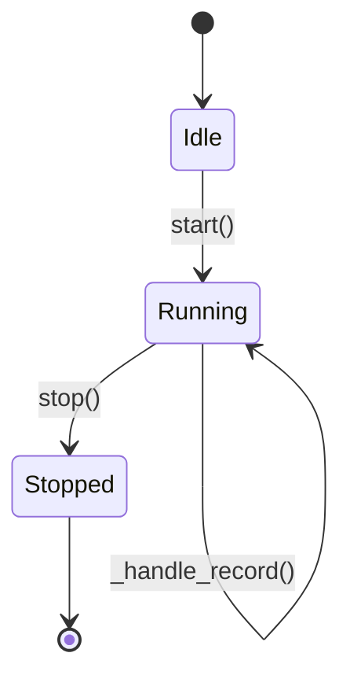

# エラー永続化 (Fail Persistence)

> 📅 最終更新日: 2026/05/28

`celestialflow.persistence` モジュールは堅牢なエラー収集と永続化メカニズムを提供し、マルチプロセス並行タスク実行時にすべての例外情報が安全かつ秩序正しく記録されることを保証します。後続の分析やリトライに使用できます。

コアコンポーネントは `FailSpout` と `FailInlet` です。

## アーキテクチャ設計

### データフロー



システムはエラーログの処理に**プロデューサー・コンシューマー**パターンを採用しています：

1.  **FailInlet（プロデューサー）**:
    -   各 Worker スレッドが保持。
    -   エラー情報とタスクメタデータを辞書にパッケージング。
    -   パッケージングされたデータをスレッドセーフなキュー（`queue.Queue`）に投入。

2.  **FailSpout（コンシューマー）**:
    -   独立したデーモンスレッドで実行。
    -   キューを継続的に監視し、新しいエラーレコードが到着すると即座にローカルファイルに書き込む。
    -   ファイル形式は JSONL（JSON Lines）で、ストリーミング読み取りと処理に便利。

この設計により、複数スレッドがファイル書き込みロックを競合することを回避し、高パフォーマンスとデータ整合性を保証します。

## FailSpout

`FailSpout` はエラーログファイルの作成と書き込みを管理します。

### 初期化と起動

```python
listener = FailSpout(error_source="graph_errors")
listener.start()
```

-   `error_source`: エラーソース識別子。ファイル名の一部として使用。
-   起動後、`./fallback/{date}/` ディレクトリに `{error_source}({time}).jsonl` という名前のファイルが作成されます。

### ライフサイクル



### ファイルパス

エラーログはデフォルトで `./fallback/` ディレクトリに日付別にアーカイブされて保存されます：

```text
./fallback/
└── 2026-05-24/
    └── graph_errors(14-30-05-123).jsonl
```

### リスナーの停止

```python
listener.stop()
```

キューに終了シグナルを送信し、バックグラウンドスレッドが残りのデータの処理を完了するのを待ってから安全に終了します。

### エラーカウンター

`FailSpout` は `total_error_num` カウンターを維持し、`error_id` を持つレコードが書き込まれるたびに自動的にインクリメントします。

## FailInlet

`FailInlet` はエラーキューにデータを送信するインターフェースです。

### タスクエラーの記録

タスクが失敗しリトライできない場合、`TaskExecutor` は `task_error` メソッドを呼び出してエラーを記録します：

```python
sinker.task_error(
    stage_name="MyStage",
    err_id=12345,
    error=ValueError("Invalid input"),
    task=[1, 2, 3]
)
```

記録される JSONL 行には以下のフィールドが含まれます：

| フィールド | 型 | 説明 |
|-----------|------|------|
| `timestamp` | `str` | エラー発生時刻（ISO 形式） |
| `ts` | `float` | エラー発生時刻（Unix タイムスタンプ） |
| `stage` | `str` | エラーが発生したステージ名 |
| `error_id` | `int` | エラーの一意識別子 |
| `error_type` | `str` | 例外タイプ名（例: `ValueError`） |
| `error_message` | `str` | 例外メッセージテキスト |
| `error` | `str` | 完全なエラー表現（`error_type(error_message)`） |
| `error_repr` | `str` | 切り詰められたエラー表現（最大 100 文字） |
| `task_repr` | `str` | 切り詰められたタスクデータ文字列表現（最大 100 文字） |
| `task` | `str` | 元のタスクデータの文字列形式 |

### メタデータの記録

`FailInlet` は起動メタデータの記録もサポートし、当時の実行環境の復元に役立ちます：

#### start_graph

タスクグラフの構造情報を記録します。パラメータ `structure_json` は `list[Any]`（タスクグラフ構造の JSON 表現）です。

```python
sinker.start_graph([
    {"name": "StageA", "depends_on": []},
    {"name": "StageB", "depends_on": ["StageA"]},
])
```

#### start_executor

エグゼキューターの起動情報を記録します。パラメータはエグゼキューター名の文字列です。

```python
sinker.start_executor("Executor-1")
```

## データリカバリ

エラーログは標準の JSONL 形式を使用しているため、これらのファイルを読み取るスクリプトを簡単に作成し、失敗したタスクデータを抽出してリトライや分析に使用できます。フレームワークは `celestialflow.persistence.util_jsonl` モジュールで豊富な読み取り補助関数を提供します。

```python
from celestialflow.persistence.util_jsonl import (
    load_jsonl_logs,        # 汎用 JSONL 読み取り、フィールドフィルタリング対応
    load_task_error_pairs,  # (task, error) ペアの読み込み
    load_task_by_stage,     # stage 別にグループ化
)
```
