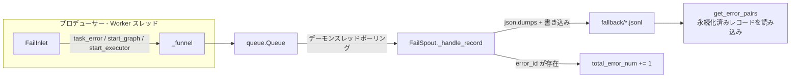
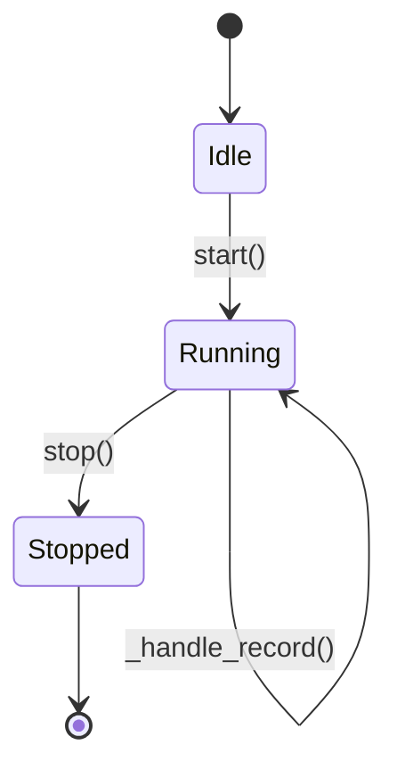

# エラー永続化 (Fail Persistence)

> 📅 最終更新日: 2026/06/11

`celestialflow.persistence` モジュールは、マルチスレッド並行タスク実行時にすべての例外情報を安全かつ整然と記録し、後続の分析やリトライに利用できる堅牢なエラー収集・永続化メカニズムを提供します。

コアコンポーネントは `FailSpout` と `FailInlet` です。

## アーキテクチャ設計

### データフロー



システムは **プロデューサー・コンシューマー** パターンを採用してエラーログを処理します：

1.  **FailInlet（プロデューサー）**:
    -   各 Worker スレッドが保持。
    -   エラー情報、タスクメタデータを辞書にカプセル化。
    -   カプセル化したデータをスレッドセーフなキュー（`queue.Queue`）に投入。

2.  **FailSpout（コンシューマー）**:
    -   独立したデーモンスレッドで実行。
    -   キューを継続的に監視し、新しいエラーレコードがあれば即座にローカルファイルに書き込み。
    -   ファイル形式は JSONL（JSON Lines）で、ストリーミング読み取りと処理が容易。

この設計により、マルチスレッドがファイル書き込みロックを直接競合する問題を回避し、高パフォーマンスとデータ整合性を保証します。

## FailSpout

`FailSpout` はエラーログファイルの作成と書き込みを管理します。

### 初期化と起動

```python
listener = FailSpout(error_source="graph_errors")
listener.start()
```

-   `error_source`: エラーソース識別子。ファイル名の一部として使用されます。
-   起動後、`./fallback/{date}/` ディレクトリに `{error_source}({time}).jsonl` という名前のファイルを作成します。
-   バッチフラッシュ閾値：1 レコードごとに flush（`_flush_every = 1`）。

### ライフサイクル



### ファイルパス

エラーログはデフォルトで `./fallback/` ディレクトリに日付別にアーカイブされます：

```text
./fallback/
└── 2026-05-24/
    └── graph_errors(14-30-05-123).jsonl
```

### リスナー停止

```python
listener.stop()
```

終了シグナルをキューに送信し、バックグラウンドスレッドが残存データを処理した後、安全に終了します。

### エラーカウンター

`FailSpout` は `total_error_num` カウンターを保持し、`error_id` を持つレコードが書き込まれるたびに自動インクリメントされます。

### 永続化済みレコードの読み取り

```python
error_pairs = listener.get_error_pairs()
# list[tuple[Any, PersistedErrorRecord]] を返す
```

## FailInlet

`FailInlet` はエラーキューにデータを送信するインターフェースです。

### タスクエラーの記録

タスク実行が失敗しリトライ不可能な場合、`TaskExecutor` が `task_error` メソッドを呼び出してエラーを記録します：

```python
sinker.task_error(
    stage_name="MyStage",
    err_id=12345,
    error=ValueError("Invalid input"),
    task=[1, 2, 3]
)
```

記録される JSONL 行には以下のフィールドが含まれます：

| フィールド | 型 | 説明 |
|------|------|------|
| `timestamp` | `str` | エラー発生日時（ISO 形式） |
| `ts` | `float` | エラー発生日時（Unix タイムスタンプ） |
| `stage` | `str` | エラーが発生したステージ名 |
| `error_id` | `int` | エラーの一意識別子 |
| `error_type` | `str` | 例外型名（例：`ValueError`） |
| `error_message` | `str` | 例外メッセージテキスト |
| `task` | `Any` | `_to_retry_payload()` で変換されたタスクデータ（注入ページに再入力可能な JSON フレンドリーな構造） |

> **変更点**：以前のドキュメントでは `error`、`error_repr`、`task_repr` などのフィールドが記載されていましたが、現在のソースコードの `FailInlet.task_error()` は実際には上記 7 つのフィールドのみを書き込みます。タスクデータは `_to_retry_payload()` で再帰的に JSON 互換構造に変換されてから `task` フィールドに格納されます。

### メタデータの記録

`FailInlet` は起動メタデータの記録もサポートし、当時の実行環境の復元に役立ちます：

#### start_graph

タスクグラフの構造情報を記録します。

```python
sinker.start_graph(
    graph_name="my_pipeline",
    structure_graph={"stages": ["A", "B"], "edges": [("A", "B")]}
)
```

> **変更点**：`start_graph` のシグネチャは `(graph_name: str, structure_graph: dict[str, Any])` です。以前のドキュメントに記載されていたパラメータ `structure_json: list[Any]` は現在のソースコードと一致しません。

#### start_executor

実行者起動情報を記録します。

```python
sinker.start_executor("Executor-1")
```

## データ復旧

エラーログは標準的な JSONL 形式を採用しているため、スクリプトを作成してこれらのファイルを簡単に読み取り、失敗したタスクデータを抽出してリトライや分析に利用できます。フレームワークが提供する `celestialflow.persistence.util_jsonl` モジュールには豊富な読み取り補助関数が用意されています。

```python
from celestialflow.persistence.util_jsonl import (
    load_jsonl_logs,        # 汎用 JSONL 読み取り。フィールドフィルタリング対応
    load_task_error_pairs,  # (task, error) ペアを読み込み
    load_task_by_stage,     # stage ごとにグループ化
)
```
