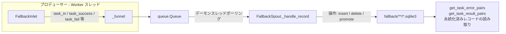
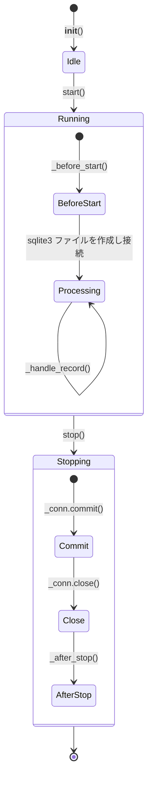

# Fallback 永続化 (Fallback Persistence)

> 📅 最終更新日: 2026/06/22

`persistence/core_fallback.py` は、タスクの fallback（フォールバック）永続化メカニズムを提供します。タスクのライフサイクル全体における状態変化（pending → success / failed）を記録し、データを SQLite データベースファイルに永続化します。

## アーキテクチャ設計

### データフロー



システムは **プロデューサー-コンシューマー** パターンを採用しています：

1.  **FallbackInlet (プロデューサー)**：各 Worker スレッドに保持され、タスクのライフサイクルイベントを操作辞書にカプセル化し、スレッドセーフなキューに入れます。
2.  **FallbackSpout (コンシューマー)**：独立したデーモンスレッドで実行され、キューを継続的に監視し、操作タイプに応じて対応する SQLite 書き込み操作を実行します。

## FallbackSpout

`FallbackSpout` は SQLite データベースファイルの作成と書き込みを管理します。

### 初期化と起動

```python
class FallbackSpout(BaseSpout):
    def __init__(self, error_source: str) -> None:
        """
        :param error_source: エラー來源識別子（ファイル名に使用）
        """
```

起動後、`./fallback/{date}/` ディレクトリに `{error_source}({time}).sqlite3` ファイルを作成します。

```python
fallback_spout = FallbackSpout("executor_fallbacks")
fallback_spout.start()
```

### ライフサイクル



### _handle_record 操作タイプ

`FallbackSpout._handle_record` は `record["__op__"]` に応じて異なる SQLite 操作を実行します：

| 操作 | トリガーメソッド | 説明 |
|------|---------|------|
| `insert` | `task_in()` | 新しいタスクが stage に入り、`pending` レコードを書き込む |
| `delete` | `task_success(persist=False)` / `task_duplicate()` | 対応する pending レコードを削除 |
| `update_event_id` | `task_retry()` | pending レコードを新しいリトライ event ID に移行 |
| `promote_success` | `task_success(persist=True)` | pending を success に昇格し、結果を書き込む |
| `promote_failed` | `task_fail()` | pending を failed に昇格し、エラー情報を書き込む |

### ファイルパス

Fallback データはデフォルトで `./fallback/` ディレクトリに日付別にアーカイブされます：

```text
./fallback/
└── 2026-06-18/
    └── executor_fallbacks(14-30-05-123).sqlite3
```

### 永続化済みレコードの読み取り

```python
# エラーレコードを取得
error_pairs: list[tuple[Any, tuple[str, str]]] = fallback_spout.get_task_error_pairs("StageA")
# 返値: [(task, (error_type, error_message)), ...]

# 成功結果を取得
result_pairs: list[tuple[Any, Any]] = fallback_spout.get_task_result_pairs("StageA")
# 返値: [(task, result), ...]
```

## FallbackInlet

`FallbackInlet` は `BaseInlet` を継承し、fallback キューへのスレッドセーフな書き込みラッパーです。

### コアメソッド

```python
class FallbackInlet(BaseInlet):
    def task_in(self, stage_name: str, event_id: int, task: Any) -> None:
        """pending レコードを書き込み、タスクが stage に入ったことを示す。"""

    def task_success(self, event_id: int, result: Any, persist: bool = False) -> None:
        """
        タスク成功処理。
        - persist=False（デフォルト）：pending レコードを削除。
        - persist=True：pending を success に昇格し、結果を書き込む。
        """

    def task_retry(self, event_id: int, retry_id: int) -> None:
        """pending レコードを新しいリトライ event ID に移行。"""

    def task_duplicate(self, event_id: int) -> None:
        """重複判定されたタスクに対応する pending レコードを削除。"""

    def task_fail(self, event_id: int, error_id: int, error: Exception) -> None:
        """pending を failed に昇格し、エラー情報を関連付ける。"""
```

## 使用例

### 完全なライフサイクル追跡

```python
from celestialflow.persistence import FallbackSpout, FallbackInlet

# 1. FallbackSpout を作成して起動
fallback_spout = FallbackSpout("my_errors")
fallback_spout.start()

# 2. FallbackInlet を作成
fallback_inlet = FallbackInlet().bind_spout(fallback_spout)

# 3. タスクライフサイクルを記録
# タスクが stage に入る
fallback_inlet.task_in("StageA", event_id=1, task="hello")

# タスク成功（結果は永続化しない）
fallback_inlet.task_success(event_id=1, result="OK", persist=False)

# タスクリトライ
fallback_inlet.task_in("StageA", event_id=2, task="world")
fallback_inlet.task_retry(event_id=2, retry_id=3)

# タスク失敗
fallback_inlet.task_fail(event_id=3, error_id=10, error=ValueError("bad input"))

# 4. 永続化データを取得
errors = fallback_spout.get_task_error_pairs("StageA")
for task, (error_type, error_msg) in errors:
    print(f"失敗タスク: {task}, エラー: {error_type}: {error_msg}")

# 5. 停止
fallback_spout.stop()
```

## 注意事項

1. **SQLite ストレージ**：WAL モード + `check_same_thread=False` を使用し、マルチスレッド読み書きをサポートします。
2. **即時 commit**：毎回の書き込み操作後に即座に commit し、データ損失を防止します。
3. **FallbackInlet はキューのみ書き込み**：データベースを直接操作せず、すべての I/O は `FallbackSpout` のバックグラウンドスレッドで完了します。
4. **persist 制御**：`task_success` の `persist` パラメータは結果データを保持するかどうかを制御します。デフォルトの `False` では、スペース節約のため pending レコードのみ削除します。
