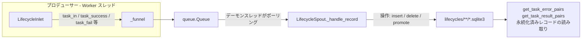

# タスクライフサイクル永続化 (Lifecycle Persistence)

> 📅 最終更新日: 2026/08/31

`persistence/core_lifecycle.py` は、タスクライフサイクル（Lifecycle）の永続化を担当します：タスクのライフサイクル全体における状態変化（pending → success / failed / 削除）を記録し、データを `lifecycles/` ディレクトリ下の SQLite データベースファイルに書き込みます。中核コンポーネントは `LifecycleSpout` と `LifecycleInlet` です。

## アーキテクチャ設計

### データフロー



システムは **プロデューサー-コンシューマー** パターンを採用しています：

1.  **LifecycleInlet (プロデューサー)**：各エグゼキュータに保持され、タスクのライフサイクルイベントを操作辞書にカプセル化して、スレッドセーフなキューに入れます。
2.  **LifecycleSpout (コンシューマー)**：独立したデーモンスレッドで動作し、キューを継続的に監視し、操作タイプ（`__op__`）に応じて対応する SQLite 書き込み操作を実行します。

## LifecycleSpout

`LifecycleSpout` は `BaseSpout` を継承し、SQLite データベースファイルの作成と書き込みを管理します。

### 初期化と起動

```python
class LifecycleSpout(BaseSpout):
    def __init__(self) -> None:
        """ライフサイクル記録リスナーを初期化します。"""
```

起動後（`_before_start()`）、`./lifecycles/{date}/` ディレクトリ下に `flow_lifecycle({time}).sqlite3` ファイルを作成し、sqlite 接続を確立します：

```python
from celestialflow.persistence import LifecycleSpout

lifecycle_spout = LifecycleSpout()
lifecycle_spout.start()
```

`_after_stop()` はまず `commit()` を実行してから接続を閉じ、残存するトランザクションの永続化を確実にします。

### _handle_record の操作タイプ

`LifecycleSpout._handle_record` は `record["__op__"]` に応じて異なる SQLite 操作を実行します：

| 操作 | トリガーメソッド | 説明 |
|------|---------|------|
| `insert` | `LifecycleInlet.task_in()` | 新規タスクが stage に入り、`pending` レコードを書き込む |
| `delete` | `LifecycleInlet.task_duplicate()` | 重複判定されたタスクに対応する pending レコードを削除 |
| `promote_success` | `LifecycleInlet.task_success()` | pending を `success` に昇格させ、結果 JSON を書き込む |
| `promote_failed` | `LifecycleInlet.task_fail()` | pending を `failed` に昇格させ、event_id を更新してエラータイプとメッセージを書き込む |

操作が実際にレコードを変更するたびに、直ちに `commit()` が実行されます。

### ファイルパス

Lifecycle データはデフォルトで `./lifecycles/` ディレクトリ下に保存され、日付ごとにアーカイブされます：

```text
./lifecycles/
└── 2026-08-26/
    └── flow_lifecycle(14-30-05-123).sqlite3
```

### 永続化済みレコードの読み取り

```python
# エラーレコードを取得
error_pairs: list[tuple[Any, tuple[str, str]]] = lifecycle_spout.get_task_error_pairs(
    "StageA"
)
# 返値: [(task, (error_type, error_message)), ...]

# 成功結果を取得
result_pairs: list[tuple[Any, Any]] = lifecycle_spout.get_task_result_pairs("StageA")
# 返値: [(task, result), ...]
```

両メソッドは `db_path` がまだ初期化されていない場合は空のリストを返します。

## LifecycleInlet

`LifecycleInlet` は `BaseInlet` を継承し、lifecycle キューへのスレッドセーフな書き込みラッパーです。

### コアメソッド

```python
class LifecycleInlet(BaseInlet):
    def task_in(self, stage_name: str, event_id: int, task: Any) -> None:
        """pending レコードを書き込み、タスクが stage に入ったことを示します。"""

    def task_success(self, event_id: int, result: Any) -> None:
        """pending レコードを success に昇格させ、結果を書き込みます。"""

    def task_duplicate(self, event_id: int) -> None:
        """重複判定されたタスクに対応する pending レコードを削除します。"""

    def task_fail(self, event_id: int, error_id: int, error: Exception) -> None:
        """pending を failed に昇格させ、最終エラー情報を紐付けます。"""
```

説明：

- `task_in` の `task` は `to_persisted_payload()` によって JSON フレンドリな構造にシリアライズされ、`task_json` フィールドに保存されます。
- `task_fail` は `error_type`（例外クラス名）と `error_message`（`str(error)`）を併せて永続化します。
- `LifecycleInlet` はキューへの書き込みのみを行い、データベースを直接操作しません。すべての I/O は `LifecycleSpout` のバックグラウンドスレッドで実行されます。

## グローバルシングルトン

```python
get_lifecycle_spout() -> LifecycleSpout  # グローバルで唯一の LifecycleSpout インスタンス
get_lifecycle_inlet() -> LifecycleInlet  # グローバルで唯一の LifecycleInlet インスタンス（グローバル spout にバインド済み）
```

フレームワークの各実行コンポーネント（`TaskExecutor` / `TaskSplitter` / `TaskRouter` / `TaskGraph`）は `get_lifecycle_inlet()` を介してライフサイクルイベントを記録し、`TaskExecutor.get_success_pairs()` と `get_error_pairs()` は `get_lifecycle_spout()` を介して結果を読み取ります。

## 使用例

### ライフサイクル操作

```python
from celestialflow.persistence import LifecycleInlet, LifecycleSpout

# 1. LifecycleSpout を作成して起動
lifecycle_spout = LifecycleSpout()
lifecycle_spout.start()

# 2. LifecycleInlet を作成してバインド
lifecycle_inlet = LifecycleInlet().bind_spout(lifecycle_spout)

# 3. タスクのライフサイクルを記録
lifecycle_inlet.task_in("StageA", event_id=1, task="hello")

# タスク成功: pending -> success
lifecycle_inlet.task_success(event_id=1, result="OK")

# タスク失敗: pending -> failed
lifecycle_inlet.task_fail(event_id=2, error_id=10, error=ValueError("bad input"))

# 4. 永続化データを取得
errors = lifecycle_spout.get_task_error_pairs("StageA")
for task, (error_type, error_msg) in errors:
    print(f"失敗タスク: {task}, エラー: {error_type}: {error_msg}")

# 5. 停止
lifecycle_spout.stop()
```

実際の使用では、通常 `get_lifecycle_inlet()` / `get_lifecycle_spout()` を介してグローバルシングルトンを取得するため、手動で作成する必要はありません。

## 注意事項

1. **SQLite ストレージ**：WAL モード + `check_same_thread=False` を使用し、スレッドを跨いだ読み書きをサポートします（`util_sqlite.connect_db` を参照）。
2. **即時 commit**：書き込み操作が実際にレコードを変更するたびに直ちに commit が行われ、データの損失を防ぎます。
3. **Inlet はキューへの書き込みのみ**：データベースを直接操作せず、すべての I/O は `LifecycleSpout` のバックグラウンドスレッドで実行されます。
