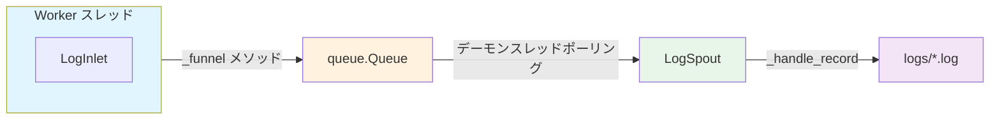

# ログ永続化 (Log Persistence)

> 📅 最終更新日: 2026/06/11

`celestialflow.persistence` モジュールは、マルチプロセス環境におけるログの統合収集、フォーマット、永続化の問題を解決するマルチプロセス安全なログシステムを提供します。

コアコンポーネントは `LogSpout` と `LogInlet` です。

## アーキテクチャ設計

### データフロー

ログシステムはプロデューサー・コンシューマーパターンを採用しています。完全なデータフローは以下の通りです：



### ログレベルフィルタリング

`LogInlet._log()` メソッドはキューに書き込む前にレベルフィルタリングを行います：

```mermaid
flowchart LR
    Call[_log が呼び出される] --> Check{level in
LEVEL_DICT?}
    Check -->|いいえ| Skip[破棄]
    Check -->|はい| Compare{LEVEL_DICT[level] <
LEVEL_DICT[log_level]?}
    Compare -->|はい - レベルが低すぎる| Skip
    Compare -->|いいえ| Funnel[_funnel を呼び出し
キューに書き込み]

    style Call fill:#e3f2fd
    style Skip fill:#ffcdd2
    style Funnel fill:#c8e6c9
```

エラー永続化と同様に、ログシステムも **Logger-Listener** パターンを採用しています：

1.  **LogInlet（プロデューサー）**:
    -   ラッパークラス。各 Worker スレッドが保持。
    -   豊富なセマンティックメソッド（`task_success`、`start_stage` など）を提供。
    -   ログメッセージとレベルをカプセル化してスレッドセーフなキュー（`queue.Queue`）に投入。
    -   ログレベルに基づくフィルタリングをサポートし、不要な通信を削減。

2.  **LogSpout（コンシューマー）**:
    -   独立したデーモンスレッドで実行。
    -   キューからログレコードを取得し、ファイルに書き込み。

## ログレベル

システムは以下の標準ログレベルをサポートします（数値が大きいほど優先度が高い）：

| レベル | 値 | 説明 |
|------|----|------|
| TRACE | 0 | 最も詳細なトレース情報。キューの `put`/`get` 操作など |
| DEBUG | 10 | デバッグ情報。タスク入力など |
| SUCCESS | 20 | 重要な操作の成功。タスク完了、分割成功など |
| INFO | 30 | 一般情報。ステージ起動/終了、グラフ構造表示など |
| WARNING | 40 | 警告情報。タスクリトライ、キュー操作異常など |
| ERROR | 50 | エラー情報。タスク失敗、ループ異常など |
| CRITICAL | 60 | 重大エラー |

## LogSpout

`LogSpout` はログファイルの設定と書き込みスレッドの管理を担当します。

### 初期化

```python
listener = LogSpout()
listener.start()
```

起動後、ログは `logs/task_logger({date}).log` ファイルに書き込まれます。

### ファイルパス

```text
logs/
└── task_logger(2026-05-24).log
```

## LogInlet

`LogInlet` は異なるコンポーネント向けの専用ログメソッドを提供し、ログ内容の構造化と一貫性を保証します。

### 初期化

```python
sinker = LogInlet(log_queue, log_level="SUCCESS")
```

-   `log_queue`: `LogSpout.get_queue()` が返すキューです。
-   `log_level`: この Inlet の最低ログレベルを設定します。このレベルを下回るログはキューに送信されません。

### メソッド分類

すべてのメソッドはコンポーネントドメイン別に以下のように分類されます：

#### タスクグラフ (Graph)

| メソッド | ログレベル | 説明 |
|------|---------|------|
| `start_graph(graph_name, structure_list)` | INFO | タスクグラフの起動と構造情報を記録 |
| `end_graph(graph_name, use_time)` | INFO | タスクグラフの終了と経過時間を記録 |

#### 階層スケジューリング (Layer)

| メソッド | ログレベル | 説明 |
|------|---------|------|
| `start_layer(layer, layer_level)` | INFO | 階層の起動を記録 |
| `end_layer(layer, use_time)` | INFO | 階層の終了と経過時間を記録 |

#### ステージノード (Stage)

| メソッド | ログレベル | 説明 |
|------|---------|------|
| `start_stage(stage_name, stage_mode, execution_mode_desc)` | INFO | ノード起動を記録 |
| `end_stage(stage_name, stage_mode, execution_mode_desc, use_time, success_num, failed_num, duplicated_num)` | INFO | ノード終了と統計を記録 |

#### 実行者 (Executor)

| メソッド | ログレベル | 説明 |
|------|---------|------|
| `start_executor(executor_name, task_num, execution_mode_desc)` | INFO | 実行者起動を記録 |
| `end_executor(executor_name, execution_mode_desc, use_time, success_num, failed_num, duplicated_num)` | INFO | 実行者終了と統計を記録 |

#### タスクライフサイクル (Task)

| メソッド | ログレベル | 説明 |
|------|---------|------|
| `task_input(func_name, task_repr, source, input_id)` | DEBUG | タスクが入力キューに入ったことを記録 |
| `task_success(func_name, task_repr, exec_mode, result_repr, use_time, parent_id, success_id)` | SUCCESS | タスク成功完了を記録 |
| `task_retry(func_name, task_repr, retry_times, exception, parent_id, retry_id)` | WARNING | タスク失敗だがリトライがトリガーされたことを記録 |
| `task_error(func_name, task_repr, exception, parent_id, error_id)` | ERROR | タスク失敗かつリトライ不可能を記録 |
| `task_duplicate(func_name, task_repr, parent_id, duplicate_id)` | WARNING | 重複タスク検出を記録 |

#### Split 分割 (Splitter)

| メソッド | ログレベル | 説明 |
|------|---------|------|
| `split_trace(func_name, part_index, part_total, parent_id, split_id)` | TRACE | split サブタスク配信を記録 |
| `split_success(func_name, task_repr, split_count, use_time)` | SUCCESS | split 成功を記録 |

#### Router ルーティング (Router)

| メソッド | ログレベル | 説明 |
|------|---------|------|
| `route_success(func_name, task_repr, target_node, use_time, parent_id, route_id)` | SUCCESS | タスクルーティング成功を記録 |

#### 終了シグナル (Termination)

| メソッド | ログレベル | 説明 |
|------|---------|------|
| `termination_input(func_name, source, termination_id)` | DEBUG | 終了シグナル入力を記録 |
| `termination_merge(func_name, parent_ids, termination_id)` | TRACE | 終了シグナルマージを記録 |

#### レポーター (Reporter)

| メソッド | ログレベル | 説明 |
|------|---------|------|
| `stop_reporter()` | DEBUG | レポーター停止を記録 |
| `loop_failed(exception)` | ERROR | レポーターループエラーを記録 |
| `pull_interval_failed(exception)` | WARNING | レポート間隔プル失敗を記録 |
| `pull_history_limit_failed(exception)` | WARNING | 履歴制限プル失敗を記録 |
| `pull_tasks_failed(exception)` | WARNING | タスク注入プル失敗を記録 |
| `inject_tasks_success(target_node, task_datas)` | INFO | タスク注入成功を記録 |
| `inject_tasks_failed(target_node, task_datas, exception)` | WARNING | タスク注入失敗を記録 |
| `push_errors_failed(exception)` | WARNING | エラー情報プッシュ失敗を記録 |
| `push_status_failed(exception)` | WARNING | 状態情報プッシュ失敗を記録 |
| `push_structure_failed(exception)` | WARNING | 構造情報プッシュ失敗を記録 |
| `push_analysis_failed(exception)` | WARNING | 分析情報プッシュ失敗を記録 |
| `push_summary_failed(exception)` | WARNING | サマリー情報プッシュ失敗を記録 |
| `push_history_failed(exception)` | WARNING | 履歴情報プッシュ失敗を記録 |

### 使用例

```python
# グラフライフサイクル
sinker.start_graph("my_graph", ["NodeA -> NodeB", "NodeB -> NodeC"])
sinker.end_graph("my_graph", 12.34)

# ステージサイクル
sinker.start_stage("ProcessStage", "thread", "thread-4")
sinker.end_stage("ProcessStage", "thread", "thread-4", 5.2, 100, 2, 0)

# 実行者サイクル
sinker.start_executor("Executor1", 50, "thread")
sinker.end_executor("Executor1", "thread", 4.8, 48, 1, 1)

# タスクライフサイクル
sinker.task_input("process_func", "task_1", "queue", 1)
sinker.task_success("process_func", "task_1", "thread", "OK", 0.05, 1, 2)
sinker.task_retry("process_func", "task_2", 1, TimeoutError("timeout"), 1, 3)
sinker.task_error("process_func", "task_3", ValueError("bad"), 1, 4)
sinker.task_duplicate("process_func", "task_2", 1, 5)

# 終了シグナル
sinker.termination_input("process_func", "queue", 1)
sinker.termination_merge("process_func", [1, 2], 3)

# レポーターイベント
sinker.inject_tasks_success("StageA", ["task_10", "task_11"])
sinker.inject_tasks_failed("StageA", ["task_10"], RuntimeError("conflict"))
sinker.push_errors_failed(ConnectionError("timeout"))
sinker.push_history_failed(ConnectionError("timeout"))
```

これらの専用メソッドを使用することで、汎用的な `info()` や `debug()` の代わりに、生成されるログの可読性と機械解析の容易さが保証されます。
