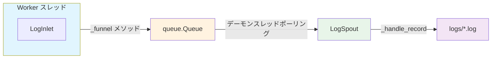

# src/celestialflow/persistence/core_log.py

> 📅 最終更新日: 2026/09/24

`persistence/core_log.py` モジュールは、スレッドセーフなログシステムを提供します。プロデューサー・コンシューマーモードにより、ログを統一的に収集・フォーマットし、`logs/` ディレクトリ配下のテキストファイルに永続化します。

コアコンポーネントは `LogSpout` と `LogInlet` です。

## アーキテクチャ設計

### データフロー

ログシステムはプロデューサー・コンシューマーパターンを採用しています。完全なデータフローは以下の通りです：


```mermaid
flowchart LR
    subgraph Worker[Worker スレッド]
        Inlet[LogInlet]
    end
    Worker -->|_funnel メソッド| Queue[queue.Queue]
    Queue -->|デーモンスレッドポーリング| Spout[LogSpout]
    Spout -->|_handle_record| File[logs/*.log]

    style Worker fill:#e1f5fe
    style Queue fill:#fff3e0
    style Spout fill:#e8f5e9
    style File fill:#f3e5f5
```

### ログレベルフィルタリング

`LogInlet._log()` メソッドはキューに書き込む前にレベルフィルタリングを行います：

```mermaid
flowchart LR
    Call[_log が呼び出される] --> Check{level in
LEVEL_DICT?}
    Check -->|いいえ| Skip[破棄]
    Check -->|はい| Compare{LEVEL_DICT[level] <
LEVEL_DICT[log_level]?}
    Compare -->|はい - レベルが低すぎる| Skip
    Compare -->|いいえ| Funnel[_funnel を呼び出し
キューに書き込み]

    style Call fill:#e3f2fd
    style Skip fill:#ffcdd2
    style Funnel fill:#c8e6c9
```

ログシステムは **Logger-Listener** パターンを採用しています：

1.  **LogInlet（プロデューサー）**:
    -   ラッパークラス。各 Worker スレッドが保持。
    -   豊富なセマンティックメソッド（`task_success`、`graph_start` など）を提供。
    -   ログメッセージとレベルをカプセル化してスレッドセーフなキュー（`queue.Queue`）に投入。
    -   ログレベルに基づくフィルタリングをサポートし、不要な通信を削減。

2.  **LogSpout（コンシューマー）**:
    -   独立したデーモンスレッドで実行。
    -   キューからログレコードを取得し、ファイルに書き込み。

## ログレベル

システムは以下の標準ログレベルをサポートします（数値が大きいほど優先度が高い）：

| レベル | 値 | 説明 |
|------|----|------|
| TRACE | 0 | 最も詳細なトレース情報。終了シグナルのマージなど |
| DEBUG | 10 | デバッグ情報。タスク入力、レポーター停止など |
| SUCCESS | 20 | 重要な操作の成功。タスク完了など |
| INFO | 30 | 一般情報。ノードの起動停止、グラフ構造の出力など |
| WARNING | 40 | 警告情報。タスクリトライ、レポート失敗など |
| ERROR | 50 | エラー情報。タスク失敗、ループ異常など |
| CRITICAL | 60 | 重大エラー。ノード / ワーカークラッシュなど |

## LogSpout

`LogSpout` はログファイルの設定と書き込みスレッドの管理を担当します。

### 初期化

```python
listener = LogSpout()
listener.start()
```

起動後、ログは `logs/flow_log({date}).log` ファイルに書き込まれ、行バッファリング（`buffering=1`）方式で開かれるため、読み取り側が新規ログを速やかに確認できます。

### ファイルパス

```text
logs/
└── flow_log(2026-05-24).log
```

## LogInlet

`LogInlet` は異なるコンポーネント向けの専用ログメソッドを提供し、ログ内容の構造化と一貫性を保証します。

### 初期化

```python
sinker = LogInlet(log_level="SUCCESS").bind_spout(log_spout)
```

-   `log_queue`: `LogSpout.get_queue()` が返すキューです。
-   `log_level`: この Inlet の最低ログレベルを設定します。このレベルを下回るログはキューに送信されません；不正なレベルは `InvalidOptionError` を送出します。

### メソッド分類

すべてのメソッドはコンポーネントドメイン別に以下のように分類されます：

#### タスクグラフ (Graph)

| メソッド | ログレベル | 説明 |
|------|---------|------|
| `graph_start(graph_name, graph_mode, structure_list)` | INFO | タスクグラフの起動と構造情報を記録 |
| `graph_end(graph_name, use_time)` | INFO | タスクグラフの終了と経過時間を記録 |

#### ノード (Node)

| メソッド | ログレベル | 説明 |
|------|---------|------|
| `node_start(node_name, task_num, execution_mode_desc)` | INFO | ノード起動と実行モードを記録 |
| `node_end(node_name, execution_mode_desc, use_time, success_num, failed_num, duplicated_num)` | INFO | ノード終了と統計を記録 |
| `node_crash(node_name, exception)` | CRITICAL | ノードクラッシュを記録 |

#### ワーカースレッド (Worker)

| メソッド | ログレベル | 説明 |
|------|---------|------|
| `worker_crash(exception)` | CRITICAL | ワーカークラッシュを記録 |

#### タスクライフサイクル (Task)

| メソッド | ログレベル | 説明 |
|------|---------|------|
| `task_input(node_name, task_repr, input_id)` | DEBUG | タスクが入力キューに入ったことを記録 |
| `task_success(node_name, task_repr, result_repr, use_time, parent_id, success_id)` | SUCCESS | タスク成功完了を記録 |
| `task_retry(node_name, task_repr, fail_times, exception, task_id)` | WARNING | タスク失敗だがリトライがトリガーされたことを記録 |
| `task_fail(node_name, task_repr, exception, parent_id, error_id)` | ERROR | タスク失敗かつリトライ不可能を記録 |

> 分割（Split）とルーティング（Router）には専用のログメソッドがなくなりました：`TaskSplitter` / `TaskRouter` の入力配分は一律 `task_input`、成功は一律 `task_success` を通ります。重複タスクログ `task_duplicate` も削除されました。

#### 終了シグナル (Termination)

| メソッド | ログレベル | 説明 |
|------|---------|------|
| `termination_input(node_name, termination_id)` | DEBUG | 終了シグナル入力を記録 |
| `termination_merge(node_name, parent_ids, termination_id)` | TRACE | 終了シグナルマージを記録 |

#### レポーター (Reporter)

| メソッド | ログレベル | 説明 |
|------|---------|------|
| `stop_reporter()` | DEBUG | レポーター停止を記録 |
| `loop_failed(exception)` | ERROR | レポーターループエラーを記録 |
| `pull_interval_failed(exception)` | WARNING | レポート間隔のプル失敗を記録 |
| `pull_tasks_failed(exception)` | WARNING | タスク注入のプル失敗を記録 |
| `inject_tasks_success(target_node, task_datas)` | INFO | タスク注入成功を記録 |
| `inject_tasks_failed(target_node, task_datas, exception)` | WARNING | タスク注入失敗を記録 |
| `push_errors_failed(exception)` | WARNING | エラー情報プッシュ失敗を記録 |
| `push_status_failed(exception)` | WARNING | 状態情報プッシュ失敗を記録 |
| `push_graph_meta_failed(exception)` | WARNING | グラフメタ情報プッシュ失敗を記録 |

### 使用例

```python
from celestialflow.persistence import LogSpout, LogInlet

log_spout = LogSpout()
log_spout.start()
sinker = LogInlet(log_level="SUCCESS").bind_spout(log_spout)

# 图生命周期
sinker.graph_start("my_graph", "thread", ["NodeA -> NodeB", "NodeB -> NodeC"])
sinker.graph_end("my_graph", 12.34)

# 节点周期
sinker.node_start("NodeA", 50, "thread")
sinker.node_end("NodeA", "thread", 4.8, 48, 1, 1)

# 任务生命周期
sinker.task_input("NodeA", "task_1", 1)
sinker.task_success("NodeA", "task_1", "OK", 0.05, 1, 2)
sinker.task_retry("NodeA", "task_2", 1, TimeoutError("timeout"), 1)
sinker.task_fail("NodeA", "task_3", ValueError("bad"), 1, 4)

# 终止信号
sinker.termination_input("NodeA", 1)
sinker.termination_merge("NodeA", [1, 2], 3)

# 上报器事件
sinker.inject_tasks_success("NodeA", ["task_10", "task_11"])
sinker.inject_tasks_failed("NodeA", ["task_10"], RuntimeError("conflict"))
sinker.push_errors_failed(ConnectionError("timeout"))
sinker.push_status_failed(ConnectionError("timeout"))
sinker.push_graph_meta_failed(ConnectionError("timeout"))

log_spout.stop()
```

これらの専用メソッドを使用することで、汎用的な `info()` や `debug()` の代わりに、生成されるログの可読性と機械解析の容易さが保証されます。
