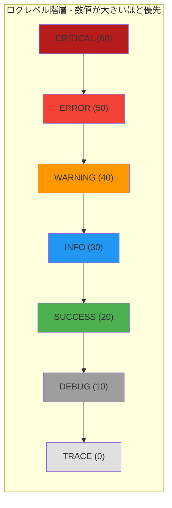

# PersistenceConstant

> 📅 最終更新日: 2026/05/24

`persistence/util_constant.py` はログレベルマッピング定数 `LEVEL_DICT` を定義します。

## レベル階層

ログレベルは数値の低い順から高い順に並び、厳密なフィルタリング階層を形成します：



この定数は `LogInlet` がログフィルタリングとレベル比較に使用します。`LogInlet` の `log_level` が特定のレベルに設定されると、そのレベルより数値が低いすべてのログは破棄されます。

## 使用例

### LEVEL_DICT のフィルタリング比較の使用法

以下の例は、`LEVEL_DICT` を使用してログレベルのフィルタリングと比較を行う方法を示します：

```python
from celestialflow.persistence.util_constant import LEVEL_DICT

# 1. すべてのレベルと対応する数値を確認
print("ログレベルマッピング:")
for name, value in LEVEL_DICT.items():
    print(f"  {name:>8} = {value:>2}")
# 出力：
#     TRACE =  0
#     DEBUG = 10
#    SUCCESS = 20
#      INFO = 30
#   WARNING = 40
#     ERROR = 50
#  CRITICAL = 60

# 2. LogInlet のログフィルタリングロジックをシミュレート
#    現在のログレベルが INFO に設定されている場合、数値 >= 30 のログのみ保持
log_level_name = "INFO"
current_level = LEVEL_DICT[log_level_name]

# ログレコードのサンプル
log_records = [
    ("DEBUG", "デバッグ情報"),
    ("INFO", "ユーザーログイン成功"),
    ("WARNING", "ディスク容量不足"),
    ("ERROR", "データベース接続失敗"),
    ("SUCCESS", "データエクスポート成功"),
    ("CRITICAL", "システムクラッシュ"),
]

filtered = []
for level_name, message in log_records:
    level_value = LEVEL_DICT.get(level_name, 0)
    if level_value >= current_level:
        filtered.append((level_name, message))

print(f"\nログレベルを {log_level_name}({current_level}) に設定した場合のフィルタリング結果:")
for level_name, message in filtered:
    print(f"  [{level_name:>8}] {message}")
# 出力：
#   [    INFO] ユーザーログイン成功
#   [ WARNING] ディスク容量不足
#   [   ERROR] データベース接続失敗
#   [ CRITICAL] システムクラッシュ
# 注意：SUCCESS(20) と DEBUG(10) は INFO(30) より低いためフィルタリングされました

# 3. レベル比較ヘルパー関数
def is_level_enabled(current: str, target: str) -> bool:
    """target レベルが current レベル以上かどうかを判定"""
    return LEVEL_DICT.get(target, 0) >= LEVEL_DICT.get(current, 0)

print("\nレベル比較:")
print(f"  ERROR >= WARNING ? {is_level_enabled('WARNING', 'ERROR')}")  # True
print(f"  DEBUG >= INFO    ? {is_level_enabled('INFO', 'DEBUG')}")     # False
print(f"  TRACE >= CRITICAL? {is_level_enabled('CRITICAL', 'TRACE')}") # False
```
