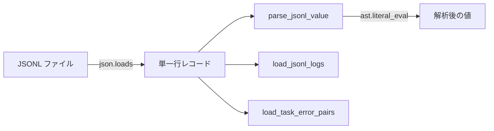

# PersistenceJSONL

> 📅 最終更新日: 2026/05/24

`persistence/util_jsonl.py` は JSONL 永続化および読み取りツールを提供します。

## 読み取りインターフェース

| 関数 | 説明 |
|------|------|
| `load_jsonl_logs(path, start_seq=1, keys=None)` | 行ごとに読み取り。オプションでフィールドフィルタリング、指定行番号からの読み取りをサポート |
| `load_jsonl_by_key(jsonl_path, extract_key="stage", extract_value="task")` | 指定フィールドでグループ化読み込み。カスタムグループ化キーと抽出値フィールドをサポート |
| `load_jsonl_grouped_by_keys(jsonl_path, group_keys, extract_field)` | 複数フィールドでグループ化読み取り。フィールド抽出と `ast.literal_eval` 逆シリアライズをサポート |
| `load_task_by_stage(jsonl_path)` | エラーレコードを読み込み、stage 別に分類。`{stage_name: [task_list]}` を返す |
| `load_task_by_error(jsonl_path)` | エラーレコードを読み込み、error_type と stage で分類。`{(error_type, stage): [task_list]}` を返す |
| `load_task_error_pairs(jsonl_path)` | エラーレコードを読み込み、`(task, PersistedErrorRecord)` ペアリストを返す |

### 内部関数

| 関数 | 説明 |
|------|------|
| `_parse_error_record(item)` | JSONL レコードから `PersistedErrorRecord` オブジェクトを解析 |
| `parse_jsonl_value(val)` | JSONL フィールド値をスマート解析。文字列形式のリスト/タプルに対する `ast.literal_eval` 逆シリアライズをサポート |

#### parse_jsonl_value 詳細

この関数は JSONL 内の生フィールド値を Python オブジェクトにスマート解析します：

```python
from celestialflow.persistence.util_jsonl import parse_jsonl_value

# 文字列形式リスト → タプル
parse_jsonl_value("[1, 2, 3]")       # → (1, 2, 3)
parse_jsonl_value("(a, b, c)")       # → ("a", "b", "c")

# 通常の文字列はそのまま
parse_jsonl_value("hello")           # → "hello"

# 既にリスト/タプルの場合はそのまま変換
parse_jsonl_value([1, 2, 3])         # → (1, 2, 3)
parse_jsonl_value((1, 2, 3))         # → (1, 2, 3)
```

## データフロー


