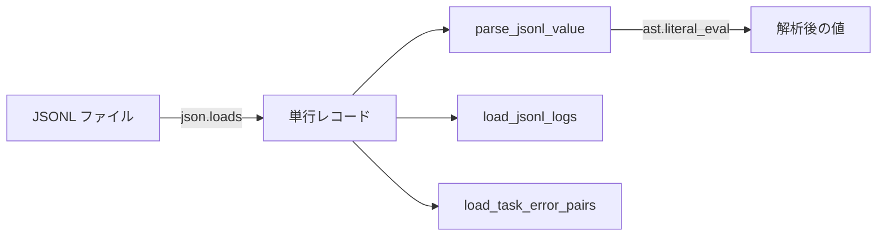

# PersistenceJSONL

> 📅 最終更新日: 2026/05/24

`persistence/util_jsonl.py` は JSONL の永続化と読み取りユーティリティを提供します。

## 読み取りインターフェース

| 関数 | 説明 |
|------|------|
| `load_jsonl_logs(path, start_seq=1, keys=None)` | 行ごとに読み取り。オプションのフィールドフィルタリング。指定行番号からの開始をサポート |
| `load_jsonl_by_key(jsonl_path, extract_key="stage", extract_value="task")` | 指定フィールドでグループ化して読み込み。カスタムグループキーと値抽出フィールドをサポート |
| `load_jsonl_grouped_by_keys(jsonl_path, group_keys, extract_field)` | 複数フィールドでグループ化して読み込み。フィールド抽出と `ast.literal_eval` デシリアライズをサポート |
| `load_task_by_stage(jsonl_path)` | エラーレコードを読み込み、stage ごとに分類。`{stage_name: [task_list]}` を返す |
| `load_task_by_error(jsonl_path)` | エラーレコードを読み込み、error と stage ごとに分類。`{(error, stage): [task_list]}` を返す |
| `load_task_error_pairs(jsonl_path)` | エラーレコードを読み込み、`(task, error)` ペアのリストを返す |

### ユーティリティ関数

| 関数 | 説明 |
|------|------|
| `parse_jsonl_value(val)` | JSONL フィールド値をインテリジェントに解析。文字列形式のリスト/タプルに対する `ast.literal_eval` デシリアライズをサポート |

#### parse_jsonl_value 詳細

この関数は JSONL 内の生のフィールド値を Python オブジェクトにインテリジェントに解析します：

```python
from celestialflow.persistence.util_jsonl import parse_jsonl_value

# 文字列形式のリスト → タプル
parse_jsonl_value("[1, 2, 3]")       # → (1, 2, 3)
parse_jsonl_value("(a, b, c)")       # → ("a", "b", "c")

# 通常の文字列はそのまま
parse_jsonl_value("hello")           # → "hello"

# 既にリスト/タプルの場合は直接変換
parse_jsonl_value([1, 2, 3])         # → (1, 2, 3)
parse_jsonl_value((1, 2, 3))         # → (1, 2, 3)
```

## データフロー


