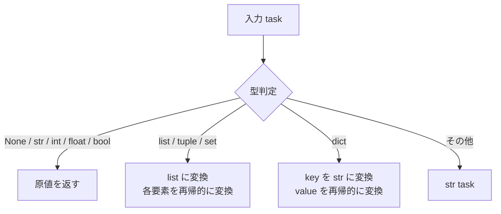

# PersistencePayload

> 📅 最終更新日: 2026/06/22

`persistence/util_payload.py` は、タスクデータの永続化シリアライゼーションツールを提供し、任意の Python オブジェクトを再帰的に JSON フレンドリーな構造に変換します。

## コア関数

### to_persisted_payload

```python
def to_persisted_payload(task: Any) -> Any:
    """
    タスクを永続化可能な JSON フレンドリーな構造に変換する。

    :param task: シリアライズするタスクデータ
    :return: 永続化可能な JSON フレンドリーな構造
    """
```

**変換ルール：**

| 入力型 | 出力 | 説明 |
|---------|------|------|
| `None` / `str` / `int` / `float` / `bool` | そのまま返す | 既に JSON ネイティブ型 |
| `list` / `tuple` / `set` | `list` | 各要素を再帰的に変換 |
| `dict` | `dict` | key を `str` に、value を再帰的に変換 |
| その他の型 | `str(task)` | 文字列表現に変換 |



## 使用例

### 基本型はそのまま透過

```python
from celestialflow.persistence.util_payload import to_persisted_payload

print(to_persisted_payload(42))       # 42
print(to_persisted_payload("hello"))  # "hello"
print(to_persisted_payload(True))     # True
print(to_persisted_payload(None))     # None
```

### 複合型の再帰的変換

```python
from celestialflow.persistence.util_payload import to_persisted_payload

# リスト
result = to_persisted_payload([1, "a", True])
print(result)  # [1, 'a', True]

# 入れ子辞書
result = to_persisted_payload({"score": 95, "tags": ["a", "b"]})
print(result)  # {'score': 95, 'tags': ['a', 'b']}

# カスタムオブジェクト
class MyTask:
    def __str__(self):
        return "MyTask(id=1)"

result = to_persisted_payload(MyTask())
print(result)  # "MyTask(id=1)"
```

### FallbackInlet での使用

`to_persisted_payload` は主に `FallbackInlet` 内部で自動的に呼び出され、タスクデータを SQLite に保存可能な JSON 文字列に変換します：

```python
# FallbackInlet.task_in 内部フロー：
from datetime import datetime

pending_item = {
    "__op__": "insert",
    "record": {
        "event_id": event_id,
        "ts": datetime.now().timestamp(),
        "stage": stage_name,
        "status": "pending",
        "task_json": to_persisted_payload(task),  # 自動シリアライズ
    },
}
```

## 注意事項

- シリアライゼーション戦略は**ベストエフォート**です：直接 JSON シリアライズできないオブジェクトは、`str()` による文字列表現にフォールバックします。
- 関数の結果は `FallbackSpout` 内部で `json.dumps` により SQLite の `task_json` または `result_json` フィールドに書き込まれます。
- 旧版 `util_jsonl.py` との違い：新版は JSONL ファイルの読み書きを扱わず、データフォーマット変換のみを担当します。
