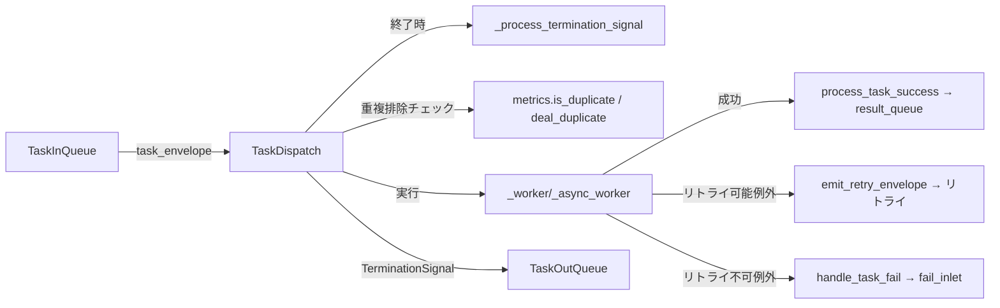
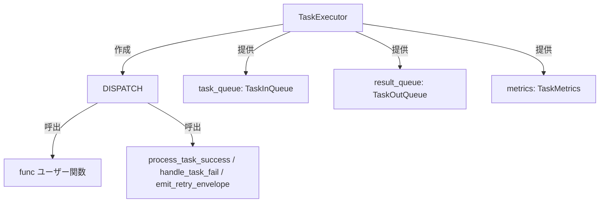

# TaskDispatch

> 📅 最終更新日: 2026/06/11

`TaskDispatch` はタスクディスパッチャであり、シリアル、スレッド、非同期のいずれかの方式で単一タスクを実行します。`TaskExecutor` の内部コンポーネントであり、`TaskInQueue` からタスクを取得し、ユーザー関数を呼び出し、結果を `TaskOutQueue` 経由で送信します。

## 初期化

```python
class TaskDispatch:
    def __init__(self, task_executor: TaskExecutor, func: Callable[..., Any], max_workers: int):
        """
        タスクランナーを初期化します。

        :param task_executor: TaskExecutor インスタンス
        :param func: タスク関数
        :param max_workers: ワーカースレッド/コルーチン数の上限
        """
```

## ディスパッチモード

### dispatch_serial

タスクを順次実行します。1 つずつ処理します。

```python
def dispatch_serial(self) -> None:
    """タスクをシリアルに実行します"""
```

実行フロー:
1. `task_queue.get()` からタスクを取得
2. `TerminationIdPool` を受信した場合、`_process_termination_signal()` を呼び出して終了
3. `TaskEnvelope` を受信した場合、`task_executor.metrics.is_duplicate()` で重複チェック
4. 重複時は `task_executor.deal_duplicate()` で処理
5. それ以外は `_worker()` を同期的に実行
6. マージされた `TerminationSignal` を `result_queue` に投入

### dispatch_thread

スレッドプールを使用してタスクを並行実行します。

```python
def dispatch_thread(self) -> None:
    """スレッドプールを使用してタスクを並行実行します。"""
```

実行フロー:
1. 必要に応じて `ThreadPoolExecutor` を初期化
2. キューからタスクを取得しスレッドプールに `submit`
3. futures リストが `max_workers * 2` に達したら完了済みをフィルタリング（メモリリーク防止）
4. 全 future の完了を待機後、終了シグナルを処理
5. スレッドプールをシャットダウン

### dispatch_async

コルーチンとセマフォを使用してタスクを非同期実行し、並行数を制御します。

```python
async def dispatch_async(self) -> None:
    """タスクを非同期に実行し、並行数を制限します。"""
```

実行フロー:
1. `asyncio.Semaphore(self.max_workers)` を作成して並行数を制御
2. `asyncio.to_thread(task_queue.get)` で非同期にタスクを取得（イベントループのブロック回避）
3. 各タスクを `asyncio.Task` としてラップし、未完了セットを追跡
4. `asyncio.gather` で全未完了タスクを待機
5. 終了シグナルを処理

## 内部メソッド

### _worker / _async_worker

同期/非同期ワーカー関数。単一タスクを処理しリトライをサポートします:

```python
def _worker(self, task_envelope: TaskEnvelope) -> None:
    """単一タスクを同期的に実行し、リトライをサポートします。"""

async def _async_worker(self, task_envelope: TaskEnvelope) -> None:
    """単一タスクを非同期に実行し、リトライをサポートします。"""
```

リトライロジック:
- `max_retries + 1` 回の試行内でループ
- 成功時は `process_task_success` を呼び出し
- 例外が `retry_exceptions` に含まれ上限未満の場合、リトライエンベロープを発行して継続
- それ以外は `handle_task_fail` を呼び出し

### _process_termination_signal

```python
def _process_termination_signal(self, termination_pool: TerminationIdPool) -> TerminationSignal:
    """
    終了シグナルを処理し、merge イベントを生成します。

    :param termination_pool: 複数の終了シグナル ID を含むプール
    :return: マージ後の終了シグナル
    """
```

### 重複排除チェック

重複排除ロジックは各 dispatch メソッド内でインライン実行され、独立したメソッドにはなっていません:

```python
# インライン重複排除（dispatch_serial / dispatch_thread / dispatch_async で共通パターン）
task_hash = envelope.get_hash()
if self.task_executor.metrics.is_duplicate(task_hash):
    self.task_executor.deal_duplicate(envelope)
    continue
```

`is_duplicate()` はアトミック操作です: ハッシュが `processed_set` に存在しない場合は追加して `False` を返し、既存の場合は `True` を返します。

### _init_pool / _release_pool

```python
def _init_pool(self, execution_mode: str) -> None:
    """必要に応じてスレッドプールを初期化します。"""

def _release_pool(self) -> None:
    """スレッドプールをシャットダウンし、リソースを解放します。"""
```

## データフロー



## TaskExecutor との関係



`TaskExecutor` は `execution_mode` に応じて呼び出し方法を選択します:
- `serial` → `dispatch_serial()`
- `thread` → `dispatch_thread()`
- `async` → `dispatch_async()`

## 注意事項

## 使用例

`TaskDispatch` は `TaskExecutor` の内部コンポーネントであり、`TaskExecutor` の `start()` メソッドを通じて間接的に使用します。
以下の例は 3 つの実行モードの違いを示します:

### Serial モード（順次実行）

```python
from celestialflow import TaskExecutor

# serial モード: シングルスレッド順次実行、デバッグに最適
executor = TaskExecutor(
    "SerialWorker",
    func=lambda x: x ** 2,
    execution_mode="serial",
)
executor.start([1, 2, 3, 4, 5])

success_pairs = executor.get_success_pairs()
for task, result in success_pairs:
    print(f"Task {task} -> {result}")

print(f"成功: {executor.get_counts()['tasks_succeeded']}")
```

### Thread モード（スレッドプール並行）

```python
from celestialflow import TaskExecutor
import time

def io_task(x: int) -> int:
    time.sleep(0.1)  # I/O 操作をシミュレート
    return x * 10

# thread モード: スレッドプール並行、I/O バウンドに最適
executor = TaskExecutor(
    "ThreadWorker",
    func=io_task,
    execution_mode="thread",
    max_workers=4,
)
executor.start([1, 2, 3, 4, 5])

counts = executor.get_counts()
print(f"成功: {counts['tasks_succeeded']}, 失敗: {counts['tasks_failed']}")
```

### Async モード（非同期コルーチン）

```python
import asyncio
from celestialflow import TaskExecutor

async def async_task(x: int) -> int:
    await asyncio.sleep(0.05)  # 非同期 I/O をシミュレート
    return x * 100

# async モード: 非同期コルーチン、ネットワーク I/O に最適
executor = TaskExecutor(
    "AsyncWorker",
    func=async_task,
    execution_mode="async",
    max_workers=4,
)
executor.start([1, 2, 3])

counts = executor.get_counts()
print(f"成功: {counts['tasks_succeeded']}")
```

### リトライ設定

```python
from celestialflow import TaskExecutor

# リトライ戦略を設定。ConnectionError または TimeoutError 発生時に自動リトライ
unstable_func = lambda x: 100 // x if x != 0 else exec("raise ConnectionError('network error')")

executor = TaskExecutor(
    "RetryWorker",
    func=unstable_func,
    execution_mode="serial",
    max_retries=3,  # 最大 3 回リトライ
)
executor.add_retry_exceptions(ConnectionError, TimeoutError)
executor.start([1, 2, 0, 4])

counts = executor.get_counts()
print(f"成功: {counts['tasks_succeeded']}, 失敗: {counts['tasks_failed']}")
```

## 注意事項

1. **シリアルモード**: 同期ブロッキング、デバッグに最適
2. **スレッドモード**: I/O バウンドに最適; `_release_pool` がリソース解放を保証
3. **非同期モード**: 関数はコルーチンである必要あり; `asyncio.to_thread` でブロッキング回避
4. **futures クリーンアップ**: `dispatch_thread` ではリストが `max_workers * 2` に達した時点で完了済み future をクリーンアップ
5. **重複排除**: ワーカー投入前に完了するため無効計算を削減
6. **リトライ**: ワーカー内部でループと `emit_retry_envelope` により実現
