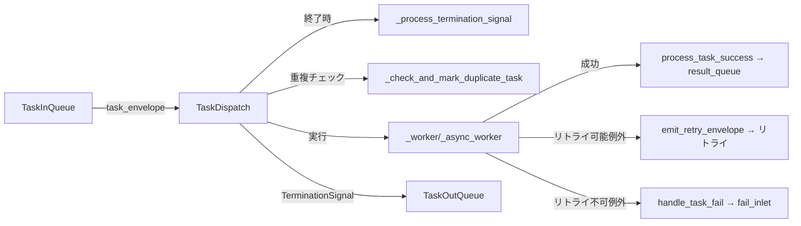

# TaskDispatch

> 📅 最終更新日: 2026/05/24

`TaskDispatch` はタスクスケジューラーで、シリアル、スレッド、または非同期方式で単一タスクを実行する役割を担います。`TaskExecutor` の内部コンポーネントであり、`TaskInQueue` からタスクを取得し、ユーザー関数を呼び出し、結果を `TaskOutQueue` を通じて送信します。

## 初期化

```python
class TaskDispatch:
    def __init__(self, task_executor: TaskExecutor, func: Callable[..., Any], max_workers: int):
        """
        タスクランナーを初期化します。

        :param task_executor: TaskExecutor インスタンス
        :param func: タスク関数
        :param max_workers: ワーカースレッド/コルーチンの数量制限
        """
```

## スケジューリングモード

### dispatch_serial

タスクをシリアルに実行し、1つずつ処理します。

```python
def dispatch_serial(self) -> None:
    """タスクをシリアルに実行する"""
```

実行フロー：
1. `task_queue.get()` からタスクを取得
2. `TerminationIdPool` を受信した場合、`_process_termination_signal()` を呼び出して終了
3. `TaskEnvelope` を受信した場合、重複チェック（`_check_and_mark_duplicate_task`）
4. `_worker()` を呼び出して同期的に実行
5. マージされた `TerminationSignal` を `result_queue` に投入

### dispatch_thread

スレッドプールを使用してタスクを並列実行します。

```python
def dispatch_thread(self) -> None:
    """スレッドプールを使用してタスクを並列実行する。"""
```

実行フロー：
1. 必要に応じて `ThreadPoolExecutor` を初期化
2. キューからタスクを取得しスレッドプールに `submit`
3. futures リストが `max_workers * 2` に達した時に完了済みのものをフィルタリング（メモリリーク防止）
4. すべての future の完了を待ってから終了シグナルを処理
5. スレッドプールを閉じる

### dispatch_async

コルーチンとセマフォを使用して並行制御しながらタスクを非同期実行します。

```python
async def dispatch_async(self) -> None:
    """並行数を制限しながらタスクを非同期実行する。"""
```

実行フロー：
1. `asyncio.Semaphore(self.max_workers)` を作成して並行数を制御
2. `asyncio.to_thread(task_queue.get)` を通じて非同期的にタスクを取得（イベントループのブロックを防止）
3. 各タスクを `asyncio.Task` にラップし、未完了タスク集合を追跡
4. `asyncio.gather` を使用してすべての未完了タスクを待機
5. 終了シグナルを処理

## 内部メソッド

### _worker / _async_worker

同期/非同期ワーカー関数。単一タスクを実行しリトライをサポート：

```python
def _worker(self, task_envelope: TaskEnvelope) -> None:
    """単一タスクを同期的に実行し、リトライをサポートする。"""

async def _async_worker(self, task_envelope: TaskEnvelope) -> None:
    """単一タスクを非同期的に実行し、リトライをサポートする。"""
```

リトライロジック：
- `max_retries + 1` 回の試行内でループ
- 成功時は `process_task_success` を呼び出す
- 例外が `retry_exceptions` に含まれ上限未達の場合、リトライエンベロープを発行して継続
- それ以外の場合は `handle_task_fail` を呼び出す

### _process_termination_signal

```python
def _process_termination_signal(self, termination_pool: TerminationIdPool) -> TerminationSignal:
    """
    終了シグナルを処理し、マージイベントを生成する。

    :param termination_pool: 複数の終了シグナル ID を含むプール
    :return: マージされた終了シグナル
    """
```

### _check_and_mark_duplicate_task

```python
def _check_and_mark_duplicate_task(self, task_envelope: TaskEnvelope) -> bool:
    """
    worker に入る前に重複チェックを完了する。

    :param task_envelope: タスクエンベロープ
    :return: 重複タスクにヒットしたかどうか
    """
```

### _init_pool / _release_pool

```python
def _init_pool(self, execution_mode: str) -> None:
    """必要に応じてスレッドプールを初期化する。"""

def _release_pool(self) -> None:
    """スレッドプールを閉じ、リソースを解放する。"""
```

## データフロー



## TaskExecutor との関係


`TaskExecutor` は `execution_mode` に基づいて呼び出し方法を選択します：
- `serial` → `dispatch_serial()`
- `thread` → `dispatch_thread()`
- `async` → `dispatch_async()`

## 使用例

`TaskDispatch` は `TaskExecutor` の内部コンポーネントであり、`TaskExecutor` の `start()` メソッドを通じて間接的に使用します。
以下は3つの実行モードの違いを示す例です：

### Serial モード（シリアル実行）

```python
from celestialflow import TaskExecutor

# serial モード：シングルスレッド順次実行。デバッグに適しています
executor = TaskExecutor(
    "SerialWorker",
    func=lambda x: x ** 2,
    execution_mode="serial",
)
executor.start([1, 2, 3, 4, 5])

success_pairs = executor.get_success_pairs()
for task, result in success_pairs:
    print(f"Task {task} -> {result}")

print(f"成功: {executor.get_counts()['tasks_succeeded']}")
```

### Thread モード（スレッドプール並列）

```python
from celestialflow import TaskExecutor
import time

def io_task(x: int) -> int:
    time.sleep(0.1)  # I/O 操作をシミュレート
    return x * 10

# thread モード：スレッドプール並列。I/O 密集型に適しています
executor = TaskExecutor(
    "ThreadWorker",
    func=io_task,
    execution_mode="thread",
    max_workers=4,
)
executor.start([1, 2, 3, 4, 5])

counts = executor.get_counts()
print(f"成功: {counts['tasks_succeeded']}, 失敗: {counts['tasks_failed']}")
```

### Async モード（非同期コルーチン）

```python
import asyncio
from celestialflow import TaskExecutor

async def async_task(x: int) -> int:
    await asyncio.sleep(0.05)  # 非同期 I/O をシミュレート
    return x * 100

# async モード：非同期コルーチン。ネットワーク I/O に適しています
executor = TaskExecutor(
    "AsyncWorker",
    func=async_task,
    execution_mode="async",
    max_workers=4,
)
executor.start([1, 2, 3])

counts = executor.get_counts()
print(f"成功: {counts['tasks_succeeded']}")
```

### リトライ設定

```python
from celestialflow import TaskExecutor

# リトライポリシーを設定。ConnectionError または TimeoutError 発生時に自動リトライ
unstable_func = lambda x: 100 // x if x != 0 else exec("raise ConnectionError('network error')")

executor = TaskExecutor(
    "RetryWorker",
    func=unstable_func,
    execution_mode="serial",
    max_retries=3,  # 最大3回リトライ
)
executor.add_retry_exceptions(ConnectionError, TimeoutError)
executor.start([1, 2, 0, 4])

counts = executor.get_counts()
print(f"成功: {counts['tasks_succeeded']}, 失敗: {counts['tasks_failed']}")
```

## 注意事項

1. **シリアルモード**: 同期ブロッキング。デバッグに適しています
2. **スレッドモード**: I/O 密集型に適しています。`_release_pool` がリソース解放を保証
3. **非同期モード**: 関数はコルーチンである必要があります。`asyncio.to_thread` を使用してブロッキングを防止
4. **futures クリーンアップ**: `dispatch_thread` ではリストが `max_workers * 2` に達した時に完了済み future をクリーンアップ
5. **重複排除**: worker に入る前に完了し、無効な計算を削減
6. **リトライ**: worker 内部でループと `change_id` によって実現
