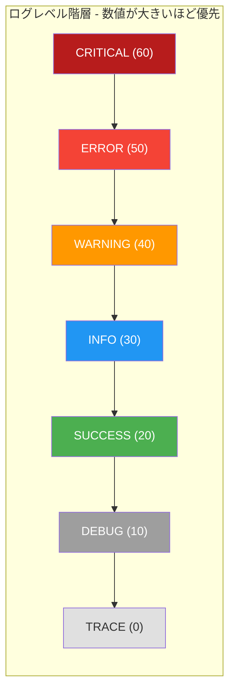

# RuntimeConstant

> 📅 最終更新日: 2026/06/22

`runtime/util_constant.py` はランタイムのグローバル定数を定義します。主にログレベルマッピングテーブル `LEVEL_DICT` です。

## コア定数

### LEVEL_DICT

ログレベルから数値へのマッピング辞書で、数値が大きいほど優先度が高くなります。この定数は `LogInlet` がログフィルタリングとレベル比較に使用します — `LogInlet` の `log_level` があるレベルに設定されると、そのレベルより低い数値のログはすべて破棄されます。

```python
LEVEL_DICT = {
    "TRACE": 0,
    "DEBUG": 10,
    "SUCCESS": 20,
    "INFO": 30,
    "WARNING": 40,
    "ERROR": 50,
    "CRITICAL": 60,
}
```

#### レベル階層



## 使用例

### ログレベルフィルタリングロジック

```python
from celestialflow.runtime.util_constant import LEVEL_DICT

# 1. 全レベルと対応する数値を表示
for name, value in LEVEL_DICT.items():
    print(f"  {name:>8} = {value:>2}")

# 2. LogInlet のログフィルタリングロジックをシミュレート
log_level_name = "INFO"
current_level = LEVEL_DICT[log_level_name]

log_records = [
    ("DEBUG", "デバッグ情報"),
    ("INFO", "ユーザーログイン成功"),
    ("WARNING", "ディスク容量不足"),
    ("ERROR", "データベース接続失敗"),
    ("SUCCESS", "データエクスポート成功"),
    ("CRITICAL", "システムクラッシュ"),
]

filtered = [
    (name, msg)
    for name, msg in log_records
    if LEVEL_DICT.get(name, 0) >= current_level
]
# 結果は INFO 以上のレベルのみ保持
print(filtered)
# [('INFO', 'ユーザーログイン成功'), ('WARNING', 'ディスク容量不足'),
#  ('ERROR', 'データベース接続失敗'), ('CRITICAL', 'システムクラッシュ')]

# 3. レベル比較補助関数
def is_level_enabled(current: str, target: str) -> bool:
    return LEVEL_DICT.get(target, 0) >= LEVEL_DICT.get(current, 0)

print(is_level_enabled("WARNING", "ERROR"))    # True
print(is_level_enabled("INFO", "DEBUG"))        # False
```

### ログレベル検証

```python
from celestialflow.runtime.util_constant import LEVEL_DICT

# ユーザー入力のログレベルが有効かどうかを検証
def validate_level(level: str) -> bool:
    return level in LEVEL_DICT

print(validate_level("INFO"))     # True
print(validate_level("VERBOSE"))  # False
```

## 注意事項

- `LEVEL_DICT` は `LogInlet` のログフィルタリングの中核的な根拠です。レベル数値を随意に変更しないでください。
- ソースコード中の `STAGE_STYLE` は現在コメントアウトされており、実際には有効化されていません。復元する場合は、外部パッケージ `celestialtree` の `NodeLabelStyle` を依存関係として追加する必要があり、テンプレート文字列中の `{base}`、`{payload.name}`、`{type}` 変数は CelestialTree レンダリングエンジンによって注入されます。
