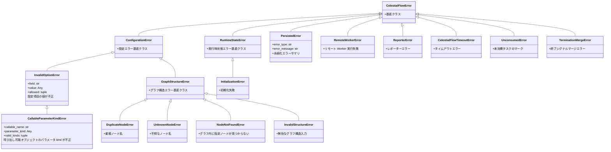

# TaskErrors

> 📅 最終更新日: 2026/08/31

TaskErrors モジュールは CelestialFlow フレームワークで使用される完全な例外クラス体系を定義します。

## 例外階層



## 基底クラス

### CelestialFlowError

全カスタム例外の基底クラスです。

```python
class CelestialFlowError(Exception):
    """CelestialFlow 全カスタム例外の基底クラス"""

    pass
```

## 設定関連例外（ConfigurationError）

### ConfigurationError

設定エラー基底クラス（不正なパラメータ、サポートされない組み合わせなど）。

```python
class ConfigurationError(CelestialFlowError):
    """設定エラー（不正なパラメータ、サポートされない組み合わせなど）"""

    pass
```

### InvalidOptionError

特定の設定項目の値が不正です。

```python
class InvalidOptionError(ConfigurationError):
    def __init__(
        self,
        field: str,
        value: Any,
        allowed: Iterable[Any],
        *,
        prefix: str = "Invalid",
    ):
        """
        :param field: 設定項目名
        :param value: 実際に渡された値
        :param allowed: 許可される値の集合
        :param prefix: エラーメッセージのプレフィックス
        """
        # 例: "Invalid execution mode: xxx. Valid options are ('serial', 'thread', 'async')."
```

### CallableParameterKindError

呼び出し可能オブジェクトのパラメータ kind が不正です。

```python
class CallableParameterKindError(InvalidOptionError):
    def __init__(
        self, callable_name: str, parameter_kind: Any, valid_kinds: Iterable[Any]
    ):
        """
        :param callable_name: 呼び出し可能オブジェクト名
        :param parameter_kind: 実際のパラメータ kind
        :param valid_kinds: 許可されるパラメータ kind の集合
        """
```

## グラフ構造例外（GraphStructureError）

### GraphStructureError

グラフ構造エラー基底クラス。

```python
class GraphStructureError(ConfigurationError):
    """グラフ構造エラー"""

    pass
```

### DuplicateNodeError

重複ノード名（`set_stages` または `add_source_name` / `add_queue` 時に発生）。

```python
class DuplicateNodeError(GraphStructureError):
    """重複ノード名"""

    pass
```

### UnknownNodeError

不明なノード名（終了シグナルソースの検証時に発生）。

```python
class UnknownNodeError(GraphStructureError):
    """不明なノード名"""

    pass
```

### NodeNotFoundError

グラフ内に指定ノードが見つからない（`connect()` または照会時に発生）。

```python
class NodeNotFoundError(GraphStructureError):
    """グラフ内に指定ノードが見つからない"""

    pass
```

## 実行時例外（RuntimeStateError）

### RuntimeStateError

実行時状態エラー基底クラス（重複起動、未初期化など）。

```python
class RuntimeStateError(CelestialFlowError):
    """実行時状態エラー"""

    pass
```

### InitializationError

初期化エラー（スレッドプールが未初期化の状態で使用された場合など）。

```python
class InitializationError(RuntimeStateError):
    """初期化エラー"""

    pass
```

## 永続化例外

### PersistedError

永続化層から復元されたエラーサマリオブジェクト。

```python
class PersistedError(CelestialFlowError):
    def __init__(self, error_type: str, error_message: str) -> None:
        self.error_type = error_type
        self.error_message = error_message

    def __str__(self) -> str:
        """``ErrorType(message)`` 形式のコンパクトな表現を返します。"""
```

## 外部サービス例外

### RemoteWorkerError

リモート Worker（Go Worker など）の実行失敗時に送出されます。

```python
class RemoteWorkerError(CelestialFlowError):
    """リモート Worker 実行失敗"""

    pass
```

### ReporterError

レポーターエラー。

```python
class ReporterError(CelestialFlowError):
    """レポーターエラー"""

    pass
```

## その他の実行時例外

### タイムアウト例外

### CelestialFlowTimeoutError

タイムアウトエラー（組み込み `TimeoutError` を継承）。

```python
class CelestialFlowTimeoutError(CelestialFlowError, TimeoutError):
    """タイムアウトエラー"""

    pass
```

### UnconsumedError

未消費タスクをマークします。

```python
class UnconsumedError(CelestialFlowError):
    """タスク未消費をマークする例外クラス"""

    pass
```

`TaskGraph._finish_start()` の後処理フェーズで全 stage を走査し `drain_task_queue()` を呼び出した結果、キューの残余タスクが検出された場合、それらは `UnconsumedError` としてマークされ、`get_lifecycle_inlet()` / `LifecycleSpout` を介して日付別に整理された lifecycle sqlite データベースに永続化されます。

### TerminationMergeError

終了シグナルマージエラー（上流の終了シグナルが不足している場合に発生）。

```python
class TerminationMergeError(CelestialFlowError):
    """終了シグナルマージエラー"""

    pass
```

## 使用シナリオ

### 1. リトライ可能例外の追加

```python
from celestialflow import TaskExecutor

executor = TaskExecutor("Processor", process, max_retries=3)
executor.set_retry_exceptions(ConnectionError, TimeoutError)
```

### 2. 設定エラーの捕捉

```python
from celestialflow.runtime.util_errors import InvalidOptionError

try:
    raise InvalidOptionError(
        field="execution_mode",
        value="invalid",
        allowed=("serial", "thread", "async"),
    )
except InvalidOptionError as e:
    print(f"フィールド: {e.field}")
    print(f"渡された値: {e.value}")
    print(f"有効な値: {e.allowed}")
```

### 3. グラフ構造検証

```python
from celestialflow.runtime.util_errors import DuplicateNodeError

try:
    graph.set_stages([stage_a, stage_a])  # 同名ノード
except DuplicateNodeError as e:
    print(f"重複ノード: {e}")
```

## 使用例

以下の例は CelestialFlow の各種例外の raise と catch の典型的な使用方法を示します。

### 設定例外

```python
from celestialflow.runtime.util_errors import InvalidOptionError

# InvalidOptionError の使用
try:
    raise InvalidOptionError(
        field="strategy",
        value="aggressive",
        allowed=("conservative", "balanced"),
    )
except InvalidOptionError as e:
    print(f"フィールド: {e.field}")
    print(f"渡された値: {e.value}")
    print(f"有効な値: {e.allowed}")
```

### グラフ構造例外

```python
from celestialflow import TaskGraph, TaskStage
from celestialflow.runtime.util_errors import DuplicateNodeError, UnknownNodeError

graph = TaskGraph(name="ErrorTestGraph")

stage_a = TaskStage("A", func=lambda x: x)
stage_b = TaskStage("A", func=lambda x: x * 2)  # 同名ノード

try:
    graph.set_stages([stage_a, stage_b])
except DuplicateNodeError as e:
    print(f"重複ノード: {e}")

try:
    from celestialflow.runtime.util_types import TerminationSignal

    # UnknownNodeError は in_queue._record_termination のソース検証時に発生
    from celestialflow.runtime import TaskInQueue

    in_queue = TaskInQueue(out_name="test")
    in_queue.add_source_name("known")
    in_queue._record_termination(TerminationSignal(source="unknown_source"))
except UnknownNodeError as e:
    print(f"不明なソース: {e}")
```

### 実行時例外とタイムアウト例外

```python
from celestialflow.runtime.util_errors import (
    RuntimeStateError,
    CelestialFlowTimeoutError,
    UnconsumedError,
    TerminationMergeError,
)

# タイムアウトエラー（組み込み TimeoutError を継承）
try:
    raise CelestialFlowTimeoutError("Task execution timed out after 30s")
except CelestialFlowTimeoutError as e:
    print(f"タイムアウト: {e}")

# 終了シグナルマージエラー
try:
    raise TerminationMergeError("Missing termination from source: B")
except TerminationMergeError as e:
    print(f"マージエラー: {e}")
```

### 外部サービス例外

```python
from celestialflow.runtime.util_errors import RemoteWorkerError

try:
    raise RemoteWorkerError("Go worker returned status code 500")
except RemoteWorkerError as e:
    print(f"リモート Worker エラー: {e}")
```


## 未消費タスクの処理

`UnconsumedError` は主にタスクが正常に消費されなかったシナリオをマークするために使用されます。`TaskGraph._finish_start()` の後処理フェーズでは、各 stage の `drain_task_queue()` が呼び出されます：

1. stage のタスクキューをクリアし、残存タスクを取り出します。
2. 各残存タスクに対して `handle_task_fail(source, UnconsumedError())` を呼び出します。
3. 失敗情報は `get_lifecycle_inlet()` を介して `LifecycleSpout`（`task_fail()` が pending レコードを failed に昇格）に書き込まれ、最終的に日付別に整理された lifecycle sqlite データベース（`./lifecycles/YYYY-MM-DD/flow_lifecycle(...).sqlite3`）に永続化されます。

したがって、未消費タスクの「永続化」は `util_errors.py` 自身が行うのではなく、Stage / Graph 層のライフサイクル（lifecycle）永続化機構に依存します。
