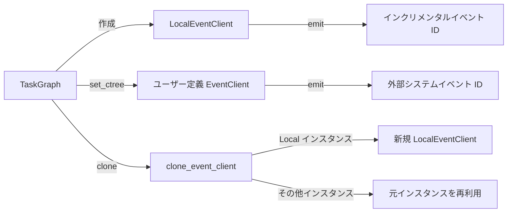

# RuntimeEvent

> 📅 最終更新日: 2026/06/18

`runtime/util_event.py` は、タスクグラフ内でのイベント ID 生成と追跡のためのイベントクライアント抽象インターフェースとローカル実装を提供します。

## コアクラス

### EventClient（Protocol）

イベントクライアントの最小抽象インターフェース。

```python
class EventClient(Protocol):
    def emit(
        self,
        type_: str,
        parents: list[int] | None = None,
        message: str | None = None,
        payload: list[Any] | dict[str, Any] | None = None,
    ) -> int:
        """イベントを発行し、対応するイベント ID を返します。"""
        ...
```

| パラメータ | 型 | 説明 |
|------|------|------|
| `type_` | `str` | イベントタイプ（例: `"task.input"`、`"task.success"` など） |
| `parents` | `list[int] \| None` | 親イベント ID リスト。イベント間の因果連鎖を構築するために使用 |
| `message` | `str \| None` | イベントメッセージ |
| `payload` | `list[Any] \| dict[str, Any] \| None` | イベントペイロード |

戻り値: イベント ID（`int`）。

### LocalEventClient

ローカルイベントクライアント。**インクリメンタルなイベント ID の生成のみを行い**、実際のイベントを外部システムに送信しません。完全なイベント追跡（CelestialTree など）が不要なシナリオに適しています。

```python
class LocalEventClient:
    def __init__(self, start_id: int = 1) -> None:
        """
        ローカルイベントクライアントを初期化します。

        :param start_id: 開始イベント ID。デフォルトは 1
        """

    def emit(
        self,
        type_: str,
        parents: list[int] | None = None,
        message: str | None = None,
        payload: list[Any] | dict[str, Any] | None = None,
    ) -> int:
        """
        ローカルイベントを発行し、インクリメンタル ID を返します。

        :param type_: イベントタイプ。現在の実装では未使用
        :param parents: 親イベント ID リスト。現在の実装では未使用
        :param message: イベントメッセージ。現在の実装では未使用
        :param payload: イベントペイロード。現在の実装では未使用
        :return: インクリメンタルイベント ID
        """
```

`LocalEventClient` は内部に `_next_id` カウンターを保持し、`emit()` が呼ばれるたびに現在値を返してインクリメントします。`threading.Lock` によりスレッドセーフを保証します。

## ツール関数

### clone_event_client

```python
def clone_event_client(client: EventClient) -> EventClient:
```

イベントクライアントをクローンします：`LocalEventClient` インスタンスの場合、新しい `LocalEventClient()` を返します。その他の実装の場合は元のインスタンスをそのまま再利用します。

## データフロー



## TaskGraph / TaskExecutor との関係

- `TaskGraph.__init__()` はデフォルトで `LocalEventClient()` を共有イベントクライアントとして作成します。
- `TaskGraph.set_ctree()` を通じて、ユーザー定義の `EventClient`（CelestialTree クライアントなど）に置き換えることができます。
- `TaskDispatch._process_termination_signal()` は `self.task_executor.ctree_client.emit()` を呼び出して終了マージイベントを発行します。

## 使用例

```python
from celestialflow.runtime.util_event import LocalEventClient, clone_event_client

# 1. ローカルイベントクライアントを作成
client = LocalEventClient(start_id=100)
print(f"最初のイベント ID: {client.emit(type_='task.input')}")   # 100
print(f"2 番目のイベント ID: {client.emit(type_='task.success')}")  # 101
print(f"3 番目のイベント ID: {client.emit(type_='task.error')}")    # 102

# 2. イベントクライアントをクローン
cloned = clone_event_client(client)
print(f"クローンインスタンスの型: {type(cloned).__name__}")  # LocalEventClient
print(f"新しいインスタンスは元のカウントを再利用するか: {cloned.emit('') == client.emit('')}")  # False（2 つの独立したインスタンス）
```

## 注意事項

- `EventClient` は `Protocol` であり、`emit()` メソッドを実装する任意のオブジェクトがこのインターフェースを満たします。明示的な継承は不要です。
- `LocalEventClient` の `emit()` メソッドはすべてのパラメータを無視し（`_ = type_, parents, message, payload` で受け取るのみ）、インクリメンタル ID のみを返します。完全なイベント追跡が不要な場合のデフォルト実装として適しています。
- イベントを CelestialTree に報告する必要がある場合は、追加で `celestialtree` パッケージをインストールし、対応するクライアントインスタンスを構築して `TaskGraph.set_ctree()` を通じて注入してください。
