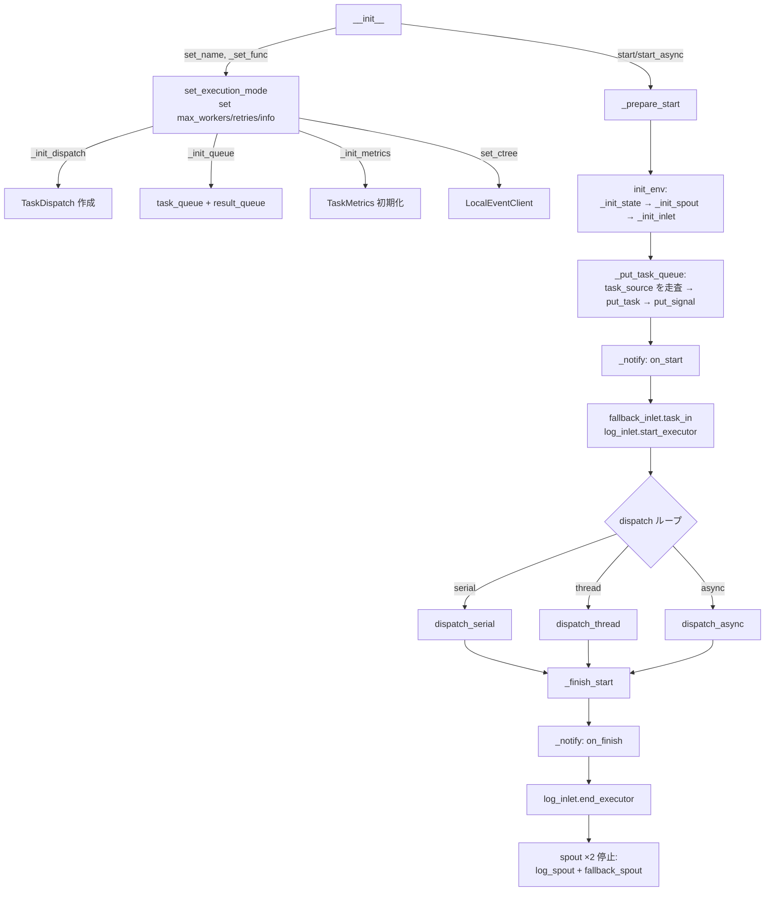

# TaskExecutor

> 📅 最終更新日: 2026/06/18

`TaskExecutor` は単一タスクロジックを実行するコアコンポーネントです。タスクの実行、並行性制御、エラー処理、リトライ機構、およびログ記録を担当します。

> 注意：`TaskExecutor` は使い捨てオブジェクトです。`start()` または `start_async()` の完了後、現在のインスタンスを安全に再利用できるとは限りません。再実行が必要な場合は、新しい `TaskExecutor` を作成してください。

## 初期化

```python
class TaskExecutor[T, R]:
    def __init__(
        self,
        name: str,
        func: Callable[[T], R] | Callable[[T], Awaitable[R]],
        *,
        execution_mode: str = "serial",
        max_workers: int | None = None,
        max_retries: int = 1,
        max_info: int = 50,
        enable_duplicate_check: bool = True,
        persist_result: bool = False,
        log_level: str = "INFO",
    ):
        ...
```

### パラメータ説明

| パラメータ | デフォルト値 | 説明 |
|------|--------|------|
| `name` | — | 実行者名。ログと追跡に使用 |
| `func` | — | タスクを実際に実行する呼び出し可能オブジェクト（同期関数とコルーチン関数の両方をサポート） |
| `execution_mode` | `"serial"` | 実行モード：`"serial"` / `"thread"` / `"async"` |
| `max_workers` | `None` | 並行数制限（None の場合は動的: `min(32, cpu_count+4)`） |
| `max_retries` | `1` | タスク失敗後の最大リトライ回数（最大で retries+1 回実行） |
| `max_info` | `50` | ログにおける各情報の最大長 |
| `enable_duplicate_check` | `True` | タスクハッシュに基づく重複チェックを有効にするか |
| `persist_result` | `False` | タスク結果を SQLite に永続化するか |
| `log_level` | `"INFO"` | ログレベル |

> **変更点**：以前のドキュメントには `persist_result` パラメータの記載がありませんでした。このパラメータはタスク成功結果を SQLite に永続化するかを制御します。以前のドキュメントには `unpack_task_args` パラメータが記載されていましたが、現在のソースコードには存在せず、削除されました。

## Observer パターン

`TaskExecutor` は observer パターンを通じてライフサイクルイベントを外部にブロードキャストします。

### 登録と解除

```python
executor.add_observer(observer)     # オブザーバーを登録
executor.remove_observer(observer)  # オブザーバーを解除
```

### ブロードキャストイベント

| イベント | トリガー位置 | 説明 |
|------|---------|------|
| `on_start(name, total)` | `_prepare_start()` | 実行開始（注意：total は常に 0。実際のタスク数は `on_tasks_added` で通知） |
| `on_task_success()` | `process_task_success()` | タスク成功（パラメータなし。Observer が自身でカウントを取得） |
| `on_task_fail()` | `handle_task_fail()` | タスク失敗（パラメータなし） |
| `on_task_duplicate()` | `deal_duplicate()` | 重複検出（パラメータなし） |
| `on_tasks_added(count)` | `_put_task_queue()` | 新規タスク追加（100 件ごとに通知） |
| `on_finish()` | `_finish_start()` finally | 実行終了（パラメータなし） |

> **変更点**：以前のドキュメントでは `on_start` が実際のタスク総数を渡すと記載されていましたが、ソースコードでは常に `0` を渡します。実際のタスク数は後続の `on_tasks_added` イベントで逐次通知されます。成功/失敗/重複イベントもカウントパラメータを渡しません。

## コアメソッド

### start / start_async / start_db

```python
def start(self, task_source: Iterable[T]) -> None:
    """
    実行者を同期的に起動。フロー：
    1. _prepare_start() — init_env() + タスク注入 + 起動ログ記録
    2. execution_mode に応じて dispatch の対応メソッドを呼び出し
    3. _finish_start() — on_finish 通知 + 全 spout 停止
    """

async def start_async(self, task_source: Iterable[T]) -> None:
    """
    実行者を非同期的に起動。内部で execution_mode="async" を設定。
    asyncio.run() の代わりに await dispatch.dispatch_async() を使用。
    """

def start_db(self, db_path: str | Path, status: str = "failed") -> None:
    """
    sqlite 永続化ストアから現在の stage の失敗タスクを読み取り実行を起動。

    :param db_path: sqlite データベースファイルパス
    :param status: レコード状態フィルタ条件。デフォルト "failed"
    """
```

ライフサイクル制約：

- 実行中はキュー、`spout/inlet`、統計状態、スケジューラー実行時リソースを作成・保持します。
- 現在の実装は単回実行向けに設計されており、一度の実行終了後に完全にリセットできることは保証されません。
- 同じロジックを複数回実行する必要がある場合は、同じオブジェクトの `start()` / `start_async()` / `start_db()` を繰り返し呼ぶのではなく、新しい実行者インスタンスを作成してください。

## エラー処理

### リトライロジック

例外は `TaskDispatch._worker` で分類されます：
- **リトライ可能な例外**: `retry_exceptions` に含まれ、かつ `max_retries` に達していない場合、`emit_retry_envelope()` でタスク ID を更新してリトライ
- **リトライ不可能な例外**: タスクを失敗としてマークし、エラーログを記録、`fallback_inlet` に投入

```python
def set_retry_exceptions(self, *exceptions: type[Exception]) -> None:
    """リトライが必要な例外型を追加する。"""
```

> **変更点**：以前のドキュメントでは `add_retry_exceptions` と記載されていましたが、ソースコードのメソッド名は `set_retry_exceptions` です。

### 結果処理（コアメソッド）

タスクの結果処理は以下のメソッドで実装されます：

```python
def process_task_success(self, task_envelope: TaskEnvelope[T], result: R, start_time: float) -> None:
    """成功タスクの処理：observer 通知、ログ書き込み、結果エンベロープ生成、result_queue への投入。"""

def handle_task_fail(self, task_envelope: TaskEnvelope[T], exception: Exception) -> None:
    """失敗タスクの処理：observer 通知、fallback_inlet と log_inlet への記録。"""

def deal_duplicate(self, task_envelope: TaskEnvelope[T]) -> None:
    """重複タスクの処理：observer 通知、ログ記録。"""
```

> **変更点**：以前のドキュメントではオーバーライド可能なメソッド `process_result()` と `get_args()` が記載されていましたが、現在のソースコードにはこれらのメソッドは存在しません。以前のドキュメントには `process_result_dict()` と `handle_error_dict()` の記載もありましたが、現在のソースコードにもこれらのメソッドは存在せず、実際の結果処理は `process_task_success()` で行われます。

### 結果の取得

```python
def get_success_pairs(self) -> list[tuple[T, R]]:
    """
    成功タスク (task, result) リストを取得。
    persist_result=True が必要。それ以外の場合は空リストを返し警告を発行。
    """

def get_error_pairs(self) -> list[tuple[T, PersistedError]]:
    """失敗タスク (task, PersistedError) リストを取得。"""
```

## CelestialTree 統合

```python
def set_ctree(self, ctree_client: EventClient) -> None:
    """イベントクライアントインスタンスを設定。"""
```

> デフォルトでは、`TaskExecutor` は内部で `LocalEventClient()` を使用してローカルインクリメンタルイベント ID を生成します。
>
> CelestialTree に接続する必要がある場合は、まず `celestialtree` を追加インストールし、クライアントオブジェクトを構築して `set_ctree()` に渡してください。現在、独立した `set_nullctree()` 設定エントリは存在しません。

## 状態照会メソッド

```python
def get_name(self) -> str:                    # 実行者名
def get_full_name(self) -> str:               # "name(mode-workers)" または "name(serial)"
def get_func_name(self) -> str:               # 関数名
def get_summary(self) -> dict:                # スナップショット：name, func_name, execution_mode, max_workers
def get_counts(self) -> dict:                 # カウンター：tasks_input/succeeded/failed/duplicated/processed/pending
def get_fallback_path(self) -> Path:          # fallback SQLite ファイルの絶対パス
```

> **変更点**：`get_summary()` が返す辞書のキーは `name, func_name, execution_mode, max_workers` であり、`class_name` は含まれません。

## ライフサイクル



> **変更点**：以前のフローチャートには `_release_client` ノード（ソースコードに存在しません）と 3 つの spout（`log_spout` + `fail_spout` + `success_spout`）が含まれていました。現在は 2 つの spout のみです：`log_spout` + `fallback_spout`。

## 使用例

### 基本タスク実行

```python
from celestialflow import TaskExecutor

def process_item(x: int) -> int:
    return x * 10

executor = TaskExecutor(
    name="Calculator",
    func=process_item,
    execution_mode="serial",
)
executor.start([1, 2, 3])

# 成功/失敗結果を取得
success = executor.get_success_pairs()
errors = executor.get_error_pairs()
print(f"成功: {len(success)}, 失敗: {len(errors)}")
```

### SQLite から失敗タスクを復元

```python
from celestialflow import TaskExecutor

def process_item(x: int) -> int:
    return x * 10

executor = TaskExecutor("Recovery", process_item, execution_mode="thread")
# 永続化された失敗レコードから実行を復元
executor.start_db("fallback/2026-06-18/executor_fallbacks.sqlite3", status="failed")
```

## 注意事項

| モード | 適したシナリオ | 注意事項 |
|------|----------|---------|
| `serial` | デバッグ、単純なタスク | 並行性なし、シングルスレッド |
| `thread` | I/O 密集型 | GIL 制限に注意、内部でスレッドプールを使用 |
| `async` | ネットワーク I/O | 関数はコルーチンである必要あり。`start` ではなく `start_async` を使用 |

- `process_task_success` は結果エンベロープを作成し `result_queue` に投入
- `handle_task_fail` はエラーレコードを `fallback_inlet` に書き込み
- `deal_duplicate` は重複タスクを処理しログを記録
- `_init_spout` は自動的に `FallbackSpout`、`LogSpout` の 2 つのバックグラウンドスレッドを作成・起動
