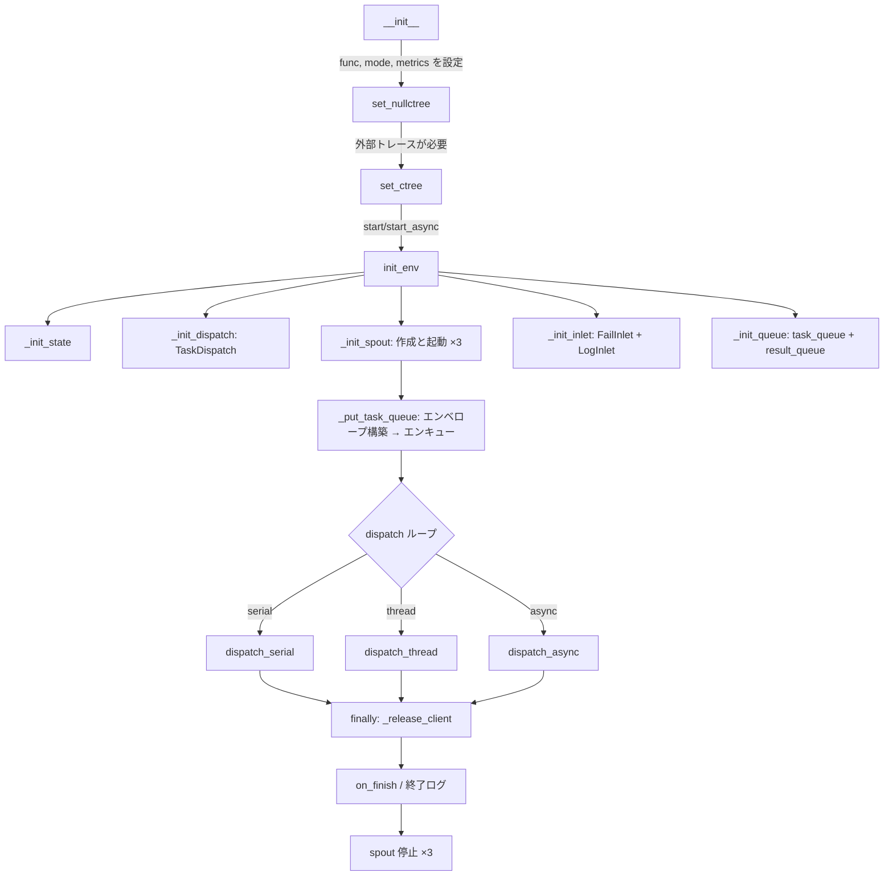

# TaskExecutor

> 📅 最終更新日: 2026/06/05

`TaskExecutor` は単一タスクロジックを実行するコアコンポーネントです。タスクの実行、並行制御、エラーハンドリング、リトライメカニズム、ログ記録を担当します。

> 注意: `TaskExecutor` は使い切りオブジェクトとして扱うべきです。1 回 `start()` / `start_async()` を実行した後、同じインスタンスを安全に再利用できる保証はありません。

## 初期化

```python
class TaskExecutor:
    def __init__(
        self,
        name: str,
        func: Callable[..., Any],
        execution_mode: str = "serial",
        max_workers: int | None = None,
        max_retries: int = 1,
        max_info: int = 50,
        unpack_task_args: bool = False,
        enable_duplicate_check: bool = True,
        log_level: str = "INFO",
    ):
        ...
```

### パラメータ説明

| パラメータ | デフォルト | 説明 |
|-----------|----------|------|
| `name` | — | エグゼキューター名。ログとトレースに使用 |
| `func` | — | タスクを実際に実行する呼び出し可能オブジェクト |
| `execution_mode` | `"serial"` | 実行モード: `"serial"` / `"thread"` / `"async"` |
| `max_workers` | `None` | 並行数制限（None 時は動的: `min(32, cpu_count+4)`） |
| `max_retries` | `1` | タスク失敗後の最大リトライ回数 |
| `max_info` | `50` | ログメッセージの最大長 |
| `unpack_task_args` | `False` | タスク引数を関数に渡す際に展開（`*args`）するかどうか |
| `enable_duplicate_check` | `True` | ハッシュベースの重複チェックを有効にするか |
| `log_level` | `"INFO"` | ログレベル |

## Observer パターン

`TaskExecutor` は Observer パターンを通じてライフサイクルイベントを外部にブロードキャストします。

### 登録と削除

```python
executor.add_observer(observer)     # オブザーバーを登録
executor.remove_observer(observer)  # オブザーバーを削除
```

### ブロードキャストイベント

| イベント | 発火場所 | 説明 |
|---------|--------|------|
| `on_start(name, total)` | `start()`/`start_async()` | 実行開始 |
| `on_task_success()` | `process_task_success()` | タスク成功 |
| `on_task_fail()` | `handle_task_fail()` | タスク失敗 |
| `on_task_duplicate()` | `deal_duplicate()` | 重複検出 |
| `on_tasks_added(count)` | `_put_task_queue()` | 新タスク追加（100件ごとに通知） |
| `on_finish()` | `start()`/`start_async()` finally | 実行終了 |

注意: `on_task_success`、`on_task_fail`、`on_task_duplicate` の `_notify` 呼び出しはカウント引数を渡しません。Observer は外部から取得する必要があります。

## コアメソッド

### start / start_async

```python
def start(self, task_source: Iterable[Any]) -> None:
    """
    同期的にエグゼキューターを起動。フロー：
    1. init_env() — metrics、dispatch、spout、inlet、queue を初期化
    2. _put_task_queue() — エンベロープを構築し全タスクをエンキュー
    3. execution_mode に応じた dispatch メソッドを呼び出し
    4. finally で spout を停止
    
    注意: async モードではこのメソッドを使用しないでください（内部で asyncio.run）。start_async を使用してください。
    """

async def start_async(self, task_source: Iterable[Any]) -> None:
    """
    非同期的にエグゼキューターを起動。内部的に execution_mode="async" を設定。
    """
```

ライフサイクル上の注意:
- 内部キュー、spout、inlet、カウンタ、実行時状態は 1 回の実行ライフサイクル向けに初期化されます。
- 同じタスクフローを再度実行したい場合は、同じインスタンスを再起動するのではなく、新しい `TaskExecutor` を作成してください。

## エラーハンドリング

### リトライロジック

例外は `TaskDispatch._worker` で分類されます:
- **リトライ可能な例外**: `retry_exceptions` に含まれ、`max_retries` に達していない場合、`emit_retry_envelope()` でタスク ID を更新してリトライ
- **リトライ不可能な例外**: タスクを失敗としてマーク、エラーログを記録、`fail_inlet` に配置

```python
def add_retry_exceptions(self, *exceptions: type[Exception]) -> None:
    """リトライが必要な例外タイプを追加。"""
```

### 結果処理（オーバーライド可能メソッド）

```python
def process_result(self, task: Any, result: Any) -> Any:
    """カスタム結果処理ロジック（デフォルトはそのまま返す）。"""

def get_args(self, task: Any) -> tuple[Any, ...]:
    """カスタム引数抽出ロジック（デフォルトは unpack_task_args に基づいて展開）。"""
```

### 結果の取得

```python
def get_success_pairs(self) -> list[tuple[Any, Any]]:
    """成功タスク (task, result) リストを取得（SuccessSpout キャッシュ経由）。"""

def get_error_pairs(self) -> list[tuple[Any, PersistedErrorRecord]]:
    """失敗タスク (task, error_record) リストを取得（FailSpout キャッシュ経由）。"""

def process_result_dict(self) -> dict[Any, Any]:
    """成功と失敗の結果辞書をマージ。"""

def handle_error_dict(self) -> dict[tuple[str, str], list[Any]]:
    """(error_type, error_message) でエラーをグループ化。"""
```

## CelestialTree 統合

```python
def set_ctree(self, host: str = "127.0.0.1", http_port: int = 7777, grpc_port: int = 7778) -> None:
    """CelestialTree クライアントを設定（gRPC トランスポートのみ）。"""

def set_nullctree(self, event_id: int | None = None) -> None:
    """Null クライアントを設定（外部サービスに接続せず、イベント ID のみ生成）。"""
```

## 状態クエリメソッド

```python
def get_name(self) -> str:           # エグゼキューター名
def get_full_name(self) -> str:      # "name(mode-workers)" または "name(serial)"
def get_func_name(self) -> str:      # 関数名
def _get_class_name(self) -> str:    # クラス名
def _get_execution_mode_desc(self) -> str:  # 実行モード説明文字列
def get_summary(self) -> dict:       # スナップショット: name, func_name, class_name, execution_mode
def get_counts(self) -> dict:        # カウンター: tasks_input/succeeded/failed/duplicated/processed/pending
```

## start / start_async フロー

### start（同期起動）

```python
def start(self, task_source: Iterable[Any]) -> None:
```

実行フロー:
1. 起動時間を記録
2. `init_env()` — metrics → dispatch → spout → inlet → queue を初期化
3. Observer に `on_start` を通知
4. `_put_task_queue(task_source)` — エンベロープを構築し全タスクをエンキュー
5. `fail_inlet.start_executor()` / `log_inlet.start_executor()` — 起動ログを記録
6. `execution_mode` に応じた dispatch メソッドを呼び出し:
   - `serial` → `dispatch_serial()`
   - `thread` → `dispatch_thread()`
   - `async` → `asyncio.run(dispatch_async())`（非推奨、`start_async` を使用）
7. `finally` クリーンアップ: `on_finish` 通知 → 終了ログ記録 → 全 spout を停止

### start_async（非同期起動）

```python
async def start_async(self, task_source: Iterable[Any]) -> None:
```

`start` と同様ですが:
- 自動的に `execution_mode="async"` を設定
- `asyncio.run()` の代わりに `await dispatch.dispatch_async()` を使用
- 既存のイベントループ内での呼び出しに適する

## ライフサイクル



## 注意事項

| モード | 適用シナリオ | 注意事項 |
|-------|------------|---------|
| `serial` | デバッグ、シンプルなタスク | 並行性なし、シングルスレッド |
| `thread` | I/O 集約型 | GIL 制限に注意。内部的にスレッドプールを使用 |
| `async` | ネットワーク I/O | 関数はコルーチンである必要がある。`start` ではなく `start_async` を使用 |

- `process_task_success` は結果エンベロープを作成し `result_queue`（= `SuccessSpout` のキュー）に配置
- `handle_task_fail` はエラーレコードを `fail_inlet` に書き込み
- `deal_duplicate` は重複タスクを処理しログを記録
